# Ersatzbilder — Aufstellung zur Freigabe (2026-09-14)

Grundlage: [image-review-2026-09-14.md](image-review-2026-09-14.md) (305 Befunde in 208 Bildordnern). Für jeden Befund wurde auf Wikimedia Commons ein Ersatzbild gesucht, per 640-px-Vorschau gesichtet und mit Lizenz, Autor und Größe erfasst. Je Ordner steht zusätzlich eine Alternative. **Noch ist nichts ersetzt.**

| | Anzahl |
|---|---|
| Ordner mit Vorschlägen | 208 |
| Slots mit Ersatzvorschlag | 305 |
| davon CC0 / Public domain | 62 |
| davon CC BY (Attribution) | 65 |
| davon CC BY-SA (Attribution + Share-alike) | 175 |

Spalte „Bisher" zeigt das aktuelle Thumbnail aus `data/images/`, Spalte „Neu" das 320-px-Thumbnail von Commons (wird online geladen). Lizenzen sind alle frei (CC0, Public domain, CC BY, CC BY-SA); attributionspflichtige Bilder landen beim Einbau in `CREDITS.md`. Hochformate sind markiert, sie werden in der Hero-Karte mittig beschnitten.

## 1. Tag der Arbeit (1. Mai, `images/labour_day`, global)

Bisherige Bilder (alle unpassend):

| Slot | Bisher | Zu sehen |
|---|---|---|
| 01.jpg |  | Demonstration mit Palästina-Flaggen vor Oxford-Museum |
| 02.jpg |  | Graffiti 1 Mai mit Anarchie-Symbol auf Backsteinwand |
| 03.jpg | 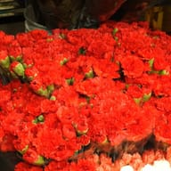 | Namensliste auf Boden bei Protest, verpixelte Personen |

Die erste Runde (Maibaum, Maibaum von unten, Maiglöckchen) wurde verworfen. Zweite Runde mit 17 geprüften Kandidaten aus fünf Motivrichtungen, bitte drei auswählen (oder eine Richtung vorgeben):

| # | Richtung | Vorschau | Commons-Datei | Lizenz / Autor / Größe | Zu sehen / warum | Empfehlung |
|---|---|---|---|---|---|---|
| 1 | Arbeit/Handwerk |  | [File:Baker woman's hands kneading bread dough.jpg](https://commons.wikimedia.org/wiki/File:Baker_woman%27s_hands_kneading_bread_dough.jpg) | CC BY 2.0 / Shixart1985 / 5154×3441 | Zwei Hände kneten Brotteig auf bemehltem Tisch, warmes Fensterlicht, kein Gesicht — Ruhiges, freundliches Handwerksmotiv ohne erkennbare Person, das Arbeit als etwas Positives zeigt und international funktioniert. | 01 |
| 2 | Arbeit/Handwerk |  | [File:Sparks fly at metal tech 150623-F-CB366-073.jpg](https://commons.wikimedia.org/wiki/File:Sparks_fly_at_metal_tech_150623-F-CB366-073.jpg) | Public domain / Airman 1st Class David Owsianka (US Air Force) / 3319×2325 | Schweißer mit Schutzmaske und Handschuhen, Funkenregen aus der Weitwinkel-Perspektive — Dynamisches Industrie-Motiv mit Wow-Effekt, Gesicht hinter der Maske verborgen, Public Domain. | 02 |
| 3 | Symbolik (Nelke) |  | [File:Clavel rojo.jpg](https://commons.wikimedia.org/wiki/File:Clavel_rojo.jpg) | CC BY-SA 4.0 / Nia Ran01 / 4608×3456 | Bildfüllend leuchtend rote Nelken, gebündelt auf einem Blumenmarkt — Die rote Nelke ist das klassische Symbol des 1. Mai in DE/AT/IT/PT und trägt keinerlei Partei-Logo; kräftige Grußkarten-Farbe. | 03 |
| 4 | Freier Tag/Frühling |  | [File:Chêne, colza, Jura (horizontal).jpg](https://commons.wikimedia.org/wiki/File:Ch%C3%AAne,_colza,_Jura_%28horizontal%29.jpg) | CC BY-SA 4.0 / ZarlokX / 7800×3900 | Einzelne grüne Eiche im gelben Rapsfeld vor Bergkulisse, Panorama-Format — Quality Image, sehr breites Format, freundliche Mai-Landschaft als Sinnbild für den freien Tag; Alternative zu Slot 02 oder 03. | 02/03 (Alternative) |
| 5 | Arbeit/Handwerk |  | [File:Germany Plane-with-wood-shavings-and-carpenters-pencil-01.jpg](https://commons.wikimedia.org/wiki/File:Germany_Plane-with-wood-shavings-and-carpenters-pencil-01.jpg) | CC BY-SA 3.0 / CEphoto, Uwe Aranas / 5480×3659 | Stillleben: alter Holzhobel, Hobelspäne und roter Zimmermannsbleistift auf grauem Grund — Sauberes Handwerks-Stillleben ohne Personen; kleiner Herstelleraufdruck auf dem Bleistift ist nur bei Nahsicht lesbar. | Reserve (Alternative zu 03) |
| 6 | Arbeit/Handwerk |  | [File:Let the sparks fly (13313009905).jpg](https://commons.wikimedia.org/wiki/File:Let_the_sparks_fly_%2813313009905%29.jpg) | Public domain / US Air Force / 6016×4016 | Kniender Schweißer mit Maske schweißt Metallrahmen, Funken, gelber Schutzvorhang — Zweites Schweißer-Motiv, ruhiger als der Funkenregen, Gesicht verdeckt; etwas dunkler. | Reserve |
| 7 | Arbeit/Handwerk |  | [File:Carpenter-tools Beveled-edge-chisel-two-angle-gauges-and-carpenters-pencil-01.jpg](https://commons.wikimedia.org/wiki/File:Carpenter-tools_Beveled-edge-chisel-two-angle-gauges-and-carpenters-pencil-01.jpg) | CC BY-SA 3.0 / CEphoto, Uwe Aranas / 5621×3753 | Stillleben: Stechbeitel, zwei Holzwinkel und roter Zimmermannsbleistift — Gleicher Fotograf/Stil wie der Hobel, falls ein zweites Werkzeug-Stillleben gewünscht ist. | Reserve |
| 8 | Symbolik (Nelke) |  | [File:Dianthus caryophyllus in China (9).jpg](https://commons.wikimedia.org/wiki/File:Dianthus_caryophyllus_in_China_%289%29.jpg) | CC BY-SA 4.0 / Dinkun Chen / 8192×5464 | Nahaufnahme rosaroter Nelkenblüten mit Wassertropfen, weicher Hintergrund — Sehr hochwertige Nelken-Nahaufnahme, aber eher rosa als rot – falls die Farbe nicht entscheidend ist. | Reserve |
| 9 | Symbolik (Nelke) |  | [File:Red Carnations flower.jpg](https://commons.wikimedia.org/wiki/File:Red_Carnations_flower.jpg) | CC BY-SA 4.0 / Rashid Jorvee / 2080×2795 (Hochformat) | Strauß roter Nelken mit Lilienknospen auf weißem Tisch, von oben — Roter Nelkenstrauß, aber Hochformat und Rosastich – nur falls Querformat-Beschnitt akzeptabel ist. | Reserve |
| 10 | Feier/Brauchtum |  | [File:Balloons in the sky.jpg](https://commons.wikimedia.org/wiki/File:Balloons_in_the_sky.jpg) | CC BY 2.0 / Crystal (Flickr) / 1712×2288 (Hochformat) | Bündel bunter Luftballons vor tiefblauem Himmel — Reines Feier-Motiv ohne Personen oder Text; allerdings Hochformat und nur 1712 px breit. | Reserve |
| 11 | Feier/Brauchtum |  | [File:Valborgarmessa.jpg](https://commons.wikimedia.org/wiki/File:Valborgarmessa.jpg) | CC BY 2.0 / Jonas Bengtsson / 2560×1920 | Drei Silhouetten vor großem Maifeuer (Walpurgisnacht, Schweden) — Maifeuer-Tradition zum 30. April/1. Mai, Personen nur als Schatten; Bild ist nachts aufgenommen und daher dunkel. | Reserve |
| 12 | Feier/Brauchtum |  | [File:The Forest of Dean Morris Dancers await the sunrise on May Day - geograph.org.uk - 4454705.jpg](https://commons.wikimedia.org/wiki/File:The_Forest_of_Dean_Morris_Dancers_await_the_sunrise_on_May_Day_-_geograph.org.uk_-_4454705.jpg) | CC BY-SA 2.0 / Roger Davies / 3456×2304 | Morris-Tänzer in bunten Flickenjacken von hinten vor rosa Morgenhimmel — Englische May-Day-Tradition, Personen überwiegend von hinten; Dämmerlicht etwas flau. | Reserve |
| 13 | Freier Tag/Frühling |  | [File:Pola rzepaku w Rybinie, 20220523 0928 6357.jpg](https://commons.wikimedia.org/wiki/File:Pola_rzepaku_w_Rybinie,_20220523_0928_6357.jpg) | CC BY-SA 4.0 / Jakub Hałun / 5333×3560 | Rapsfeld mit Weiden, Feldweg und blauem Himmel mit Schäfchenwolken — Frische Mai-Landschaft (Quality Image) als Ausflugs-/Radtour-Stimmung, ohne Personen. | Reserve |
| 14 | Freier Tag/Frühling |  | [File:Haltern am See, Sythen, Löwenzahn auf einer Wiese -- 2020 -- 6977.jpg](https://commons.wikimedia.org/wiki/File:Haltern_am_See,_Sythen,_L%C3%B6wenzahn_auf_einer_Wiese_--_2020_--_6977.jpg) | CC BY-SA 4.0 / Dietmar Rabich / 4876×3251 | Pusteblumen im sonnigen hohen Gras einer Maiwiese — Leichtes, freundliches Frühlingsmotiv (Quality Image, Mai) ohne jede politische Konnotation. | Reserve |
| 15 | Freier Tag/Frühling |  | [File:Beach Picnic (Unsplash).jpg](https://commons.wikimedia.org/wiki/File:Beach_Picnic_%28Unsplash%29.jpg) | CC0 / Scott Webb / 5832×3888 | Zwei Wassermelonenhälften auf buntem Streifentuch am Sandstrand, von oben — Verspieltes Picknick-/Freizeitmotiv, CC0, ohne Personen; wirkt eher sommerlich als maihaft. | Reserve |
| 16 | Freier Tag/Frühling |  | [File:Preparing grill for grilling, grill with flames and cones near Hostákov, Vladislav, Třebíč District.jpg](https://commons.wikimedia.org/wiki/File:Preparing_grill_for_grilling,_grill_with_flames_and_cones_near_Host%C3%A1kov,_Vladislav,_T%C5%99eb%C3%AD%C4%8D_District.jpg) | CC BY 3.0 / Frettie / 3888×2592 | Kugelgrill mit hohen Flammen und Tannenzapfen auf einer Wiese — Grillen am freien Tag als Freizeitmotiv; Hintergrund etwas dunkel, sonst sauber. | Reserve |
| 17 | International |  | [File:Labour Day weekend at Lost Lake (44628634925).jpg](https://commons.wikimedia.org/wiki/File:Labour_Day_weekend_at_Lost_Lake_%2844628634925%29.jpg) | CC BY 2.0 / Ruth Hartnup / 3744×2815 | Bergsee mit Sandstrand, kleine Figuren mit Fahrrädern, Wolkenhimmel (Kanada) — Einziger gefundener unpolitischer 'Labour Day'-Freizeitmoment; Personen winzig und nicht erkennbar, aber kanadischer Labour Day ist im September. | Reserve |

_Empfehlung des Suchlaufs:_ Empfohlene Dreierkombination: 01 = Bäckerinnen-Hände beim Teigkneten (warm, freundlich, Handwerk ohne Gesicht), 02 = Schweißer mit Funkenregen (Industrie/Arbeit, PD), 03 = rote Nelken vom Markt (klassisches 1.-Mai-Symbol ohne Parteibezug). Wer weniger 'Arbeit' und mehr 'freier Tag' möchte, tauscht 02 oder 03 gegen die Eiche im Rapsfeld (Panorama). Verworfen nach Sichtung: Werkzeug-Sets von Wilfredor (CC0, aber BLACK+DECKER/DEKO-Logos), Blacksmith working 3 (Gesicht, quadratisch), Töpfer Indien (gelber Pfosten verdeckt, unscharf), weiße/pinke Nelken-Sorten, Chodura-Wildnelke (zu klein im Bild), Sweet William (fast schwarz), Carnation Eric.Ray (Zoom-Effekt, quadratisch), Walpurgis Jesenice und Tanz in den Mai Potsdam (Menschenmengen mit Gesichtern, dunkel), Morris-Tänzer im Sonnenaufgang (Flaggen, Gesichter), Beltane-Prozession und Vappu-Picknicks Helsinki (Gesichter), Havis Amanda 2016 (Werbekran) und 1960er (Werbeplakat, Gesichter), muguet-Fotos 1911-1933 (s/w-Scans mit Randbeschriftung), Vappu-Ballons 1934 und Labour-Day-Picknick Sydney (s/w, Gesichter/Text), Tischlerhände Staatsarchiv (Wasserzeichen, s/w), Montgolfiade Münster (WEST/LOTTO-Werbung), Glasarbeiter (Würth-Handschuh), Lampenmacher Marrakesch (Gesicht, Farbeimer-Marke), Meekranz Wahlhausen (Maibaum-nah, Text), Fanfare Genève (Gesichter, Peace-Flagge), Baile di Cinta (Innenraum, Gesicht), Día del Trabajo CDMX (Regierungsveranstaltung), Chisel.jpg und Dinkelbrot (zu nüchtern), Aschaffenburg Tulpenwiese und Pörtschach Holzstapel (Mauer bzw. kahle Bäume dominieren). Historische 1.-Mai-Plakate/Illustrationen ohne Parteibezug wurden über mehrere Suchbegriffe nicht gefunden.

## 2. Alle übrigen Befunde

### Globale Feiertage (alle Länder) — 21 Ordner

#### ascension — `ascension`

_Hinweis:_ Fast alle Himmelfahrtsgemälde auf Commons sind Hochformat (01 und 03); Mittelausschnitt funktioniert bei beiden. Alternative ist bewusst generisch-symbolisch.

| Slot | Bisher | Befund | Neu | Commons-Datei | Lizenz / Autor / Größe | Zu sehen / warum |
|---|---|---|---|---|---|---|
| 01.jpg | 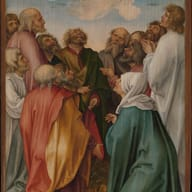 [01.jpg](../data/images/ascension/01.jpg) | **fraglich**: Ruhiger See mit Wolkenspiegelung und Morgenhimmel. Generische Landschaft, nur über den Himmel lose mit Christi Himmelfahrt verknüpft; besser Himmelfahrtsgemälde, Kirchenfenster oder Lichtstrahlen durch Wolken. |  | [File:The Ascension of Christ MET DP280379.jpg](https://commons.wikimedia.org/wiki/File:The_Ascension_of_Christ_MET_DP280379.jpg) | CC0 / Hans von Kulmbach / 2398×3878 (Hochformat) | Renaissance-Tafelbild: Jünger blicken empor, Christi Füße verschwinden in Wolken — Klassisches Himmelfahrtsmotiv (Hans von Kulmbach, MET, CC0), eindeutig und farbenfroh. |
| 02.jpg | 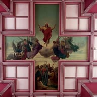 [02.jpg](../data/images/ascension/02.jpg) | **fraglich**: Blauer Himmel mit Schleierwolken über Baumsilhouetten. Reines Himmel-Symbolbild ohne erkennbaren Feiertagsbezug; besser Himmelfahrtsmotiv aus Kunst oder Kirche. |  | [File:Church of the Immaculate Conception (Saint Mary-of-the-Woods, Indiana), interior, mural on the ceiling, The Ascension.jpg](https://commons.wikimedia.org/wiki/File:Church_of_the_Immaculate_Conception_%28Saint_Mary-of-the-Woods,_Indiana%29,_interior,_mural_on_the_ceiling,_The_Ascension.jpg) | CC BY-SA 3.0 / Nheyob / 4288×2848 | Deckengemälde: Christus schwebt zwischen Engeln über den Jüngern, rosa Kassettendecke — Querformatiges Himmelfahrts-Deckenbild mit klarer Ikonografie und heller, freundlicher Farbigkeit. |
| 03.jpg | 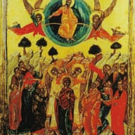 [03.jpg](../data/images/ascension/03.jpg) | **fraglich**: Sonnenuntergang mit Bergsilhouette und Farbverlauf. Generischer Sonnenuntergang, könnte auch Abschied/Trauer signalisieren; besser eindeutiges Himmelfahrtsmotiv. |  | [File:Ascension of Jesus icon, Lattakia (1667).jpg](https://commons.wikimedia.org/wiki/File:Ascension_of_Jesus_icon,_Lattakia_%281667%29.jpg) | Public domain / Unknown authorUnknown author / 2425×3094 (Hochformat) | Goldgrundige Ikone: Christus in Mandorla von Engeln getragen, Maria und Apostel unten — Ostkirchliche Himmelfahrtsikone, sehr farbstark und international verständlich. |
| Alternative | | |  | [File:Crepuscular rays at Lloyd Lake.jpg](https://commons.wikimedia.org/wiki/File:Crepuscular_rays_at_Lloyd_Lake.jpg) | CC BY-SA 4.0 / Brocken Inaglory / 2222×1481 | Sonnenstrahlen brechen durch Bäume über einem nebligen See — Symbolisches Lichtstrahlen-Motiv als nicht-kunsthistorische Ergänzung, falls ein Foto gewünscht ist. |

#### assumption — `assumption`

| Slot | Bisher | Befund | Neu | Commons-Datei | Lizenz / Autor / Größe | Zu sehen / warum |
|---|---|---|---|---|---|---|
| 01.jpg | 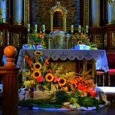 [01.jpg](../data/images/assumption/01.jpg) | **unpassend**: Barocke Bischofsstatue mit Monstranz und Kreuzstab auf Figur tretend. Zeigt einen Bischofsheiligen (vermutlich Norbert), nicht Maria; besser Mariä-Himmelfahrt-Gemälde oder Marienstatue mit Kräuterbüschel. |  | [File:04 Krauterweihe 2013 und Maria Himmelfahrt in Sanok.JPG](https://commons.wikimedia.org/wiki/File:04_Krauterweihe_2013_und_Maria_Himmelfahrt_in_Sanok.JPG) | CC BY-SA 3.0 / Silar / 4515×3094 | Kirchenaltar geschmückt mit Sonnenblumen, Kräutern, Kürbissen und Kerzen — Kräuterweihe zu Mariä Himmelfahrt, Altar mit Marien-Monogramm auf der Decke, keine Personen. |
| Alternative | | |  | [File:Ascension of Mary fresco - Cathedral of Palermo - Italy 2015.JPG](https://commons.wikimedia.org/wiki/File:Ascension_of_Mary_fresco_-_Cathedral_of_Palermo_-_Italy_2015.JPG) | CC BY-SA 4.0 / José Luiz / 2048×1852 | Deckenfresko der Kathedrale Palermo: Maria von Engeln in den Himmel getragen — Barockes Mariä-Himmelfahrt-Fresko, nahezu quadratisch, ergänzt die beiden Marienstatuen um ein Gemälde. |

#### boxing_day — `boxing_day`

_Hinweis:_ Beide Bilder sind Panoramen (2,5:1), im Hero-Mittelausschnitt aber funktionsfähig. Sales-/Shopping-Fotos auf Commons sind Hochformat oder mit Markenlogos.

| Slot | Bisher | Befund | Neu | Commons-Datei | Lizenz / Autor / Größe | Zu sehen / warum |
|---|---|---|---|---|---|---|
| 02.jpg | 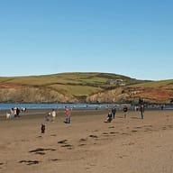 [02.jpg](../data/images/boxing_day/02.jpg) | **fraglich**: US-Soldaten in Uniform mit weihnachtlichen Geschenktüten in einem Büro. US-Militär-Motiv ohne Boxing-Day-Bezug (Boxing Day wird in UK/Commonwealth gefeiert); besser Geschenke, Sales-Shopping oder gemütlicher Feiertag nach Weihnachten. |  | [File:Newport Beach, Boxing Day 2024 - geograph.org.uk - 7946292.jpg](https://commons.wikimedia.org/wiki/File:Newport_Beach,_Boxing_Day_2024_-_geograph.org.uk_-_7946292.jpg) | CC BY-SA 2.0 / Dylan Moore / 3882×1546 | Spaziergänger am sonnigen Strand von Newport (Wales) am Boxing Day — Der Boxing-Day-Spaziergang ist eine britische Tradition; sonnig und entspannt, ergänzt die Geschenkmotive. |
| Alternative | | |  | [File:Boxing Day walkers (8312002042).jpg](https://commons.wikimedia.org/wiki/File:Boxing_Day_walkers_%288312002042%29.jpg) | CC BY 2.0 / Simon Harrod from Uk / 4592×1852 | Wanderer als Silhouetten im Moor bei tiefstehender Wintersonne — Ebenfalls Boxing-Day-Spaziergang, stimmungsvolles Winterlicht. |

#### Christmas Day (Orthodox) — `christmas_day_orthodox`

_Hinweis:_ Weitere Geburtsikonen auf Commons sind meist Scans mit Rand oder kleiner als 1280 px.

| Slot | Bisher | Befund | Neu | Commons-Datei | Lizenz / Autor / Größe | Zu sehen / warum |
|---|---|---|---|---|---|---|
| 01.jpg | 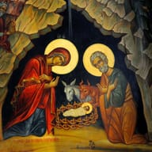 [01.jpg](../data/images/christmas_day_orthodox/01.jpg) | **fraglich**: Reich verzierte Gottesmutter-Ikone mit goldenen Lampen und Engelfiguren. Orthodoxe Ikone, aber keine Weihnachts- bzw. Geburtsdarstellung, dazu schwer erkennbar und mit kyrillischer Beschriftung; besser eine Geburt-Christi-Ikone wie in Bild 02. |  | [File:Nativity icon.jpg](https://commons.wikimedia.org/wiki/File:Nativity_icon.jpg) | CC0 / Unknown author / 1600×1557 | Orthodoxe Geburtsikone: Maria und Josef knien an der Krippe in der Höhle, Ochs und Esel — Klare Geburt-Christi-Darstellung im orthodoxen Stil, annähernd quadratisch, gut lesbar. |
| Alternative | | |  | [File:Russia Orthodox Christmas candles.jpg](https://commons.wikimedia.org/wiki/File:Russia_Orthodox_Christmas_candles.jpg) | CC BY 4.0 / Sergey A. Demidov / 4000×2252 | Brennende rote Kerze vor dunklem Hintergrund mit zweiter Flamme als Lichtpunkt — Stilles Kerzenmotiv zum orthodoxen Weihnachtsfest, unterscheidet sich von den Ikonen. |

#### Christmas Eve — `christmas_eve`

| Slot | Bisher | Befund | Neu | Commons-Datei | Lizenz / Autor / Größe | Zu sehen / warum |
|---|---|---|---|---|---|---|
| 01.jpg | 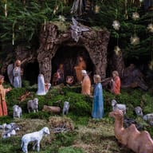 [01.jpg](../data/images/christmas_eve/01.jpg) | **fraglich**: Lichter-Engel auf Weihnachtsmarkt, Verkaufsstand und Mann im Vordergrund. Engel passt, aber Stand, Werbeschilder und Person im Vordergrund machen das Bild unruhig; besser ein freistehender Lichter-Engel oder eine stille Heiligabend-Szene mit Kerzen. |  | [File:Stettfeld Krippe -20200112-RM-155644.jpg](https://commons.wikimedia.org/wiki/File:Stettfeld_Krippe_-20200112-RM-155644.jpg) | CC BY-SA 4.0 / Ermell / 10368×7776 | Weihnachtskrippe mit Engel über der Höhle, Hirten, Schafen und Kamel unter Tannenzweigen — Engel und Krippe in einem stillen Heiligabend-Motiv, ohne Marktstände oder Personen. |
| 03.jpg | 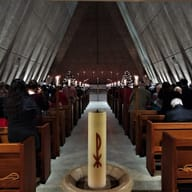 [03.jpg](../data/images/christmas_eve/03.jpg) | **unpassend**: Verwackeltes Nachtfoto eines Lichterbaums durch nasse Autoscheibe. Sehr schlechte Qualität mit Regentropfen, Blendflecken und Unschärfe; besser ein sauberes Foto eines beleuchteten Weihnachtsbaums oder einer Krippe. |  | [File:Kramer Chapel candlelight service.jpg](https://commons.wikimedia.org/wiki/File:Kramer_Chapel_candlelight_service.jpg) | CC0 / Schetm / 3728×3040 | Kerzenlicht-Gottesdienst in moderner Kapelle, Gemeinde von hinten, Weihnachtsbäume am Altar — Christvesper-Stimmung mit Kerzen und Lichterbäumen, Menschen nur von hinten, scharf und sauber. |
| Alternative | | |  | [File:Marktzeuln Christmas crib-20190106-RM-164712.jpg](https://commons.wikimedia.org/wiki/File:Marktzeuln_Christmas_crib-20190106-RM-164712.jpg) | CC BY-SA 4.0 / Ermell / 5184×3888 | Bunte Weihnachtskrippe mit orientalischen Häusern, Königen, Kamel und Elefant unter Strohsternen — Detailreiche, fröhliche Krippenszene als zweites Heiligabend-Motiv. |

#### corpus_christi — `corpus_christi`

| Slot | Bisher | Befund | Neu | Commons-Datei | Lizenz / Autor / Größe | Zu sehen / warum |
|---|---|---|---|---|---|---|
| 02.jpg | 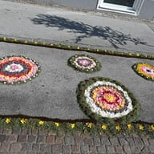 [02.jpg](../data/images/corpus_christi/02.jpg) | **fraglich**: Dunkles Schwarzweißfoto, Priester mit Monstranz unter Baldachin. Motiv passt, aber sehr dunkel, unscharf und wenig ansprechend; besser eine helle Prozession mit Blumenteppich oder Monstranz. |  | [File:Deutschlandsberg 2025-06-19 Fronleichnam Blumenteppich zac.jpg](https://commons.wikimedia.org/wiki/File:Deutschlandsberg_2025-06-19_Fronleichnam_Blumenteppich_zac.jpg) | CC0 / Josef Moser / 6016×4016 | Bunte Blütenrosetten und Blumenteppich auf der Prozessionsstraße, Sonnenlicht — Heller Fronleichnams-Blumenteppich statt dunklem Altfoto, ergänzt die beiden Prozessionsbilder um ein anderes Motiv. |
| Alternative | | |  | [File:Monstranz-Fronleichnam-Bamberg-2015.jpg](https://commons.wikimedia.org/wiki/File:Monstranz-Fronleichnam-Bamberg-2015.jpg) | CC BY-SA 4.0 / Pep CeMor / 3760×3264 | Goldene Strahlenmonstranz über dem Velum des Priesters, Kerze, dunkler Hintergrund — Die Monstranz ist das zentrale Fronleichnamssymbol, scharf und ohne erkennbares Gesicht. |

#### Easter Sunday — `easter_sunday`

_Hinweis:_ Alternative ist Hochformat (2092x2497).

| Slot | Bisher | Befund | Neu | Commons-Datei | Lizenz / Autor / Größe | Zu sehen / warum |
|---|---|---|---|---|---|---|
| 01.jpg | 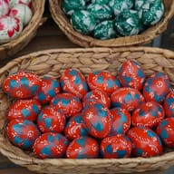 [01.jpg](../data/images/easter_sunday/01.jpg) | **unpassend**: Riesige pinke Ei-Skulptur in Hotel-Lobby, Datumsstempel. Dekorative Ei-Installation in einer Casino-Lobby (Aufnahme November 2023, Zeitstempel im Bild) hat keinen Osterbezug; besser Ostereier, Osterkorb oder Frühlingsblumen. |  | [File:Coloured wooden eggs, Easter (2023), Austria.jpg](https://commons.wikimedia.org/wiki/File:Coloured_wooden_eggs,_Easter_%282023%29,_Austria.jpg) | CC BY 4.0 / Naturpuur / 5000×3333 | Körbe voller rot-blau bemalter Ostereier auf einem Marktstand — Klassisches, farbenfrohes Ostereier-Motiv ohne Datumsstempel. |
| 02.jpg | 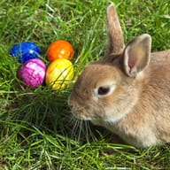 [02.jpg](../data/images/easter_sunday/02.jpg) | **unpassend**: Dieselbe Ei-Installation geöffnet, Kuppelhalle, Datumsstempel. Wie Bild 01: Casino-Dekoration ohne Osterbezug, mit Zeitstempel; besser klassisches Ostermotiv wie bunte Eier oder Osterlamm. |  | [File:Easterbunny 1.jpg](https://commons.wikimedia.org/wiki/File:Easterbunny_1.jpg) | CC BY-SA 4.0 / Superbass / 3450×3450 | Braunes Kaninchen neben vier bunten Ostereiern im Gras — Osterhase plus Eier, quadratisch und für die Hero-Karte gut beschneidbar. |
| 03.jpg | 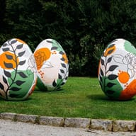 [03.jpg](../data/images/easter_sunday/03.jpg) | **unpassend**: Dieselbe Ei-Installation im Blumenrondell, Datumsstempel. Drittes Bild derselben Casino-Installation, kein Osterbezug, Zeitstempel im Bild; besser Osterhase, Eiersuche oder Osterfrühstück. |  | [File:Big Easter eggs on green grass in park (52829661350).jpg](https://commons.wikimedia.org/wiki/File:Big_Easter_eggs_on_green_grass_in_park_%2852829661350%29.jpg) | CC BY 2.0 / Jernej Furman from Slovenia / 6633×4422 | Drei große, mit Blumenmustern bemalte Ostereier auf einer Parkwiese — Drittes, klar anderes Ostermotiv im Freien, frühlingshaft und freundlich. |
| Alternative | | |  | [File:Eastereggs ostereier.jpg](https://commons.wikimedia.org/wiki/File:Eastereggs_ostereier.jpg) | CC BY-SA 3.0 / Toelstede (Wikipedia-Name Nyks) / 2092×2497 (Hochformat) | Weidenkorb mit gefärbten Eiern auf Stroh im Gras, Narzisse dahinter — Traditioneller Osterkorb aus Deutschland; Hochformat, Motiv aber mittig. |

#### epiphany — `epiphany`

_Hinweis:_ Slot 02 hat nur 1500x1001 (über Mindestbreite). Sternsinger-Fotos zeigten Kinder mit erkennbaren Gesichtern und wurden daher verworfen.

| Slot | Bisher | Befund | Neu | Commons-Datei | Lizenz / Autor / Größe | Zu sehen / warum |
|---|---|---|---|---|---|---|
| 01.jpg | 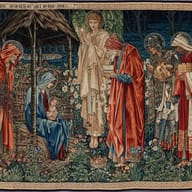 [01.jpg](../data/images/epiphany/01.jpg) | **fraglich**: Krippen-Diorama mit Lehmhaus, Palmen, Tieren, Zettel oben rechts. Krippenmodell ohne sichtbare Heilige Drei Könige und mit Notizzettel im Bild; besser die Drei Könige, Stern von Bethlehem, Sternsinger oder Dreikönigskuchen. |  | [File:Edward Burne-Jones - The Adoration of the Magi - Google Art Project.jpg](https://commons.wikimedia.org/wiki/File:Edward_Burne-Jones_-_The_Adoration_of_the_Magi_-_Google_Art_Project.jpg) | Public domain / Edward Burne-Jones / 5968×4114 | Wandteppich nach Burne-Jones: Die drei Könige mit Gaben vor Maria, Kind und Engel — Klassische Anbetung der Könige, farbenprächtig und gemeinfrei. |
| 02.jpg | 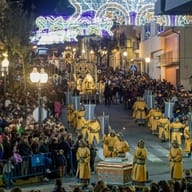 [02.jpg](../data/images/epiphany/02.jpg) | **fraglich**: Krippen-Diorama mit Steinen, Wasserlauf, Ziegen, weißer Stadt. Zweite Ansicht desselben Dioramas, Könige nicht erkennbar, wirkt wie Bastelmodell; besser Heilige Drei Könige oder Sternsinger. |  | [File:Cabalgata de Reyes de Ibi.jpg](https://commons.wikimedia.org/wiki/File:Cabalgata_de_Reyes_de_Ibi.jpg) | CC BY-SA 4.0 / Javiertrad / 1500×1001 | Nächtlicher Dreikönigsumzug in Ibi mit Lichterbögen, Pagen in Gold und Menschenmenge — Cabalgata de Reyes als gelebter Epiphanias-Brauch, festlich beleuchtet, keine erkennbaren Gesichter. |
| 03.jpg | 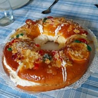 [03.jpg](../data/images/epiphany/03.jpg) | **unpassend**: Museums-Diorama mit Waffenwand voller Säbel und Dolche, Figur mit Turban. Waffensammlung hat keinen Bezug zu Epiphanias/Heilige Drei Könige und wirkt irreführend; besser Sternsinger, Krippe mit den drei Königen oder Dreikönigskuchen. |  | [File:Roscón de Reyes 2024, en algún lugar de España.jpg](https://commons.wikimedia.org/wiki/File:Rosc%C3%B3n_de_Reyes_2024,_en_alg%C3%BAn_lugar_de_Espa%C3%B1a.jpg) | CC0 / Zarateman / 2680×2325 | Roscón de Reyes mit kandierten Früchten und Sahne auf Spitzendeckchen — Dreikönigskuchen als kulinarisches Symbol des Tages, appetitlich und CC0. |
| Alternative | | |  | [File:Fra Angelico, Fra Filippo Lippi, The Adoration of the Magi.jpg](https://commons.wikimedia.org/wiki/File:Fra_Angelico,_Fra_Filippo_Lippi,_The_Adoration_of_the_Magi.jpg) | Public domain / Fra Angelico and Fra Filippo Lippi (1395 - 1455) – painter (Italian) Born in Italy, Mugello, Vicchio. Died in Italy, Rome. Details on Google Art Project / 11480×11480 | Rundbild von Fra Angelico und Filippo Lippi: Anbetung der Könige mit großem Gefolge — Berühmtes Renaissance-Tondo, quadratisch und damit ideal für die Hero-Karte. |

#### Father's Day — `fathers_day`

_Hinweis:_ Alternative hat nur 1920x1080. Bilder mit Vater-Kind-Schulterritt zeigten überall erkennbare Gesichter als Hauptmotiv.

| Slot | Bisher | Befund | Neu | Commons-Datei | Lizenz / Autor / Größe | Zu sehen / warum |
|---|---|---|---|---|---|---|
| 01.jpg |  [01.jpg](../data/images/fathers_day/01.jpg) | **unpassend**: Corot-Landschaftsgemälde mit Weg, Bäumen, Spaziergängern und Hund. Landschaftsgemälde ohne erkennbaren Vater-Kind-Bezug; besser Vater mit Kind auf den Schultern oder gemeinsam beim Spielen. |  | [File:Dad teaching child to ride a bike.jpg](https://commons.wikimedia.org/wiki/File:Dad_teaching_child_to_ride_a_bike.jpg) | CC BY-SA 4.0 / Alextredz / 4000×2667 | Vater hält von hinten das Fahrrad seines Sohnes beim Radfahren lernen im Grünen — Klassischer Vater-Kind-Moment, beide nur von hinten zu sehen. |
| 02.jpg |  [02.jpg](../data/images/fathers_day/02.jpg) | **unpassend**: Impressionistisches Gemälde zweier Frauen in einem Boot unter Weiden. Zwei Frauen im Boot haben keinen Bezug zum Vatertag; besser Vater mit Kind oder Geschenk/Karte für Papa. |  | [File:Father and Daughter at RK Beach in Visakhapatnam.jpg](https://commons.wikimedia.org/wiki/File:Father_and_Daughter_at_RK_Beach_in_Visakhapatnam.jpg) | CC BY-SA 3.0 / Srichakra Pranav / 2718×1295 | Silhouetten von Vater und Tochter Hand in Hand am Strand vor tiefstehender Sonne — Warme Vater-Tochter-Szene im Gegenlicht ohne erkennbare Gesichter. |
| Alternative | | |  | [File:Ormond Scenic Loop & Trail - Father and Daughter at Seabridge Park - NARA - 7720835.jpg](https://commons.wikimedia.org/wiki/File:Ormond_Scenic_Loop_%26_Trail_-_Father_and_Daughter_at_Seabridge_Park_-_NARA_-_7720835.jpg) | Public domain / Unknown authorUnknown author or not provided / 1920×1080 | Vater und kleine Tochter sitzen auf einem Holzsteg am Wasser, von hinten — Ruhiger gemeinsamer Moment am See, Rückenansicht, gemeinfrei. |

#### good_friday — `good_friday`

_Hinweis:_ Alternative zeigt im Hintergrund eine Keksdose mit teilweise lesbarem Wort 'shortbread' (unscharf, kein Logo). Slot 02 hat nur 1500 px Breite (Minimum knapp erfüllt).

| Slot | Bisher | Befund | Neu | Commons-Datei | Lizenz / Autor / Größe | Zu sehen / warum |
|---|---|---|---|---|---|---|
| 01.jpg | 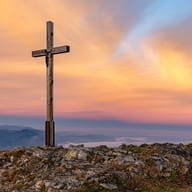 [01.jpg](../data/images/good_friday/01.jpg) | **unpassend**: Landstraße mit Bahnübergang, Strommasten, kahle Bäume. Bahnübergang hat keinerlei Bezug zu Karfreitag; besser ein schlichtes Holzkreuz, Kirchenfenster oder Kerze im stillen Licht. |  | [File:Hochries, Alpes del Chiemgau, Alemania, 2024-10-19, DD 28-30 HDR.jpg](https://commons.wikimedia.org/wiki/File:Hochries,_Alpes_del_Chiemgau,_Alemania,_2024-10-19,_DD_28-30_HDR.jpg) | CC BY-SA 4.0 / Diego Delso / 7679×4329 | Schlichtes Holz-Gipfelkreuz vor rosa-orangem Morgenhimmel über Alpenkette — Ruhiges Kreuz vor Himmel, genau das im Gründe-Text gewünschte stille Karfreitagsmotiv ohne Blut oder Düsternis. |
| 02.jpg | 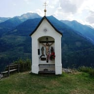 [02.jpg](../data/images/good_friday/02.jpg) | **unpassend**: Aquarell-Skizze einer Ebene mit Zeltlager und Reitern. Landschaftsskizze (vermutlich Kriegslager) ohne Bezug zu Karfreitag; besser Kreuz, Kirche oder Passionsmotiv in ruhiger Bildsprache. |  | [File:Karfreitag Kreuz, Danielsberg 966 m, Mölltal, Kärnten.jpg](https://commons.wikimedia.org/wiki/File:Karfreitag_Kreuz,_Danielsberg_966_m,_M%C3%B6lltal,_K%C3%A4rnten.jpg) | CC BY 4.0 / Naturpuur / 1500×955 | Weiße Bergkapelle mit Kruzifix, Maria und Johannes, Blumen, grüne Berge dahinter — Kreuzigungsgruppe in freundlicher Alpenlandschaft, milde und einladend statt düster; Bildtitel nennt Karfreitag. |
| 03.jpg |  [03.jpg](../data/images/good_friday/03.jpg) | **fraglich**: Barockgemälde der Kreuzigung mit Maria und Johannes, Totenschädel. Thematisch passend, aber blutig und düster mit Schädel am Kreuzfuß für eine Grußkarten-Optik; besser ein schlichtes Kreuz vor Himmel oder ein Kirchenfenster. |  | [File:Scottish hot cross buns in basket.jpg](https://commons.wikimedia.org/wiki/File:Scottish_hot_cross_buns_in_basket.jpg) | CC BY 2.0 / Marijke Blazer / 3872×2592 | Glänzende Hot Cross Buns mit Teigkreuz in Weidenkorb, Nahaufnahme — Hot Cross Buns sind das traditionelle Karfreitagsgebäck im englischsprachigen Raum; warmes, grußkartentaugliches Motiv. |
| Alternative | | |  | [File:Hot cross buns (stacked).jpg](https://commons.wikimedia.org/wiki/File:Hot_cross_buns_%28stacked%29.jpg) | Public domain / Lark Ascending / 5184×3456 | Gestapelte Hot Cross Buns auf Teller, rosa Tulpen unscharf im Hintergrund — Gleiche Karfreitagstradition, stimmungsvoller mit Frühlingsblumen; Ersatz für Slot 03. |

#### Holy Saturday — `holy_saturday`

_Hinweis:_ Slot 03 ist Hochformat; die Osterkerze trägt die Jahreszahl 2017 (typische Kerzenverzierung, kein Datumsstempel).

| Slot | Bisher | Befund | Neu | Commons-Datei | Lizenz / Autor / Größe | Zu sehen / warum |
|---|---|---|---|---|---|---|
| 01.jpg | 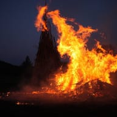 [01.jpg](../data/images/holy_saturday/01.jpg) | **fraglich**: Osterfeuer im Freien, Ministranten in Weiß, Gemeinde mit Masken. Osternacht-Feuer passt, aber Schnappschussqualität, Parkplatz im Hintergrund und Corona-Masken wirken beliebig; besser eine stimmungsvolle Osterkerze oder ein Osterfeuer bei Dämmerung. |  | [File:Easter Fire.JPG](https://commons.wikimedia.org/wiki/File:Easter_Fire.JPG) | CC BY 3.0 / ElHeineken / 5616×3744 | Hoch loderndes Osterfeuer aus Holzstapel in der Abenddämmerung, dunkelblauer Himmel — Stimmungsvolles Osterfeuer bei Dämmerung ohne Parkplatz, Masken oder Personen, wie im Gründe-Text gewünscht. |
| 02.jpg | 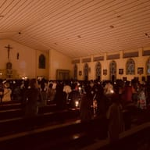 [02.jpg](../data/images/holy_saturday/02.jpg) | **fraglich**: Ministrant geht an kleinem Osterfeuer vorbei, Kies-Labyrinth. Das Feuer ist winzig und das Motiv unscheinbar, Person mit Maske abgeschnitten; besser die Entzündung der Osterkerze am Feuer in Nahaufnahme. |  | [File:Easter Fire Ritual 02.jpg](https://commons.wikimedia.org/wiki/File:Easter_Fire_Ritual_02.jpg) | CC BY-SA 4.0 / Black Lyn / 4032×3024 | Gemeinde von hinten mit brennenden Kerzen in dunkler Kirche, Altar im Hintergrund — Die Lichtfeier der Osternacht mit Kerzenlicht in der dunklen Kirche, Menschen nur als Rückenansichten. |
| 03.jpg | 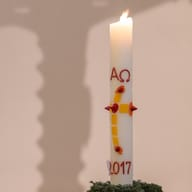 [03.jpg](../data/images/holy_saturday/03.jpg) | **fraglich**: Osterkerze auf Tisch, Priester und Ministranten mit Masken und Visieren. Osterkerze passt zur Osternacht, aber Gesichtsvisiere und Masken datieren das Bild und lenken ab; besser eine Osterkerze allein im dunklen Kirchenraum. |  | [File:Dülmen, St.-Viktor-Kirche, Innenansicht -- 2018 -- 0653.jpg](https://commons.wikimedia.org/wiki/File:D%C3%BClmen,_St.-Viktor-Kirche,_Innenansicht_--_2018_--_0653.jpg) | CC BY-SA 4.0 / Dietmar Rabich / 4480×6720 (Hochformat) | Brennende Osterkerze mit Alpha-Omega und Kreuz, Kreuzschatten an heller Kirchenwand — Osterkerze allein im Kirchenraum, ohne Personen oder Masken; Kerze steht zentral, sodass der Mittelausschnitt funktioniert. |
| Alternative | | |  | [File:Visitors at the 2024 Easter fire in Rottorf, 2024 03 30.jpg](https://commons.wikimedia.org/wiki/File:Visitors_at_the_2024_Easter_fire_in_Rottorf,_2024_03_30.jpg) | CC BY-SA 4.0 / Friedrich Haag / 5750×3821 | Zwei Silhouetten von hinten vor großem, funkensprühendem Osterfeuer — Dramatisches Osterfeuer mit Betrachtern nur als Schattenriss; Ersatz für Slot 01 oder 02. |

#### Immaculate Conception — `immaculate_conception`

_Hinweis:_ Slot 01 und Alternative sind Hochformat; Maria steht jeweils mittig, Mittelausschnitt funktioniert. Alternative hat Stromleitungen im Himmel.

| Slot | Bisher | Befund | Neu | Commons-Datei | Lizenz / Autor / Größe | Zu sehen / warum |
|---|---|---|---|---|---|---|
| 01.jpg | 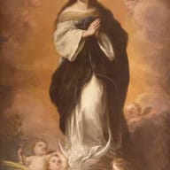 [01.jpg](../data/images/immaculate_conception/01.jpg) | **fraglich**: Goldene Krone mit Smaragden und Kreuz vor grauem Hintergrund. Die Anden-Krone gehört zwar einer Marienstatue der Unbefleckten Empfängnis, wirkt ohne Kontext aber wie ein Königsschatz; besser eine Mariendarstellung (blau-weiß, Mondsichel, Sternenkranz). |  | [File:Bartolomé Esteban Murillo - Immaculada Concepción, c. 1670.jpg](https://commons.wikimedia.org/wiki/File:Bartolom%C3%A9_Esteban_Murillo_-_Immaculada_Concepci%C3%B3n,_c._1670.jpg) | Public domain / Bartolomé Esteban Murillo / 2320×3368 (Hochformat) | Murillo-Gemälde: Maria in Weiß-Blau auf Mondsichel, betende Hände, Engel in goldenen Wolken — Die klassische Immaculata-Darstellung (blau-weiß, Mondsichel) ist genau das im Gründe-Text gewünschte Motiv. |
| 03.jpg | 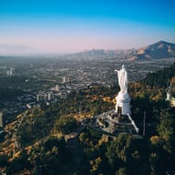 [03.jpg](../data/images/immaculate_conception/03.jpg) | **fraglich**: Weiße Marienstatue über Kirchenschild mit Messzeiten-Text. Das Schild mit Messzeiten und Beichtterminen dominiert die untere Hälfte; besser die Marienstatue allein oder ein Gemälde der Immaculata. |  | [File:Santuario de la Inmaculada Concepción, Cerro San Cristóbal (25059260397).jpg](https://commons.wikimedia.org/wiki/File:Santuario_de_la_Inmaculada_Concepci%C3%B3n,_Cerro_San_Crist%C3%B3bal_%2825059260397%29.jpg) | CC BY 2.0 / Deensel / 3520×2952 | Weiße Marienstatue der Inmaculada auf dem Cerro San Cristóbal hoch über Santiago, Anden im Dunst — Die Immaculata-Statue über der Stadt ist ein bekanntes Heiligtum des Festes, ganz ohne Schild oder Text. |
| Alternative | | |  | [File:Estatua de la Inmaculada Concepción con palomas.jpg](https://commons.wikimedia.org/wiki/File:Estatua_de_la_Inmaculada_Concepci%C3%B3n_con_palomas.jpg) | CC BY-SA 3.0 / Dario Alpern / 3216×4288 (Hochformat) | Weiße Inmaculada-Statue mit ausgebreiteten Armen und Tauben vor blauem Himmel, Nahansicht — Nahaufnahme derselben Immaculata-Statue mit Tauben; freundlich und klar, Ersatz für Slot 03. |

#### Mother's Day — `mothers_day`

_Hinweis:_ Nur Blumenmotive: Mutter-Kind-Fotos auf Commons zeigen durchweg erkennbare Gesichter. Bild 03 enthält kleine Preisschilder am Stand; Alternative ist Hochformat.

| Slot | Bisher | Befund | Neu | Commons-Datei | Lizenz / Autor / Größe | Zu sehen / warum |
|---|---|---|---|---|---|---|
| 01.jpg |  [01.jpg](../data/images/mothers_day/01.jpg) | **unpassend**: Vergilbter handgeschriebener Brief in Kursivschrift. Unleserliche Textseite ohne Muttertagsbezug; besser Blumenstrauß, Mutter mit Kind oder Grußkarte. |  | [File:Mother's Day Narcissi (24960968354).jpg](https://commons.wikimedia.org/wiki/File:Mother%27s_Day_Narcissi_%2824960968354%29.jpg) | CC BY-SA 2.0 / Amanda Slater from Coventry, West Midlands, UK / 3648×2736 | Nahaufnahme cremefarbener Narzissen mit orangefarbener Krone am Fenster — Frischer Muttertagsstrauß in Grußkarten-Optik, hell und freundlich. |
| 02.jpg | 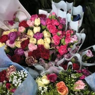 [02.jpg](../data/images/mothers_day/02.jpg) | **unpassend**: Historischer Brief mit kreuzweise beschriebenen Zeilen. Unleserliche Textseite ohne Muttertagsbezug; besser Blumen oder Mutter-Kind-Motiv. |  | [File:母親節路邊賣的鮮花 - panoramio - Tianmu peter (2).jpg](https://commons.wikimedia.org/wiki/File:%E6%AF%8D%E8%A6%AA%E7%AF%80%E8%B7%AF%E9%82%8A%E8%B3%A3%E7%9A%84%E9%AE%AE%E8%8A%B1_-_panoramio_-_Tianmu_peter_%282%29.jpg) | CC BY 3.0 / Tianmu peter / 2592×1944 | Bunte Nelken- und Rosensträuße in Geschenkpapier zum Muttertag, Blick von oben — Nelken sind das klassische Muttertagssymbol, Sträuße wirken wie fertige Geschenke. |
| 03.jpg | 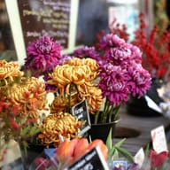 [03.jpg](../data/images/mothers_day/03.jpg) | **unpassend**: Alter handgeschriebener Brief auf hellem Papier. Unleserliche Textseite ohne Muttertagsbezug; besser Blumen oder Mutter-Kind-Motiv. |  | [File:Mother's Day flower sale (Unsplash).jpg](https://commons.wikimedia.org/wiki/File:Mother%27s_Day_flower_sale_%28Unsplash%29.jpg) | CC0 / Erol Ahmed erol / 5760×3840 | Chrysanthemen in Orange und Violett am Blumenstand, weicher Hintergrund — Warmer Blumenstand-Moment, farblich anders als die beiden anderen Sträuße. |
| Alternative | | |  | [File:Pink carnation bouquets (Unsplash).jpg](https://commons.wikimedia.org/wiki/File:Pink_carnation_bouquets_%28Unsplash%29.jpg) | CC0 / Lizzie amianyuhua / 3456×5184 (Hochformat) | In Packpapier gewickelter Strauß mit Nelken und lachsfarbenen Rosen auf weißem Tuch — Stilvolles Geschenkstrauß-Motiv, Hochformat, Mittelausschnitt mit Strauß funktioniert. |

#### new_years_eve — `new_years_eve`

| Slot | Bisher | Befund | Neu | Commons-Datei | Lizenz / Autor / Größe | Zu sehen / warum |
|---|---|---|---|---|---|---|
| 01.jpg | 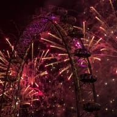 [01.jpg](../data/images/new_years_eve/01.jpg) | **fraglich**: Feuerwerk über Lincoln Memorial und Washington Monument. Deutlich US-Nationalfeiertag-Motiv (4. Juli) für einen globalen Silvester-Eintrag; besser neutrales Skyline-Feuerwerk. |  | [File:London Eye - New Year 2020 Fireworks.jpg](https://commons.wikimedia.org/wiki/File:London_Eye_-_New_Year_2020_Fireworks.jpg) | CC BY 2.0 / sergejf / 3791×2527 | Rot-goldenes Silvesterfeuerwerk rund um das beleuchtete London Eye — Echtes Neujahrsfeuerwerk ohne Nationalfeiertags-Symbolik, unterscheidet sich von Brücken- und Skyline-Motiven. |
| Alternative | | |  | [File:Sydney Harbour fireworks and smoke 2023.jpg](https://commons.wikimedia.org/wiki/File:Sydney_Harbour_fireworks_and_smoke_2023.jpg) | CC BY-SA 4.0 / Dicklyon / 3466×2275 | Gewaltiges Silvesterfeuerwerk über Sydney Harbour, Opernhaus und Boote im Vordergrund — Weltbekanntes Neujahrsfeuerwerk, global verständlich. |

#### Pentecost — `pentecost`

| Slot | Bisher | Befund | Neu | Commons-Datei | Lizenz / Autor / Größe | Zu sehen / warum |
|---|---|---|---|---|---|---|
| 02.jpg | 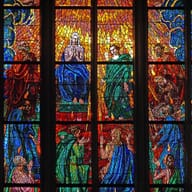 [02.jpg](../data/images/pentecost/02.jpg) | **unpassend**: Weiße Kreidefelsen von Dover mit Leuchtturm. Klippen von Dover haben keinen Bezug zu Pfingsten; besser Taube, Flammenzungen oder Pfingstrosen. |  | [File:The central part of the Pentecost stained glass in St. Andrew chapel of St. Vitus Cathedral, Prague.jpg](https://commons.wikimedia.org/wiki/File:The_central_part_of_the_Pentecost_stained_glass_in_St._Andrew_chapel_of_St._Vitus_Cathedral,_Prague.jpg) | CC BY-SA 3.0 / Ввласенко / 5127×3957 | Leuchtendes Pfingstfenster: Maria und Apostel mit Flammenzungen, rot-blau-gelbes Glas — Zeigt die Pfingstszene selbst mit Feuerzungen, farbstark und querformatig. |
| 03.jpg | 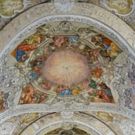 [03.jpg](../data/images/pentecost/03.jpg) | **unpassend**: Gemälde mit Kriegsschiffen vor Dover, Museumsfarbkeil am Rand. Kriegsgemälde mit Kalibrierungsstreifen hat nichts mit Pfingsten zu tun; besser Taube, Flammen oder Pfingstgottesdienst. |  | [File:Banz Deckenfresko Pfingsten 3070549.jpg](https://commons.wikimedia.org/wiki/File:Banz_Deckenfresko_Pfingsten_3070549.jpg) | CC BY-SA 4.0 / Ermell / 10368×7776 | Barockes Deckenfresko: Taube im Lichtkranz über den Aposteln, weißer Stuck — Taube des Heiligen Geistes als Pfingstsymbol, helles freundliches Barock statt Fenster. |
| Alternative | | |  | [File:Red Peonia in the Large Pálffy garden under the castle of Prague 02.jpg](https://commons.wikimedia.org/wiki/File:Red_Peonia_in_the_Large_P%C3%A1lffy_garden_under_the_castle_of_Prague_02.jpg) | CC BY-SA 4.0 / Kritzolina / 5472×3648 | Rote Pfingstrose mit Biene, grünes Laub — Pfingstrose als saisonales Pfingstsymbol, weltliche Alternative zu den Kirchenmotiven. |

#### Saint Joseph's Day — `saint_josephs_day`

_Hinweis:_ Alternative ist Hochformat.

| Slot | Bisher | Befund | Neu | Commons-Datei | Lizenz / Autor / Größe | Zu sehen / warum |
|---|---|---|---|---|---|---|
| 02.jpg | 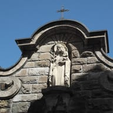 [02.jpg](../data/images/saint_josephs_day/02.jpg) | **unpassend**: Statue des heiligen Antonius mit Lilie und Jesuskind. Falscher Heiliger (Antonius von Padua in Franziskanerkutte statt Josef); besser Josef mit Zimmermannswerkzeug oder Lilienstab und Kind. |  | [File:Immenstadt im Allgäu St. Josef 956.jpg](https://commons.wikimedia.org/wiki/File:Immenstadt_im_Allg%C3%A4u_St._Josef_956.jpg) | CC BY-SA 4.0 / GFreihalter / 4517×3011 | Josef mit Jesuskind und Lilienstab in Giebelnische, blauer Himmel — Eindeutig der heilige Josef mit Kind und Lilie, freundliches Außenmotiv im Querformat. |
| 03.jpg | 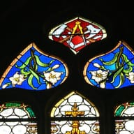 [03.jpg](../data/images/saint_josephs_day/03.jpg) | **unpassend**: Statue eines Jesuitenheiligen in schwarzer Soutane mit Buch. Falscher Heiliger (vermutlich Ignatius von Loyola), kein Josef-Bezug; besser Josefsstatue mit Werkzeug oder Zimmermannsmotiv. |  | [File:Haslach - Kirche Glasfenster Josef 3.jpg](https://commons.wikimedia.org/wiki/File:Haslach_-_Kirche_Glasfenster_Josef_3.jpg) | CC BY-SA 3.0 / Wolfgang Sauber / 2560×1920 | Glasfenster mit Zimmermannswerkzeug (Winkel, Axt, Säge) und weißen Lilien — Josefs Attribute Werkzeug und Lilie als Symbolmotiv, klar dem Zimmermann zuzuordnen. |
| Alternative | | |  | [File:Passau Mariahilf - Heiliger Josef.jpg](https://commons.wikimedia.org/wiki/File:Passau_Mariahilf_-_Heiliger_Josef.jpg) | CC BY-SA 4.0 / Wolfgang Sauber / 2887×3861 (Hochformat) | Farbige Holzfigur: Josef hält das Jesuskind an der Hand, weiße Nische — Zärtliche Vater-Kind-Darstellung des Heiligen, gut lesbar auch im Mittelausschnitt. |

#### Saint Peter and Saint Paul — `saint_peter_and_saint_paul`

_Hinweis:_ Slot 03 hat nur 1600 px Breite (knapp über Mindestmaß). Alternative ist Hochformat mit sichtbarer Bildreproduktion.

| Slot | Bisher | Befund | Neu | Commons-Datei | Lizenz / Autor / Größe | Zu sehen / warum |
|---|---|---|---|---|---|---|
| 03.jpg | 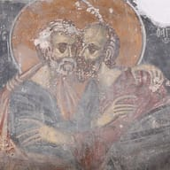 [03.jpg](../data/images/saint_peter_and_saint_paul/03.jpg) | **fraglich**: Verwitterter Kapellenraum mit kleinen Ikonen auf Tischen. Heilige nur winzig erkennbar, Motiv wirkt verfallen und generisch; besser Nahaufnahme einer Petrus-und-Paulus-Ikone. |  | [File:Fresco St Peter and Paul - St Peter and Paul Church MUSNIKOVO2 1 IMG 7239.jpg](https://commons.wikimedia.org/wiki/File:Fresco_St_Peter_and_Paul_-_St_Peter_and_Paul_Church_MUSNIKOVO2_1_IMG_7239.jpg) | CC BY 4.0 / BLAGO Fund, Inc. / 1600×1067 | Fresko: Petrus und Paulus umarmen sich, goldene Heiligenscheine, Nahaufnahme — Klassische Umarmung der beiden Apostel, beide groß und gemeinsam im Bild. |
| Alternative | | |  | [File:Peter and Paul the Apostle icon, Aleppo 1667.jpg](https://commons.wikimedia.org/wiki/File:Peter_and_Paul_the_Apostle_icon,_Aleppo_1667.jpg) | Public domain / Unbekannt (Aleppo, 1667) / 1888×2650 (Hochformat) | Ikone auf Goldgrund: Petrus mit Schlüssel und Paulus mit Buch nebeneinander — Beide Apostel mit ihren Attributen auf einer Ikone, gemeinfrei. |

#### st_stephen — `st_stephen`

_Hinweis:_ Slot 01 ist Hochformat (Museumsfoto vor grauem Hintergrund). Weihnachtliche Stephansdom-Fotos zeigten Werbebanner und Gesichter; Stephanus-Motive ohne Steinigung sind auf Commons rar.

| Slot | Bisher | Befund | Neu | Commons-Datei | Lizenz / Autor / Größe | Zu sehen / warum |
|---|---|---|---|---|---|---|
| 01.jpg | 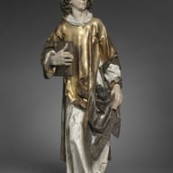 [01.jpg](../data/images/st_stephen/01.jpg) | **fraglich**: Südturm des Stephansdoms in Wien vor Himmel. Nur Namensbezug über die Kirche, Heiliger selbst nicht erkennbar; besser Darstellung des heiligen Stephanus (Ikone/Statue mit Palmzweig) oder Weihnachtsstimmung. |  | [File:Clevelandart 1959.43.jpg](https://commons.wikimedia.org/wiki/File:Clevelandart_1959.43.jpg) | CC0 / Tilman Riemenschneider (Foto: Cleveland Museum of Art) / 2244×3400 (Hochformat) | Vergoldete Riemenschneider-Holzfigur des Stephanus mit Buch und Steinen in der Dalmatik — Der heilige Stephanus selbst mit seinen Attributen, hochwertige Museumsaufnahme, CC0. |
| 02.jpg | 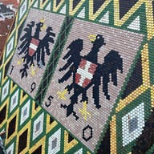 [02.jpg](../data/images/st_stephen/02.jpg) | **fraglich**: Gotisches Gewölbe des Stephansdoms von unten. Generisches Kircheninnere ohne erkennbaren Stephanus-Bezug; besser Stephanus-Darstellung oder festliches Weihnachtsmotiv. |  | [File:Wien - Stephansdom, Dach, nordseitige Wappen.JPG](https://commons.wikimedia.org/wiki/File:Wien_-_Stephansdom,_Dach,_nordseitige_Wappen.JPG) | CC BY-SA 4.0 / C.Stadler/Bwag / 3898×2598 | Buntes Ziegeldach des Stephansdoms mit Adlerwappen, Blick über Wiener Dächer — Unverwechselbares, farbenfrohes Stephansdom-Motiv statt generischem Gewölbe. |
| 03.jpg | 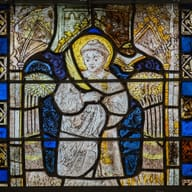 [03.jpg](../data/images/st_stephen/03.jpg) | **unpassend**: Gedenktafel mit Text über Rettung des Stephansturms 1945. Reine Texttafel mit Kriegsbezug, nicht als Grußkarte geeignet; besser Stephanus-Darstellung oder Stephansdom in festlicher Stimmung. |  | [File:Nicorps – Église Saint-Corneille – Baie 0 – Saint Étienne 2023 08 14.jpg](https://commons.wikimedia.org/wiki/File:Nicorps_%E2%80%93_%C3%89glise_Saint-Corneille_%E2%80%93_Baie_0_%E2%80%93_Saint_%C3%89tienne_2023_08_14.jpg) | CC BY-SA 4.0 / Andreas F. Borchert / 2124×1749 | Mittelalterliches Glasfenster: Stephanus als Diakon mit Heiligenschein, blau-gelbe Bordüre — Stephanus-Darstellung im Querformat, ruhig und ohne Gewaltszene. |
| Alternative | | |  | [File:Wien Stephansdom Dachziegel Gaube.jpg](https://commons.wikimedia.org/wiki/File:Wien_Stephansdom_Dachziegel_Gaube.jpg) | CC BY-SA 4.0 / Herbert Heim / 5000×3333 | Grün-weiß-schwarze Dachziegel des Stephansdoms mit kleiner Gaube, Nahaufnahme — Grafisches Stephansdom-Detail als Ersatz für Slot 02, falls die Wappen zu heraldisch wirken. |

#### valentines_day — `valentines_day`

| Slot | Bisher | Befund | Neu | Commons-Datei | Lizenz / Autor / Größe | Zu sehen / warum |
|---|---|---|---|---|---|---|
| 03.jpg |  [03.jpg](../data/images/valentines_day/03.jpg) | **fraglich**: Rückseite der Klappkarte mit Handschrift, Herz kaum sichtbar. Rückansicht des Papierobjekts, Valentinsmotiv nicht erkennbar; besser Frontansicht der Karte, Herzen oder Rosen. |  | [File:Red roses from bouquet 2.jpg](https://commons.wikimedia.org/wiki/File:Red_roses_from_bouquet_2.jpg) | CC BY-SA 4.0 / Montanabw / 2634×1881 | Nahaufnahme leuchtend roter Rosenblüten mit grünen Blättern, bildfüllend — Rote Rosen sind das klassische Valentinsmotiv und ergänzen die beiden Vintage-Karten-Slots um ein fotografisches Bild. |
| Alternative | | |  | [File:Chocolate-dipped heart-shaped cookies.jpg](https://commons.wikimedia.org/wiki/File:Chocolate-dipped_heart-shaped_cookies.jpg) | CC BY-SA 3.0 / Mk2010 / 3800×2532 | Herzförmiger Keks mit rosa Glasur und weißen Zuckerpunkten auf weißem Teller — Freundliches, klar lesbares Herzmotiv ohne Text, deutlich verschieden von Karten und Rosen. |

#### whit_monday — `whit_monday`

_Hinweis:_ Slot 03 ist ein fotografiertes Altarbild mit sichtbaren Goldrahmen (Triptychon); Autor verlangt ausdrücklich Namensnennung 'Ad Meskens'. Ein freies Foto einer fliegenden weißen Taube war auf Commons nicht in Hero-Qualität zu finden.

| Slot | Bisher | Befund | Neu | Commons-Datei | Lizenz / Autor / Größe | Zu sehen / warum |
|---|---|---|---|---|---|---|
| 01.jpg | 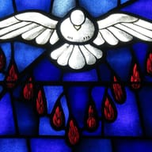 [01.jpg](../data/images/whit_monday/01.jpg) | **unpassend**: Kreidefelsen von Dover mit Leuchtturm bei blauem Himmel. Kein Bezug zu Pfingsten (vermutlich „white“-Treffer); besser Taube, Pfingstrosen, Kirchenfenster oder Frühlingsausflug im Grünen. |  | [File:Saint James the Greater Catholic Church (Concord, North Carolina) - stained glass, Holy Spirit at Pentecost.JPG](https://commons.wikimedia.org/wiki/File:Saint_James_the_Greater_Catholic_Church_%28Concord,_North_Carolina%29_-_stained_glass,_Holy_Spirit_at_Pentecost.JPG) | CC BY-SA 4.0 / Nheyob / 3782×2122 | Kirchenfenster: weiße Taube mit ausgebreiteten Flügeln, rote Feuerzungen auf blauem Glas — Taube und Feuerzungen sind die eindeutigen Pfingstsymbole, kräftige Farben im Querformat. |
| 02.jpg |  [02.jpg](../data/images/whit_monday/02.jpg) | **unpassend**: Gemälde: Kriegsschiffe vor Dover, Museumsfarbkeil am Rand. Kriegsmarine-Gemälde ohne Pfingstbezug, dazu Museumsbeschriftung im Bild; besser Taube oder Pfingstrosen. |  | [File:Bouquet of peonies 03.JPG](https://commons.wikimedia.org/wiki/File:Bouquet_of_peonies_03.JPG) | CC BY-SA 3.0 / Kor!An (Андрей Корзун) / 2266×2112 | Strauß rosa-weißer Pfingstrosen in Glasvase auf dunklem Holztisch — Pfingstrosen blühen zur Pfingstzeit und tragen das Fest im Namen; freundliches, fast quadratisches Grußkartenmotiv. |
| 03.jpg | 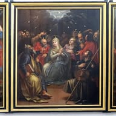 [03.jpg](../data/images/whit_monday/03.jpg) | **unpassend**: Kupferstich: Darstellung Jesu im Tempel, lateinischer Text unten. Falsches Fest (Lichtmess/Darstellung im Tempel statt Pfingsten), textlastiger Stich; besser Pfingstwunder-Darstellung, Taube oder Frühlingsmotiv. |  | [File:Mechelen St - Jan Lucas Franchoys Descent of the Holy Spirit 01.jpg](https://commons.wikimedia.org/wiki/File:Mechelen_St_-_Jan_Lucas_Franchoys_Descent_of_the_Holy_Spirit_01.jpg) | CC BY-SA 4.0 / Ad Meskens / 5184×3229 | Barockes Triptychon: Ausgießung des Heiligen Geistes, Taube und Flammen über Maria und Aposteln — Klassische Pfingstwunder-Darstellung (Lucas Franchoys) im Querformat, ersetzt den falschen Lichtmess-Stich. |
| Alternative | | |  | [File:Holy Spirit mosaic - Palatine Chapel - Aachen - Germany 2017.jpg](https://commons.wikimedia.org/wiki/File:Holy_Spirit_mosaic_-_Palatine_Chapel_-_Aachen_-_Germany_2017.jpg) | CC BY-SA 4.0 / José Luiz / 5184×3456 | Goldenes Deckenmosaik im Aachener Dom mit Heilig-Geist-Taube über Thron und Engeln — Heilig-Geist-Taube als Pfingstsymbol in prächtiger Mosaikoptik, Mittelausschnitt funktioniert als Hero. |

#### womens_day — `womens_day`

_Hinweis:_ Frei lizenzierte Mimosen-Sträuße auf Commons sind nur Gemälde oder kleine/unaufgeräumte Fotos; daher blühender Mimosenbaum als Alternative (1728 px, knapp über Minimum).

| Slot | Bisher | Befund | Neu | Commons-Datei | Lizenz / Autor / Größe | Zu sehen / warum |
|---|---|---|---|---|---|---|
| 01.jpg |  [01.jpg](../data/images/womens_day/01.jpg) | **fraglich**: Zwei Männer von hinten kaufen Blumen in Blumenladen, Teddys. Nur lose erkennbar (osteuropäische 8.-März-Blumenkauf-Szene), Männer von hinten im Fokus; besser Mimosen-/Tulpenstrauß oder Frauen gemeinsam feiernd. |  | [File:Tulip-bouquet-vienna (Unsplash).jpg](https://commons.wikimedia.org/wiki/File:Tulip-bouquet-vienna_%28Unsplash%29.jpg) | CC0 / Gábor Juhász juhg / 4608×3456 | Bildfüllender bunter Tulpenstrauß von oben: pink, weiß, gelb, orange, lila — Tulpenstrauß ist das typische Geschenk zum 8. März, frisch, freundlich und ohne Personen. |
| Alternative | | |  | [File:Acacia dealbata (16484357258).jpg](https://commons.wikimedia.org/wiki/File:Acacia_dealbata_%2816484357258%29.jpg) | CC0 / Jusotil_1943 / 1728×1152 | Bildfüllende gelbe Mimosenblüten (Acacia dealbata) an grünen Zweigen — Mimose ist das Symbol des Frauentags in Italien, Russland und Osteuropa. |

### Gedenk- und Aktionstage (MEMORIAL) — 23 Ordner

#### Day of Remembrance for Truth and Justice — `MEMORIAL/ar_day_of_remembrance_for_truth_and_justice`

_Hinweis:_ Die eingravierten Namen sind Teil des Denkmals (kein Plakattext); Pañuelo-Bilder vom 24. März sind Demonstrationsmotive und wurden ausgelassen.

| Slot | Bisher | Befund | Neu | Commons-Datei | Lizenz / Autor / Größe | Zu sehen / warum |
|---|---|---|---|---|---|---|
| 01.jpg | 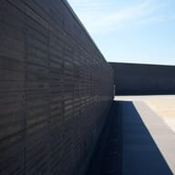 [01.jpg](../data/images/MEMORIAL/ar_day_of_remembrance_for_truth_and_justice/01.jpg) · [Quelle](https://commons.wikimedia.org/wiki/File:Parque_de_la_Memoria%2C_Buenos_Aires_-_7.JPG) | **fraglich**: Weite Parkfläche mit Rasenraster, Monument nur klein. Parque de la Memoria wirkt wie ein gewöhnlicher Stadtpark, Gedenkstele kaum erkennbar; besser Nahaufnahme der Namenswand oder Denkmal. |  | [File:Monumento a las Víctimas del Terrorismo de Estado.jpg](https://commons.wikimedia.org/wiki/File:Monumento_a_las_V%C3%ADctimas_del_Terrorismo_de_Estado.jpg) | CC BY-SA 4.0 / Blmurch / 6000×4000 | Dunkle Namenswand des Monumento a las Víctimas im Parque de la Memoria, Nahsicht — Die Namenswand ist das eigentliche Denkmal des Gedenktags, würdevoll und klar erkennbar. |
| Alternative | | |  | [File:Monumento a las Víctimas del Terrorismo de Estado 2.jpg](https://commons.wikimedia.org/wiki/File:Monumento_a_las_V%C3%ADctimas_del_Terrorismo_de_Estado_2.jpg) | CC BY-SA 4.0 / Blmurch / 6000×4000 | Namenswand aus hellem Stein am Río de la Plata, blauer Himmel, weite Promenade — Gleiches Denkmal in heller Gesamtansicht mit Fluss, ohne Parkrasen-Eindruck. |

#### Congolese Genocide Day — `MEMORIAL/cd_congolese_genocide_day`

_Hinweis:_ Einschränkung: Das Portal trägt den großen Schriftzug MEMORIAL DU GENOCOST (dominanter Text). Acht Suchbegriffe (Genocost, Kinshasa memorial, Mémorial du genocost, Congo memorial candles, Genocost cérémonie, bougies commémoration, Kinshasa monument, Genocost 2 août) lieferten nur Portal-Aufnahmen; Kerzen-/Kranzbilder aus Kinshasa existieren nicht. Alternative ist ortsunabhängig (Tallinn).

| Slot | Bisher | Befund | Neu | Commons-Datei | Lizenz / Autor / Größe | Zu sehen / warum |
|---|---|---|---|---|---|---|
| 01.jpg | 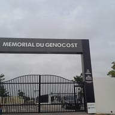 [01.jpg](../data/images/MEMORIAL/cd_congolese_genocide_day/01.jpg) · [Quelle](https://commons.wikimedia.org/wiki/File:2013_Boulevard_du_30_Juin_Kinshasa_8756682965.jpg) | **unpassend**: Boulevard in Kinshasa mit Autos und Werbeplakat. Alltägliche Straßenszene ohne jeden Gedenkbezug; besser Kerzen, Kranz oder ein Gedenkort in Kinshasa. |  | [File:Mémorial du genocost.jpg](https://commons.wikimedia.org/wiki/File:M%C3%A9morial_du_genocost.jpg) | CC BY-SA 4.0 / Alphonse Masandi / 4080×2296 | Eingangsportal des Mémorial du Genocost in Kinshasa, weiße Mauer, Baum, Wolkenhimmel — Einziger echter Gedenkort des Genocost auf Commons, ruhig und ohne Personen. |
| Alternative | | |  | [File:2014-07-18 Flowers and vigil candles on the doorsteps of Embassy of Netherlands in Estonia (closeup).jpg](https://commons.wikimedia.org/wiki/File:2014-07-18_Flowers_and_vigil_candles_on_the_doorsteps_of_Embassy_of_Netherlands_in_Estonia_%28closeup%29.jpg) | CC BY-SA 1.0 / Mardus / 2048×1536 | Grablichter und Blumensträuße auf Steinstufen, gedämpftes Licht — Generisches, würdevolles Gedenkmotiv mit Kerzen ohne Ortsbezug als Ausweich. |

#### East German uprising of 17 June 1953 — `MEMORIAL/de_june_17_uprising`

_Hinweis:_ Der Gedenkort am Bundesfinanzministerium (Leipziger Straße) ist auf Commons nur als extrem breites Panorama oder Straßenfoto mit Werbeschild vorhanden; Kranzbilder gibt es nicht.

| Slot | Bisher | Befund | Neu | Commons-Datei | Lizenz / Autor / Größe | Zu sehen / warum |
|---|---|---|---|---|---|---|
| 01.jpg | 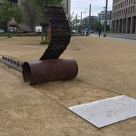 [01.jpg](../data/images/MEMORIAL/de_june_17_uprising/01.jpg) · [Quelle](https://commons.wikimedia.org/wiki/File:Berlin_Tiergarten_Stra%C3%9Fe_des_17_Juni.jpg) | **fraglich**: Luftbild Straße des 17. Juni durch grünen Tiergarten. Nur der Straßenname stellt den Bezug her, das Bild zeigt eine Parklandschaft; besser Gedenkstein am Bundesfinanzministerium oder Gedenkkranz. |  | [File:Denkmal Volksaufstand 17. Juni 1953, Postplatz Dresden.jpg](https://commons.wikimedia.org/wiki/File:Denkmal_Volksaufstand_17._Juni_1953,_Postplatz_Dresden.jpg) | CC0 / ubahnverleih / 2523×1982 | Rostige Panzerketten-Skulptur des Denkmals zum 17. Juni 1953 am Dresdner Postplatz — Eigens dem Volksaufstand gewidmetes Denkmal, ohne Gewaltdarstellung, klar erkennbarer Gedenkort. |
| Alternative | | |  | [File:Gedenkstaette 17 Juni 1953 Gedenkstein.jpg](https://commons.wikimedia.org/wiki/File:Gedenkstaette_17_Juni_1953_Gedenkstein.jpg) | CC BY-SA 3.0 / Refactor / 2272×1704 | Granit-Gedenkstein mit Inschrift zum 17. Juni 1953 vor grüner Hecke, Blumen davor — Stiller Gedenkstein mit Blumenschmuck in Berlin-Nikolassee, würdevoll. |

#### Yom HaZikaron (Memorial Day) — `MEMORIAL/il_yom_hazikaron`

_Hinweis:_ Alternative zeigt sehr frische Gräber (Okt. 2023), ggf. emotional stark; Kerzenbilder auf Commons nur als Teelicht-Nahaufnahme oder mit Staatspräsident.

| Slot | Bisher | Befund | Neu | Commons-Datei | Lizenz / Autor / Größe | Zu sehen / warum |
|---|---|---|---|---|---|---|
| 01.jpg | 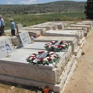 [01.jpg](../data/images/MEMORIAL/il_yom_hazikaron/01.jpg) · [Quelle](https://commons.wikimedia.org/wiki/File:PikiWiki_Israel_12579_entrance_to_the_military_cemetery_on_mount_herzl.jpg) | **fraglich**: Eingangsbau Militärfriedhof Herzlberg, Parkplatz mit Auto. Eingangsgebäude mit Parkplatz wirkt wie Architekturfoto, Gedenkcharakter kaum erkennbar; besser Gräberreihen mit Flaggen oder Gedenkkerze. |  | [File:Ofra5136.JPG](https://commons.wikimedia.org/wiki/File:Ofra5136.JPG) | CC BY-SA 4.0 / יעקב / 4608×2592 | Gräberreihen mit kleinen Israel-Flaggen und Kränzen, Besucher im Hintergrund, Hügellandschaft — Flaggen und Kränze auf Soldatengräbern sind das typische Yom-HaZikaron-Bild, würdevoll. |
| Alternative | | |  | [File:Mount Herzl Military Cemetery-28.10.23-1.jpg](https://commons.wikimedia.org/wiki/File:Mount_Herzl_Military_Cemetery-28.10.23-1.jpg) | CC BY-SA 4.0 / YoavR / 8000×6000 | Frische Gräber mit Israel-Flaggen unter weißem Sonnensegel auf dem Herzlberg, Bäume — Militärfriedhof Herzlberg mit Flaggen, ohne Parkplatz oder Eingangsarchitektur. |

#### Baltic Unity Day — `MEMORIAL/lv_baltic_unity_day`

_Hinweis:_ Fertiges Saule-Denkmal auf Commons nicht gefunden. Alternative zeigt Trachtenträger im Profil (öffentliche Veranstaltung, keine Politiker).

| Slot | Bisher | Befund | Neu | Commons-Datei | Lizenz / Autor / Größe | Zu sehen / warum |
|---|---|---|---|---|---|---|
| 01.jpg | 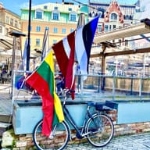 [01.jpg](../data/images/MEMORIAL/lv_baltic_unity_day/01.jpg) · [Quelle](https://commons.wikimedia.org/wiki/File:Constructing_of_monument_to_Saules_Battle%2C_AD1236_-_panoramio.jpg) | **unpassend**: Findling auf Baustelle mit Rasengittersteinen und Brettern. Unfertige Baustelle des Saule-Denkmals, nicht als Gedenkmotiv erkennbar; besser fertiges Denkmal oder die drei baltischen Flaggen. |  | [File:Baltic States’ Flags in Riga Old Town, May 2024.jpg](https://commons.wikimedia.org/wiki/File:Baltic_States%E2%80%99_Flags_in_Riga_Old_Town,_May_2024.jpg) | CC BY-SA 4.0 / Steven1991 / 4032×3024 | Estnische, lettische und litauische Flagge an einem Fahrrad in der Rigaer Altstadt, sonnig — Die drei baltischen Flaggen nebeneinander in Riga sind das direkte Symbol der baltischen Einheit. |
| Alternative | | |  | [File:Baltu vienības diena Kuldīgā 2021 08.jpg](https://commons.wikimedia.org/wiki/File:Baltu_vien%C4%ABbas_diena_Kuld%C4%ABg%C4%81_2021_08.jpg) | CC BY-SA 2.0 / Saeima / 4961×3312 | Teilnehmer in lettischer Volkstracht mit Kopftüchern beim Baltu-vienības-Tag in Kuldīga — Aufnahme vom offiziellen Baltic-Unity-Day-Fest 2021 mit lettischer Tracht, festlich und ohne Politiker. |

#### Border Guards Day — `MEMORIAL/lv_border_guards_day`

_Hinweis:_ Alternative ist Hochformat (1944×2592), Pfahl steht mittig und funktioniert im Mittelausschnitt. Paradefotos der Grenzschützer zeigen Gewehre und wurden verworfen.

| Slot | Bisher | Befund | Neu | Commons-Datei | Lizenz / Autor / Größe | Zu sehen / warum |
|---|---|---|---|---|---|---|
| 01.jpg | 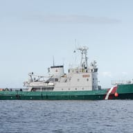 [01.jpg](../data/images/MEMORIAL/lv_border_guards_day/01.jpg) · [Quelle](https://commons.wikimedia.org/wiki/File:Estonia-Latvia_border_in_Valka.jpg) | **fraglich**: Graue Straßenszene mit EU-Grenzschild Latvija/Valka, kahle Bäume. Nur ein Ortsschild an grauer Straße, Grenzschutz selbst nicht erkennbar; besser lettische Grenzschützer bei einer Zeremonie oder ein Grenzstein mit Flagge. |  | [File:Latvian Coast Guard Ship Valpas.jpg](https://commons.wikimedia.org/wiki/File:Latvian_Coast_Guard_Ship_Valpas.jpg) | CC BY 2.0 / Jevgēnijs Šlihto / 5155×2883 | Patrouillenboot „Valpas" der lettischen Grenzschutzbehörde mit lettischer Flagge auf See — Zeigt eindeutig den lettischen Grenzschutz (Valsts robežsardze) im Einsatz, ohne Waffen im Vordergrund. |
| Alternative | | |  | [File:Boundary marker of Latvia.JPG](https://commons.wikimedia.org/wiki/File:Boundary_marker_of_Latvia.JPG) | CC BY-SA 3.0 / Pudelek (Marcin Szala) / 1944×2592 (Hochformat) | Rot-weiß-roter lettischer Grenzpfahl mit Wappen an einem Waldweg — Der lettische Grenzpfahl ist das klassische Symbol der Staatsgrenze und des Grenzschutzes. |

#### Commemoration Day of Victims of Genocide Against the Latvian People By the Totalitarian Communist Regime — `MEMORIAL/lv_commemoration_day_of_victims_of_genocide_against_the_latvian_people_by_the_totalitarian_communist_regime`

| Slot | Bisher | Befund | Neu | Commons-Datei | Lizenz / Autor / Größe | Zu sehen / warum |
|---|---|---|---|---|---|---|
| 01.jpg | 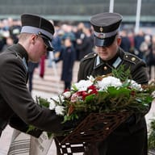 [01.jpg](../data/images/MEMORIAL/lv_commemoration_day_of_victims_of_genocide_against_the_latvian_people_by_the_totalitarian_communist_regime/01.jpg) · [Quelle](https://commons.wikimedia.org/wiki/File:St%C5%ABra_m%C4%81ja_%28Corner_House%29_in_Riga.02.jpg) | **fraglich**: Weißes Jugendstil-Eckgebäude (Stūra māja) an Straßenkreuzung mit Verkehr. Das ehemalige KGB-Haus wirkt ohne Kontext wie ein beliebiges Stadtgebäude; besser Kerzen/Kränze am Gedenkort oder das Viehwaggon-Denkmal. |  | [File:Komunistiskā genocīda upuru piemiņas dienai veltītā vainagu un ziedu nolikšanas ceremonija pie Okupācijas muzeja piemiņas memoriāla 2024.gada 25.marts - 19.jpg](https://commons.wikimedia.org/wiki/File:Komunistisk%C4%81_genoc%C4%ABda_upuru_piemi%C5%86as_dienai_velt%C4%ABt%C4%81_vainagu_un_ziedu_nolik%C5%A1anas_ceremonija_pie_Okup%C4%81cijas_muzeja_piemi%C5%86as_memori%C4%81la_2024.gada_25.marts_-_19.jpg) | CC BY-SA 2.0 / Saeima / 12600×8453 | Zwei Ehrengardisten legen einen Kranz mit rot-weiß-roter Schleife am Gedenkort nieder — Offizielle Kranzniederlegung zum Gedenktag der Opfer des kommunistischen Genozids (25. März 2024), würdevoll und ohne Politiker. |
| Alternative | | |  | [File:Torņakalns, památník obětem sovětských deporatací.jpg](https://commons.wikimedia.org/wiki/File:Tor%C5%86akalns,_pam%C3%A1tn%C3%ADk_ob%C4%9Btem_sov%C4%9Btsk%C3%BDch_deporatac%C3%AD.jpg) | CC BY 3.0 / Dezidor / 2816×2112 | Gedenkstein „1941" und historischer Viehwaggon am Bahnhof Torņakalns, Riga — Das Deportationsdenkmal in Torņakalns erinnert direkt an die Deportationen von 1941 und 1949. |

#### Day of Remembrance for Victims of Stalinism and Nazism — `MEMORIAL/lv_day_of_remembrance_for_victims_of_stalinism_and_nazism`

_Hinweis:_ Kerzen am Freiheitsdenkmal wurden auf Commons nicht gefunden; das Hauptbild stammt von der Zeremonie zum 25. März, ist aber motivisch ein allgemeines Opfergedenken.

| Slot | Bisher | Befund | Neu | Commons-Datei | Lizenz / Autor / Größe | Zu sehen / warum |
|---|---|---|---|---|---|---|
| 01.jpg | 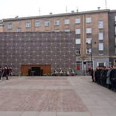 [01.jpg](../data/images/MEMORIAL/lv_day_of_remembrance_for_victims_of_stalinism_and_nazism/01.jpg) · [Quelle](https://commons.wikimedia.org/wiki/File:Baltsk%C3%BD%C5%98et%C4%9Bz.jpg) | **fraglich**: Menschenkette Baltischer Weg 1989 mit litauischer Flagge, jubelnd. Litauische statt lettische Flagge und feiernde Stimmung passen nicht zu einem stillen Opfer-Gedenktag; besser Kerzen am Freiheitsdenkmal oder ein Gedenkstein. |  | [File:Komunistiskā genocīda upuru piemiņas dienai veltītā vainagu un ziedu nolikšanas ceremonija pie Okupācijas muzeja piemiņas memoriāla 2024.gada 25.marts - 31.jpg](https://commons.wikimedia.org/wiki/File:Komunistisk%C4%81_genoc%C4%ABda_upuru_piemi%C5%86as_dienai_velt%C4%ABt%C4%81_vainagu_un_ziedu_nolik%C5%A1anas_ceremonija_pie_Okup%C4%81cijas_muzeja_piemi%C5%86as_memori%C4%81la_2024.gada_25.marts_-_31.jpg) | CC BY-SA 2.0 / Saeima / 12600×8400 | Weite Ansicht der Gedenkzeremonie am Okkupationsmuseum Riga mit Flaggen, Kränzen und Trauergästen — Stille Gedenkzeremonie am Denkmal des Okkupationsmuseums, das an beide Besatzungen erinnert; Personen nur als Menge. |
| Alternative | | |  | [File:Memorial Salaspils 1.JPG](https://commons.wikimedia.org/wiki/File:Memorial_Salaspils_1.JPG) | CC BY-SA 4.0 / Agnete / 4692×2855 | Monumentale Betonskulpturen der Gedenkstätte Salaspils vor der schrägen Mauer — Salaspils ist die zentrale Gedenkstätte für NS-Opfer in Lettland und ergänzt den Gedenktag um die zweite Seite. |

#### Day of the Sea Festival — `MEMORIAL/lv_day_of_the_sea_festival`

| Slot | Bisher | Befund | Neu | Commons-Datei | Lizenz / Autor / Größe | Zu sehen / warum |
|---|---|---|---|---|---|---|
| 01.jpg | 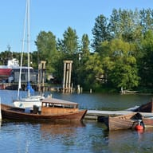 [01.jpg](../data/images/MEMORIAL/lv_day_of_the_sea_festival/01.jpg) · [Quelle](https://commons.wikimedia.org/wiki/File:Boats_in_Ventspils_harbour_-_panoramio.jpg) | **fraglich**: Zwei Arbeitsschiffe mit Kränen an schäbigem Kai, Ventspils. Industrielle Baggerschiffe an einem verwahrlosten Kai wirken nicht festlich; besser geschmückte Boote, Segelschiffe oder Leuchtturm beim Meeresfest. |  | [File:Pāvilosta - panoramio (17).jpg](https://commons.wikimedia.org/wiki/File:P%C4%81vilosta_-_panoramio_%2817%29.jpg) | CC BY-SA 3.0 / Laima Gūtmane (simka… / 4928×3264 | Holzboote und ein Segelboot am sonnigen Hafen von Pāvilosta, rotes Fischerschiff im Hintergrund — Freundliche lettische Hafenszene mit traditionellen Booten passt zur Stimmung des Meeresfestes. |
| Alternative | | |  | [File:Ventspils - panoramio (32).jpg](https://commons.wikimedia.org/wiki/File:Ventspils_-_panoramio_%2832%29.jpg) | CC BY-SA 3.0 / Laima Gūtmane (simka… / 4552×3035 | Mole mit kleinem Leuchtturm bei Ventspils im goldenen Abendlicht, Ostsee — Ventspils ist ein Zentrum der Jūras svētki; Mole und Leuchtturm sind ein stimmungsvolles Meeresmotiv. |

#### Knowledge Day — `MEMORIAL/lv_knowledge_day`

_Hinweis:_ Erstklässler-mit-Blumen-Nahaufnahmen zeigen erkennbare Kinder und wurden verworfen.

| Slot | Bisher | Befund | Neu | Commons-Datei | Lizenz / Autor / Größe | Zu sehen / warum |
|---|---|---|---|---|---|---|
| 01.jpg | 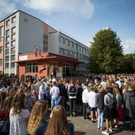 [01.jpg](../data/images/MEMORIAL/lv_knowledge_day/01.jpg) · [Quelle](https://commons.wikimedia.org/wiki/File:Knowledge_Day_in_Kelmentsi_2025_%2801%29.jpg) | **fraglich**: Schulkinder in Weiß, Traktor mit kostümierten Erwachsenen auf Schulhof. Der Traktor dominiert und macht die Schulfeier unverständlich; besser Erstklässler mit Blumen und Schulglocke. |  | [File:2017. gada 1. septembris Liepājas Raiņa 6. vidusskolā.jpg](https://commons.wikimedia.org/wiki/File:2017._gada_1._septembris_Liep%C4%81jas_Rai%C5%86a_6._vidusskol%C4%81.jpg) | Public domain / Liepāja / 5349×3515 | Schüler versammelt vor einer Schule in Liepāja am 1. September, lettische Flagge am Eingang — Echte Zinību-diena-Feier in Lettland am 1. September; Schüler überwiegend von hinten, lettische Flagge sichtbar. |
| Alternative | | |  | [File:Ministru prezidents Rīgas 49.vidusskolā (4948018412).jpg](https://commons.wikimedia.org/wiki/File:Ministru_prezidents_R%C4%ABgas_49.vidusskol%C4%81_%284948018412%29.jpg) | CC BY-SA 2.0 / State Chancellery of Latvia / 3872×2592 | Schulhof-Feier zum 1. September in Riga, Schüler im Halbkreis, Erstklässler in Weiß — Zeigt die typische Eröffnungsfeier des Schuljahres in einer Rigaer Schule aus der Weite. |

#### Medical Worker Day — `MEMORIAL/lv_medical_worker_day`

| Slot | Bisher | Befund | Neu | Commons-Datei | Lizenz / Autor / Größe | Zu sehen / warum |
|---|---|---|---|---|---|---|
| 01.jpg |  [01.jpg](../data/images/MEMORIAL/lv_medical_worker_day/01.jpg) · [Quelle](https://commons.wikimedia.org/wiki/File:Hospital_%28J.Stradina%29_entrance_-_ainars_br%C5%ABvelis_-_Panoramio.jpg) | **fraglich**: Backstein-Krankenhausgebäude Stradiņš, geparkte Autos im Vordergrund. Generisches Gebäude mit Parkplatz, medizinisches Personal nicht erkennbar; besser Pflegekräfte/Ärzte oder Stethoskop-Motiv. |  | [File:2023 Stetoskop.jpg](https://commons.wikimedia.org/wiki/File:2023_Stetoskop.jpg) | CC BY-SA 4.0 / Jacek Halicki / 5000×3416 | Schwarzes Stethoskop auf hellgrauem Untergrund, Studioaufnahme — Klares, freundliches Symbol für medizinisches Personal ohne erkennbare Personen. |
| Alternative | | |  | [File:USAF surgical team help inaugurate new operating rooms in Suriname (8257395).jpg](https://commons.wikimedia.org/wiki/File:USAF_surgical_team_help_inaugurate_new_operating_rooms_in_Suriname_%288257395%29.jpg) | Public domain / U.S. Air Force photo by Tech. Sgt. Rachel Maxwell / 7957×5305 | OP-Team in blauen Kitteln und Masken unter der Operationsleuchte — Zeigt Ärzte und Pflegekräfte bei der Arbeit, Gesichter durch Masken nicht erkennbar. |

#### National Resistance Movement Remembrance Day — `MEMORIAL/lv_national_resistance_movement_remembrance_day`

_Hinweis:_ Alternative ist Hochformat (2112×2816), der Blumenteppich liegt im Mittelausschnitt. Zeremoniefotos zeigen durchweg Politiker und wurden verworfen.

| Slot | Bisher | Befund | Neu | Commons-Datei | Lizenz / Autor / Größe | Zu sehen / warum |
|---|---|---|---|---|---|---|
| 01.jpg | 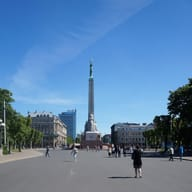 [01.jpg](../data/images/MEMORIAL/lv_national_resistance_movement_remembrance_day/01.jpg) · [Quelle](https://commons.wikimedia.org/wiki/File:Commemorative_plaque-Konstant%C4%ABns_%C4%8Cakste_01.JPG) | **fraglich**: Textlastige Gedenktafel Konstantīns Čakste an Hauswand, Schaufenster. Kleine Tafel mit dichtem lettischem Text zwischen Schaufenstern, als Titelbild unleserlich; besser Gedenkzeremonie oder Freiheitsdenkmal mit Kranz. |  | [File:Freedom Monument (Brivibas Piemineklis).JPG](https://commons.wikimedia.org/wiki/File:Freedom_Monument_%28Brivibas_Piemineklis%29.JPG) | CC BY-SA 4.0 / PIERRE ANDRE LECLERCQ / 3264×3684 | Freiheitsdenkmal Riga in voller Höhe vor blauem Himmel, Passanten auf dem Platz — Das Freiheitsdenkmal ist der zentrale Gedenkort für den lettischen Widerstand und den Freiheitskampf. |
| Alternative | | |  | [File:Květiny u Památníku svobody (2).jpg](https://commons.wikimedia.org/wiki/File:Kv%C4%9Btiny_u_Pam%C3%A1tn%C3%ADku_svobody_%282%29.jpg) | CC BY 3.0 / Dezidor / 2112×2816 (Hochformat) | Blumenteppich in Rot-Weiß-Rot am Fuß des Freiheitsdenkmals Riga — Niedergelegte Blumen in Nationalfarben am Freiheitsdenkmal stehen für stilles Gedenken. |

#### Official Language Day — `MEMORIAL/lv_official_language_day`

| Slot | Bisher | Befund | Neu | Commons-Datei | Lizenz / Autor / Größe | Zu sehen / warum |
|---|---|---|---|---|---|---|
| 01.jpg | 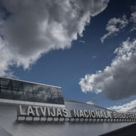 [01.jpg](../data/images/MEMORIAL/lv_official_language_day/01.jpg) · [Quelle](https://commons.wikimedia.org/wiki/File:Riga_-_Latvian_National_Library_%22Gaismas_pils%22_-_Latvijos_nacionalin%C4%97_biblioteka_%22%C5%A0viesos_pilis%22_-_panoramio.jpg) | **fraglich**: Nationalbibliothek Riga im Rohbau mit Baukran und Gerüst. Baustelle mit Kran wirkt unfertig; besser die fertige Nationalbibliothek oder ein Motiv mit lettischer Schrift/Büchern. |  | [File:National Library of Latvia 2016.jpg](https://commons.wikimedia.org/wiki/File:National_Library_of_Latvia_2016.jpg) | CC BY-SA 4.0 / Bjørn Erik Pedersen / 3798×2935 | Fertige Nationalbibliothek „Gaismas pils" hinter der Vanšu-Brücke mit großer lettischer Flagge — Die vollendete Nationalbibliothek plus lettische Flagge verbindet Sprache, Kultur und Nation. |
| Alternative | | |  | [File:Gaismas-pils.jpg](https://commons.wikimedia.org/wiki/File:Gaismas-pils.jpg) | CC BY 4.0 / Rīgas pašvaldības aģentūra “Rīgas investīciju un tūrisma aģentūra” / 2800×1867 | Warm beleuchtete Bücherwand hinter Glas im Atrium der Nationalbibliothek Riga — Die „Volksbücherwand" der Nationalbibliothek ist ein starkes Bild für die lettische Schriftkultur. |

#### World Non-Governmental Organization Day — `MEMORIAL/lv_world_non_governmental_organization_day`

| Slot | Bisher | Befund | Neu | Commons-Datei | Lizenz / Autor / Größe | Zu sehen / warum |
|---|---|---|---|---|---|---|
| 01.jpg | 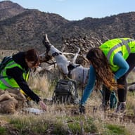 [01.jpg](../data/images/MEMORIAL/lv_world_non_governmental_organization_day/01.jpg) · [Quelle](https://commons.wikimedia.org/wiki/File:Volunteers_from_the_community_lend_a_helping_hand._%285913279092%29.jpg) | **fraglich**: Gruppe posierender Freiwilliger unter Pavillon mit US-Flagge. US-Flagge und Gruppenfoto passen nicht zu einem Welttag der NGOs in Lettland; besser Freiwillige bei der Arbeit ohne Nationalflagge. |  | [File:Volunteers planting (55066598042).jpg](https://commons.wikimedia.org/wiki/File:Volunteers_planting_%2855066598042%29.jpg) | Public domain / Joshua Tree National Park / 5184×2916 | Zwei Freiwillige in Warnwesten pflanzen Setzlinge in einer Berglandschaft — Freiwillige bei ehrenamtlicher Naturschutzarbeit ohne Nationalflagge, Gesichter abgewandt. |
| Alternative | | |  | [File:Tuja Liela Talka 2016 aprilis (62) (26598802866).jpg](https://commons.wikimedia.org/wiki/File:Tuja_Liela_Talka_2016_aprilis_%2862%29_%2826598802866%29.jpg) | CC BY-SA 2.0 / Helmuts Rudzītis from Rīga, Latvia / 4288×3216 | Gruppe Freiwilliger sammelt mit Säcken Müll am Strand von Tūja, Lettland — Die Lielā Talka ist Lettlands größte NGO-Freiwilligenaktion; Personen nur aus der Distanz. |

#### Genocide Remembrance Day — `MEMORIAL/na_genocide_remembrance_day`

_Hinweis:_ Hauptbild ist Hochformat (3864×5152), die Skulptur steht mittig und trägt den Mittelausschnitt. Alle Querformate des Denkmals zeigen das Gewaltrelief.

| Slot | Bisher | Befund | Neu | Commons-Datei | Lizenz / Autor / Größe | Zu sehen / warum |
|---|---|---|---|---|---|---|
| 01.jpg | 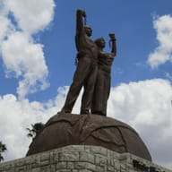 [01.jpg](../data/images/MEMORIAL/na_genocide_remembrance_day/01.jpg) · [Quelle](https://commons.wikimedia.org/wiki/File:Genozid-Denkmal_vor_der_Alten_Feste_in_Windhoek3.jpg) | **unpassend**: Bronzerelief mit erhängten Menschen und bewaffneten Soldaten, Windhoek. Das Relief zeigt Gehängte und Soldaten mit Gewehren, also explizite Gewaltdarstellung; besser die Skulptur des stehenden Paares am Genozid-Denkmal oder ein Kranz. |  | [File:Genozid-Denkmal vor der Alten Feste in Windhoek2.jpg](https://commons.wikimedia.org/wiki/File:Genozid-Denkmal_vor_der_Alten_Feste_in_Windhoek2.jpg) | CC BY-SA 4.0 / Pemba.mpimaji / 3864×5152 (Hochformat) | Bronzeskulptur eines Paares mit gesprengten Ketten auf dem Genozid-Denkmal Windhoek, blauer Himmel — Zeigt nur die würdevolle Skulptur des stehenden Paares ohne das Gewaltrelief. |
| Alternative | | |  | [File:Windhuk Christuskirche & Independence Memorial Museum 1.jpg](https://commons.wikimedia.org/wiki/File:Windhuk_Christuskirche_%26_Independence_Memorial_Museum_1.jpg) | CC BY-SA 4.0 / Zairon / 4564×3410 | Christuskirche und Independence Memorial Museum in Windhoek vor tiefblauem Himmel — Das Independence Memorial Museum ist der Standort des Genozid-Denkmals und Gedenkort in Windhoek. |

#### Remembrance Day — `MEMORIAL/pg_remembrance_day`

| Slot | Bisher | Befund | Neu | Commons-Datei | Lizenz / Autor / Größe | Zu sehen / warum |
|---|---|---|---|---|---|---|
| 01.jpg |  [01.jpg](../data/images/MEMORIAL/pg_remembrance_day/01.jpg) · [Quelle](https://commons.wikimedia.org/wiki/File:CDRUSINDOPACOM_Visits_Port_Moresby_%28Bomana%29_War_Cemetery_%288529269%29.jpg) | **fraglich**: Zwei Männer (Marineoffizier) im Gespräch vor Soldatenfriedhof Bomana. Die Personen dominieren, der Friedhof ist nur Hintergrund; besser Gräberreihen oder Mohnblumen/Kranz in Bomana. |  | [File:CDRUSINDOPACOM Visits Port Moresby (Bomana) War Cemetery (8529263).jpg](https://commons.wikimedia.org/wiki/File:CDRUSINDOPACOM_Visits_Port_Moresby_%28Bomana%29_War_Cemetery_%288529263%29.jpg) | Public domain / U.S. Navy photo by Chief Petty Officer Shannon Smith / 6048×4024 | Cross of Sacrifice mit Kranz auf dem Bomana War Cemetery, Gräberreihen im Gegenlicht — Das zentrale Kreuz mit Kranz in Bomana ist das würdevolle Gedenkmotiv ohne dominierende Personen. |
| Alternative | | |  | [File:CDRUSINDOPACOM Visits Port Moresby (Bomana) War Cemetery (8529267).jpg](https://commons.wikimedia.org/wiki/File:CDRUSINDOPACOM_Visits_Port_Moresby_%28Bomana%29_War_Cemetery_%288529267%29.jpg) | Public domain / U.S. Navy photo by Chief Petty Officer Shannon Smith / 5987×3983 | Reihen weißer Grabsteine mit bunten Blumenbeeten auf dem Bomana War Cemetery — Die gepflegten Gräberreihen von Bomana stehen still für die Gefallenen Papua-Neuguineas. |

#### Rudolf Maister Day — `MEMORIAL/si_rudolf_maister_day`

_Hinweis:_ Die Maribor-Statue gibt es auf Commons nur mit Datumsstempel; deshalb das Reiterdenkmal in Ljubljana. Am Sockel steht ein Radfahrer, am Bahnhof ist ein kleines McDonald's-M sichtbar (im Hero-Ausschnitt randständig).

| Slot | Bisher | Befund | Neu | Commons-Datei | Lizenz / Autor / Größe | Zu sehen / warum |
|---|---|---|---|---|---|---|
| 01.jpg |  [01.jpg](../data/images/MEMORIAL/si_rudolf_maister_day/01.jpg) · [Quelle](https://commons.wikimedia.org/wiki/File:Republika_Slovenija-Maribor_2021.jpg) | **fraglich**: Rudolf-Maister-Statue Maribor, kahle Bäume, Datumsstempel im Bild. Motiv passt, aber ein eingebrannter Datumsstempel 28/12/2021 stört; beschneiden oder anderes Foto der Statue nehmen. |  | [File:Ljubljana - Železniška postaja Ljubljana & Spomenik Rudolfu Maistru (48874550281).jpg](https://commons.wikimedia.org/wiki/File:Ljubljana_-_%C5%BDelezni%C5%A1ka_postaja_Ljubljana_%26_Spomenik_Rudolfu_Maistru_%2848874550281%29.jpg) | CC BY 2.0 / Fred Romero from Paris, France / 5184×3456 | Bronzenes Reiterstandbild Rudolf Maisters vor dem gelben Ljubljanaer Bahnhof, blauer Himmel — Zeigt das Maister-Denkmal groß und ohne Datumsstempel, klar dem Gedenktag zuzuordnen. |
| Alternative | | |  | [File:General Rudolf Maister grave.jpg](https://commons.wikimedia.org/wiki/File:General_Rudolf_Maister_grave.jpg) | CC BY-SA 4.0 / Cabana / 4160×3120 | Maisters Grab in Maribor mit Kränzen in slowenischen Farben und Kerzen — Würdevolle Gedenkszene mit Kränzen und Kerzen direkt am Grab des Generals. |

#### Slovenian Sports Day — `MEMORIAL/si_slovenian_sports_day`

_Hinweis:_ Auf dem 2009er Foto sind am Schanzenhang kleine Sponsorenbanner zu sehen, nicht bildbestimmend.

| Slot | Bisher | Befund | Neu | Commons-Datei | Lizenz / Autor / Größe | Zu sehen / warum |
|---|---|---|---|---|---|---|
| 01.jpg |  [01.jpg](../data/images/MEMORIAL/si_slovenian_sports_day/01.jpg) · [Quelle](https://commons.wikimedia.org/wiki/File:Postcard_of_Planica_ski_jumping_hill.jpg) | **fraglich**: Alte Schwarzweiß-Postkarte Skispringer Planica mit Museums-Wasserzeichen. Vergilbte Postkarte mit Bildunterschrift und SEM-Logo wirkt wie Archivscan; besser aktuelles Foto von Planica oder slowenischen Sportlern. |  | [File:PlanicaSkiJumps2009Final.JPG](https://commons.wikimedia.org/wiki/File:PlanicaSkiJumps2009Final.JPG) | CC BY-SA 3.0 / Pinky sl / 3264×2448 | Skiflugschanze Planica im Schnee, Zuschauer mit slowenischen Fahnen im Vordergrund — Aktuelles Farbfoto des slowenischen Sportheiligtums mit Fans und Landesflaggen statt Archivpostkarte. |
| Alternative | | |  | [File:Planica (38964538311).jpg](https://commons.wikimedia.org/wiki/File:Planica_%2838964538311%29.jpg) | CC BY 2.0 / Miran Hojnik / 3992×2992 | Luftaufnahme des verschneiten Nordischen Zentrums Planica bei Abenddämmerung — Stimmungsvolle Ansicht der Planica-Schanzen als ruhigere Variante ohne Menschenmenge. |

#### Commemoration of all those who died at war — `MEMORIAL/sm_commemoration_of_all_those_who_died_at_war`

_Hinweis:_ Keine Kranzniederlegung aus San Marino auf Commons gefunden; Ara-dei-Volontari-Fotos sind teils mit Baukran oder pale.

| Slot | Bisher | Befund | Neu | Commons-Datei | Lizenz / Autor / Größe | Zu sehen / warum |
|---|---|---|---|---|---|---|
| 01.jpg |  [01.jpg](../data/images/MEMORIAL/sm_commemoration_of_all_those_who_died_at_war/01.jpg) · [Quelle](https://commons.wikimedia.org/wiki/File:Fortress_of_Guaita_2013-09-19.jpg) | **fraglich**: Festung Guaita in San Marino auf dem Monte Titano. Reines Wahrzeichen-Foto ohne Gedenkbezug; besser ein Kriegerdenkmal oder Kranzniederlegung in San Marino. |  | [File:RSM-San Marino043.jpg](https://commons.wikimedia.org/wiki/File:RSM-San_Marino043.jpg) | CC BY-SA 4.0 / Szeder László / 2272×1704 | Obelisk der Ara dei Volontari in San Marino, dahinter Steinhäuser und Hügellandschaft — Die Ara dei Volontari ist das Gefallenendenkmal San Marinos, also der passende Gedenkort. |
| Alternative | | |  | [File:Statua San Marino.jpg](https://commons.wikimedia.org/wiki/File:Statua_San_Marino.jpg) | CC BY-SA 3.0 / Przemek Pietrak, globalquiz.org / 2048×1365 | Weiße Freiheitsstatue auf der Piazza della Libertà vor tiefblauem Himmel — Symbol der Freiheit San Marinos, würdevoll und eindeutig dem Land zuzuordnen. |

#### Journalists' Day — `MEMORIAL/ve_journalists_day`

_Hinweis:_ Kein brauchbares Venezuela-spezifisches Motiv (Correo del Orinoco, venezolanische Redaktionen) gefunden; generische Presse-Motive.

| Slot | Bisher | Befund | Neu | Commons-Datei | Lizenz / Autor / Größe | Zu sehen / warum |
|---|---|---|---|---|---|---|
| 01.jpg |  [01.jpg](../data/images/MEMORIAL/ve_journalists_day/01.jpg) · [Quelle](https://commons.wikimedia.org/wiki/File:Casa_del_Correo_del_Orinoco.jpg) | **fraglich**: Schlichte weiße Hausfassade des Correo del Orinoco. Bezug zum Journalismus ist nur für Kenner erkennbar; besser Zeitungsseiten, Druckerpresse oder eine Reporter-Szene. |  | [File:Vecteezy stack-of-newspaper 1961329.jpg](https://commons.wikimedia.org/wiki/File:Vecteezy_stack-of-newspaper_1961329.jpg) | CC BY 4.0 / Bernerlover / 5616×3744 | Stapel gefalteter Zeitungen vor weißem Hintergrund, Nahaufnahme — Zeitungen sind das sofort verständliche Symbol für Journalismus, sauber freigestellt. |
| Alternative | | |  | [File:Writing the Moment (Unsplash).jpg](https://commons.wikimedia.org/wiki/File:Writing_the_Moment_%28Unsplash%29.jpg) | CC0 / rawpixel.com rawpixel / 4912×3776 | Hände tippen auf alter schwarzer Schreibmaschine auf Holztisch am Fenster — Klassisches Reporter-Motiv, warm und ohne erkennbare Person. |

#### Slavery Abolition Anniversary — `MEMORIAL/ve_slavery_abolition_anniversary`

_Hinweis:_ Es handelt sich um das niederländische Nationaldenkmal im Amsterdamer Oosterpark, kein venezolanisches Motiv. Venezolanische Alternativen (Chirino-Statue Coro) sind schief fotografiert und tafeldominiert; Ketten-Motive auf Commons unbrauchbar.

| Slot | Bisher | Befund | Neu | Commons-Datei | Lizenz / Autor / Größe | Zu sehen / warum |
|---|---|---|---|---|---|---|
| 01.jpg |  [01.jpg](../data/images/MEMORIAL/ve_slavery_abolition_anniversary/01.jpg) · [Quelle](https://commons.wikimedia.org/wiki/File:Monumento_a_los_precursores%2C_Paseo_Los_Pr%C3%B3ceres%2C_Paseo_de_los_Precursores.jpg) | **fraglich**: Bronze-Reiterstatue vor Obelisk am Paseo Los Próceres. Denkmal ehrt Unabhängigkeitshelden, nicht die Abschaffung der Sklaverei; besser ein Motiv zu Freiheit oder zerbrochenen Ketten. |  | [File:Erwin de Vries - Nationaal Monument Slavernijverleden 2.jpg](https://commons.wikimedia.org/wiki/File:Erwin_de_Vries_-_Nationaal_Monument_Slavernijverleden_2.jpg) | CC0 / RoMaVo / 6000×4000 | Bronzeskulptur: Figuren schreiten durch einen Bogen in die Freiheit, Park mit roten Rosen — Denkmal zur Abschaffung der Sklaverei, Motiv des Aufbruchs in die Freiheit ohne Gewaltdarstellung. |
| Alternative | | |  | [File:Erwin de Vries - Nationaal Monument Slavernijverleden 1.jpg](https://commons.wikimedia.org/wiki/File:Erwin_de_Vries_-_Nationaal_Monument_Slavernijverleden_1.jpg) | CC0 / RoMaVo / 6000×4000 | Dasselbe Sklaverei-Denkmal von der anderen Seite, Figurengruppe und Bogen, Rosenbeete — Gleiche Aussage, andere Perspektive mit sichtbarer Figurenkette. |

#### Teachers' Day — `MEMORIAL/ve_teachers_day`

_Hinweis:_ Hauptvorschlag ist ein Museums-Klassenzimmer (historisch, aber freundlich). Die Alternative zeigt Kinder mit Masken, Gesichter teils erkennbar – nur nehmen, wenn das akzeptabel ist. Venezolanische Schulfotos in Hero-Qualität nicht gefunden.

| Slot | Bisher | Befund | Neu | Commons-Datei | Lizenz / Autor / Größe | Zu sehen / warum |
|---|---|---|---|---|---|---|
| 01.jpg |  [01.jpg](../data/images/MEMORIAL/ve_teachers_day/01.jpg) · [Quelle](https://commons.wikimedia.org/wiki/File:Instituto_de_Ni%C3%B1os_Cantores_del_Zulia_001.jpg) | **fraglich**: Eingang eines Theaters für Kinderchor, karger Vorplatz. Kein Lehrer- oder Schulbezug erkennbar, unattraktives Gebäudefoto; besser Klassenzimmer, Tafel oder Schulkinder. |  | [File:Karmsund folkemuseum Haugesund Norway Interior Skolestue klasserom Class room ca 1910 Skolepulter skrivepulter benker school room benches writing desks Kateter Tavle Blackboard etc 2020-06-10 DSC00312.jpg](https://commons.wikimedia.org/wiki/File:Karmsund_folkemuseum_Haugesund_Norway_Interior_Skolestue_klasserom_Class_room_ca_1910_Skolepulter_skrivepulter_benker_school_room_benches_writing_desks_Kateter_Tavle_Blackboard_etc_2020-06-10_DSC00312.jpg) | CC BY-SA 4.0 / Wolfmann / 5472×3648 | Nostalgisches Klassenzimmer mit großer Tafel, Holzpulten, Landkarte und Globus — Tafel und Schulbänke stehen unmissverständlich für Lehrer und Schule, ohne Personen. |
| Alternative | | |  | [File:A pupil answering a question in class.jpg](https://commons.wikimedia.org/wiki/File:A_pupil_answering_a_question_in_class.jpg) | CC0 / Kwameghana(Bright Kwame Ayisi) / 5697×4020 | Schüler in grün-gelben Uniformen im Klassenzimmer, einer hebt die Hand — Lebendige Unterrichtsszene, die den Lehrer-Schüler-Bezug zeigt. |

#### Human Rights Day — `MEMORIAL/za_human_rights_day`

_Hinweis:_ Sharpeville nur als Hochformat-Grabfotos vorhanden; Verfassungsgericht außen nur mit dominanter Schriftfassade bzw. Flammen-Inschrift.

| Slot | Bisher | Befund | Neu | Commons-Datei | Lizenz / Autor / Größe | Zu sehen / warum |
|---|---|---|---|---|---|---|
| 01.jpg |  [01.jpg](../data/images/MEMORIAL/za_human_rights_day/01.jpg) · [Quelle](https://commons.wikimedia.org/wiki/File:Constitutional_Court_of_South_Africa_judges_view.jpg) | **fraglich**: Leerer Saal des südafrikanischen Verfassungsgerichts. Trockene Innenaufnahme ohne erkennbaren Menschenrechtsbezug; besser Sharpeville-Gedenkstätte oder Verfassungsgericht von außen. |  | [File:Freedom Park Amphitheatre 01.jpg](https://commons.wikimedia.org/wiki/File:Freedom_Park_Amphitheatre_01.jpg) | CC BY-SA 3.0 / ljswaan / 4128×2322 | Freedom Park Pretoria: Amphitheater mit Wasserbecken, Fahnenmasten, Stadt im Hintergrund — Nationale Gedenkstätte für Freiheit und Menschenrechte, weite, würdevolle Außenaufnahme. |
| Alternative | | |  | [File:Freedom Park Amphitheatre and eternal flame.jpg](https://commons.wikimedia.org/wiki/File:Freedom_Park_Amphitheatre_and_eternal_flame.jpg) | CC BY-SA 3.0 / ljswaan / 3408×2304 | Gedenkbau mit ewiger Flamme und Fontänen im Wasserbecken, blauer Himmel — Nahansicht der ewigen Flamme im Freedom Park, ruhig und feierlich. |

### Kuriose Feiertage (FUN) — 58 Ordner

#### National Absurdity Day (11-20) — `FUN/absurdity_day`

| Slot | Bisher | Befund | Neu | Commons-Datei | Lizenz / Autor / Größe | Zu sehen / warum |
|---|---|---|---|---|---|---|
| 01.jpg |  [01.jpg](../data/images/FUN/absurdity_day/01.jpg) · [Quelle](https://commons.wikimedia.org/wiki/File:Two_Rubber_Chickens.jpg) | **fraglich**: Zwei Gummihühner hängen an Haken einer Schießbude, Schild '7 SHOTS'. Gummihühner passen zum Absurden, aber aufgehängt an einer Schießbude mit 'SHOTS'-Schild wirkt es leicht makaber; besser ein Gummihuhn allein oder eine bewusst absurde Szene. |  | [File:Upside Down House, Brighton Seafront.jpg](https://commons.wikimedia.org/wiki/File:Upside_Down_House,_Brighton_Seafront.jpg) | CC BY-SA 2.0 / Loz Pycock / 3888×2592 | Türkises Haus steht kopfüber auf dem Dach an der Strandpromenade — Bewusst absurde Szene, sofort erkennbar witzig, ohne makabre Note. |
| Alternative | | |  | [File:Rubber chicken (639463051).jpg](https://commons.wikimedia.org/wiki/File:Rubber_chicken_%28639463051%29.jpg) | CC BY-SA 2.0 / Simon Law from Montréal, QC, Canada / 3504×2336 | Gummihuhn baumelt an Schnur am Rückspiegel im Auto — Ein einzelnes Gummihuhn als Klassiker des Absurden, harmlos und witzig. |

#### Alice in Wonderland Day (07-04) — `FUN/alice_in_wonderland_day`

_Hinweis:_ Alternative ist Hochformat (2478x3600); Tischszene mit Figuren liegt im Mittelausschnitt.

| Slot | Bisher | Befund | Neu | Commons-Datei | Lizenz / Autor / Größe | Zu sehen / warum |
|---|---|---|---|---|---|---|
| 01.jpg |  [01.jpg](../data/images/FUN/alice_in_wonderland_day/01.jpg) · [Quelle](https://commons.wikimedia.org/wiki/File:Teapot_2010_G1.jpg) | **fraglich**: Porzellan-Teekanne mit japanischem Dekor auf blauem Tuch. Nur lose über die Teeparty verknüpft, das japanische Motiv führt eher nach Ostasien; besser ein Teeparty-Tisch, Taschenuhr mit weißem Kaninchen oder Alice-Illustration von Tenniel. |  | [File:Alice in Wonderland sculpture in Central Park.jpg](https://commons.wikimedia.org/wiki/File:Alice_in_Wonderland_sculpture_in_Central_Park.jpg) | Public domain / GreenReaper / 3369×2403 | Bronzeskulptur Alice auf Riesenpilz mit Hutmacher und Hase, Central Park — Alice, Hutmacher, Märzhase und Pilz sind unverwechselbare Wonderland-Motive, Public Domain. |
| Alternative | | |  | [File:Alice in Wonderland by Arthur Rackham - 08 - A Mad Tea-Party.jpg](https://commons.wikimedia.org/wiki/File:Alice_in_Wonderland_by_Arthur_Rackham_-_08_-_A_Mad_Tea-Party.jpg) | Public domain / Arthur Rackham / 2478×3600 (Hochformat) | Rackham-Illustration der verrückten Teeparty mit Hutmacher, Hase und Alice — Klassische gemeinfreie Illustration der Teeparty, direkter Bezug zur Vorlage. |

#### Backwards Day (01-31) — `FUN/backwards_day`

_Hinweis:_ Für Spiegelschrift oder verkehrt getragene Kleidung fand Commons keine brauchbaren freien Fotos (Suchen: mirror writing sign, clothes worn backwards, backwards cap, walking backwards); Kopfüber-Motive als Ersatz.

| Slot | Bisher | Befund | Neu | Commons-Datei | Lizenz / Autor / Größe | Zu sehen / warum |
|---|---|---|---|---|---|---|
| 01.jpg |  [01.jpg](../data/images/FUN/backwards_day/01.jpg) · [Quelle](https://commons.wikimedia.org/wiki/File:Ambigram_Magic_Dream_-_mirror_symmetry_with_a_handheld_pattern_giving_a_reversed_shadow_on_a_blue_wall.jpg) | **fraglich**: Hand hält Wolke mit 'DREAM', Schatten zeigt gespiegelt 'MAGIC'. Ambigramm-Kunst ist clever, aber textlastig und der Bezug zu 'verkehrt herum' erschließt sich erst beim Nachdenken; besser Person mit Kleidung verkehrt herum oder Spiegelschrift-Schild. |  | [File:Handstand-yoga.png](https://commons.wikimedia.org/wiki/File:Handstand-yoga.png) | CC BY-SA 4.0 / ATHLETICULT / 3840×2160 | Silhouette einer Person im Handstand vor orangem Sonnenuntergang — Kopfüber-Motiv steht klar für 'verkehrt herum', Person nicht erkennbar, breites Format. |
| Alternative | | |  | [File:Handstand on the city.jpg](https://commons.wikimedia.org/wiki/File:Handstand_on_the_city.jpg) | CC BY-SA 4.0 / Jacob Ekaineck / 2080×1170 | Mann im Handstand auf Felsen über einer Stadt, Gesicht verdeckt — Ebenfalls Kopfüber-Motiv mit Weitblick, Gesicht durch Haare verdeckt. |

#### Bloomsday (06-16) — `FUN/bloomsday`

_Hinweis:_ Alternative ist Hochformat (1768x3000), Statue steht mittig und funktioniert im Ausschnitt.

| Slot | Bisher | Befund | Neu | Commons-Datei | Lizenz / Autor / Größe | Zu sehen / warum |
|---|---|---|---|---|---|---|
| 01.jpg |  [01.jpg](../data/images/FUN/bloomsday/01.jpg) · [Quelle](https://commons.wikimedia.org/wiki/File:Georgian_Dublin_%2811926449375%29.jpg) | **fraglich**: Georgianische Dubliner Backsteinfassade mit roter und blauer Haustür. Nur ein allgemeines Dublin-Motiv ohne Bezug zu Joyce/Ulysses; besser James-Joyce-Statue, Strohhut mit Edwardian-Outfit oder Ulysses-Buchausgabe. |  | [File:Dun Laoghaire - celebrating Bloomsday (2011) (5840565950) (7).jpg](https://commons.wikimedia.org/wiki/File:Dun_Laoghaire_-_celebrating_Bloomsday_%282011%29_%285840565950%29_%287%29.jpg) | CC BY-SA 2.0 / William Murphy from Dublin, Ireland / 4592×2576 | Zwei Männer in Strohhüten und edwardianischen Anzügen von hinten, Bloomsday — Typische Bloomsday-Kostümierung (Strohhut, Anzug), Rückenansicht ohne erkennbare Gesichter. |
| Alternative | | |  | [File:James Joyce statue, Dublin 1998.jpg](https://commons.wikimedia.org/wiki/File:James_Joyce_statue,_Dublin_1998.jpg) | CC BY-SA 4.0 / Rodhullandemu / 1768×3000 (Hochformat) | Bronzestatue von James Joyce mit Hut und Stock in Dublin — Die Joyce-Statue in der North Earl Street ist das Wahrzeichen des Bloomsday. |

#### Book Lovers Day (08-09) — `FUN/book_lovers_day`

_Hinweis:_ Alternative ist Hochformat (6336x9504); Katze und Bücher liegen im Mittelausschnitt.

| Slot | Bisher | Befund | Neu | Commons-Datei | Lizenz / Autor / Größe | Zu sehen / warum |
|---|---|---|---|---|---|---|
| 01.jpg |  [01.jpg](../data/images/FUN/book_lovers_day/01.jpg) · [Quelle](https://commons.wikimedia.org/wiki/File:A_Baroque_library%2C_Prague_-_7555.jpg) | **fraglich**: Alte Bücherrücken im Regal, Titel „Die katholische Kirche“ lesbar. Gut lesbare religiöse deutsche Buchtitel wirken für ein neutrales, internationales Titelbild unpassend; besser aufgeschlagenes Buch oder Bücherstapel ohne lesbare Titel. |  | [File:Royal Society - Journal Books of the Royal Society 4.jpg](https://commons.wikimedia.org/wiki/File:Royal_Society_-_Journal_Books_of_the_Royal_Society_4.jpg) | Public domain / Photographed at the Royal Society, London, with the kind permission of the Royal Society Library, as part of WikiProject Royal Society. Photograph by Mike Peel (www.mikepeel.net). / 5184×3456 | Aufgeschlagenes altes Buch mit handschriftlichen Seiten auf Lesepult — Aufgeschlagenes Buch ohne lesbare moderne Titel, neutral und international, Public Domain. |
| Alternative | | |  | [File:Europäisch-Kurzhaar-Kater Nikita 2022-02-25 auf Bücherstapel (3).jpg](https://commons.wikimedia.org/wiki/File:Europ%C3%A4isch-Kurzhaar-Kater_Nikita_2022-02-25_auf_B%C3%BCcherstapel_%283%29.jpg) | CC BY-SA 4.0 / Roman Eisele / 6336×9504 (Hochformat) | Getigerte Katze sitzt auf einem Bücherstapel, warmes Licht — Bücherstapel ohne lesbare Titel, charmantes Motiv für Buchliebhaber. |

#### National Bubble Bath Day (01-08) — `FUN/bubble_bath_day`

_Hinweis:_ Klassische Wanne-mit-Schaumkrone-Fotos ohne Personen gibt es auf Commons kaum (Suchen: bubble bath, bathtub foam bubbles, Schaumbad, foam bath, rubber duck bubble bath).

| Slot | Bisher | Befund | Neu | Commons-Datei | Lizenz / Autor / Größe | Zu sehen / warum |
|---|---|---|---|---|---|---|
| 01.jpg |  [01.jpg](../data/images/FUN/bubble_bath_day/01.jpg) · [Quelle](https://commons.wikimedia.org/wiki/File:Bathtub_Bath_Feet_Relax.jpg) | **fraglich**: Nackte Füße ragen aus Schaumbad, Kerze und Blumen. Bloße Füße dominieren das Bild und wirken als Grußkarten-Motiv wenig ansprechend; besser Wanne mit Schaum, Badeente oder Schaumkrone. |  | [File:Intergalactic bath bomb hero ayr 7 (1) (1).jpg](https://commons.wikimedia.org/wiki/File:Intergalactic_bath_bomb_hero_ayr_7_%281%29_%281%29.jpg) | CC BY-SA 4.0 / RuanaLush / 5760×3840 | Bunte Schaumwirbel einer Badebombe auf blauem Badewasser, Draufsicht — Schaum und Badewasser ohne Personen, farbenfroh und entspannend. |
| Alternative | | |  | [File:Rubber Duck (7250751978).jpg](https://commons.wikimedia.org/wiki/File:Rubber_Duck_%287250751978%29.jpg) | CC BY 2.0 / Chris Combe from York, UK / 2555×1700 | Nahaufnahme einer orangen Badeente vor blauem Hintergrund — Die Badeente ist das klassische Schaumbad-Symbol, bildfüllend und witzig. |

#### National Cake Day (11-26) — `FUN/cake_day`

_Hinweis:_ Slot-Bild zeigt am linken Rand unscharf einen Arm und ein Handy; im Mittelausschnitt nicht störend.

| Slot | Bisher | Befund | Neu | Commons-Datei | Lizenz / Autor / Größe | Zu sehen / warum |
|---|---|---|---|---|---|---|
| 01.jpg |  [01.jpg](../data/images/FUN/cake_day/01.jpg) · [Quelle](https://commons.wikimedia.org/wiki/File:Italy_-_birthday_cake_with_candles_5.jpg) | **fraglich**: Sahnetorte mit vielen Kerzen und Zahl „23“. Wirkt wie eine Geburtstagstorte mit Alterszahl und ist in einer Geburtstags-App missverständlich; besser eine Torte ohne Kerzen und Zahl. |  | [File:Strawberry cream cake - Rawlab 2025-08-31.jpg](https://commons.wikimedia.org/wiki/File:Strawberry_cream_cake_-_Rawlab_2025-08-31.jpg) | CC0 / Andy Li / 8160×6144 | Stück Erdbeer-Sahnetorte auf hellem Teller mit Gabel — Torte ohne Kerzen und Zahl, klar als Kuchen erkennbar, CC0. |
| Alternative | | |  | [File:Strawberry Cake I.jpg](https://commons.wikimedia.org/wiki/File:Strawberry_Cake_I.jpg) | CC BY-SA 4.0 / Karl Thomas Moore / 7119×5085 | Helles Erdbeer-Sahnetortenstück auf Marmor, weich ausgeleuchtet — Ebenfalls Torte ohne Geburtstagsbezug, hochauflösend und grußkartenartig. |

#### National Cake Decorating Day (10-10) — `FUN/cake_decorating_day`

_Hinweis:_ Slot-Bild ist mit 1889 px Breite knapp über dem Minimum; Alternative ist Hochformat (2806x3720).

| Slot | Bisher | Befund | Neu | Commons-Datei | Lizenz / Autor / Größe | Zu sehen / warum |
|---|---|---|---|---|---|---|
| 01.jpg |  [01.jpg](../data/images/FUN/cake_decorating_day/01.jpg) · [Quelle](https://commons.wikimedia.org/wiki/File:Fondant-covered_cake_sewing_kit.jpg) | **fraglich**: Fondant-Torte in Form eines Nähkästchens mit Garnrollen. Auf den ersten Blick sieht man ein Nähkästchen, nicht eine Torte; besser eine Szene mit Spritzbeutel/Verzieren einer Torte. |  | [File:Piping buttercream onto cake.JPG](https://commons.wikimedia.org/wiki/File:Piping_buttercream_onto_cake.JPG) | CC BY 2.5 / Michael Prudhomme, CakesMadeEasy.com / 1889×1465 | Hand spritzt mit Spritzbeutel grüne Ornamente auf weiße Torte — Der Verzier-Vorgang selbst ist zu sehen, genau das gewünschte Motiv. |
| Alternative | | |  | [File:Ombre Rose Cake.jpg](https://commons.wikimedia.org/wiki/File:Ombre_Rose_Cake.jpg) | CC BY-SA 4.0 / CakeLovesMe / 2806×3720 (Hochformat) | Torte mit rosa-gelben Buttercreme-Rosen und Zuckerperlen — Aufwendig dekorierte Torte, das Ergebnis des Verzierens. |

#### National Caramel Day (04-05) — `FUN/caramel_day`

| Slot | Bisher | Befund | Neu | Commons-Datei | Lizenz / Autor / Größe | Zu sehen / warum |
|---|---|---|---|---|---|---|
| 01.jpg |  [01.jpg](../data/images/FUN/caramel_day/01.jpg) · [Quelle](https://commons.wikimedia.org/wiki/File:Caramel-3.jpg) | **fraglich**: Zerbrochene Hartkaramell-Scherben auf weißem Teller. Sieht eher wie zerbrochenes Bernsteinglas als nach Karamell aus; besser Karamellbonbons oder fließende Karamellsauce. |  | [File:Caramel Sauce - Caramel Syrup.jpg](https://commons.wikimedia.org/wiki/File:Caramel_Sauce_-_Caramel_Syrup.jpg) | CC BY 2.0 / Rebecca Siegel / 4000×3000 | Glas mit dickflüssiger Karamellsauce und Löffel auf Holzbrett — Karamell sofort als solches erkennbar, warme Farben, Draufsicht. |
| Alternative | | |  | [File:Panna Cotta with caramel sauce.jpg](https://commons.wikimedia.org/wiki/File:Panna_Cotta_with_caramel_sauce.jpg) | CC BY-SA 4.0 / Toben / 4032×3024 | Panna Cotta mit fließender Karamellsauce, Erdbeeren und Minze — Fließendes Karamell als Dessertmotiv, appetitlich angerichtet. |

#### National Cartoonists Day (05-05) — `FUN/cartoonists_day`

_Hinweis:_ Nahaufnahmen einer Hand, die Comicfiguren zeichnet, fand Commons nicht frei (Suchen: drawing cartoon hand pencil, cartoonist drawing, sketching hand pen comic, Comiczeichner, inking comic page); Alternative wirkt etwas unruhig.

| Slot | Bisher | Befund | Neu | Commons-Datei | Lizenz / Autor / Größe | Zu sehen / warum |
|---|---|---|---|---|---|---|
| 01.jpg |  [01.jpg](../data/images/FUN/cartoonists_day/01.jpg) · [Quelle](https://commons.wikimedia.org/wiki/File:Cartoonist_Mike_Russell_in_2009.jpg) | **fraglich**: Lächelnder Mann zeichnet mit Stift am Tisch. Porträt einer erkennbaren Privatperson, das Zeichnen ist kaum zu sehen; besser Nahaufnahme einer Hand, die Comicfiguren skizziert. |  | [File:Caricature artist stall King's Square York.jpg](https://commons.wikimedia.org/wiki/File:Caricature_artist_stall_King%27s_Square_York.jpg) | CC BY-SA 4.0 / Malcolmxl5 / 2229×2229 | Karikaturisten-Stand mit Schirm, Klappstühlen und ausgestellten Karikaturen — Karikaturen und Zeichnerstand ohne erkennbare Personen im Vordergrund, quadratisch. |
| Alternative | | |  | [File:New Orleans Square Caricature Artist Vendor 2014.JPG](https://commons.wikimedia.org/wiki/File:New_Orleans_Square_Caricature_Artist_Vendor_2014.JPG) | CC BY-SA 3.0 / Patrick Pelletier / 4608×3072 | Karikaturist von hinten an Staffelei unter gestreiftem Schirm — Zeichner bei der Arbeit, Rückenansicht, Zeichnungen sichtbar. |

#### Checkers Day (09-23) — `FUN/checkers_day`

| Slot | Bisher | Befund | Neu | Commons-Datei | Lizenz / Autor / Größe | Zu sehen / warum |
|---|---|---|---|---|---|---|
| 00.jpg |  [00.jpg](../data/images/FUN/checkers_day/00.jpg) · [Quelle](https://commons.wikimedia.org/wiki/File:American_Cocker_Spaniel.jpg) | **unpassend**: Zotteliger heller Cocker Spaniel auf Holzboden, Blitzfoto. Der Hund verweist auf Nixons Hund „Checkers“, Nutzer erwarten beim Label aber das Dame-Spiel, zudem schwache Bildqualität; besser ein Dame-Brett mit Spielsteinen. |  | [File:2026-02 Damespiel.jpg](https://commons.wikimedia.org/wiki/File:2026-02_Damespiel.jpg) | CC BY-SA 4.0 / Ziko van Dijk / 4080×3060 | Holz-Damebrett mit hellen und dunklen Steinen in Startaufstellung auf Tisch, weitere Bretter dahinter — Zeigt eindeutig das Dame-Spiel, hell und aufgeräumt, ohne Personen. |
| Alternative | | |  | [File:Damiera cropped mirrored.JPG](https://commons.wikimedia.org/wiki/File:Damiera_cropped_mirrored.JPG) | CC BY-SA 3.0 / User:Jatroce / 2307×1557 | Elegantes Holz-Damebrett mit dunklen und hellen Steinen, Aufsicht schräg von oben — Klassisches Dame-Motiv als Nahaufnahme, ruhiger Hintergrund. |

#### National Chocolate Pudding Day (06-26) — `FUN/chocolate_pudding_day`

_Hinweis:_ Klassischer Pudding im Glas mit Sahnehaube auf Commons nur dunkel/unscharf (Chocolate pudding in glasses), daher Teller-Varianten.

| Slot | Bisher | Befund | Neu | Commons-Datei | Lizenz / Autor / Größe | Zu sehen / warum |
|---|---|---|---|---|---|---|
| 01.jpg |  [01.jpg](../data/images/FUN/chocolate_pudding_day/01.jpg) · [Quelle](https://commons.wikimedia.org/wiki/File:Chocolate_pudding_at_Antell_Martintalo.jpg) | **fraglich**: Flache Schale mit dunkler Schokoladenmasse, Plastiklöffel, Pappbecher. Wirkt wie geschmolzene Schokosauce im Imbiss und wenig appetitlich; besser klassischer Schokopudding im Glas mit Sahnehaube. |  | [File:Small chocolate pudding.jpg](https://commons.wikimedia.org/wiki/File:Small_chocolate_pudding.jpg) | CC BY-SA 2.0 / Charles Haynes from Bangalore, India / 2910×1998 | Gestürzter Schokoladenpudding mit weißer Schokodeko auf rotem Teller — Appetitlich angerichteter Schokopudding, hell und farbkräftig, klar erkennbar. |
| Alternative | | |  | [File:Chocolate mousse (16013444604).jpg](https://commons.wikimedia.org/wiki/File:Chocolate_mousse_%2816013444604%29.jpg) | CC BY 2.0 / Ruth Hartnup from Vancouver, Canada / 3515×2510 | Schokoladendessert mit Sahnehaube, Himbeeren und Fruchtsauce auf weißem Teller — Schokodessert mit Sahne wie im Motivvorschlag, freundliches Restaurantfoto. |

#### National Comic Book Day (09-25) — `FUN/comic_book_day`

_Hinweis:_ Beide Bilder zeigen Cover fremder Comics als Beiwerk (auf Commons frei lizenziert); Alternative enthält ein kleines OPEN-Neonschild.

| Slot | Bisher | Befund | Neu | Commons-Datei | Lizenz / Autor / Größe | Zu sehen / warum |
|---|---|---|---|---|---|---|
| 01.jpg |  [01.jpg](../data/images/FUN/comic_book_day/01.jpg) · [Quelle](https://commons.wikimedia.org/wiki/File:008_Anime_and_manga_bookshop_in_Japan_-_bookstore_in_Kyoto%2C_Japan.jpg) | **fraglich**: Manga-Regale in japanischer Buchhandlung, großes pinkes Schild. Sehr textlastig mit dominantem japanischem Werbeschild, Comic-Thema nur über Manga-Regale; besser Stapel bunter Comichefte oder Sprechblasen-Motiv. |  | [File:Fan Expo 2014 - Stacks (9669608946).jpg](https://commons.wikimedia.org/wiki/File:Fan_Expo_2014_-_Stacks_%289669608946%29.jpg) | CC BY 2.0 / jareed from London, UK / 4752×3168 | Stapel bunter Comic-Hefte und Graphic Novels auf einem Verkaufstisch — Genau der vorgeschlagene Stapel bunter Comics, farbenfroh und eindeutig. |
| Alternative | | |  | [File:A comic book cafe, Cowley Road - geograph.org.uk - 4326392.jpg](https://commons.wikimedia.org/wiki/File:A_comic_book_cafe,_Cowley_Road_-_geograph.org.uk_-_4326392.jpg) | CC BY-SA 2.0 / Chris Denny / 5091×3394 | Fassade eines Comic-Cafés komplett mit Comic-Covern beklebt, Fahrrad davor — Verspielte Comic-Optik als Straßenszene, ohne Personen im Fokus. |

#### Day of the Ninja (12-05) — `FUN/day_of_the_ninja`

| Slot | Bisher | Befund | Neu | Commons-Datei | Lizenz / Autor / Größe | Zu sehen / warum |
|---|---|---|---|---|---|---|
| 01.jpg |  [01.jpg](../data/images/FUN/day_of_the_ninja/01.jpg) · [Quelle](https://commons.wikimedia.org/wiki/File:Koka_Ninja_House_20090823.jpg) | **fraglich**: Strohgedecktes Ninja-Haus in Koka, parkende Autos, Ninja-Fotoaufsteller. Ninja-Bezug nur über kleine Comic-Aufsteller erkennbar, parkende Autos dominieren den Vordergrund; besser eine Ninja-Figur, Shuriken oder ein Ninja-Kostüm. |  | [File:Ninja Shuriken The Master Ninja.jpg](https://commons.wikimedia.org/wiki/File:Ninja_Shuriken_The_Master_Ninja.jpg) | CC BY-SA 4.0 / Persianfile / 2988×1662 | Sammlung silberner Wurfsterne in verschiedenen Formen auf rotem Samt — Shuriken sind das Ninja-Symbol schlechthin, grafisch stark und ohne Personen. |
| Alternative | | |  | [File:Iga Railway Ninja Ressha (14814655587).jpg](https://commons.wikimedia.org/wiki/File:Iga_Railway_Ninja_Ressha_%2814814655587%29.jpg) | CC BY-SA 2.0 / m-louis .® from Osaka, Japan / 5232×3488 | Blauer Ninja-Zug der Iga-Bahn mit aufgemalten Ninja-Augen am Bahnsteig — Witziges, kurioses Ninja-Motiv aus der Ninja-Heimat Iga. |

#### National Donald Duck Day (06-09) — `FUN/donald_duck_day`

_Hinweis:_ Slot-Vorschlag ist Hochformat (Figur sitzt mittig, Mittelausschnitt funktioniert) und zeigt eine Disney-Figur als historische Flugzeugbemalung; freie Fotos der Figur selbst gibt es sonst nicht (Kostüm-/Kalenderfotos zu klein oder mit Personen).

| Slot | Bisher | Befund | Neu | Commons-Datei | Lizenz / Autor / Größe | Zu sehen / warum |
|---|---|---|---|---|---|---|
| 01.jpg |  [01.jpg](../data/images/FUN/donald_duck_day/01.jpg) · [Quelle](https://commons.wikimedia.org/wiki/File:American_Pekin_Duck.jpg) | **fraglich**: Weiße Pekingente schwimmt auf blauem Wasser. Echte Ente statt der Comicfigur, nur lose Assoziation; lizenzfrei kaum besser lösbar, alternativ Matrosenmütze/Stoffente als Anspielung. |  | [File:Donald Duck (307193747).jpg](https://commons.wikimedia.org/wiki/File:Donald_Duck_%28307193747%29.jpg) | CC BY-SA 2.0 / Edward O'Connor from San Francisco, USA / 2112×2816 (Hochformat) | Donald Duck in Matrosenjacke als Nose-Art auf historischem Museumsflugzeug — Zeigt tatsächlich die Comicfigur mit Matrosenoutfit statt einer echten Ente. |
| Alternative | | |  | [File:Male mallard duck 2.jpg](https://commons.wikimedia.org/wiki/File:Male_mallard_duck_2.jpg) | CC BY 3.0 / Acarpentier / 2000×1339 | Stockerpel mit glänzend grünem Kopf am Ufer, Nahaufnahme — Fotografisch starke Ente als Anspielung, unterscheidet sich klar von der weißen Pekingente. |

#### National Escargot Day (05-24) — `FUN/escargot_day`

| Slot | Bisher | Befund | Neu | Commons-Datei | Lizenz / Autor / Größe | Zu sehen / warum |
|---|---|---|---|---|---|---|
| 01.jpg |  [01.jpg](../data/images/FUN/escargot_day/01.jpg) · [Quelle](https://commons.wikimedia.org/wiki/File:Escargots_%C3%A0_la_bourguignonne.jpg) | **fraglich**: Weinbergschnecken mit Kräuterbutter auf Teller, dunkel fotografiert. Motiv passt, aber Foto ist dunkel, unscharf und wenig appetitlich; besser ein helles Restaurantfoto mit Escargot-Pfanne. |  | [File:Escargot à la Bourguignonne - eatingeast.jpg](https://commons.wikimedia.org/wiki/File:Escargot_%C3%A0_la_Bourguignonne_-_eatingeast.jpg) | CC BY 2.0 / eatingeast / 4000×3000 | Sechs Schnecken mit grüner Kräuterbutter in gusseiserner Escargot-Pfanne, Besteck daneben — Helles Restaurantfoto der klassischen Escargot-Pfanne, scharf und appetitlich. |
| Alternative | | |  | [File:Escargot .jpg](https://commons.wikimedia.org/wiki/File:Escargot_.jpg) | CC BY 4.0 / Misaochan / 4032×3024 | Sechs Escargots mit Kräutern auf weißem Teller, Baguette und Besteck, weiße Tischdecke — Elegant angerichtete Bistro-Variante, hell und klar erkennbar. |

#### Frankenstein Day (08-30) — `FUN/frankenstein_day`

_Hinweis:_ Beide Hochformat; Slot-Vorschlag ist eine TIF-Datei (Commons liefert JPG-Thumbnails, Original-Download ggf. konvertieren). Boris-Karloff-Foto (PD) ist nur 1194 px breit; Cosplay-Fotos zeigen erkennbare Personen.

| Slot | Bisher | Befund | Neu | Commons-Datei | Lizenz / Autor / Größe | Zu sehen / warum |
|---|---|---|---|---|---|---|
| 01.jpg |  [01.jpg](../data/images/FUN/frankenstein_day/01.jpg) · [Quelle](https://commons.wikimedia.org/wiki/File:Burg_Frankenstein_%28Pfalz%29-0432.jpg) | **fraglich**: Burgruine Frankenstein in der Pfalz auf bewaldetem Hügel. Nur Namensgleichheit, der Tag meint Mary Shelleys Roman und das Monster; besser eine Illustration der Monsterfigur oder ein Porträt von Mary Shelley. |  | [File:Mary Wollstonecraft Shelley Rothwell.tif](https://commons.wikimedia.org/wiki/File:Mary_Wollstonecraft_Shelley_Rothwell.tif) | Public domain / Richard Rothwell / 1733×2109 (Hochformat) | Ölporträt von Mary Shelley in schwarzem Kleid vor dunklem Hintergrund (Rothwell, 1840) — Das bekannteste Porträt der Frankenstein-Autorin, gemeinfrei und würdevoll. |
| Alternative | | |  | [File:Frankenstein Cooke 1823.jpg](https://commons.wikimedia.org/wiki/File:Frankenstein_Cooke_1823.jpg) | Public domain / Nathaniel Whittock / Thomas Charles Wageman / 2610×3311 (Hochformat) | Historische Theaterlithografie: Schauspieler T. P. Cooke als Frankensteins Kreatur mit wehendem Umhang — Frühe Darstellung des Monsters (1823), gemeinfrei, dramatisch aber nicht gruselig. |

#### German Beer Day (04-23) — `FUN/german_beer_day`

_Hinweis:_ Alternative zeigt ein Brauerei-Logo auf dem Krug und einen angeschnittenen Cola-Schriftzug auf dem Tablett – nur nehmen, wenn Marken-Beiwerk toleriert wird; logo-freie Maßkrug-Fotos in ausreichender Größe nicht gefunden.

| Slot | Bisher | Befund | Neu | Commons-Datei | Lizenz / Autor / Größe | Zu sehen / warum |
|---|---|---|---|---|---|---|
| 01.jpg |  [01.jpg](../data/images/FUN/german_beer_day/01.jpg) · [Quelle](https://commons.wikimedia.org/wiki/File:Brewery_kettles_-_Carlsberg_-_panoramio.jpg) | **fraglich**: Kupferne Sudkessel in einer Brauerei (Carlsberg, Dänemark). Generische Braukessel einer dänischen Brauerei ohne erkennbaren Deutschland- oder Bierbezug; besser ein gefülltes Bierglas/Maßkrug oder eine deutsche Brauerei mit Bier im Bild. |  | [File:Biergarten, Herrsching, Alemania 2012-05-01, DD 01.JPG](https://commons.wikimedia.org/wiki/File:Biergarten,_Herrsching,_Alemania_2012-05-01,_DD_01.JPG) | CC BY-SA 3.0 / Diego Delso / 4446×3388 | Sonniger bayerischer Biergarten unter Kastanien mit blau-weißem Torbogen, Gäste in der Ferne — Eindeutig deutsche Bierkultur (Biergarten, Bayern-Farben), freundlich und ohne Logos. |
| Alternative | | |  | [File:Eine Maß Helles (5943793774).jpg](https://commons.wikimedia.org/wiki/File:Eine_Ma%C3%9F_Helles_%285943793774%29.jpg) | CC BY-SA 2.0 / Cornelius Kibelka from Berlin, Germany / 2832×2128 | Gefüllter Maßkrug Helles mit Schaumkrone auf Tablett im Münchner Biergarten — Der gefüllte Maßkrug ist das Sinnbild für deutsches Bier. |

#### National Good Neighbor Day (09-28) — `FUN/good_neighbor_day`

_Hinweis:_ Slot-Vorschlag enthält ein kleines Zeltschild (GIN GARDEN), nicht dominant. Motiv 'Nachbarn am Gartenzaun' auf Commons nur mit Wasserzeichen oder erkennbaren Privatpersonen.

| Slot | Bisher | Befund | Neu | Commons-Datei | Lizenz / Autor / Größe | Zu sehen / warum |
|---|---|---|---|---|---|---|
| 01.jpg |  [01.jpg](../data/images/FUN/good_neighbor_day/01.jpg) · [Quelle](https://commons.wikimedia.org/wiki/File:Colourful_row_of_houses_at_Gamlingay_Cinques_-_geograph.org.uk_-_5819363.jpg) | **fraglich**: Reihe pastellfarbener Reihenhäuser an einer Dorfstraße. Generische Häuserzeile ohne Menschen, Nachbarschaft nur indirekt erkennbar; besser Nachbarn am Gartenzaun oder gemeinsames Straßenfest. |  | [File:Frankfurt am Main, Schweizer Straßenfest 2025 - 2.jpg](https://commons.wikimedia.org/wiki/File:Frankfurt_am_Main,_Schweizer_Stra%C3%9Fenfest_2025_-_2.jpg) | CC BY-SA 4.0 / Dr. Thomas Liptak / 6000×3375 | Sonniges Straßenfest mit Ständen und Menschen unter Platanen, Skyline im Hintergrund — Gemeinsames Nachbarschafts-Straßenfest wie vorgeschlagen, Personen klein und von hinten. |
| Alternative | | |  | [File:Parkdale Community garden volunteer day.JPG](https://commons.wikimedia.org/wiki/File:Parkdale_Community_garden_volunteer_day.JPG) | CC BY-SA 4.0 / Oceanflynn / 4608×3456 | Nachbarn arbeiten gemeinsam im Gemeinschaftsgarten, blühende Cosmea im Vordergrund — Nachbarschaftliches Miteinander im Garten, Personen von hinten, freundliche Farben. |

#### National Goof Off Day (03-22) — `FUN/goof_off_day`

_Hinweis:_ Beide Bilder sind Gruppenszenen öffentlicher Events mit sichtbaren Gesichtern (keine Einzelperson als Hauptmotiv); Einzelporträts mit Grimassen wären erkennbare Privatpersonen.

| Slot | Bisher | Befund | Neu | Commons-Datei | Lizenz / Autor / Größe | Zu sehen / warum |
|---|---|---|---|---|---|---|
| 01.jpg |  [01.jpg](../data/images/FUN/goof_off_day/01.jpg) · [Quelle](https://commons.wikimedia.org/wiki/File:River_Kwai_Hammock_-_Flickr_-_Mark_Fischer.jpg) | **fraglich**: Hängematten auf Bambusterrasse am Fluss, tropisch. Zeigt nur Entspannung (und dupliziert das Hammock-Day-Motiv), Faulenzen/Blödeln nicht spezifisch; besser jemand, der lachend Unsinn macht oder Füße hochlegt am Schreibtisch. |  | [File:Piazza Maggiore pillow fight 2008.jpg](https://commons.wikimedia.org/wiki/File:Piazza_Maggiore_pillow_fight_2008.jpg) | CC BY 2.0 / Donato Accogli / 3089×2101 | Ausgelassene Kissenschlacht junger Leute auf der Piazza Maggiore in Bologna, Federn fliegen — Pures Blödeln in der Gruppe, witzig und dynamisch, kein Duplikat des Hängematten-Motivs. |
| Alternative | | |  | [File:Jump for Joy at the Marigold Festival.jpg](https://commons.wikimedia.org/wiki/File:Jump_for_Joy_at_the_Marigold_Festival.jpg) | CC BY 2.0 / David Noah / 3396×2848 | Lachende junge Frauen hüpfen und tanzen ausgelassen auf einer Straße bei einem Festival — Fröhliches Herumalbern in der Gruppe, hell und lebendig. |

#### National Grammar Day (03-04) — `FUN/grammar_day`

_Hinweis:_ Alternative ist Hochformat (Mittelausschnitt zeigt Text mit Stift, Wasserflasche am oberen Rand fällt weg); Bilder mit Rotstift-Korrekturen oder Satzzeichen in Hero-Größe nicht gefunden.

| Slot | Bisher | Befund | Neu | Commons-Datei | Lizenz / Autor / Größe | Zu sehen / warum |
|---|---|---|---|---|---|---|
| 01.jpg |  [01.jpg](../data/images/FUN/grammar_day/01.jpg) · [Quelle](https://commons.wikimedia.org/wiki/File:Wood_letterpress_type.jpg) | **fraglich**: Haufen alter Holz-Druckbuchstaben, Letterpress-Lettern. Typografie statt Grammatik, Bezug nur lose und optisch etwas düster; besser Text mit Rotstift-Korrekturen, Satzzeichen oder aufgeschlagenes Wörterbuch. |  | [File:Older Scrabble Dutch edition letter stacks.jpg](https://commons.wikimedia.org/wiki/File:Older_Scrabble_Dutch_edition_letter_stacks.jpg) | CC BY-SA 3.0 / Dascandy / 4000×3000 | Alphabet aus hellen Holz-Buchstabensteinen A bis Z auf Holztisch — Sprache/Buchstaben als freundliches, helles Motiv ohne Markenschriftzug. |
| Alternative | | |  | [File:Example of copyedited manuscript.jpg](https://commons.wikimedia.org/wiki/File:Example_of_copyedited_manuscript.jpg) | CC BY-SA 3.0 / Phoebe / 1836×3264 (Hochformat) | Manuskriptseiten mit handschriftlichen Korrekturen und Kugelschreiber auf Schreibtisch — Genau das vorgeschlagene Korrektur-Motiv, Grammatik-Bezug direkt sichtbar. |

#### National Grape Popsicle Day (05-27) — `FUN/grape_popsicle_day`

_Hinweis:_ Slot-Vorschlag ist eher schlicht (Eis auf Verpackung, kleiner Witz-Aufdruck am Stiel); andere Popsicle-Fotos auf Commons sind rot/pink oder tragen Marken.

| Slot | Bisher | Befund | Neu | Commons-Datei | Lizenz / Autor / Größe | Zu sehen / warum |
|---|---|---|---|---|---|---|
| 01.jpg |  [01.jpg](../data/images/FUN/grape_popsicle_day/01.jpg) · [Quelle](https://commons.wikimedia.org/wiki/File:Fruit_ice_lollies_%288588758339%29.jpg) | **fraglich**: Pinkes Beeren-Eis am Stiel mit gefrorenen Beeren. Beeren-Eis in Pink statt lila Trauben-Eis, Motiv passt nur teilweise; besser violettes Eis am Stiel oder Trauben-Eis. |  | [File:Grape Popsicle (27017361690).jpg](https://commons.wikimedia.org/wiki/File:Grape_Popsicle_%2827017361690%29.jpg) | CC BY-SA 2.0 / Willis Lam / 1600×1200 | Violettes Trauben-Eis am Stiel auf geöffneter weißer Verpackung — Exakt das Motiv – lila Grape Popsicle – klar erkennbar. |
| Alternative | | |  | [File:BUNCH WINE GRAPES green and purple close up (48986786716).jpg](https://commons.wikimedia.org/wiki/File:BUNCH_WINE_GRAPES_green_and_purple_close_up_%2848986786716%29.jpg) | CC0 / Alabama Extension / 5472×3648 | Nahaufnahme dunkelvioletter Weintrauben am Rebstock mit grünen Blättern — Traubenmotiv als Geschmacksbezug, sehr hochauflösend und CC0. |

#### Guy Fawkes Night (11-05) — `FUN/guy_fawkes_night`

_Hinweis:_ Bonfire-Fotos aus Lewes zeigen meist brennende Kreuze oder Menschenmengen mit Gesichtern; deshalb Feuerwerk bzw. Wunderkerze gewählt.

| Slot | Bisher | Befund | Neu | Commons-Datei | Lizenz / Autor / Größe | Zu sehen / warum |
|---|---|---|---|---|---|---|
| 01.jpg |  [01.jpg](../data/images/FUN/guy_fawkes_night/01.jpg) · [Quelle](https://commons.wikimedia.org/wiki/File:1_singapore_national_day_parade_2011_fireworks.jpg) | **fraglich**: Feuerwerk über Marina Bay Singapur, Skyline nachts. Feuerwerk passt, aber die Singapur-Skyline (Nationalfeiertag Singapur) ist für den britischen Anlass falsch verortet; besser Bonfire-Night-Feuerwerk oder Lagerfeuer in Großbritannien. |  | [File:Lewes Bonfire Night 2013 South Street fireworks display.JPG](https://commons.wikimedia.org/wiki/File:Lewes_Bonfire_Night_2013_South_Street_fireworks_display.JPG) | CC BY 3.0 / Editor5807 / 4320×2432 | Buntes Feuerwerk über dem Bonfire-Night-Feuer in Lewes, Sussex — Feuerwerk beim berühmtesten Bonfire-Night-Fest Großbritanniens, damit richtig verortet und ohne Singapur-Skyline. |
| Alternative | | |  | [File:051111-063 CPS.jpg](https://commons.wikimedia.org/wiki/File:051111-063_CPS.jpg) | CC BY 2.0 / Chris Sampson / 4592×3056 | Leuchtender Wunderkerzen-Kreis im Garten, Langzeitbelichtung, Bonfire Night — Wunderkerzen gehören zur Bonfire Night in britischen Gärten, Person nur als Schemen erkennbar. |

#### I Love Honey Day (12-18) — `FUN/i_love_honey_day`

_Hinweis:_ Alternative ist Hochformat (1780x2700).

| Slot | Bisher | Befund | Neu | Commons-Datei | Lizenz / Autor / Größe | Zu sehen / warum |
|---|---|---|---|---|---|---|
| 01.jpg |  [01.jpg](../data/images/FUN/i_love_honey_day/01.jpg) · [Quelle](https://commons.wikimedia.org/wiki/File:Honeycomb_15_03_2012.jpg) | **fraglich**: Leere, dunkle Bienenwabe auf trockenem Laub. Wabe wirkt alt, leer und ungepflegt, kein goldener Honig sichtbar; besser Honigglas mit Honiglöffel oder tropfende goldene Wabe. |  | [File:MielCristalizada.jpg](https://commons.wikimedia.org/wiki/File:MielCristalizada.jpg) | CC BY-SA 4.0 / Ruffiana / 2816×2112 | Zwei umgekippte Honiggläser, goldener Honig fließt aus, Honiglöffel daneben — Zeigt goldenen Honig und Honiglöffel groß und appetitlich, ohne Etiketten oder Marken. |
| Alternative | | |  | [File:Runny hunny.jpg](https://commons.wikimedia.org/wiki/File:Runny_hunny.jpg) | Public domain / Scott Bauer, USDA ARS / 1780×2700 (Hochformat) | Honigglas und Honiglöffel, Honig tropft auf frische Biscuits — Warmes Frühstücksmotiv mit tropfendem Honig, USDA-Foto gemeinfrei; Hochformat, Mittelausschnitt trägt. |

#### International Animation Day (10-28) — `FUN/international_animation_day`

| Slot | Bisher | Befund | Neu | Commons-Datei | Lizenz / Autor / Größe | Zu sehen / warum |
|---|---|---|---|---|---|---|
| 01.jpg |  [01.jpg](../data/images/FUN/international_animation_day/01.jpg) · [Quelle](https://commons.wikimedia.org/wiki/File:Zoetrope_NN.jpg) | **unpassend**: Antikes Zoetrop mit Bildstreifen tanzender Figuren. Der Bildstreifen zeigt rassistische Minstrel-Karikaturen (Blackface-Stil), als Grußkarten-Motiv anstößig; besser ein Daumenkino, Zeichentrick-Skizzen oder ein Zoetrop mit neutralem Motiv (z. B. galoppierendes Pferd). |  | [File:Praxinoscope.jpg](https://commons.wikimedia.org/wiki/File:Praxinoscope.jpg) | CC BY 4.0 / Gerarus / 4288×2848 | Rotes Praxinoskop mit Spiegeln und Bildstreifen galoppierender Reiter — Klassischer Animations-Vorläufer mit neutralem Pferde-Motiv, farbig und ohne anstößige Karikaturen. |
| Alternative | | |  | [File:Zoetrope at Amon Carter Museum.jpg](https://commons.wikimedia.org/wiki/File:Zoetrope_at_Amon_Carter_Museum.jpg) | Public domain / User:FA2010 / 3264×2448 | Schwarzes Zoetrop mit Muybridge-Bildstreifen galoppierender Pferde im Museum — Zoetrop mit dem berühmten galoppierenden Pferd, wie im Motivvorschlag gewünscht. |

#### International Internet Day (10-29) — `FUN/internet_day`

| Slot | Bisher | Befund | Neu | Commons-Datei | Lizenz / Autor / Größe | Zu sehen / warum |
|---|---|---|---|---|---|---|
| 01.jpg |  [01.jpg](../data/images/FUN/internet_day/01.jpg) · [Quelle](https://commons.wikimedia.org/wiki/File:Chemicumi_serverid_03.jpg) | **fraglich**: Server-Rack mit blauen Netzwerkkabeln. Rechenzentrum wirkt technisch-kühl und für eine Grußkarte wenig einladend; besser Weltkugel mit Netzverbindungen oder Menschen mit Laptop/Smartphone. |  | [File:Typing on a laptop (Unsplash).jpg](https://commons.wikimedia.org/wiki/File:Typing_on_a_laptop_%28Unsplash%29.jpg) | CC0 / Simon Hattinga Verschure webmarbles / 3888×2592 | Hände tippen auf silbernem Laptop, heller Wohnraum, Pflanze im Hintergrund — Einladendes Alltagsmotiv von Menschen online statt kühlem Serverraum, keine Gesichter, CC0. |
| Alternative | | |  | [File:Earth's City Lights by DMSP, 1994-1995 (large).jpg](https://commons.wikimedia.org/wiki/File:Earth%27s_City_Lights_by_DMSP,_1994-1995_%28large%29.jpg) | Public domain / Data: Marc Imhoff/NASA GSFC, Christopher Elvidge/NOAA NGDC; Image: Craig Mayhew and Robert Simmon/NASA GSFC / 4800×2400 | Weltkarte bei Nacht mit leuchtenden Städten aus Satellitendaten — Vernetzte, leuchtende Welt als Sinnbild des globalen Internets, gemeinfreies NASA-Bild. |

#### Inventors' Day (11-09) — `FUN/inventors_day`

| Slot | Bisher | Befund | Neu | Commons-Datei | Lizenz / Autor / Größe | Zu sehen / warum |
|---|---|---|---|---|---|---|
| 01.jpg |  [01.jpg](../data/images/FUN/inventors_day/01.jpg) · [Quelle](https://commons.wikimedia.org/wiki/File:Hedy_Lamarr_in_The_Heavenly_Body_1944.jpg) | **fraglich**: Schwarzweiß-Studioporträt von Hedy Lamarr, 1944. Glamour-Porträt einer Schauspielerin, der Erfinder-Bezug (Lamarrs Frequenzsprung-Patent) ist ohne Vorwissen nicht erkennbar; besser Glühbirne, Patentzeichnung oder Werkstatt-Motiv. |  | [File:Edison (Unsplash).jpg](https://commons.wikimedia.org/wiki/File:Edison_%28Unsplash%29.jpg) | CC0 / Crown Labs Agency crownlabs / 5760×3840 | Glühbirne mit glühendem Draht schwebt vor grauem Hintergrund — Die Glühbirne ist das universelle Erfinder- und Ideen-Symbol, ohne Vorwissen verständlich, CC0. |
| Alternative | | |  | [File:Lamp with lit incandescent light bulb and black background.jpg](https://commons.wikimedia.org/wiki/File:Lamp_with_lit_incandescent_light_bulb_and_black_background.jpg) | CC BY-SA 4.0 / Basile Morin / 6000×4000 | Leuchtende Edison-Glühbirne unter weißem Lampenschirm vor Schwarz — Klassische Edison-Birne als Erfindungs-Ikone, stimmungsvoll und ohne Text. |

#### Leap Day (02-29) — `FUN/leap_day`

_Hinweis:_ Kalenderblatt ist zweisprachig bulgarisch/englisch beschriftet; Text ist hier aber das Motiv.

| Slot | Bisher | Befund | Neu | Commons-Datei | Lizenz / Autor / Größe | Zu sehen / warum |
|---|---|---|---|---|---|---|
| 01.jpg |  [01.jpg](../data/images/FUN/leap_day/01.jpg) · [Quelle](https://commons.wikimedia.org/wiki/File:WallCalendar.jpg) | **fraglich**: Wandkalender 2007 mit rot markiertem 24. Oktober. Kalender zeigt September bis November 2007 mit markiertem 24. Oktober, kein Bezug zum 29. Februar; besser ein Kalenderblatt Februar mit dem 29. oder ein Frosch-Motiv. |  | [File:29 February 2020 calendar.jpg](https://commons.wikimedia.org/wiki/File:29_February_2020_calendar.jpg) | CC BY-SA 4.0 / Spiritia / 5984×3376 | Wandkalender Februar 2020 mit rot markiertem 29. Februar — Zeigt exakt den Schalttag 29. Februar, wie im Motivvorschlag gewünscht. |
| Alternative | | |  | [File:Red eyed tree frog edit2.jpg](https://commons.wikimedia.org/wiki/File:Red_eyed_tree_frog_edit2.jpg) | Public domain / Careyjamesbalboa (Carey James Balboa) / 2293×1720 | Leuchtend grüner Rotaugenlaubfrosch auf großem grünen Blatt — Frosch als klassisches Leap-Day-Symbol (leap = Sprung), farbenfroh und gemeinfrei. |

#### International Lefthanders Day (08-13) — `FUN/lefthanders_day`

_Hinweis:_ Dateiname des Vorschlags nennt US Army, im Bild sind nur Hand, Stift und Papier zu sehen.

| Slot | Bisher | Befund | Neu | Commons-Datei | Lizenz / Autor / Größe | Zu sehen / warum |
|---|---|---|---|---|---|---|
| 01.jpg |  [01.jpg](../data/images/FUN/lefthanders_day/01.jpg) · [Quelle](https://commons.wikimedia.org/wiki/File:Left-handed_writing_with_wristwatch.jpg) | **fraglich**: Hand mit Armbanduhr schreibt in Notizbuch neben Laptop. Linkshändigkeit ist im Bildausschnitt kaum erkennbar, wirkt wie generisches Büro-Motiv; besser eine klar linke Hand beim Schreiben von vorne oder eine Linkshänder-Schere. |  | [File:US Army 52864 Blue ink on the inspection sheet indicates to the students that they are a "go" during the sling load hands-on testing in the Camp Robertson Training Area Oct. 8.jpg](https://commons.wikimedia.org/wiki/File:US_Army_52864_Blue_ink_on_the_inspection_sheet_indicates_to_the_students_that_they_are_a_%22go%22_during_the_sling_load_hands-on_testing_in_the_Camp_Robertson_Training_Area_Oct._8.jpg) | Public domain / Mark Heeter (USAG Schweinfurt) / 2048×1360 | Nahaufnahme einer linken Hand, die mit blauem Kugelschreiber ein Formular ausfüllt — Linkshändiges Schreiben ist von vorne klar erkennbar, kein Gesicht, kein Militär im Bild, gemeinfrei. |
| Alternative | | |  | [File:Leftie crochet.jpg](https://commons.wikimedia.org/wiki/File:Leftie_crochet.jpg) | CC0 / Kravk / 2659×1598 | Hände häkeln linkshändig eine bunte Granny-Square-Decke — Linkshändiges Handarbeiten, farbenfroh und freundlich, CC0. |

#### Limerick Day (05-12) — `FUN/limerick_day`

_Hinweis:_ Für einen handgeschriebenen Limerick fand sich kein freies Foto; Edward-Lear-Illustrationen sind Buchscans.

| Slot | Bisher | Befund | Neu | Commons-Datei | Lizenz / Autor / Größe | Zu sehen / warum |
|---|---|---|---|---|---|---|
| 01.jpg |  [01.jpg](../data/images/FUN/limerick_day/01.jpg) · [Quelle](https://commons.wikimedia.org/wiki/File:Old_typewriter_on_brown_wooden_desk_closeup.jpg) | **fraglich**: Nahaufnahme alter Schreibmaschinentasten. Schreibmaschine ist nur ein generisches Schreib-Symbol, der Limerick als Reimform oder Irland-Bezug ist nicht erkennbar; besser ein handgeschriebener fünfzeiliger Reim oder Limerick-Stadtansicht. |  | [File:Thomond Bridge and River Shannon, Limerick - geograph.org.uk - 5141684.jpg](https://commons.wikimedia.org/wiki/File:Thomond_Bridge_and_River_Shannon,_Limerick_-_geograph.org.uk_-_5141684.jpg) | CC BY-SA 2.0 / David P Howard / 2000×1333 | Luftbild von Limerick: Thomond Bridge, Shannon, Stadt und Hügel unter blauem Himmel — Klarer Irland-/Limerick-Bezug über die namensgebende Stadt, freundliche Postkartenansicht. |
| Alternative | | |  | [File:KING JOHN'S CASTLE (LIMERICK) REF-105812 (19053790935).jpg](https://commons.wikimedia.org/wiki/File:KING_JOHN%27S_CASTLE_%28LIMERICK%29_REF-105812_%2819053790935%29.jpg) | CC BY-SA 2.0 / William Murphy from Dublin, Ireland / 6000×3416 | King John's Castle in Limerick am Ufer des Shannon bei Sonnenschein — Wahrzeichen von Limerick, sonnig und ohne Menschen im Vordergrund. |

#### Lost Sock Memorial Day (05-09) — `FUN/lost_sock_memorial_day`

| Slot | Bisher | Befund | Neu | Commons-Datei | Lizenz / Autor / Größe | Zu sehen / warum |
|---|---|---|---|---|---|---|
| 01.jpg |  [01.jpg](../data/images/FUN/lost_sock_memorial_day/01.jpg) · [Quelle](https://commons.wikimedia.org/wiki/File:Colourful_socks.jpg) | **fraglich**: Beine in passenden gestreiften Kniestrümpfen vor blauer Wand. Zwei vollständig passende Socken zeigen nicht das Thema der verlorenen Einzelsocke; besser eine einzelne einsame Socke oder ein Haufen ungepaarter Socken. |  | [File:Smelly socks.jpg](https://commons.wikimedia.org/wiki/File:Smelly_socks.jpg) | CC BY-SA 3.0 / Colonel Warden / 2851×1915 | Wäschekorb voller ungepaarter, durcheinanderliegender Socken auf Fliesenboden — Haufen einzelner Socken ohne Partner trifft das Thema der verlorenen Socke direkt. |
| Alternative | | |  | [File:Hand knitted socks.jpg](https://commons.wikimedia.org/wiki/File:Hand_knitted_socks.jpg) | CC BY-SA 4.0 / Peterdownunder / 3500×3065 | Fünf bunte, gestreifte Wollsocken, ungerade Zahl, auf geflochtener Schale — Ungerade Anzahl bunter Socken, eine bleibt ohne Partner, fröhlich und farbig. |

#### National Magic Day (10-31) — `FUN/magic_day`

_Hinweis:_ Nur Hochformat-Lithografie bzw. Produktfoto gefunden; freie Fotos von Zaubershows zeigen erkennbare Gesichter, Werbetafeln oder Menschenmengen.

| Slot | Bisher | Befund | Neu | Commons-Datei | Lizenz / Autor / Größe | Zu sehen / warum |
|---|---|---|---|---|---|---|
| 01.jpg |  [01.jpg](../data/images/FUN/magic_day/01.jpg) · [Quelle](https://commons.wikimedia.org/wiki/File:Queen_playing_cards.jpg) | **fraglich**: Hand fächert vier Damen-Spielkarten auf. Spielkarten wirken eher wie Kartenspiel als Zauberei, Magie-Thema nur indirekt; besser Zauberhut mit Zauberstab oder Kartentrick-Szene. |  | [File:Zan Zig performing with rabbit and roses, magician poster, 1899.jpg](https://commons.wikimedia.org/wiki/File:Zan_Zig_performing_with_rabbit_and_roses,_magician_poster,_1899.jpg) | Public domain / Strobridge Litho. Co., Cincinnati &amp; New York / 1721×2567 (Hochformat) | Vintage-Lithografie: Zauberer im Frack mit Kaninchen, Tauben und Rosen aus dem Zylinder — Klassische Bühnenzauberei mit Kaninchen und Zylinder, gemeinfrei, ohne Scan-Rand. |
| Alternative | | |  | [File:Collapsible top hat IMGP9662.jpg](https://commons.wikimedia.org/wiki/File:Collapsible_top_hat_IMGP9662.jpg) | CC BY-SA 3.0 / Nikodem Nijaki / 2959×2669 | Schwarzer Seiden-Zylinder freigestellt auf weißem Hintergrund — Der Zylinder ist das Zauberer-Symbol schlechthin, neutral und lizenzfrei. |

#### Mean Girls Day (10-03) — `FUN/mean_girls_day`

_Hinweis:_ Vorschlag hat nur 1600x1200 px, aber die geforderte Mindestbreite ist erfüllt.

| Slot | Bisher | Befund | Neu | Commons-Datei | Lizenz / Autor / Größe | Zu sehen / warum |
|---|---|---|---|---|---|---|
| 01.jpg |  [01.jpg](../data/images/FUN/mean_girls_day/01.jpg) · [Quelle](https://commons.wikimedia.org/wiki/File:Pink_Cupcakes.jpg) | **fraglich**: Cupcakes mit rosa Buttercreme-Frosting. Pinke Cupcakes verweisen nur über das Insider-Zitat auf den Film und wirken wie ein Backtag; besser etwas pinkfarbenes mit deutlichem Mittwoch- oder Highschool-Bezug, notfalls akzeptabel. |  | [File:Pink lockers at Canton Central Catholic High School.jpg](https://commons.wikimedia.org/wiki/File:Pink_lockers_at_Canton_Central_Catholic_High_School.jpg) | Public domain / Jimrickshaw / 1600×1200 | Reihe rosafarbener Schließfächer in einem Highschool-Flur mit Schachbrettboden — Pink plus Highschool-Spinde verbindet die beiden Film-Chiffren, gemeinfrei. |
| Alternative | | |  | [File:Lipstick Pexels Breakingpic 3123.jpg](https://commons.wikimedia.org/wiki/File:Lipstick_Pexels_Breakingpic_3123.jpg) | CC0 / Breakingpic / 4928×3264 | Nahaufnahme: pinker Lippenstift wird aufgetragen, nur Lippen und Haar sichtbar — Pinker Glamour-Look im Film-Stil, Person nicht identifizierbar, CC0. |

#### Mechanical Pencil Day (07-05) — `FUN/mechanical_pencil_day`

_Hinweis:_ Vorschlag ist Hochformat (4160x6240), Bleistiftspitze sitzt mittig.

| Slot | Bisher | Befund | Neu | Commons-Datei | Lizenz / Autor / Größe | Zu sehen / warum |
|---|---|---|---|---|---|---|
| 01.jpg |  [01.jpg](../data/images/FUN/mechanical_pencil_day/01.jpg) · [Quelle](https://commons.wikimedia.org/wiki/File:Taking_notes_with_a_pencil_%28Unsplash%29.jpg) | **unpassend**: Hand schreibt mit gelbem Holzbleistift, Spitzerspäne daneben. Zeigt einen klassischen Holzbleistift mit Anspitzspänen, also genau das Gegenteil eines Druckbleistifts; besser ein Druckbleistift mit Minen-Nahaufnahme. |  | [File:Uni Brand Pencil.jpg](https://commons.wikimedia.org/wiki/File:Uni_Brand_Pencil.jpg) | CC0 / Tyler C. / 4160×6240 (Hochformat) | Dramatische Nahaufnahme der Spitze eines schwarzen Druckbleistifts mit ausgefahrener Mine — Zeigt eindeutig einen Druckbleistift samt Minen-Nahaufnahme, CC0; Hochformat, Motiv liegt zentral. |
| Alternative | | |  | [File:Mechanical Pencils 2019.jpg](https://commons.wikimedia.org/wiki/File:Mechanical_Pencils_2019.jpg) | CC BY 2.0 / J. C. Barros / 2600×1463 | Sammlung von rund 60 Druckbleistiften in Reihen auf weißem Grund — Querformat mit vielen Druckbleistiften, Markennamen nur klein lesbar. |

#### National Microwave Oven Day (12-06) — `FUN/microwave_oven_day`

_Hinweis:_ Bedienfeld zeigt kleine Beschriftungen (Reheat/Pasta/Soup), aber keinen Markennamen. Weitere Mikrowellen-Fotos auf Commons sind Produktshots mit Logo oder Küchen-Schnappschüsse.

| Slot | Bisher | Befund | Neu | Commons-Datei | Lizenz / Autor / Größe | Zu sehen / warum |
|---|---|---|---|---|---|---|
| 01.jpg |  [01.jpg](../data/images/FUN/microwave_oven_day/01.jpg) · [Quelle](https://commons.wikimedia.org/wiki/File:Microwave_Oven.jpg) | **fraglich**: Frontansicht einer weißen Bajaj-Mikrowelle mit Drehknöpfen. Amateurhaftes Foto mit prominentem Markenlogo und Modellnummer, wenig Grußkarten-Charme; besser eine markenfreie Mikrowelle in Küchenszene oder Popcorn-Motiv. |  | [File:Microwave, 1, By DM.jpg](https://commons.wikimedia.org/wiki/File:Microwave,_1,_By_DM.jpg) | CC BY-SA 2.0 / Kent Madsen / 6000×3368 | Nahaufnahme eines Edelstahl-Mikrowellen-Bedienfelds mit rot leuchtender Zeitanzeige — Markenfreie, moderne Mikrowelle als klar erkennbares Motiv ohne Amateur-Look oder Logo. |
| Alternative | | |  | [File:Bowl of Popcorn (Unsplash).jpg](https://commons.wikimedia.org/wiki/File:Bowl_of_Popcorn_%28Unsplash%29.jpg) | CC0 / Alex Munsell alexmunsell / 4928×3264 | Glasschüssel voll frischem, weißem Popcorn auf grauem Rattan — Popcorn ist das klassische Mikrowellen-Motiv und wirkt freundlich und appetitlich. |

#### National Peanut Cluster Day (03-08) — `FUN/peanut_cluster_day`

_Hinweis:_ Commons hat kaum Peanut-Cluster-Fotos: Slot-Bild nur 1600 px breit und eher schlicht fotografiert; Alternative ist extremes Panorama-Format (3000x1100).

| Slot | Bisher | Befund | Neu | Commons-Datei | Lizenz / Autor / Größe | Zu sehen / warum |
|---|---|---|---|---|---|---|
| 01.jpg |  [01.jpg](../data/images/FUN/peanut_cluster_day/01.jpg) · [Quelle](https://commons.wikimedia.org/wiki/File:Chocolate_clusters_%285045974531%29.jpg) | **fraglich**: Schokoladen-Cluster mit Obststücken und Mandeln in Papierförmchen. Zu sehen sind Schoko-Obst-Cluster mit Mandelsplittern, keine Erdnuss-Cluster; besser ein Foto klassischer Schokoladen-Erdnuss-Cluster. |  | [File:Shaws Peanut Clusters (16755897221).jpg](https://commons.wikimedia.org/wiki/File:Shaws_Peanut_Clusters_%2816755897221%29.jpg) | CC BY-SA 2.0 / Willis Lam / 1600×1200 | Zwei Schokoladen-Erdnuss-Cluster auf hellem Backpapier — Zeigt genau das Motiv des Tages: klassische Schoko-Erdnuss-Cluster, keine Obst- oder Mandel-Variante. |
| Alternative | | |  | [File:Peanut-Cluster-Split.jpg](https://commons.wikimedia.org/wiki/File:Peanut-Cluster-Split.jpg) | Public domain / Evan-Amos / 3000×1100 | Aufgebrochener Schoko-Erdnuss-Riegel mit heller Füllung, freigestellt auf Weiß — Sauberer Produktshot eines Peanut-Cluster-Riegels ohne Verpackung oder Logo. |

#### National Piñata Day (04-18) — `FUN/pinata_day`

_Hinweis:_ Beide Bilder stammen vom selben Marktstand (Tlalpan); die Alternative ist daher motivisch ähnlich. Ein weiteres Marktfoto (Puesto de frutas ... para posadas) enthält eine Weihnachtsmann-Piñata und wurde verworfen.

| Slot | Bisher | Befund | Neu | Commons-Datei | Lizenz / Autor / Größe | Zu sehen / warum |
|---|---|---|---|---|---|---|
| 01.jpg |  [01.jpg](../data/images/FUN/pinata_day/01.jpg) · [Quelle](https://commons.wikimedia.org/wiki/File:Mexican_traditional_pi%C3%B1ata_for_sale.jpg) | **fraglich**: Lila Stern-Piñata vor blauer Wand mit Weihnachtskranz. Piñata ist klar erkennbar, aber der Weihnachtskranz im Hintergrund passt nicht zum Datum im April; besser eine Piñata auf einem Fest oder Markt ohne Weihnachtsdeko. |  | [File:Traditional Mexican Piñatas 01.jpg](https://commons.wikimedia.org/wiki/File:Traditional_Mexican_Pi%C3%B1atas_01.jpg) | CC0 / Paricutina / 4032×3024 | Bunte Stern-Piñatas mit Glanzfolie und Fransen dicht hängend auf einem Markt — Farbenfrohe Marktszene ohne Weihnachtsdeko, Piñatas füllen das ganze Bild. |
| Alternative | | |  | [File:Traditional Mexican Piñatas 02.jpg](https://commons.wikimedia.org/wiki/File:Traditional_Mexican_Pi%C3%B1atas_02.jpg) | CC0 / Paricutina / 4032×3024 | Hängende Stern-Piñatas in Pink, Orange, Blau und Grün unter Marktdach — Gleiche Serie, andere Perspektive mit Tageslicht, ebenfalls ohne saisonale Deko. |

#### Pizza with Everything but Anchovies (11-12) — `FUN/pizza_with_the_works_day`

| Slot | Bisher | Befund | Neu | Commons-Datei | Lizenz / Autor / Größe | Zu sehen / warum |
|---|---|---|---|---|---|---|
| 01.jpg |  [01.jpg](../data/images/FUN/pizza_with_the_works_day/01.jpg) · [Quelle](https://commons.wikimedia.org/wiki/File:Vegetarian_Pizza.jpg) | **fraglich**: Fladenbrot mit Tomaten, Brokkoli, Oliven auf weißem Teller. Wirkt wie ein dünner Gemüse-Fladen ohne Käse, nicht wie eine reich belegte Pizza mit allem; besser eine üppig belegte Supreme-Pizza. |  | [File:Supreme pizza.jpg](https://commons.wikimedia.org/wiki/File:Supreme_pizza.jpg) | Public domain / Scott Bauer / 2700×1809 | Supreme-Pizza mit Salami, Oliven, Pilzen, Paprika, Käsefäden, davor Tomaten — Üppig belegte Pizza mit ziehendem Käse, professionell ausgeleuchtet, gemeinfrei (USDA). |
| Alternative | | |  | [File:Pesto Tossed Supreme Pizza Mmmm! (28582258724).jpg](https://commons.wikimedia.org/wiki/File:Pesto_Tossed_Supreme_Pizza_Mmmm!_%2828582258724%29.jpg) | CC BY 2.0 / Jonathan Cutrer from San Angelo, United States / 2448×2448 | Quadratischer Blick auf Pizza mit Pepperoni, Pilzen, Oliven, Zwiebeln, Paprika — Reich belegte Pizza mit allem, quadratisches Format passt für Hero-Zuschnitt. |

#### Plant a Flower Day (03-12) — `FUN/plant_a_flower_day`

| Slot | Bisher | Befund | Neu | Commons-Datei | Lizenz / Autor / Größe | Zu sehen / warum |
|---|---|---|---|---|---|---|
| 01.jpg |  [01.jpg](../data/images/FUN/plant_a_flower_day/01.jpg) · [Quelle](https://commons.wikimedia.org/wiki/File:Plant_a_Sapling_for_Better_Future.jpg) | **fraglich**: Hände pflanzen einen Setzling in Erde. Es wird ein Baumsetzling und keine Blume gepflanzt; besser ein Motiv mit blühender Pflanze beim Einsetzen ins Beet. |  | [File:Young child planting flowers in a garden.jpg](https://commons.wikimedia.org/wiki/File:Young_child_planting_flowers_in_a_garden.jpg) | CC BY 2.0 / Shixart1985 / 6016×4016 | Kinderhand greift nach blühender weißer Begonie, die ins Beet gesetzt wird — Genau das Motiv: eine blühende Pflanze beim Einsetzen, kein Gesicht sichtbar, warme Gartenstimmung. |
| Alternative | | |  | [File:The flower bed has been planted - geograph.org.uk - 6855222.jpg](https://commons.wikimedia.org/wiki/File:The_flower_bed_has_been_planted_-_geograph.org.uk_-_6855222.jpg) | CC BY-SA 2.0 / Malcolm Neal / 2600×1734 | Frisch bepflanztes Beet mit bunten Petunien vor Lavendel und Backsteinmauer — Zeigt das Ergebnis des Blumenpflanzens im sonnigen Garten, ruhiges Querformat. |

#### World Rock Paper Scissors Day (08-27) — `FUN/rock_paper_scissors_day`

_Hinweis:_ Fotos echter Spielsituationen zeigen durchweg erkennbare Personen (Kinder, Gruppen) und wurden verworfen. Beide Vorschläge sind Kunstwerke im öffentlichen Raum: Berlin (Thorsten Goldberg) fällt unter deutsche Panoramafreiheit; die UNM-Skulptur (USA, keine Panoramafreiheit für Skulpturen) ist auf Commons als CC BY-SA 4.0 geführt, Rest-Risiko bitte selbst abwägen.

| Slot | Bisher | Befund | Neu | Commons-Datei | Lizenz / Autor / Größe | Zu sehen / warum |
|---|---|---|---|---|---|---|
| 01.jpg |  [01.jpg](../data/images/FUN/rock_paper_scissors_day/01.jpg) · [Quelle](https://commons.wikimedia.org/wiki/File:Rock-paper-scissors_%28scissors%29.png) | **fraglich**: Freigestellte Hand mit Schere-Geste vor gesprenkeltem Schwarz. Nur die Schere-Geste, grob freigestellt mit störendem Rauschhintergrund und niedriger Qualität; besser ein Foto mit allen drei Gesten (Stein, Papier, Schere) zweier Hände. |  | [File:University Of New Mexico Rock Paper Scissors Statue.jpg](https://commons.wikimedia.org/wiki/File:University_Of_New_Mexico_Rock_Paper_Scissors_Statue.jpg) | CC BY-SA 4.0 / Trevorrrrvalent / 4032×3024 | Skulptur: riesige blaue Schere schneidet Papierblatt auf einem Felsbrocken, Campus — Alle drei Elemente Stein, Papier, Schere witzig in einem Bild, sofort erkennbar. |
| Alternative | | |  | [File:Leuchtkästen Concet-Art Stein-Papier-Schere Berlin 2v3.jpg](https://commons.wikimedia.org/wiki/File:Leuchtk%C3%A4sten_Concet-Art_Stein-Papier-Schere_Berlin_2v3.jpg) | CC0 / Singlespeedfahrer / 5060×3075 | Runder Leuchtkasten mit Neon-Hand in Schere-Geste unter Berliner Brücke — Kunstinstallation zum Spiel Stein-Papier-Schere, grafisch klar, ohne Personen. |

#### National Science Fiction Day (01-02) — `FUN/science_fiction_day`

| Slot | Bisher | Befund | Neu | Commons-Datei | Lizenz / Autor / Größe | Zu sehen / warum |
|---|---|---|---|---|---|---|
| 01.jpg |  [01.jpg](../data/images/FUN/science_fiction_day/01.jpg) · [Quelle](https://commons.wikimedia.org/wiki/File:Humanoid_robot_at_Science_Square_Tsukuba.jpg) | **fraglich**: Blauer humanoider Roboter in Ausstellung, Sponsorenaufkleber, zweiter Roboter. Ein Forschungs-/Messeroboter mit Sponsorenlogos wirkt technisch statt nach Science-Fiction; besser ein Raumschiff-/Weltraum-Motiv, futuristische Skyline oder stilisiertes Retro-Sci-Fi-Bild. |  | [File:External view of a Bernal sphere.jpg](https://commons.wikimedia.org/wiki/File:External_view_of_a_Bernal_sphere.jpg) | Public domain / Rick Guidice / 1920×1387 | Retro-Gemälde einer Raumstation (Bernal-Sphäre) mit Ringen vor Sternenhimmel und Erde — Klassische 70er-Jahre-NASA-Sci-Fi-Illustration, gemeinfrei, ohne Logos oder Messe-Look. |
| Alternative | | |  | [File:Interior of a fictional spaceship.jpg](https://commons.wikimedia.org/wiki/File:Interior_of_a_fictional_spaceship.jpg) | CC0 / Parker_West / 6000×4116 | Gerenderter Raumschiff-Korridor mit Fensterreihe, Blick auf fremden Planeten — Futuristisches Raumschiff-Interieur, klar Science-Fiction, hohe Auflösung. |

#### Send a Card to a Friend Day (02-07) — `FUN/send_a_card_to_a_friend_day`

| Slot | Bisher | Befund | Neu | Commons-Datei | Lizenz / Autor / Größe | Zu sehen / warum |
|---|---|---|---|---|---|---|
| 01.jpg |  [01.jpg](../data/images/FUN/send_a_card_to_a_friend_day/01.jpg) · [Quelle](https://commons.wikimedia.org/wiki/File:Postcard_racks%2C_Avenue_des_Champs-%C3%89lys%C3%A9es_%281%29.jpg) | **fraglich**: Postkartenständer auf den Champs-Élysées, viel Text (FRANCE, PARIS, SUISSE). Touristische Straßenszene mit viel Schrift und Paris-Bezug wirkt eher wie Städtereise als wie Grußkarte an einen Freund; besser eine handgeschriebene Karte mit Umschlag und Stift. |  | [File:Envelopes (Unsplash).jpg](https://commons.wikimedia.org/wiki/File:Envelopes_%28Unsplash%29.jpg) | CC0 / Joanna Kosinska joannakosinska / 6016×4016 | Kartenumschläge mit Schleife, Bleistift und Eukalyptuszweig auf weißem Grund — Ruhiges Grußkarten-Stillleben mit Umschlag und Stift, ohne Text oder Ortsbezug. |
| Alternative | | |  | [File:Giulia Bertelli 2016-05-20 (Unsplash).jpg](https://commons.wikimedia.org/wiki/File:Giulia_Bertelli_2016-05-20_%28Unsplash%29.jpg) | CC0 / Giulia Bertelli unpeusauvage / 2568×2640 | Gemusterte Umschläge, Kraftpapier-Karten, Stift und Sticker auf Holztisch — Karten-Schreibset von oben, warm und persönlich, nahezu quadratisch. |

#### Singing Telegram Day (07-28) — `FUN/singing_telegram_day`

_Hinweis:_ Fotos von Sängern zeigen erkennbare Personen (Karaoke-Bars, Konzerte) und wurden nicht vorgeschlagen; das Singen wird über das Bühnenmikrofon transportiert.

| Slot | Bisher | Befund | Neu | Commons-Datei | Lizenz / Autor / Größe | Zu sehen / warum |
|---|---|---|---|---|---|---|
| 01.jpg |  [01.jpg](../data/images/FUN/singing_telegram_day/01.jpg) · [Quelle](https://commons.wikimedia.org/wiki/File:Morse_Key.jpg) | **fraglich**: Alte Morsetaste aus Messing auf Holzsockel, freigestellt. Eine Morsetaste steht nur für Telegramm, nicht für das Singen – der kuriose Kern des Tags fehlt; besser ein Sänger mit Mikrofon oder Brief/Notenblatt-Kombination. |  | [File:LATE NIGHT (Unsplash).jpg](https://commons.wikimedia.org/wiki/File:LATE_NIGHT_%28Unsplash%29.jpg) | CC0 / Matt Botsford mattbotsford / 6000×3376 | Retro-Bühnenmikrofon in Chrom mit blauen Einsätzen vor violettem Hintergrund — Das Vintage-Mikrofon steht für den Gesangsauftritt und bringt Show-Charme statt Morsetaste. |
| Alternative | | |  | [File:Microphone on a karaoke night (Unsplash).jpg](https://commons.wikimedia.org/wiki/File:Microphone_on_a_karaoke_night_%28Unsplash%29.jpg) | CC0 / Kane Reinholdtsen kanereinholdtsen / 5472×3648 | Mikrofon am Ständer scharf vor unscharfer Karaoke-Menge — Karaoke-Stimmung mit Publikum, Personen nur als Unschärfe, lädt zum Mitsingen ein. |

#### Smoke and Mirrors Day (03-29) — `FUN/smoke_and_mirrors_day`

_Hinweis:_ Slot-Bild ist ein Dia-Scan von 1985 (leicht weich, kleines Banner 'State Fair' über der Bühne). Zauberhut/Zauberstab-Fotos gibt es auf Commons nur als Scans oder Poster.

| Slot | Bisher | Befund | Neu | Commons-Datei | Lizenz / Autor / Größe | Zu sehen / warum |
|---|---|---|---|---|---|---|
| 01.jpg |  [01.jpg](../data/images/FUN/smoke_and_mirrors_day/01.jpg) · [Quelle](https://commons.wikimedia.org/wiki/File:Smoke_and_light_beams_%28Unsplash%29.jpg) | **fraglich**: Konzertpublikum vor Lichtstrahlen und Nebel auf Bühne. Konzertszene mit Publikum ist eine Nebel-Assoziation, aber weder Spiegel noch Illusion/Zauberei erkennbar; besser Zauberhut mit Spiegel, Spiegelkabinett oder Magier-Requisiten. |  | [File:David Copperfield show at the Ohio State Fair - DPLA - 272e8a9b9fe3dc90fbe4314697485eff.jpg](https://commons.wikimedia.org/wiki/File:David_Copperfield_show_at_the_Ohio_State_Fair_-_DPLA_-_272e8a9b9fe3dc90fbe4314697485eff.jpg) | Public domain / David E. Lucas / 3251×2184 | Freilichtbühne einer Zaubershow in Nebelwolke, Publikum von hinten, Abenddämmerung — Bühnennebel einer Magier-Show trifft das Thema Illusion, Zuschauer nur als Rückenansicht. |
| Alternative | | |  | [File:Chateau Versailles Galerie des Glaces.jpg](https://commons.wikimedia.org/wiki/File:Chateau_Versailles_Galerie_des_Glaces.jpg) | CC BY-SA 3.0 / Myrabella / 3892×2584 | Spiegelsaal von Versailles mit Kronleuchtern, Goldstatuen und Sonnenlicht auf Parkett — Der berühmteste Spiegelsaal liefert den Spiegel-Teil des Namens prachtvoll und personenfrei. |

#### Star Trek Day (09-08) — `FUN/star_trek_day`

_Hinweis:_ Slot-Bild nur 1537 px breit (Mindestmaß knapp erfüllt), Hand von Leonard Nimoy, aber ohne Gesicht. Alternative ist ein eher dunkles Museumsfoto hinter Glas mit kleiner Beschriftung. Cosplayer-Fotos mit Vulkanier-Gruß zeigen alle erkennbare Gesichter und wurden verworfen.

| Slot | Bisher | Befund | Neu | Commons-Datei | Lizenz / Autor / Größe | Zu sehen / warum |
|---|---|---|---|---|---|---|
| 01.jpg |  [01.jpg](../data/images/FUN/star_trek_day/01.jpg) · [Quelle](https://commons.wikimedia.org/wiki/File:Starry_skies_in_the_planetarium_%28BX-06-CC2%29.jpg) | **fraglich**: Planetariumskuppel mit Sternenhimmel und Sitzreihen. Generischer Sternenhimmel im Planetarium hat keinen erkennbaren Star-Trek-Bezug (markenrechtlich verständlich), wirkt austauschbar; besser ein Vulkanier-Gruß, Sternenflotten-ähnliches Cosplay-Event oder Retro-Raumschiff-Illustration. |  | [File:Leonard Nimoys hand demonstrating the Vulcan salutation.PNG](https://commons.wikimedia.org/wiki/File:Leonard_Nimoys_hand_demonstrating_the_Vulcan_salutation.PNG) | CC BY-SA 3.0 / Gage Skidmore / 1537×1125 | Hand im Vulkanier-Gruß vor schwarzem Hintergrund — Der Vulkanier-Gruß ist das ikonische Star-Trek-Zeichen, hier ohne Gesicht und ohne Markenlogo. |
| Alternative | | |  | [File:USS Enterprise star ship filming model -Star Trek - The Next Generation - Star Trek- Exploring New Worlds Exhibit at the Henry Ford Museum, Dearborn, Michigan.jpg](https://commons.wikimedia.org/wiki/File:USS_Enterprise_star_ship_filming_model_-Star_Trek_-_The_Next_Generation_-_Star_Trek-_Exploring_New_Worlds_Exhibit_at_the_Henry_Ford_Museum,_Dearborn,_Michigan.jpg) | CC BY-SA 2.0 / Joe Ross / 5568×3712 | Filmmodell der Enterprise-D in Museumsvitrine, grün beleuchtete Borg-Kulisse dahinter — Echtes Raumschiff-Modell aus der Serie, klar Star Trek, ohne Personen. |

#### Star Wars Day (05-04) — `FUN/star_wars_day`

_Hinweis:_ Stormtrooper tragen Spielzeug-Blaster (Cosplay-Requisiten, kein echtes Militär). Slot-Bild ist sehr breites Format (4008x1919). Lichtschwert-Duell-Fotos sind alle unter 1280 px.

| Slot | Bisher | Befund | Neu | Commons-Datei | Lizenz / Autor / Größe | Zu sehen / warum |
|---|---|---|---|---|---|---|
| 01.jpg |  [01.jpg](../data/images/FUN/star_wars_day/01.jpg) · [Quelle](https://commons.wikimedia.org/wiki/File:Milky_way_seen_from_bolivian_high_altiplano_03.jpg) | **fraglich**: Milchstraße über beleuchtetem Felsen im Altiplano. Schöne Landschaft, aber ohne jeden Star-Wars-Hinweis und nahezu identisches Motiv wie Star Trek Day; besser Lichtschwert-Cosplay, Stormtrooper-Fans bei Parade oder wüstenartige Doppelsonnen-Stimmung. |  | [File:Imperial stormtroopers - Dragon*Con 2008 - Parade 123.jpg](https://commons.wikimedia.org/wiki/File:Imperial_stormtroopers_-_Dragon*Con_2008_-_Parade_123.jpg) | CC BY-SA 2.0 / Hillary / 4008×1919 | Kolonne weißer Stormtrooper-Cosplayer marschiert bei Parade durch sonnige Innenstadt — Fan-Parade mit vielen Stormtroopern ist sofort als Star Wars erkennbar, Gesichter durch Helme verdeckt. |
| Alternative | | |  | [File:Star Wars Day May the Fourth be with You Reddacliff Place Brisbane P1250403.jpg](https://commons.wikimedia.org/wiki/File:Star_Wars_Day_May_the_Fourth_be_with_You_Reddacliff_Place_Brisbane_P1250403.jpg) | CC BY-SA 4.0 / John Robert McPherson / 4000×3000 | Gruppe Stormtrooper- und Snowtrooper-Cosplayer auf Stadtplatz am Star Wars Day — Aufnahme direkt vom Star Wars Day (4. Mai), Fans in Kostümen, Passanten nur klein. |

#### National Sugar Cookie Day (07-09) — `FUN/sugar_cookie_day`

_Hinweis:_ Alternative: Uploader heißt 'Hotfrogunitedkingdom' (Firmenaccount), Bild wirkt wie Stockfoto – Lizenz auf Commons CC BY-SA 4.0, Provenienz aber vor Nutzung prüfen.

| Slot | Bisher | Befund | Neu | Commons-Datei | Lizenz / Autor / Größe | Zu sehen / warum |
|---|---|---|---|---|---|---|
| 01.jpg |  [01.jpg](../data/images/FUN/sugar_cookie_day/01.jpg) · [Quelle](https://commons.wikimedia.org/wiki/File:Decorated_sugar_cookies_2.jpg) | **fraglich**: Bunt glasierte Zuckerkekse in Weihnachtsformen (Bäume, Sterne, Herz). Tannenbaum- und Sternformen in Rot/Grün wirken weihnachtlich, der Tag ist aber am 9. Juli; besser schlichte runde Zuckerkekse oder sommerlich dekorierte Kekse. |  | [File:Sweet Rainbow Sugar Cookies (4824572819).jpg](https://commons.wikimedia.org/wiki/File:Sweet_Rainbow_Sugar_Cookies_%284824572819%29.jpg) | CC BY 2.0 / Pink Sherbet Photography from USA / 5616×3744 | Nahaufnahme runder Zuckerkekse mit bunten Zuckerstreuseln, dicht gestapelt — Schlichte runde Sugar Cookies mit bunten Streuseln, sommerlich-fröhlich und ohne Weihnachtsbezug. |
| Alternative | | |  | [File:Hotfrog.jpg](https://commons.wikimedia.org/wiki/File:Hotfrog.jpg) | CC BY-SA 4.0 / Hotfrogunitedkingdom / 1600×1067 | Runder Zuckerkeks mit rosa Frosting und bunten Nonpareilles auf weißem Teller — Klassischer amerikanischer Frosted Sugar Cookie, freundlich und saisonneutral. |

#### National Tapioca Pudding Day (07-15) — `FUN/tapioca_pudding_day`

_Hinweis:_ Slot-Bild ist nur 1372 px breit (Minimum eingehalten) und leicht flau; Alternative ist deutlich hochwertiger, aber Hongkong-Variante des Puddings.

| Slot | Bisher | Befund | Neu | Commons-Datei | Lizenz / Autor / Größe | Zu sehen / warum |
|---|---|---|---|---|---|---|
| 01.jpg |  [01.jpg](../data/images/FUN/tapioca_pudding_day/01.jpg) · [Quelle](https://commons.wikimedia.org/wiki/File:Tapiokov%C3%A9-perly.jpg) | **fraglich**: Bunte Tapioka-/Popping-Perlen auf Löffeln, Nahaufnahme. Bunte Perlen erinnern eher an Bubble Tea oder Molekularküche als an Tapiokapudding; besser eine Schale cremiger Tapiokapudding mit Löffel. |  | [File:Tapioca pudding-3.jpg](https://commons.wikimedia.org/wiki/File:Tapioca_pudding-3.jpg) | CC BY-SA 3.0 / ? / 1372×1214 | Glasschale mit cremigem, hellem Tapiokapudding mit sichtbaren Perlen, Draufsicht — Zeigt genau den klassischen Tapiokapudding statt bunter Perlen; Breite 1372 px knapp über Minimum. |
| Alternative | | |  | [File:Baked Sago Pudding.jpg](https://commons.wikimedia.org/wiki/File:Baked_Sago_Pudding.jpg) | CC BY-SA 4.0 / Ceeseven / 4736×3552 | Gebackener Sago-Pudding mit goldbrauner Kruste in weißer Förmchen, Löffel daneben — Appetitliche, fotografisch bessere Pudding-Variante mit Tapioka-/Sagoperlen und Löffel. |

#### Tau Day (06-28) — `FUN/tau_day`

_Hinweis:_ Commons hat kein brauchbares Foto mit τ-Symbol oder τ/2π-Kreis (nur Diagramme unter 1280 px); beide Vorschläge nutzen den Pie-Wortwitz.

| Slot | Bisher | Befund | Neu | Commons-Datei | Lizenz / Autor / Größe | Zu sehen / warum |
|---|---|---|---|---|---|---|
| 01.jpg |  [01.jpg](../data/images/FUN/tau_day/01.jpg) · [Quelle](https://commons.wikimedia.org/wiki/File:Blackboard_bold_on_a_blackboard.jpg) | **fraglich**: Tafel mit Definition der komplexen Zahlen (C = {a+bi ...}). Die Formel handelt von komplexen Zahlen, nicht von Tau (2π) – für Kenner irreführend, für andere nur reiner Formeltext; besser ein Kreis mit τ/2π-Beschriftung oder Tau-Symbol auf Tafel. |  | [File:Two pumpkin pies in glass bakeware.jpg](https://commons.wikimedia.org/wiki/File:Two_pumpkin_pies_in_glass_bakeware.jpg) | CC BY 2.0 / Benny Mazur / 2252×1803 | Zwei frisch gebackene Kürbiskuchen nebeneinander auf dem Herd — Tau = 2π, Tau-Day-Tradition ist 'zwei Pies' – der Insider-Witz ist bildlich sofort da. |
| Alternative | | |  | [File:Pie day apple pie 12.jpg](https://commons.wikimedia.org/wiki/File:Pie_day_apple_pie_12.jpg) | CC BY 4.0 / Shisma / 4032×3024 | Kleiner Apple Pie mit ausgestochenem π-Symbol auf Kuchengitter — Pi-Symbol im Kuchen verweist direkt auf die Kreiszahl, zu der Tau (2π) gehört. |

#### National Tooth Fairy Day (02-28) — `FUN/tooth_fairy_day`

_Hinweis:_ Nur Hochformat für den Slot (Fee mittig, Ausschnitt funktioniert); Alternative ist Schwarzweiß. Motive 'Zahn unter Kopfkissen mit Münze' gibt es auf Commons nicht; lächelnde Kinder mit Zahnlücke wären erkennbare Privatpersonen.

| Slot | Bisher | Befund | Neu | Commons-Datei | Lizenz / Autor / Größe | Zu sehen / warum |
|---|---|---|---|---|---|---|
| 01.jpg |  [01.jpg](../data/images/FUN/tooth_fairy_day/01.jpg) · [Quelle](https://commons.wikimedia.org/wiki/File:ToothLost-2917.jpg) | **fraglich**: Nahaufnahme Kindermund mit Zahnlücke, Finger zieht Lippe herunter. Extreme Mund-Nahaufnahme mit Zunge und Zahnfleisch wirkt als Grußkarte wenig freundlich; besser Milchzahn unter dem Kopfkissen mit Münze oder ein lächelndes Kind mit Zahnlücke. |  | [File:Fairy in garden (14463090376).jpg](https://commons.wikimedia.org/wiki/File:Fairy_in_garden_%2814463090376%29.jpg) | CC BY 2.0 / Rob Swystun from Winnipeg, Canada / 2448×3264 (Hochformat) | Weiße Feen-Figur mit Flügeln kniet auf einem Stein zwischen grünen Pflanzen — Freundliche Fee als Figur statt Mund-Nahaufnahme; keine reale Person, kein Text. |
| Alternative | | |  | [File:Tooth fairy trinket - Flickr - JanetR3.jpg](https://commons.wikimedia.org/wiki/File:Tooth_fairy_trinket_-_Flickr_-_JanetR3.jpg) | CC BY 2.0 / Janet Ramsden / 1840×1226 | Schwarzweiß: rundes Zahnfee-Döschen mit fliegender Fee auf Holzboden — Zahnfee-Schatulle für den Milchzahn ist ein direktes Zahnfee-Motiv. |

#### National Twilight Zone Day (05-11) — `FUN/twilight_zone_day`

_Hinweis:_ Slot-Bild exakt 1280 px breit (Minimum). Alternative trägt kleinen 'SHARP'-Schriftzug am Gehäuse.

| Slot | Bisher | Befund | Neu | Commons-Datei | Lizenz / Autor / Größe | Zu sehen / warum |
|---|---|---|---|---|---|---|
| 01.jpg |  [01.jpg](../data/images/FUN/twilight_zone_day/01.jpg) · [Quelle](https://commons.wikimedia.org/wiki/File:Philco-Ford_Orange_Retro_TV_%281970s%29.jpg) | **fraglich**: Oranger Retro-Fernseher zeigt Nachrichtensendung mit Fox-Logo. Der Bildschirm zeigt einen aktuellen Nachrichtensender statt etwas Mysteriöses, nur der Retro-Fernseher trägt den Bezug; besser Retro-TV mit Rauschen/Schwarzweißbild oder ein Spiral-/Sternenhimmel-Motiv. |  | [File:TV noise.jpg](https://commons.wikimedia.org/wiki/File:TV_noise.jpg) | Public domain / Mysid / 1280×960 | Röhrenfernseher zeigt nur Bildrauschen, davor Zimmerpflanze und Jalousie — Rauschender Fernseher ist das klassische unheimliche Twilight-Zone-Motiv ohne Senderbezug. |
| Alternative | | |  | [File:Vintage television (Unsplash).jpg](https://commons.wikimedia.org/wiki/File:Vintage_television_%28Unsplash%29.jpg) | CC0 / Sven Scheuermeier sveninho / 3000×2002 | Alter Röhrenfernseher auf Stelzbeinen vor kahler, fleckiger Wand — Retro-TV mit leerem Bildschirm wirkt geheimnisvoll-nostalgisch, passend zur Serie. |

#### Winnie the Pooh Day (01-18) — `FUN/winnie_the_pooh_day`

_Hinweis:_ Slot-Bild ist Hochformat (Glas und Löffel mittig, Ausschnitt funktioniert). Pooh-Figur selbst ist markenrechtlich nicht nutzbar; Honigbär-Teddys auf Commons blieben generisch.

| Slot | Bisher | Befund | Neu | Commons-Datei | Lizenz / Autor / Größe | Zu sehen / warum |
|---|---|---|---|---|---|---|
| 01.jpg |  [01.jpg](../data/images/FUN/winnie_the_pooh_day/01.jpg) · [Quelle](https://commons.wikimedia.org/wiki/File:Teddy_Bear_-_13.jpg) | **fraglich**: Hellbrauner Teddybär auf hellblauer Decke. Generischer Teddybär ohne erkennbaren Pooh-Bezug (weder Honig noch rotes Shirt); besser ein Teddy mit Honigtopf oder ein Honigtopf-Stillleben, sofern keine markenrechtlich geschützte Figur nutzbar ist. |  | [File:Runny hunny.jpg](https://commons.wikimedia.org/wiki/File:Runny_hunny.jpg) | Public domain / Scott Bauer, USDA ARS / 1780×2700 (Hochformat) | Honigglas mit Holz-Honiglöffel, Honig tropft auf Scones — Honigtopf-Stillleben ist das markenfreie Pooh-Motiv schlechthin ('Hunny'). |
| Alternative | | |  | [File:Honey dipper stirring rod (Unsplash).jpg](https://commons.wikimedia.org/wiki/File:Honey_dipper_stirring_rod_%28Unsplash%29.jpg) | CC0 / Katie Chase katherinechasephotography / 5227×3485 | Honiglöffel mit Honigpfütze auf türkisem Untergrund, daneben Erdbeeren und Apfel — Farbenfrohes Honig-Motiv ohne Marke, unterscheidet sich klar vom Teddy. |

#### World Goth Day (05-22) — `FUN/world_goth_day`

_Hinweis:_ Alternative Lizenz CC BY-SA 2.0 fr (frei). Goth-Szenenfotos (WGT) zeigen fast immer erkennbare Personen oder Uniform-Elemente und wurden verworfen.

| Slot | Bisher | Befund | Neu | Commons-Datei | Lizenz / Autor / Größe | Zu sehen / warum |
|---|---|---|---|---|---|---|
| 01.jpg |  [01.jpg](../data/images/FUN/world_goth_day/01.jpg) · [Quelle](https://commons.wikimedia.org/wiki/File:Albi-cathedral-gothic-vault-geometry.jpg) | **unpassend**: Schwarzweiß-Foto eines gotischen Kathedralen-Rippengewölbes mit Wappen. World Goth Day feiert die Goth-Subkultur (Musik, schwarze Mode), nicht die gotische Architektur, das Gewölbe führt in die Irre; besser ein Stillleben mit schwarzen Rosen, Kerzen und Spitze oder dezente Goth-Mode/Make-up ohne erkennbare Personen. |  | [File:Black Rose (KPFC).jpg](https://commons.wikimedia.org/wiki/File:Black_Rose_%28KPFC%29.jpg) | CC BY-SA 4.0 / KPFC / 5184×3456 | Tiefdunkle, fast schwarze Rose vor dunkelgrünem Blattwerk — Schwarze Rose ist das klassische Goth-Symbol, düster-ästhetisch und ohne Personen. |
| Alternative | | |  | [File:Goth-p1010577.jpg](https://commons.wikimedia.org/wiki/File:Goth-p1010577.jpg) | CC BY-SA 2.0 fr / Rama / 2560×1920 | Fuß in schwarzer Spitzensocke mit Rosenmuster vor schwarzem Samt — Schwarze Spitze steht für Goth-Mode, ohne erkennbare Person. |

#### World Kindness Day (11-13) — `FUN/world_kindness_day`

| Slot | Bisher | Befund | Neu | Commons-Datei | Lizenz / Autor / Größe | Zu sehen / warum |
|---|---|---|---|---|---|---|
| 01.jpg |  [01.jpg](../data/images/FUN/world_kindness_day/01.jpg) · [Quelle](https://commons.wikimedia.org/wiki/File:The_Kindness_Rocks_Project.jpg) | **fraglich**: Bunt bemalte Steine im Sand, Holzschild mit Corona-Text, Projektlogo. Viel Text und Logo, Schild bezieht sich auf die Corona-Zeit; besser ein textfreies Motiv wie helfende Hände oder ein Herz-Stein in Nahaufnahme. |  | [File:Madeira - Ribeira Brava - heart-shaped stone (32761908423).jpg](https://commons.wikimedia.org/wiki/File:Madeira_-_Ribeira_Brava_-_heart-shaped_stone_%2832761908423%29.jpg) | CC BY 2.0 / muffinn from Worcester, UK / 3648×2432 | Herzförmiger grauer Stein liegt auf Kieselstrand — Textfreies, warmes Herz-Motiv wie im Gründe-Hinweis, ohne Logo oder Corona-Bezug. |
| Alternative | | |  | [File:Crew 2016-01-10 (Unsplash xCmvrpzctaQ).jpg](https://commons.wikimedia.org/wiki/File:Crew_2016-01-10_%28Unsplash_xCmvrpzctaQ%29.jpg) | CC0 / Crew crew / 7360×4912 | Zwei Menschen von hinten halten Händchen auf sonnigem Gehweg — Zusammenhalt und Zuwendung, Personen nur von hinten und nicht erkennbar. |

#### World Listening Day (07-18) — `FUN/world_listening_day`

_Hinweis:_ Slot-Bild trägt kleinen 'SONY'-Schriftzug auf dem Kopfhörer (bei Hero-Größe lesbar). Alternative ist wie das bisherige Mikrofon eher für Kenner.

| Slot | Bisher | Befund | Neu | Commons-Datei | Lizenz / Autor / Größe | Zu sehen / warum |
|---|---|---|---|---|---|---|
| 01.jpg |  [01.jpg](../data/images/FUN/world_listening_day/01.jpg) · [Quelle](https://commons.wikimedia.org/wiki/File:Veerse_in_Zahrensen%2C_Field_Recording.jpg) | **fraglich**: Mikrofon mit Windschutz auf Stativ an einem Bach. Field-Recording-Mikrofon ist als Thema Zuhören nur für Eingeweihte erkennbar; besser eine Person, die lauschend die Hand ans Ohr hält, oder Kopfhörer in der Natur. |  | [File:Abandoned headphones (Unsplash).jpg](https://commons.wikimedia.org/wiki/File:Abandoned_headphones_%28Unsplash%29.jpg) | CC0 / Antonis Spiridakis urbansurvivor / 3872×2304 | Weiße Kopfhörer liegen auf Waldweg, unscharfe Person geht in Nebel davon — Kopfhörer in der Natur sind sofort als 'Zuhören' lesbar, Person nicht erkennbar. |
| Alternative | | |  | [File:Acoustic Mirrors.jpg](https://commons.wikimedia.org/wiki/File:Acoustic_Mirrors.jpg) | CC BY-SA 4.0 / Teseum / 5352×3568 | Riesige Beton-Schallspiegel ('Listening Ears') von Denge hinter Schilf und Wasser — Die historischen 'Listening Ears' sind ein kurioses Zuhör-Motiv mit Wow-Effekt. |

#### World Sauntering Day (06-19) — `FUN/world_sauntering_day`

| Slot | Bisher | Befund | Neu | Commons-Datei | Lizenz / Autor / Größe | Zu sehen / warum |
|---|---|---|---|---|---|---|
| 01.jpg |  [01.jpg](../data/images/FUN/world_sauntering_day/01.jpg) · [Quelle](https://commons.wikimedia.org/wiki/File:Norderney%2C_Promenade_--_2025_--_9281.jpg) | **fraglich**: Strandpromenade bei Dämmerung, verwischte Spaziergänger, Laternen. Langzeitbelichtung mit geisterhaft verwischten Personen wirkt eher düster als gemütlich; besser Flaneure bei Tageslicht in Park oder Allee. |  | [File:A couple strolling along the river at Natural Bridge State Park (30432056685).jpg](https://commons.wikimedia.org/wiki/File:A_couple_strolling_along_the_river_at_Natural_Bridge_State_Park_%2830432056685%29.jpg) | CC BY 2.0 / vastateparksstaff / 2399×1589 | Paar schlendert in der Ferne auf breitem Weg durch sonnigen Herbstwald — Gemütliche Flaneure bei Tageslicht, Personen klein und nicht erkennbar. |
| Alternative | | |  | [File:Stanley Park - Couple Strolling - Vancouver BC - Canada.jpg](https://commons.wikimedia.org/wiki/File:Stanley_Park_-_Couple_Strolling_-_Vancouver_BC_-_Canada.jpg) | CC BY-SA 3.0 / Adam Jones, Ph.D. / 3456×2304 | Paar von hinten am Bootshafen vor Fachwerk-Bootshaus, Stanley Park — Entspanntes Schlendern am Wasser bei Tageslicht, Paar nur von hinten. |

#### World Tourism Day (09-27) — `FUN/world_tourism_day`

| Slot | Bisher | Befund | Neu | Commons-Datei | Lizenz / Autor / Größe | Zu sehen / warum |
|---|---|---|---|---|---|---|
| 01.jpg |  [01.jpg](../data/images/FUN/world_tourism_day/01.jpg) · [Quelle](https://commons.wikimedia.org/wiki/File:Cologne_Main_Station_May_2015.JPG) | **fraglich**: Bahnsteig im Kölner Hauptbahnhof, roter Zug, Glasdach. Bahnhof ist nur lose mit Tourismus verbunden und wirkt wie ein Pendler-Motiv; besser Koffer und Reisepass, Sehenswürdigkeit mit Touristen oder Weltkarte. |  | [File:Man looking for new travel destinations on the world map.jpg](https://commons.wikimedia.org/wiki/File:Man_looking_for_new_travel_destinations_on_the_world_map.jpg) | CC BY 2.0 / Shixart1985 / 6048×4024 | Hand mit Stift über aufgeschlagener Landkarte, Kaffeetasse daneben — Reiseplanung mit Karte ist ein klares, personenfreies Tourismus-Motiv. |
| Alternative | | |  | [File:Tourists photographing Al-Khazneh, Petra, Jordan.jpg](https://commons.wikimedia.org/wiki/File:Tourists_photographing_Al-Khazneh,_Petra,_Jordan.jpg) | CC BY-SA 3.0 / Daniel Case / 3664×2748 | Touristenmenge fotografiert vor roten Felswänden in Petra — Sehenswürdigkeit mit Touristen, Menschen nur als Menge erkennbar. |

#### World UFO Day (07-02) — `FUN/world_ufo_day`

_Hinweis:_ Slot-Bild ist eine digitale Illustration (Gemälde-Optik), kein Foto.

| Slot | Bisher | Befund | Neu | Commons-Datei | Lizenz / Autor / Größe | Zu sehen / warum |
|---|---|---|---|---|---|---|
| 01.jpg |  [01.jpg](../data/images/FUN/world_ufo_day/01.jpg) · [Quelle](https://commons.wikimedia.org/wiki/File:Lenticular_Cloud_Above_Dunes_and_Medano_Pass_%2830416185870%29.jpg) | **fraglich**: Rosa Lenticularis-Wolke über Bergen bei Sonnenuntergang. Die UFO-Anspielung der Wolke ist kaum erkennbar, es wirkt wie eine Sonnenuntergangslandschaft; besser eine fliegende Untertasse als Modell, Roswell-Motiv oder Sternenhimmel mit Teleskop. |  | [File:UFO landing, artistic representation.jpg](https://commons.wikimedia.org/wiki/File:UFO_landing,_artistic_representation.jpg) | CC BY-SA 4.0 / Віщун / 2400×1350 | Gelandete fliegende Untertasse mit Landebeinen unter Sternenhimmel, Lichtstrahl darunter — Klassische fliegende Untertasse, eindeutig UFO und augenzwinkernd. |
| Alternative | | |  | [File:Roswell Alien Streetlight 4889004723.jpg](https://commons.wikimedia.org/wiki/File:Roswell_Alien_Streetlight_4889004723.jpg) | CC BY 2.0 / CGP Grey / 1647×1097 | Straßenlaterne in Roswell mit schwarzen Alien-Augen vor rotem Ziegeldach — Roswell-Motiv mit Witz, kein Text, keine Personen. |

### Land AR — 2 Ordner

#### Independence Day — `AR/independence_day`

_Hinweis:_ Slot 02 ist nur 1600 px breit (über Minimum). Escarapela-Motive auf Commons waren zu klein oder zeigten Privatpersonen.

| Slot | Bisher | Befund | Neu | Commons-Datei | Lizenz / Autor / Größe | Zu sehen / warum |
|---|---|---|---|---|---|---|
| 02.jpg |  [02.jpg](../data/images/AR/independence_day/02.jpg) | **unpassend**: Umriss der Provinz Buenos Aires mit Provinzflagge gefüllt. Provinzkarte mit Provinzwappen statt Nationalsymbol, für Laien nicht als Unabhängigkeitstag lesbar; besser Casa de Tucumán, Escarapela oder Fahnenmeer. |  | [File:Casa Histórica de Tucumán.jpg](https://commons.wikimedia.org/wiki/File:Casa_Hist%C3%B3rica_de_Tucum%C3%A1n.jpg) | CC BY-SA 3.0 / Sunoro / 1600×1200 | Weiße Fassade der Casa Histórica de Tucumán mit argentinischen Flaggen — Die Casa de Tucumán ist der Ort der Unabhängigkeitserklärung 1816 und mit den Flaggen sofort als Nationalmotiv lesbar. |
| 03.jpg |  [03.jpg](../data/images/AR/independence_day/03.jpg) | **unpassend**: Umriss einer argentinischen Provinz mit Regionalflagge gefüllt. Abstrakte Provinzkarte ohne erkennbaren Bezug zum nationalen Feiertag; besser Casa Histórica de Tucumán oder argentinische Flaggen bei Feierlichkeiten. |  | [File:Rosario National Flag Memorial-20110510-RM-142842.jpg](https://commons.wikimedia.org/wiki/File:Rosario_National_Flag_Memorial-20110510-RM-142842.jpg) | CC BY-SA 4.0 / Ermell / 4608×3456 | Monumento Nacional a la Bandera in Rosario mit Wasserbecken und Skulpturen — Das Nationale Flaggendenkmal ist ein zentrales argentinisches Nationalsymbol, monumental und feierlich ohne Flaggen-Doppelung zu 01. |
| Alternative | | |  | [File:Casa Histórica de la Independencia • Casa de Tucumán.jpg](https://commons.wikimedia.org/wiki/File:Casa_Hist%C3%B3rica_de_la_Independencia_%E2%80%A2_Casa_de_Tucum%C3%A1n.jpg) | CC BY-SA 4.0 / Tubby3 / 4032×2268 | Innenhof der Casa de Tucumán, weiße Mauern, blaue Türen, grüner Garten — Zweite, freundlich-helle Ansicht des Unabhängigkeitshauses als Ersatz für einen der beiden Slots. |

#### May Revolution — `AR/may_revolution`

_Hinweis:_ Alternative zeigt dasselbe Gebäude wie die Gemälde in 01/02, aber als Foto.

| Slot | Bisher | Befund | Neu | Commons-Datei | Lizenz / Autor / Größe | Zu sehen / warum |
|---|---|---|---|---|---|---|
| 03.jpg |  [03.jpg](../data/images/AR/may_revolution/03.jpg) | **fraglich**: Porträtgemälde eines Offiziers in Uniform (Cornelio Saavedra). Einzelporträt einer historischen Person, ohne Kontext nicht als Mairevolution erkennbar; besser Cabildo-Gebäude, Escarapela oder Pirámide de Mayo. |  | [File:Pirámide de Mayo, AA 2014.jpg](https://commons.wikimedia.org/wiki/File:Pir%C3%A1mide_de_Mayo,_AA_2014.jpg) | CC BY 4.0 / Green Mostaza / 4232×3117 | Weiße Pirámide de Mayo mit Inschrift 25 MAYO 1810 vor blauem Himmel — Das Denkmal auf der Plaza de Mayo erinnert direkt an die Mairevolution, die Inschrift nennt das Datum. |
| Alternative | | |  | [File:Cabildo de Buenos Aires (2), AA 2014.jpg](https://commons.wikimedia.org/wiki/File:Cabildo_de_Buenos_Aires_%282%29,_AA_2014.jpg) | CC BY 4.0 / Green Mostaza / 4217×3153 | Cabildo von Buenos Aires als Foto, weiße Arkaden und Turm, Abendhimmel — Fotografische Ansicht des Cabildo als Ergänzung zu den beiden Gemälden; gleiches Gebäude, anderes Medium. |

### Land AT — 5 Ordner

#### National Holiday — `AT/national_holiday`

_Hinweis:_ Heldenplatz-Fotos zeigen Politiker und Gardesoldaten mit Gewehren, deshalb verworfen.

| Slot | Bisher | Befund | Neu | Commons-Datei | Lizenz / Autor / Größe | Zu sehen / warum |
|---|---|---|---|---|---|---|
| 02.jpg |  [02.jpg](../data/images/AT/national_holiday/02.jpg) | **unpassend**: US-Briefmarke von 1943 mit Österreich-Flagge und viel Text. US-Postwertzeichen aus dem Zweiten Weltkrieg mit dominanter Beschriftung, falscher Kontext für den Nationalfeiertag; besser Bundesflagge am Parlament oder Leistungsschau am Heldenplatz. |  | [File:Parliament Building in Vienna, Austria-open day - oblique left full PNr°1017.jpg](https://commons.wikimedia.org/wiki/File:Parliament_Building_in_Vienna,_Austria-open_day_-_oblique_left_full_PNr%C2%B01017.jpg) | CC BY-SA 4.0 / D-Kuru / 8125×4349 | Wiener Parlament am Tag der offenen Tür mit rot-weiß-roten Flaggen und Besuchern — Parlament mit Bundesflaggen unter blauem Himmel, klassisches Nationalfeiertagsbild ohne Politiker oder Militär. |
| Alternative | | |  | [File:DSC04895 Parlamentsgebäude Wien, Nationalfeiertag 2023, 2023-10.jpg](https://commons.wikimedia.org/wiki/File:DSC04895_Parlamentsgeb%C3%A4ude_Wien,_Nationalfeiertag_2023,_2023-10.jpg) | CC BY 4.0 / Aciarium / 6287×4191 | Parlament Wien am Nationalfeiertag 2023, Fahnenmast mit Flagge, Pallas-Athene-Brunnen — Gleiches Motiv am tatsächlichen Nationalfeiertag, etwas dramatischer Himmel. |

#### Saint Florian's Day — `AT/saint_florians_day`

_Hinweis:_ Slot 02 ist Hochformat, die Figur sitzt mittig, Ausschnitt funktioniert. Feuerwehrfest-Fotos zeigten nur Grillgeräte.

| Slot | Bisher | Befund | Neu | Commons-Datei | Lizenz / Autor / Größe | Zu sehen / warum |
|---|---|---|---|---|---|---|
| 02.jpg |  [02.jpg](../data/images/AT/saint_florians_day/02.jpg) | **fraglich**: Stadtplatz mit Sgraffito-Häusern und kleinem Brunnen mit Statue. Die Florian-Figur ist winzig, Platz und Häuser dominieren, Bezug nicht erkennbar; besser Nahaufnahme einer Florian-Statue oder Feuerwehr-Motiv. |  | [File:Salzburg Florianibrunnen Skulptur.jpg](https://commons.wikimedia.org/wiki/File:Salzburg_Florianibrunnen_Skulptur.jpg) | CC BY 3.0 / Photo: Andreas Praefcke / 2734×4258 (Hochformat) | Nahaufnahme der Florian-Statue am Salzburger Florianibrunnen, gießt Wasser auf brennendes Haus — Florian mit Fahne und Löscheimer ist eindeutig erkennbar, Attribut brennendes Haus sichtbar. |
| 03.jpg |  [03.jpg](../data/images/AT/saint_florians_day/03.jpg) | **fraglich**: Steinbrunnen mit kleiner Statue in grünem Park. Statue klein und nicht als Florian identifizierbar, wirkt wie beliebiger Dorfbrunnen; besser Florian-Nahaufnahme oder Feuerwehrfest. |  | [File:Florianibrunnen am Hauptplatz Horn 2014-08.jpg](https://commons.wikimedia.org/wiki/File:Florianibrunnen_am_Hauptplatz_Horn_2014-08.jpg) | CC BY-SA 3.0 at / Duke of W4 / 4500×3000 | Florianibrunnen am Hauptplatz Horn, Statue mit Fahne vor Häusern, sonnig — Querformatiger Brunnen mit gut lesbarer Florian-Figur, typischer österreichischer Ortsplatz. |
| Alternative | | |  | [File:Neukirchen an der Wild - Brunnen mit Florianistatue.JPG](https://commons.wikimedia.org/wiki/File:Neukirchen_an_der_Wild_-_Brunnen_mit_Florianistatue.JPG) | CC BY-SA 3.0 at / C.Stadler/Bwag / 2303×2835 (Hochformat) | Kleiner Florian-Brunnen mit Blumenkästen vor gelbem Haus — Freundlicher, fast quadratischer Dorfbrunnen mit klar erkennbarer Florian-Figur. |

#### Saint Leopold's Day — `AT/saint_leopolds_day`

_Hinweis:_ Slot 01 ist Hochformat (4000x6000), Statue mittig.

| Slot | Bisher | Befund | Neu | Commons-Datei | Lizenz / Autor / Größe | Zu sehen / warum |
|---|---|---|---|---|---|---|
| 01.jpg |  [01.jpg](../data/images/AT/saint_leopolds_day/01.jpg) | **fraglich**: Goldener Verduner Altar mit Reliquienschrein, starker Lichtreflex. Überstrahlt durch Lens-Flare, Motiv schwer lesbar und ohne Vorwissen nicht Leopold zuzuordnen; besser Leopold-Statue oder Stift Klosterneuburg. |  | [File:Leopold der Dritte.JPG](https://commons.wikimedia.org/wiki/File:Leopold_der_Dritte.JPG) | CC BY-SA 3.0 / Zeitblick / 4000×6000 (Hochformat) | Brunnenstatue des heiligen Leopold mit Herzogshut und Fahne vor blauem Himmel, Klosterneuburg — Leopold-Statue im Stift Klosterneuburg, Sockelinschrift Heiliger Markgraf Leopold, klar zuzuordnen. |
| Alternative | | |  | [File:Die Kirche am Leopoldsberg.JPG](https://commons.wikimedia.org/wiki/File:Die_Kirche_am_Leopoldsberg.JPG) | CC BY-SA 3.0 / Waltharis / 3872×2592 | Kirche St. Leopold am Leopoldsberg mit Blick über Wien und Donau — Dem Heiligen geweihte Kirche mit weitem Blick, freundliche Landschaftsalternative zum Stift. |

#### Saint Martin's Day — `AT/saint_martins_day`

_Hinweis:_ Laternenumzüge auf Commons waren dunkel, verwackelt oder zeigten Privatpersonen frontal.

| Slot | Bisher | Befund | Neu | Commons-Datei | Lizenz / Autor / Größe | Zu sehen / warum |
|---|---|---|---|---|---|---|
| 02.jpg |  [02.jpg](../data/images/AT/saint_martins_day/02.jpg) | **unpassend**: Handschriftliche englische Tagebuchseite. Alte englische Handschrift ohne jeden Bezug zum Martinstag; besser Laternenumzug, Martinsgans oder Mantelteilung. |  | [File:Höchster Schloß Tor St Martin.jpg](https://commons.wikimedia.org/wiki/File:H%C3%B6chster_Schlo%C3%9F_Tor_St_Martin.jpg) | CC BY-SA 2.5 / Eva K. / Eva K. / 2126×1621 | Bemalte Skulptur: Martin zu Pferd teilt Mantel mit Bettler, Rundbogennische — Die Mantelteilung ist das zentrale Martinsmotiv, farbig und freundlich. |
| 03.jpg |  [03.jpg](../data/images/AT/saint_martins_day/03.jpg) | **unpassend**: Handschriftlicher englischer Brief, zwei Seiten. Historischer Brief ohne Bezug zum Martinstag; besser Kinder mit Laternen oder St. Martin auf dem Pferd. |  | [File:Martinigans 4192.JPG](https://commons.wikimedia.org/wiki/File:Martinigans_4192.JPG) | CC BY-SA 4.0 / Karl Gruber / 4536×3024 | Gebratene Martinigans mit Rotkraut und Knödel auf weißem Teller — Martinigans ist die bekannteste österreichische Martinstradition, appetitlich und eindeutig. |
| Alternative | | |  | [File:Angoul StP Saint Martin 2012.jpg](https://commons.wikimedia.org/wiki/File:Angoul_StP_Saint_Martin_2012.jpg) | CC BY-SA 3.0 / JLPC / 3684×2364 | Romanisches Steinrelief: Martin zu Pferd schneidet Mantel für Bettler — Zweite Mantelteilung als Relief, falls die bemalte Fassung nicht gefällt. |

#### Saint Rupert's Day — `AT/saint_ruperts_day`

_Hinweis:_ Beide Hochformat; Mittelausschnitt funktioniert.

| Slot | Bisher | Befund | Neu | Commons-Datei | Lizenz / Autor / Größe | Zu sehen / warum |
|---|---|---|---|---|---|---|
| 03.jpg |  [03.jpg](../data/images/AT/saint_ruperts_day/03.jpg) | **fraglich**: Stand der Salzburger Bürgergarde mit Uniformierten und Besuchern. Privatpersonen prominent im Vordergrund, Bezug zu Rupert nur über das Schild erschließbar; besser Kirtag-Totale oder Rupert-Statue. |  | [File:Hl. Rupertus.jpg](https://commons.wikimedia.org/wiki/File:Hl._Rupertus.jpg) | CC0 / JokiVatanen / 3648×4864 (Hochformat) | Vergoldete Bischofsstatue des heiligen Rupert mit Mitra und Stab, Sockelschild Hl. Rupert — Nahaufnahme einer Rupert-Statue mit Namensschild, prunkvoll und eindeutig. |
| Alternative | | |  | [File:Rupertikirtag 2014 - 20.jpg](https://commons.wikimedia.org/wiki/File:Rupertikirtag_2014_-_20.jpg) | CC BY-SA 4.0 / Eweht / 3456×5184 (Hochformat) | Kirtag-Fahrgeschäft mit Schneemann vor Festung Hohensalzburg, Salzburger Flaggen — Kirtag-Szene mit Salzburger Wahrzeichen, Personen nur von hinten. |

### Land AU — 8 Ordner

#### Anzac Day — `AU/anzac_day`

_Hinweis:_ Dawn-Service-Fotos zeigen Politiker oder nur leere Straßen.

| Slot | Bisher | Befund | Neu | Commons-Datei | Lizenz / Autor / Größe | Zu sehen / warum |
|---|---|---|---|---|---|---|
| 03.jpg |  [03.jpg](../data/images/AU/anzac_day/03.jpg) | **unpassend**: Leere Innenstadtstraße mit Straßenbahnschienen (Adelaide). Leere Straße ohne erkennbaren Gedenkbezug; besser Dawn Service, Kranzniederlegung oder Mohnblumen am Ehrenmal. |  | [File:Hobart Cenotaph, Tasmania, Australia - with wreaths for ANZAC Day.jpg](https://commons.wikimedia.org/wiki/File:Hobart_Cenotaph,_Tasmania,_Australia_-_with_wreaths_for_ANZAC_Day.jpg) | CC BY-SA 3.0 / Edoddridge / 5139×3424 | Hobart Cenotaph zwischen zwei Pappeln, Kränze am Sockel, weiter Himmel — Würdevolles Ehrenmal mit Anzac-Day-Kränzen, ruhig und symmetrisch. |
| Alternative | | |  | [File:Wreaths at Hobart Cenotaph, Tasmania, ANZAC Day 2022.jpg](https://commons.wikimedia.org/wiki/File:Wreaths_at_Hobart_Cenotaph,_Tasmania,_ANZAC_Day_2022.jpg) | CC BY-SA 4.0 / Chuq / 4032×3024 | Bunte Kränze mit Lest-We-Forget-Schleifen auf Stufen des Hobart Cenotaph — Nahaufnahme der Kränze, farbenfroh und eindeutig Anzac Day. |

#### Australia Day — `AU/australia_day`

| Slot | Bisher | Befund | Neu | Commons-Datei | Lizenz / Autor / Größe | Zu sehen / warum |
|---|---|---|---|---|---|---|
| 01.jpg |  [01.jpg](../data/images/AU/australia_day/01.jpg) | **fraglich**: Historisches Schwarzweißfoto einer Straße mit Tram und Menschen. Altes Straßenfoto ohne sichtbaren Feiertagsbezug, düstere Wirkung; besser Feuerwerk, Flaggen oder Strandszene am Australia Day. |  | [File:Australia Day 2013 Perth 39.jpg](https://commons.wikimedia.org/wiki/File:Australia_Day_2013_Perth_39.jpg) | CC BY-SA 3.0 / Kaoz69 / 3888×2592 | Großes Feuerwerk über Perth-Skyline, Zuschauer als Silhouetten — Australia-Day-Skyworks in Perth, festlich, Personen nur als Schattenriss. |
| 03.jpg |  [03.jpg](../data/images/AU/australia_day/03.jpg) | **fraglich**: Vergilbtes, grobkörniges Foto einer Menschenmenge vor Gebäude. Sehr schlechte Bildqualität und kein erkennbarer Bezug zum Australia Day; besser aktuelles Festmotiv mit Flaggen. |  | [File:Perth Australia Day 2015 flag at sunset.jpg](https://commons.wikimedia.org/wiki/File:Perth_Australia_Day_2015_flag_at_sunset.jpg) | CC BY-SA 4.0 / Orderinchaos / 3264×2448 | Riesige australische Flagge hängt am Hubschrauber über Perth im Sonnenuntergang — Flagge als Hauptmotiv bei der Australia-Day-Feier, stimmungsvoll. |
| Alternative | | |  | [File:Dawn Reflections, Sydney Opera House, Australia Day 2023.jpg](https://commons.wikimedia.org/wiki/File:Dawn_Reflections,_Sydney_Opera_House,_Australia_Day_2023.jpg) | CC BY-SA 4.0 / Dicklyon / 3146×1772 | Sydney Opera House mit Aboriginal-Kunstprojektion im Morgengrauen — Australia-Day-Morgenprojektion am Opernhaus, Hafen ähnlich wie 02, aber andere Stimmung. |

#### Canberra Day — `AU/canberra_day`

_Hinweis:_ Ballonfestival-Fotos verworfen wegen Sponsorenlogos auf den Ballons.

| Slot | Bisher | Befund | Neu | Commons-Datei | Lizenz / Autor / Größe | Zu sehen / warum |
|---|---|---|---|---|---|---|
| 01.jpg |  [01.jpg](../data/images/AU/canberra_day/01.jpg) | **fraglich**: Leerer Plenarsaal des australischen Repräsentantenhauses. Parlamentssaal wirkt politisch-nüchtern statt festlich; besser Parliament House außen, Lake Burley Griffin oder Canberra-Ballonfestival. |  | [File:Floriade Canberra 2015 2.JPG](https://commons.wikimedia.org/wiki/File:Floriade_Canberra_2015_2.JPG) | CC BY-SA 4.0 / Grahamec / 5184×3456 | Weiße und rote Tulpenfelder der Floriade Canberra, Riesenrad im Hintergrund — Floriade ist Canberras bekanntestes Fest, bunt und festlich, ergänzt die Parlaments-Motive. |
| Alternative | | |  | [File:The Fountain, Lake Burley Griffin (6769050177).jpg](https://commons.wikimedia.org/wiki/File:The_Fountain,_Lake_Burley_Griffin_%286769050177%29.jpg) | CC BY 2.0 / Alex Proimos from Sydney, Australia / 4368×2457 | Captain Cook Memorial Jet auf Lake Burley Griffin, Parlament im Hintergrund — Wahrzeichen-Fontäne Canberras mit Parlament, Querformat. |

#### Friday before AFL Grand Final (Tentative Date) — `AU/friday_before_afl_grand_final`

_Hinweis:_ Slot 01 hat nur 1600 px Breite (über Minimum). Weitere Stadionbilder (2022/2023) sind bereits als 02/03 in Verwendung. Parade-Bild zeigt Musiker einer Band im öffentlichen Umzug, Gesichter erkennbar.

| Slot | Bisher | Befund | Neu | Commons-Datei | Lizenz / Autor / Größe | Zu sehen / warum |
|---|---|---|---|---|---|---|
| 01.jpg |  [01.jpg](../data/images/AU/friday_before_afl_grand_final/01.jpg) | **fraglich**: Historische Schwarzweißaufnahme voller Tribünen mit Hüten am MCG. Altes Foto, Sport nur an Torstangen erkennbar, wirkt wenig festlich; besser aktuelles Grand-Final-Stadionbild. |  | [File:AFL Grand Final 2010 on the Melbourne Cricket Ground.jpg](https://commons.wikimedia.org/wiki/File:AFL_Grand_Final_2010_on_the_Melbourne_Cricket_Ground.jpg) | CC BY-SA 2.0 / Alexander Sheko / 1600×1071 | Luftbild des vollen MCG beim Grand Final 2010, Stadt im Hintergrund — Aktuelles, farbiges Stadionbild aus neuer Perspektive, das sich klar von den beiden Innenansichten unterscheidet. |
| Alternative | | |  | [File:2017 AFL Grand Final parade – Bagpipes 1.jpg](https://commons.wikimedia.org/wiki/File:2017_AFL_Grand_Final_parade_%E2%80%93_Bagpipes_1.jpg) | CC BY-SA 4.0 / Flickerd / 3879×2581 | Dudelsackband marschiert bei der Grand-Final-Parade durch Melbourne — Die Grand-Final-Parade findet genau am Freitag vor dem Finale statt und ist das eigentliche Ereignis des Tages. |

#### King's Birthday — `AU/kings_birthday`

_Hinweis:_ Beide Bilder nur 1333 px breit (knapp über Minimum), Lizenz CC BY 4.0 (NSW Government). Andere freie Charles-Porträts sind entweder zu klein (<1280 px) oder zeigen zusätzlich Politiker.

| Slot | Bisher | Befund | Neu | Commons-Datei | Lizenz / Autor / Größe | Zu sehen / warum |
|---|---|---|---|---|---|---|
| 03.jpg |  [03.jpg](../data/images/AU/kings_birthday/03.jpg) | **fraglich**: Junger Prinz Charles in den 1980ern mit Blume am Revers. Stark veraltetes Foto, als heutiger König kaum wiedererkennbar; besser aktuelles Porträt oder Krone/Flagge. |  | [File:2024 Royal Visit Sydney (2).jpg](https://commons.wikimedia.org/wiki/File:2024_Royal_Visit_Sydney_%282%29.jpg) | CC BY 4.0 / NSW Government / 1333×772 | Porträt von König Charles und Königin Camilla auf die Opera-House-Segel projiziert — Aktuelles Königsporträt mit australischem Wahrzeichen, direkt vom Australien-Besuch 2024. |
| Alternative | | |  | [File:2024 Royal Visit Sydney (1).jpg](https://commons.wikimedia.org/wiki/File:2024_Royal_Visit_Sydney_%281%29.jpg) | CC BY 4.0 / NSW Government / 1333×772 | Sydney Opera House nachts mit projizierter Royal-Visit-Bildcollage — Gleicher Anlass, andere Projektion; verbindet König und Australien ohne veraltetes Foto. |

#### Labour Day — `AU/labour_day_au`

_Hinweis:_ Alle aktuellen Paraden-Fotos auf Commons zeigen Gewerkschaftslogos oder politische Parolen und wurden deshalb verworfen. Alternative ist Hochformat (2252x4000), Säule steht mittig. Trades Hall nur 1600 px breit; kleine Aboriginal- und Eureka-Flagge auf dem Dach. Weitere Option: Moomba-Wasserski auf dem Yarra (File:Moomba water skier (2445474714).jpg).

| Slot | Bisher | Befund | Neu | Commons-Datei | Lizenz / Autor / Größe | Zu sehen / warum |
|---|---|---|---|---|---|---|
| 01.jpg |  [01.jpg](../data/images/AU/labour_day_au/01.jpg) | **fraglich**: Historische Schwarzweiß-Aufnahme einer Straßenparade mit Menschenmenge und Gewerbebannern. Alte, grobkörnige Archivaufnahme ohne erkennbaren Bezug zum Tag der Arbeit; besser ein farbiges Motiv einer Eight-Hour-Day-Parade oder Arbeitersymbolik (Werkzeuge, Handschlag). |  | [File:Melbourne during Moomba (2444656467).jpg](https://commons.wikimedia.org/wiki/File:Melbourne_during_Moomba_%282444656467%29.jpg) | CC BY 2.0 / Peter Dowley from Dubai, United Arab Emirates / 3264×2448 | Yarra-Ufer mit Moomba-Kirmes, Karussell und Melbourne-Skyline bei Sonne — Das Moomba-Festival findet am Labour-Day-Wochenende in Victoria statt und zeigt den Feiertag als Volksfest. |
| 02.jpg |  [02.jpg](../data/images/AU/labour_day_au/02.jpg) | **fraglich**: Mann in Anwaltsrobe und Perücke, flankiert von Männern in Ketten, Parade. Szene wirkt wie Gefangenenvorführung und ist ohne Kontext missverständlich; besser eine klar erkennbare Gewerkschafts-/Arbeiterparade oder Feiertagsstimmung. |  | [File:DSC 7382 (32636474773).jpg](https://commons.wikimedia.org/wiki/File:DSC_7382_%2832636474773%29.jpg) | CC BY 2.0 / Tom Reynolds from Melbourne, Australia / 7352×4156 | Familie beim Camping mit Zelt und Lagerfeuerstelle im Busch, Labour Day 2017 — Zeigt das typische lange Wochenende im Freien; Commons-Kategorie "Labour Day 2017 in Australia". |
| 03.jpg |  [03.jpg](../data/images/AU/labour_day_au/03.jpg) | **unpassend**: Paradewagen mit riesigem Fisch und Schriftzug 'Eat More Fish'. Werbewagen der Fischereibehörde mit dominantem Text, kein Bezug zum Tag der Arbeit; besser Arbeiter-/Gewerkschaftsmotiv oder entspannter Feiertag im Freien. |  | [File:Melbourne Trades Hall entrance.jpg](https://commons.wikimedia.org/wiki/File:Melbourne_Trades_Hall_entrance.jpg) | CC BY-SA 3.0 / The original uploader was Tirin at English Wikipedia. / 1600×1267 | Klassizistische Fassade der Melbourne Trades Hall mit Flaggen unter blauem Himmel — Geburtsort der Achtstundentag-Bewegung, aus der der australische Labour Day hervorging – ohne Parolen oder Logos. |
| Alternative | | |  | [File:Eight Hour Day Memorial.jpg](https://commons.wikimedia.org/wiki/File:Eight_Hour_Day_Memorial.jpg) | CC BY-SA 4.0 / Shkuru Afshar / 2252×4000 (Hochformat) | Säule des Eight-Hour-Day-Denkmals mit goldener Kugel und 888 vor blauem Himmel — Direktes Symbol des Achtstundentags, dem der Feiertag gewidmet ist. |

#### Melbourne Cup — `AU/melbourne_cup`

_Hinweis:_ Echte Rennszenen im Galopp auf Commons tragen alle dominante Sponsorbanner (Emirates/Darley) und wurden verworfen. Slot 02: kleiner Sponsor-Schriftzug auf der Weste des Pferdeführers. Slot 03 nur 1400 px breit.

| Slot | Bisher | Befund | Neu | Commons-Datei | Lizenz / Autor / Größe | Zu sehen / warum |
|---|---|---|---|---|---|---|
| 02.jpg |  [02.jpg](../data/images/AU/melbourne_cup/02.jpg) | **fraglich**: Alte Postkarte 'Melbourne Cup Finish 1905' mit Handschrift und Beschriftungen. Stark textlastige, verblasste Postkarte mit handschriftlichen Notizen; besser ein Foto von Rennpferden im Galopp oder Hüten/Flemington-Stimmung. |  | [File:Protectionist before the 2014 Melbourne Cup.jpg](https://commons.wikimedia.org/wiki/File:Protectionist_before_the_2014_Melbourne_Cup.jpg) | CC BY 2.0 / Chris Phutully / 3689×2462 | Rennpferd Protectionist mit Jockey wird vor voller Tribüne geführt — Aktuelles Farbfoto vom Melbourne Cup selbst, Pferd und Publikum klar erkennbar. |
| 03.jpg |  [03.jpg](../data/images/AU/melbourne_cup/03.jpg) | **fraglich**: Postkarten-Scan: einzelnes Rennpferd, viel Text 'Mail Card' und Bildunterschrift. Halbe Bildfläche ist Postkartentext, Motiv statisch; besser ein dynamisches Rennfoto oder Siegerkranz. |  | [File:Flemington main stand, 2013 Melbourne Cup.jpg](https://commons.wikimedia.org/wiki/File:Flemington_main_stand,_2013_Melbourne_Cup.jpg) | CC BY 2.0 / Jupiter Firelyte / 1400×1050 | Haupttribüne Flemington mit festlich gekleideten Besuchern und Rosenbeeten — Zeigt die Cup-Day-Stimmung mit Hüten und Rosen, für die Flemington bekannt ist. |
| Alternative | | |  | [File:2013 Melbourne Cup Parade (10664479703).jpg](https://commons.wikimedia.org/wiki/File:2013_Melbourne_Cup_Parade_%2810664479703%29.jpg) | CC BY 2.0 / Chris Phutully from Australia / 4403×3062 | Blaskapelle in roten Uniformen bei der Melbourne-Cup-Parade — Festlicher Farbtupfer vom Parade-Tag vor dem Rennen. |

#### Western Australia Day — `AU/western_australia_day`

| Slot | Bisher | Befund | Neu | Commons-Datei | Lizenz / Autor / Größe | Zu sehen / warum |
|---|---|---|---|---|---|---|
| 03.jpg |  [03.jpg](../data/images/AU/western_australia_day/03.jpg) | **fraglich**: Aboriginal-Flagge als Umriss von Western Australia. Aboriginal-Flagge zum kolonial begründeten WA Day kann als politische Aussage gelesen werden; besser Landschaft/Skyline oder die WA-Staatsflagge. |  | [File:AUS Perth, Cottesloe, Cottesloe Beach 039.jpg](https://commons.wikimedia.org/wiki/File:AUS_Perth,_Cottesloe,_Cottesloe_Beach_039.jpg) | CC BY 4.0 / -wuppertaler / 3994×2181 | Cottesloe Beach mit Indiana Tea House, Pinien und Wolkenhimmel — Bekanntester Strand Westaustraliens, unpolitisches Landschaftsmotiv passend zur Skyline in Slot 01. |
| Alternative | | |  | [File:Springtime in Perth - panoramio.jpg](https://commons.wikimedia.org/wiki/File:Springtime_in_Perth_-_panoramio.jpg) | CC BY 3.0 / Annette Teng / 3600×2672 | Blühende Wildblumen im Kings Park mit Blick auf den Swan River — WA-typische Wildblumen im Kings Park, freundlich und farbig. |

### Land BR — 1 Ordner

#### Independence Day — `BR/independence_day`

_Hinweis:_ Feuerwerk stammt vom Silvester an der Copacabana (nicht vom 7. September). Zivile Schulparaden auf Commons zeigen stets Militärpolizei im Vordergrund.

| Slot | Bisher | Befund | Neu | Commons-Datei | Lizenz / Autor / Größe | Zu sehen / warum |
|---|---|---|---|---|---|---|
| 02.jpg |  [02.jpg](../data/images/BR/independence_day/02.jpg) | **unpassend**: Panzer mit Soldaten bei Militärparade vor Zuschauern. Panzer wirkt martialisch und passt nicht zu einer freundlichen Grußkarte; besser Flagge, Feuerwerk oder feiernde Menschen in Grün-Gelb. |  | [File:Brazilian Flag 2023.jpg](https://commons.wikimedia.org/wiki/File:Brazilian_Flag_2023.jpg) | CC BY-SA 4.0 / Boaventuravinicius / 4271×2972 | Wehende brasilianische Flagge vor blauem Himmel — Klares Nationalsymbol ohne Militär, unterscheidet sich von der Paradenszene in Slot 01. |
| 03.jpg |  [03.jpg](../data/images/BR/independence_day/03.jpg) | **fraglich**: Marschierende Soldaten mit Gewehren, Brasilien-Flaggen und Schriftzug 'BRASIL'. Militärparade mit Waffen ist für eine Grußkarte eher hart, obwohl Flaggen den Anlass zeigen; besser zivile Feier oder Flaggenmotiv. |  | [File:Fireworks (8333336004).jpg](https://commons.wikimedia.org/wiki/File:Fireworks_%288333336004%29.jpg) | CC BY 2.0 / Leandro Neumann Ciuffo / 3832×2205 | Großes buntes Feuerwerk über Rio de Janeiro und Booten — Festliches Feuerwerk in Brasilien als Feierstimmung ohne Waffen. |
| Alternative | | |  | [File:Flag-Brazil-Rio-street-art-mural.jpg](https://commons.wikimedia.org/wiki/File:Flag-Brazil-Rio-street-art-mural.jpg) | CC BY 4.0 / Acediscovery / 3157×2353 | Wandgemälde der brasilianischen Flagge auf Ziegelwand in Rio — Flagge als Street-Art, lebendige Alternative zum Foto. |

### Land CA — 9 Ordner

#### Canada Day — `CA/canada_day`

_Hinweis:_ Slot 03 zeigt Militärflugzeuge der Kunstflugstaffel (unbewaffnete Jets), keine Waffen.

| Slot | Bisher | Befund | Neu | Commons-Datei | Lizenz / Autor / Größe | Zu sehen / warum |
|---|---|---|---|---|---|---|
| 01.jpg |  [01.jpg](../data/images/CA/canada_day/01.jpg) | **unpassend**: US-Flagge über kanadischer Flagge, Soldaten salutieren auf Militärbasis. US-Flagge dominiert und Militärkontext passt nicht zum Canada Day; besser Ahornblatt-Flagge, Feuerwerk über Ottawa oder feiernde Menschen in Rot-Weiß. |  | [File:Canada Day fireworks Ottawa 2011.jpg](https://commons.wikimedia.org/wiki/File:Canada_Day_fireworks_Ottawa_2011.jpg) | CC BY 2.0 / Brian Gratwicke / 4658×3089 | Feuerwerk über dem Parlament in Ottawa am Canada Day — Kanadisches Wahrzeichen mit Canada-Day-Feuerwerk – korrektes Land, korrekter Feiertag. |
| 02.jpg |  [02.jpg](../data/images/CA/canada_day/02.jpg) | **unpassend**: Große US-Flagge an Gebäude mit Bannern 'Happy 4th of July'. Falsches Land und falscher Feiertag (US-Unabhängigkeitstag); besser kanadische Flagge oder Canada-Day-Feier. |  | [File:Flagge Kanadas.jpg](https://commons.wikimedia.org/wiki/File:Flagge_Kanadas.jpg) | CC BY-SA 3.0 / Wladyslaw / 3872×2592 | Wehende Ahornblatt-Flagge vor blauem Himmel — Eindeutiges kanadisches Symbol ohne US-Bezug. |
| 03.jpg |  [03.jpg](../data/images/CA/canada_day/03.jpg) | **unpassend**: US-Marines-Fahnenwache mit US-Flagge auf Rasen vor Zelten. US-Militär und US-Flagge, kein Kanada-Bezug; besser kanadische Flaggen, Ahornblatt-Deko oder Feuerwerk. |  | [File:Canada Day 2008 Snowbirds over Parliament.jpg](https://commons.wikimedia.org/wiki/File:Canada_Day_2008_Snowbirds_over_Parliament.jpg) | CC BY-SA 2.0 / Naimi Grondin / 2592×1944 | Snowbirds-Kunstflugstaffel über dem Peace Tower mit Kanada-Flagge — Traditioneller Canada-Day-Überflug in Ottawa, rot-weiß und feierlich. |
| Alternative | | |  | [File:Teepees sit at Fort Calgary during Canada day celebrations in Calgary, Alberta - 2022.jpg](https://commons.wikimedia.org/wiki/File:Teepees_sit_at_Fort_Calgary_during_Canada_day_celebrations_in_Calgary,_Alberta_-_2022.jpg) | CC BY-SA 4.0 / Dwayne Reilander / 3985×2657 | Tipis vor Calgary-Skyline bei Canada-Day-Feier, Menschen in Rot — Zivile Feier mit indigenem Bezug, freundlich und aktuell. |

#### Civic Holiday — `CA/civic_holiday`

_Hinweis:_ Slot 01 nur 2048 px breit. Alternative trägt einen kleinen Herstellerschriftzug auf dem Kanu.

| Slot | Bisher | Befund | Neu | Commons-Datei | Lizenz / Autor / Größe | Zu sehen / warum |
|---|---|---|---|---|---|---|
| 01.jpg |  [01.jpg](../data/images/CA/civic_holiday/01.jpg) | **fraglich**: Modernes Cottage am felsigen Seeufer mit Kiefern, alte Dia-Aufnahme. Nur lose passend (Sommer-Cottage zum Augustwochenende), Dia-Rahmen und Farbstich mindern Qualität; besser sommerliches Seebild mit Familie/Kanu. |  | [File:Canoe Lake in Algonquin Provincial Park, Ontario, Canada.jpg](https://commons.wikimedia.org/wiki/File:Canoe_Lake_in_Algonquin_Provincial_Park,_Ontario,_Canada.jpg) | CC BY-SA 4.0 / Yrkidding17 / 2048×1152 | Zwei Kanus am Holzsteg vor Sonnenuntergang am Canoe Lake — Sommerliches Cottage-/Kanu-Wochenende in Ontario, typisch für das August-Wochenende. |
| 02.jpg |  [02.jpg](../data/images/CA/civic_holiday/02.jpg) | **unpassend**: Japanische Tanzgruppe mit Fächer vor Sapporo-Bier-Werbewand. Werbebanner einer Biermarke und kein erkennbarer Bezug zum Civic Holiday; besser Sommerfest, See oder Picknick. |  | [File:Algonquin Canoe Lake.jpg](https://commons.wikimedia.org/wiki/File:Algonquin_Canoe_Lake.jpg) | CC BY-SA 4.0 / Sarthkr / 6000×4000 | Sonnendurchfluteter Canoe Lake mit Steg, Kanus und Lodge — Helle Sommerstimmung am See ohne Dia-Rahmen oder Farbstich. |
| 03.jpg |  [03.jpg](../data/images/CA/civic_holiday/03.jpg) | **fraglich**: Ölgemälde einer kanadischen Fluss- und Hügellandschaft. Generische Landschaftsmalerei ohne Feiertagsbezug, wirkt eher düster; besser sonniges Sommermotiv am See. |  | [File:CanoeLake.JPG](https://commons.wikimedia.org/wiki/File:CanoeLake.JPG) | Public domain / Markabq / 3888×2592 | Kanus am Steg des Canoe Lake, Wald und Wolken im Hintergrund — Klassisches Ontario-Seemotiv, ruhig und einladend. |
| Alternative | | |  | [File:Canoe - Algonquin Provincial Park, Ontario.jpg](https://commons.wikimedia.org/wiki/File:Canoe_-_Algonquin_Provincial_Park,_Ontario.jpg) | CC BY-SA 4.0 / Ryan Hodnett / 6016×4000 | Rotes Kanu liegt am Ufer im Algonquin Park — Minimalistisches Kanu-Motiv als Alternative. |

#### Family Day — `CA/family_day`

_Hinweis:_ Rodel-/Eislauf-Nahaufnahmen von Familien auf Commons zeigen Kindergesichter groß im Bild und wurden deshalb verworfen.

| Slot | Bisher | Befund | Neu | Commons-Datei | Lizenz / Autor / Größe | Zu sehen / warum |
|---|---|---|---|---|---|---|
| 01.jpg |  [01.jpg](../data/images/CA/family_day/01.jpg) | **fraglich**: Menschenmenge auf Schneefläche aus der Ferne, Nokia-Werbebanner. Weit entfernte, unscharfe Menge mit Werbefahnen, Familien kaum erkennbar; besser Nahaufnahme einer Familie beim Schlittschuhlaufen oder Rodeln. |  | [File:Winterlude Ottawa Gatineau (37397996600).jpg](https://commons.wikimedia.org/wiki/File:Winterlude_Ottawa_Gatineau_%2837397996600%29.jpg) | CC BY 2.0 / Michel Rathwell from Cornwall, Canada / 3392×2321 | Familien mit Kindern im Schnee vor Tipi beim Winterlude-Fest — Familien im Winter bei einem kanadischen Fest, näher dran als das entfernte Menge-Bild, ohne Werbung. |
| Alternative | | |  | [File:Winterlude Ottawa Gatineau (36985021693).jpg](https://commons.wikimedia.org/wiki/File:Winterlude_Ottawa_Gatineau_%2836985021693%29.jpg) | CC BY 2.0 / Michel Rathwell from Cornwall, Canada / 3240×2217 | Große Schneeskulptur mit Biber und Kindern beim Winterlude — Kinderfreundliches Wintermotiv, unterscheidet sich von den Eislauf-Slots. |

#### Labour Day — `CA/labour_day_ca`

_Hinweis:_ Alle Labour-Day-Paraden-Fotos aus Toronto zeigen Gewerkschaftslogos/Parolen; stattdessen die CNE als Labour-Day-Tradition. Slot 03 zeigt kleinen Schriftzug "Express" einer Fahrgeschäft-Dekoration. Alternative ähnelt Slot 01.

| Slot | Bisher | Befund | Neu | Commons-Datei | Lizenz / Autor / Größe | Zu sehen / warum |
|---|---|---|---|---|---|---|
| 01.jpg |  [01.jpg](../data/images/CA/labour_day_ca/01.jpg) | **fraglich**: Historische Schwarzweiß-Straßenszene mit Menschenmenge vor Geschäften. Alte Archivaufnahme ohne erkennbaren Arbeitstag-Bezug; besser farbige Labour-Day-Parade oder Arbeiter-Motiv. |  | [File:Canadian National Exhibition 2012.jpg](https://commons.wikimedia.org/wiki/File:Canadian_National_Exhibition_2012.jpg) | CC BY-SA 3.0 / Kotsy / 4000×2248 | Kirmes der Canadian National Exhibition mit CN Tower und Toronto-Skyline — Die CNE endet traditionell am Labour Day und ist das Feiertagsvergnügen Torontos – ohne Parolen. |
| 02.jpg |  [02.jpg](../data/images/CA/labour_day_ca/02.jpg) | **unpassend**: Paradewagen 'Sanitation & Health – Help keep it clean' mit Mülltonnen. Werbewagen der Stadtreinigung mit dominantem Text, kein Bezug zum Tag der Arbeit; besser Gewerkschaftsparade oder Handwerker-Motiv. |  | [File:CIAS 2011 - CNE Air Show (6122530360).jpg](https://commons.wikimedia.org/wiki/File:CIAS_2011_-_CNE_Air_Show_%286122530360%29.jpg) | CC BY 2.0 / Ken Mist from Brampton, Canada / 3900×2613 | Snowbirds-Formation aus sieben roten Jets am Abendhimmel — Die CNE Air Show am Labour-Day-Wochenende ist eine feste Tradition. |
| 03.jpg |  [03.jpg](../data/images/CA/labour_day_ca/03.jpg) | **fraglich**: Gewerkschaftsmarsch mit Kanada-Flagge und CAW-Banner 'Speak out in defence…'. Gewerkschaftsbanner mit politischer Parole und Fahnen; passt thematisch, sollte aber wegen Slogan geprüft werden – besser Motiv ohne lesbare Forderung. |  | [File:Ferris Wheel (Unsplash).jpg](https://commons.wikimedia.org/wiki/File:Ferris_Wheel_%28Unsplash%29.jpg) | CC0 / Filip Mroz mroz / 2738×1825 | Riesenrad und Kirmesbeleuchtung bei der CNE unter blauem Himmel — Farbige Kirmesstimmung vom Labour-Day-Wochenende, CC0. |
| Alternative | | |  | [File:TheEXCNE.jpg](https://commons.wikimedia.org/wiki/File:TheEXCNE.jpg) | CC BY-SA 3.0 / JenniferHeartsU / 2241×1639 | Luftbild der CNE-Kirmes mit Menschenmenge und CN Tower — Gleiches Fest aus anderer Perspektive. |

#### National Day for Truth and Reconciliation — `CA/national_day_for_truth_and_reconciliation`

_Hinweis:_ Alternative zeigt eine Trommlerin erkennbar im Bild (Zeremonie), Flagge ist Hauptmotiv.

| Slot | Bisher | Befund | Neu | Commons-Datei | Lizenz / Autor / Größe | Zu sehen / warum |
|---|---|---|---|---|---|---|
| 01.jpg |  [01.jpg](../data/images/CA/national_day_for_truth_and_reconciliation/01.jpg) | **fraglich**: Drei Frauen in orangen 'Every Child Matters'-Shirts, Nahaufnahme. Orange-Shirt-Motiv passt, aber Nahporträt von Privatpersonen ist als Titelbild heikel; besser die Menge in Orange oder ein Orange-Shirt-Symbol. |  | [File:National Day for Truth and Reconciliation in Toronto, 2024 (IMG 06).jpg](https://commons.wikimedia.org/wiki/File:National_Day_for_Truth_and_Reconciliation_in_Toronto,_2024_%28IMG_06%29.jpg) | CC BY-SA 2.0 / Dillan Payne / 6000×4000 | Nathan Phillips Square mit Tipis, weißen Zelten und Menschen in Orange — Würdevolle Gedenkveranstaltung aus der Übersicht, keine Einzelpersonen als Hauptmotiv. |
| Alternative | | |  | [File:National Day for Truth and Reconciliation in Huntsville, Ontario (1).jpg](https://commons.wikimedia.org/wiki/File:National_Day_for_Truth_and_Reconciliation_in_Huntsville,_Ontario_%281%29.jpg) | CC BY-SA 4.0 / Maksim Sokolov (maxergon.com) / 5602×3601 | Survivors-Flagge und Trommlerin am Gedenkstein in Huntsville — Zeremonie mit Survivors-Flagge und Gedenkstein, orange als Leitfarbe. |

#### National Holiday — `CA/national_holiday`

| Slot | Bisher | Befund | Neu | Commons-Datei | Lizenz / Autor / Größe | Zu sehen / warum |
|---|---|---|---|---|---|---|
| 02.jpg |  [02.jpg](../data/images/CA/national_holiday/02.jpg) | **fraglich**: Graue Gebäudefassade, kleine Québec-Flagge auf dem Dach. Flagge ist winzig, Bild von leerer Fassade dominiert; besser große Québec-Flagge, Fête-nationale-Feuerwerk oder Feiernde in Blau-Weiß. |  | [File:Fête nationale du Quebec.jpg](https://commons.wikimedia.org/wiki/File:F%C3%AAte_nationale_du_Quebec.jpg) | CC BY-SA 2.5 / Montrealais / 1600×856 | Feiernde Menge mit vielen Québec-Fahnen beim Fête-nationale-Umzug in Montréal, Sonne — Zeigt genau das Fest mit Lilienflaggen, Menschen meist von hinten oder als Menge. |
| 03.jpg |  [03.jpg](../data/images/CA/national_holiday/03.jpg) | **fraglich**: Historische Schwarzweiß-Parade mit Kadetten und Geistlichem, Zuschauer. Alte Archivaufnahme ohne erkennbaren Québec-Bezug; besser Fête-nationale-Motiv mit Lilienflagge. |  | [File:Parlement du Québec - Drapeau 2024.jpg](https://commons.wikimedia.org/wiki/File:Parlement_du_Qu%C3%A9bec_-_Drapeau_2024.jpg) | CC BY-SA 4.0 / Gabriel Picard / 5092×3392 | Große wehende Québec-Flagge vor dem Turm des Parlamentsgebäudes in Québec City — Flagge plus Wahrzeichen der Provinzhauptstadt, klar Québec zugeordnet und anders als die Nahaufnahme in 01. |
| Alternative | | |  | [File:Fete nationale du Quebec, rue Saint-Denis, 2015-06-24 - 002a.jpg](https://commons.wikimedia.org/wiki/File:Fete_nationale_du_Quebec,_rue_Saint-Denis,_2015-06-24_-_002a.jpg) | CC BY-SA 3.0 / Jeangagnon / 3648×2736 | Frau und Kind von hinten, in Québec-Fahnen gehüllt, blaue Perücke und Hut, Straßenrand — Warmes, verspieltes Fête-nationale-Motiv in Blau-Weiß, Personen nur von hinten. |

#### Remembrance Day — `CA/remembrance_day`

| Slot | Bisher | Befund | Neu | Commons-Datei | Lizenz / Autor / Größe | Zu sehen / warum |
|---|---|---|---|---|---|---|
| 03.jpg |  [03.jpg](../data/images/CA/remembrance_day/03.jpg) | **unpassend**: Spanische Soldaten übergeben Kranz an Gedenkstein mit spanischer Flagge. Spanische Armee und spanische Flagge an ausländischem Stützpunkt, kein Kanada-Bezug; besser Mohnblumen, kanadisches Kriegerdenkmal oder Kranzniederlegung in Ottawa. |  | [File:Halifax November 12 2015 2270 (22954882402).jpg](https://commons.wikimedia.org/wiki/File:Halifax_November_12_2015_2270_%2822954882402%29.jpg) | CC BY 2.0 / Kelly Mercer from Halifax, Canada / 5184×3456 | Kreuz voller roter Mohnblumen vor Kränzen mit lila Schleifen am Kriegerdenkmal Halifax — Kanadisches Cenotaph mit Poppies und Kränzen, würdevoll und farbig, ohne Militär. |
| Alternative | | |  | [File:Remembrance Day, 2016 (30638220710).jpg](https://commons.wikimedia.org/wiki/File:Remembrance_Day,_2016_%2830638220710%29.jpg) | CC BY 2.0 / jmv from New Westminster, BC, Canada / 5456×3064 | Weißes Steinkreuz auf Rasen mit verstreuten Mohnblumen und Kranz, New Westminster BC — Stilles kanadisches Gedenkmotiv mit Poppies, ruhiger Bildaufbau für die Hero-Karte. |

#### Thanksgiving — `CA/thanksgiving`

_Hinweis:_ Truthahn-Fotos auf Commons wirkten wenig appetitlich (Schneidebrett, blasser Braten); Kürbis/Ernte bevorzugt. Keine kanadaspezifischen Thanksgiving-Motive in guter Qualität gefunden.

| Slot | Bisher | Befund | Neu | Commons-Datei | Lizenz / Autor / Größe | Zu sehen / warum |
|---|---|---|---|---|---|---|
| 01.jpg |  [01.jpg](../data/images/CA/thanksgiving/01.jpg) | **fraglich**: Teller mit Bratenfleisch, Yorkshire Pudding, Kartoffeln und Soße. Britischer Sunday Roast statt Thanksgiving-Essen, Anlass nicht erkennbar; besser Truthahn, Kürbisse oder Herbst-Erntetisch. |  | [File:Kürbisse auf dem Linke Hof.jpg](https://commons.wikimedia.org/wiki/File:K%C3%BCrbisse_auf_dem_Linke_Hof.jpg) | CC BY-SA 4.0 / August Geyler / 6032×4032 | Haufen orangeroter Hokkaido-Kürbisse, bildfüllend, weiches Herbstlicht — Klassisches Herbst-Erntemotiv, sofort als Thanksgiving lesbar und ortsneutral. |
| Alternative | | |  | [File:Great Lakes Seaway Trail - Cornucopia - NARA - 7718821.jpg](https://commons.wikimedia.org/wiki/File:Great_Lakes_Seaway_Trail_-_Cornucopia_-_NARA_-_7718821.jpg) | Public domain / Unknown author or not provided / 2179×1468 | Körbe mit Äpfeln und Trauben vor großem Kürbis auf Stroh, Erntestillleben — Bunte Erntegaben als Thanksgiving-Symbol, gemeinfrei; etwas älterer Scan, aber sauber. |

#### Victoria Day — `CA/victoria_day`

_Hinweis:_ Victoria-Day-Parade-Fotos (Victoria BC) enthalten Werbeaufschriften, daher verworfen.

| Slot | Bisher | Befund | Neu | Commons-Datei | Lizenz / Autor / Größe | Zu sehen / warum |
|---|---|---|---|---|---|---|
| 01.jpg |  [01.jpg](../data/images/CA/victoria_day/01.jpg) | **unpassend**: Historischer Paradewagen mit Kuppeln, Singer-Werbeschild, Zuschauer, Schwarzweiß. Alter Reklame-Paradewagen ohne erkennbaren Bezug zu Victoria Day; besser Feuerwerk am Maiwochenende, Krone/Queen-Victoria-Statue oder Frühlingsgarten. |  | [File:Milliken Park fireworks, Victoria Day 2018.jpg](https://commons.wikimedia.org/wiki/File:Milliken_Park_fireworks,_Victoria_Day_2018.jpg) | CC BY-SA 3.0 / Jason Zhang / 5184×3456 | Helles goldgrünes Feuerwerk zwischen Baumsilhouetten am Nachthimmel, Toronto — Explizit Victoria-Day-Feuerwerk in Toronto, hell und gut erkennbar. |
| 02.jpg |  [02.jpg](../data/images/CA/victoria_day/02.jpg) | **fraglich**: Sehr dunkles Nachtfoto, unscharfe Funkenspur einer Feuerwerksrakete. Feuerwerk passt zum Victoria Day, aber das Bild ist fast schwarz und kaum als Motiv erkennbar; besser ein helles Feuerwerk über einer kanadischen Skyline oder eine Victoria-Day-Parade. |  | [File:Parliament Hill Queen Vic Statue Sunset 3676.jpg](https://commons.wikimedia.org/wiki/File:Parliament_Hill_Queen_Vic_Statue_Sunset_3676.jpg) | CC BY 4.0 / ImagePerson / 3412×2578 | Silhouette der Queen-Victoria-Statue und kanadische Flagge vor orangem Abendhimmel, Ottawa — Königin Victoria plus Kanada-Flagge, stimmungsvoll und eindeutig dem Feiertag zugeordnet. |
| Alternative | | |  | [File:British Columbia Parliament Building in Victoria, British Columbia, Canada 07.jpg](https://commons.wikimedia.org/wiki/File:British_Columbia_Parliament_Building_in_Victoria,_British_Columbia,_Canada_07.jpg) | CC BY-SA 4.0 / Michal Klajban / 3491×2679 | Beleuchtete Fassade des Parlaments von British Columbia in Victoria zur blauen Stunde — Wahrzeichen der nach der Königin benannten Stadt Victoria, festlich beleuchtet. |

### Land CH — 6 Ordner

#### Federal Day of Thanksgiving — `CH/federal_day_of_thanksgiving`

| Slot | Bisher | Befund | Neu | Commons-Datei | Lizenz / Autor / Größe | Zu sehen / warum |
|---|---|---|---|---|---|---|
| 01.jpg |  [01.jpg](../data/images/CH/federal_day_of_thanksgiving/01.jpg) | **unpassend**: Vergilbtes Titelblatt eines Bettags-Büchleins von 1929 in Frakturschrift. Reine Textseite in Fraktur, thematisch zwar korrekt, aber als Grußkarten-Titelbild ungeeignet; besser eine Kirche in Herbstlandschaft, Erntegaben oder ein Gottesdienst-Motiv. |  | [File:Reformierte Kirche Scuol. 11-10-2024. (actm.) 02.jpg](https://commons.wikimedia.org/wiki/File:Reformierte_Kirche_Scuol._11-10-2024._%28actm.%29_02.jpg) | CC BY-SA 4.0 / Agnes Monkelbaan / 5017×3345 | Weiße reformierte Kirche mit spitzem Turm in Scuol vor Herbstbäumen und Bergen — Schweizer Kirche in Herbstlandschaft passt zum kirchlichen Dank-, Buss- und Bettag im September. |
| Alternative | | |  | [File:Alpirsbach-St Benedikt-14-Altar-Erntedank-2025-gje.jpg](https://commons.wikimedia.org/wiki/File:Alpirsbach-St_Benedikt-14-Altar-Erntedank-2025-gje.jpg) | CC BY 4.0 / Gerd Eichmann / 3631×2665 | Geflochtenes Erntedankbrot mit Traubenreben auf steinernem Altar in einer Kirche — Erntedank-Altar als Dank-Motiv; Aufnahme aus Deutschland, aber ohne erkennbaren Ortsbezug. |

#### Federal Fast Monday — `CH/federal_fast_monday`

| Slot | Bisher | Befund | Neu | Commons-Datei | Lizenz / Autor / Größe | Zu sehen / warum |
|---|---|---|---|---|---|---|
| 03.jpg |  [03.jpg](../data/images/CH/federal_fast_monday/03.jpg) | **fraglich**: Extrem schmales Panorama einer Bergkette über einem See. Sehr breites, niedriges Format und graues Licht, kein erkennbarer Bezug zum Bettagsmontag; besser eine Waadtländer Landschaft im Normalformat wie die beiden anderen Bilder. |  | [File:Le vignoble du Lavaux en automne.jpg](https://commons.wikimedia.org/wiki/File:Le_vignoble_du_Lavaux_en_automne.jpg) | CC BY-SA 4.0 / Jean-Paul Gagnère / 4000×3000 | Goldgelbe Rebterrassen des Lavaux im Herbst, dahinter blauer Genfersee — Waadtländer Landschaft im Normalformat, Herbstfarben zum Bettagsmontag im September. |
| Alternative | | |  | [File:Bateau Belle-Epoque sur le Léman.jpg](https://commons.wikimedia.org/wiki/File:Bateau_Belle-Epoque_sur_le_L%C3%A9man.jpg) | CC BY-SA 4.0 / Jean-Paul Gagnère / 4000×3000 | Weißer Belle-Époque-Raddampfer auf dem Genfersee bei Lutry, rote Geranien im Vordergrund — Typisches Waadtländer Seemotiv mit Schweizer Fahne, unterscheidet sich von den Rebberg-Bildern. |

#### Geneva Prayday — `CH/geneva_prayday`

| Slot | Bisher | Befund | Neu | Commons-Datei | Lizenz / Autor / Größe | Zu sehen / warum |
|---|---|---|---|---|---|---|
| 01.jpg |  [01.jpg](../data/images/CH/geneva_prayday/01.jpg) | **fraglich**: Jet d'Eau in Genf hinter kahlen Platanen, Auto im Vordergrund. Genfer Wahrzeichen passt, aber parkendes Auto, Straße und kahle Bäume wirken lieblos; besser eine freie Ansicht des Jet d'Eau wie in Bild 02. |  | [File:Tarte pruneaux Jeûne Genevois.jpg](https://commons.wikimedia.org/wiki/File:Tarte_pruneaux_Je%C3%BBne_Genevois.jpg) | CC BY-SA 3.0 / Schnäggli / 2512×1886 | Runde Zwetschgenwähe in Backform von oben auf hellem Marmor — Die Tarte aux pruneaux ist das traditionelle Gericht des Jeûne genevois. |
| Alternative | | |  | [File:Façade de la cathédrale Saint-Pierre de Genève 2009-07-11.jpg](https://commons.wikimedia.org/wiki/File:Fa%C3%A7ade_de_la_cath%C3%A9drale_Saint-Pierre_de_Gen%C3%A8ve_2009-07-11.jpg) | CC BY-SA 4.0 / Yann (talk) / 3903×3603 | Klassizistische Säulenfassade der Kathedrale Saint-Pierre in Genf bei blauem Himmel — Genfer Kirche als Bezug zum Bettag, annähernd quadratisch; zwei kleine Banner an den Säulen. |

#### Restoration Day — `CH/restoration_day`

| Slot | Bisher | Befund | Neu | Commons-Datei | Lizenz / Autor / Größe | Zu sehen / warum |
|---|---|---|---|---|---|---|
| 01.jpg |  [01.jpg](../data/images/CH/restoration_day/01.jpg) | **fraglich**: Genfer Straße mit Genfer Fahnen, SOLDES-Schildern und Lieferwagen. Genfer Fahnen passen, aber Ausverkaufsschilder, Lieferwagen und Baustelle wirken wie eine Alltagsszene; besser die Escalade-Gedenkfeier, das Genfer Wappen oder eine festliche Altstadtansicht. |  | [File:Drapeau et cathédrale de Genève.jpg](https://commons.wikimedia.org/wiki/File:Drapeau_et_cath%C3%A9drale_de_Gen%C3%A8ve.jpg) | CC BY-SA 4.0 / Yann (talk) / 3332×2452 | Wehende Genfer Fahne mit Adler und Schlüssel, dahinter Türme der Kathedrale Saint-Pierre — Genfer Wappenfahne plus Kathedrale stehen für die Republik Genf, deren Wiederherstellung gefeiert wird. |
| Alternative | | |  | [File:Geneve drapeau 3763.JPG](https://commons.wikimedia.org/wiki/File:Geneve_drapeau_3763.JPG) | CC BY 3.0 / Hynek Moravec / 2272×1704 | Große Genfer Fahne am Schiffsheck vor Genfer Seeufer und Salève — Bildfüllendes Genfer Wappen in Rot-Gelb, festlich und ortsgebunden. |

#### St. Berchtold's Day — `CH/st_berchtolds_day`

_Hinweis:_ Alternative nur im Hochformat; Bilder 01 und 03 stammen vom selben Fotografen, sind aber verschiedene Motive.

| Slot | Bisher | Befund | Neu | Commons-Datei | Lizenz / Autor / Größe | Zu sehen / warum |
|---|---|---|---|---|---|---|
| 01.jpg |  [01.jpg](../data/images/CH/st_berchtolds_day/01.jpg) | **fraglich**: Barockes Stillleben mit Obst, Nüssen, Brot und Weinglas. Nüsse passen lose zum Berchtoldstag-Brauch, aber das dunkle Stillleben ist ohne Erklärung nicht zuzuordnen; besser Nüsse im Schnee, ein Winterbrauch-Motiv oder Kinder beim Nüsse-Spiel. |  | [File:Hazelnuts (Corylus avellana).jpg](https://commons.wikimedia.org/wiki/File:Hazelnuts_%28Corylus_avellana%29.jpg) | CC BY-SA 4.0 / Ivar Leidus / 6000×4000 | Haufen brauner Haselnüsse in der Schale auf hellblauem Untergrund — Haselnüsse sind das Symbol des Berchtoldstags (Nüsse-Spiele, Nusskuchen), klares Motiv. |
| 02.jpg |  [02.jpg](../data/images/CH/st_berchtolds_day/02.jpg) | **fraglich**: Stillleben mit Zitronen, Haselnüssen, Katze und Maus. Nur die Haselnüsse verweisen auf den Berchtoldstag, Katze und Maus lenken ab; besser ein klares Nuss- oder Wintermotiv. |  | [File:Noces Walnuts Nueces.jpg](https://commons.wikimedia.org/wiki/File:Noces_Walnuts_Nueces.jpg) | CC BY-SA 4.0 / Lmbuga (Luis Miguel Bugallo Sánchez) / 3811×2540 | Vier Walnüsse in der Schale auf weißem Hintergrund — Zweites Nussmotiv, ruhig und grafisch, ergänzt die Haselnüsse ohne Doppelung. |
| 03.jpg |  [03.jpg](../data/images/CH/st_berchtolds_day/03.jpg) | **unpassend**: Gescannte englische Buchseite über Nussverarbeitung in Fabriken. Reine Textseite ohne Bezug zum Berchtoldstag, nur das Stichwort Nuss hat wohl zur Auswahl geführt; besser ein Foto von Haselnüssen oder einem Winterbrauch. |  | [File:Hazelnuts (Corylus avellana) - whole with kernels.jpg](https://commons.wikimedia.org/wiki/File:Hazelnuts_%28Corylus_avellana%29_-_whole_with_kernels.jpg) | CC BY-SA 4.0 / Ivar Leidus / 6000×3375 | Nahaufnahme zweier Haselnüsse mit geschälten Kernen auf blauem Verlauf — Haselnusskerne als Nahaufnahme, sauberes Querformat und thematisch eindeutig. |
| Alternative | | |  | [File:Corylus avellana flower hoarfrost 02-20200102-RM-112558.jpg](https://commons.wikimedia.org/wiki/File:Corylus_avellana_flower_hoarfrost_02-20200102-RM-112558.jpg) | CC BY-SA 4.0 / Ermell / 2646×3488 (Hochformat) | Raureif-bedeckte Haselkätzchen am Zweig, aufgenommen am 2. Januar — Hasel und Winter am 2. Januar in einem Bild; Hochformat, Motiv sitzt aber mittig. |

#### Swiss National Day — `CH/swiss_national_day`

_Hinweis:_ Höhenfeuer-Fotos auf Commons nur Hochformat/geringe Auflösung; Feuerwerk ist bereits in 02/03 belegt.

| Slot | Bisher | Befund | Neu | Commons-Datei | Lizenz / Autor / Größe | Zu sehen / warum |
|---|---|---|---|---|---|---|
| 01.jpg |  [01.jpg](../data/images/CH/swiss_national_day/01.jpg) | **unpassend**: Hubble-Aufnahme einer Galaxie im Weltall. Astronomiebild ohne jeden Bezug zur Schweiz oder zum 1. August; besser Schweizer Fahne, Höhenfeuer, Lampions oder Feuerwerk wie in Bild 02/03. |  | [File:Beatenbucht 2026 002.jpg](https://commons.wikimedia.org/wiki/File:Beatenbucht_2026_002.jpg) | CC0 / Fl.schmitt / 5868×3838 | Wehende Schweizer Fahne am Schiffsheck über türkisem Thunersee, bewaldetes Ufer — Große Schweizer Fahne in Alpenlandschaft, freundlich und sommerlich zum 1. August. |
| Alternative | | |  | [File:Türme des Parlamentsgebäudes in Bern.jpg](https://commons.wikimedia.org/wiki/File:T%C3%BCrme_des_Parlamentsgeb%C3%A4udes_in_Bern.jpg) | CC BY-SA 4.0 / August Geyler / 4840×3803 | Zwei grüne Kuppeltürme des Bundeshauses Bern mit Schweizer Fahnen vor Wolkenhimmel — Bundeshaus mit Fahnen als staatliches Symbol der Bundesfeier. |

### Land CL — 2 Ordner

#### National Holiday — `CL/national_holiday`

_Hinweis:_ Fonda-/Ramada-Fotos auf Commons sind entweder mit Präsident Piñera, nachts/dunkel oder mit dominantem Werbetext; deshalb Tanz + Flagge + Volantín.

| Slot | Bisher | Befund | Neu | Commons-Datei | Lizenz / Autor / Größe | Zu sehen / warum |
|---|---|---|---|---|---|---|
| 01.jpg |  [01.jpg](../data/images/CL/national_holiday/01.jpg) | **fraglich**: Paar tanzt Cueca in Tracht neben chilenischer Flagge. Cueca und Flagge passen ideal, der Tänzer ist aber offenbar Präsident Sebastián Piñera, also ein prominenter Politiker; besser ein Foto anonymer Cueca-Tänzer oder einer Fonda. |  | [File:Cueca en la calle Santiago 2015 dic f01.jpg](https://commons.wikimedia.org/wiki/File:Cueca_en_la_calle_Santiago_2015_dic_f01.jpg) | CC BY-SA 4.0 / Rodrigo Fernández / 3938×2916 | Anonymes Cueca-Paar in Tracht tanzt mit Taschentüchern auf einer Straße in Santiago — Cueca als Nationaltanz der Fiestas Patrias, ohne prominente Personen; Huaso von hinten, Tänzerin klein. |
| 02.jpg |  [02.jpg](../data/images/CL/national_holiday/02.jpg) | **fraglich**: Cueca-Tanz auf Bühne, Mann mit Poncho und Hut, Bicentenario-Schärpe. Gleiche Veranstaltung mit Präsident Piñera und Ehefrau, politische Prominenz; besser anonyme Cueca-Tänzer, Empanadas oder chilenische Fahnenschmuck-Motive. |  | [File:Chilean Flag - La Moneda - Presidential Palace - Santiago, Chile (5278030598).jpg](https://commons.wikimedia.org/wiki/File:Chilean_Flag_-_La_Moneda_-_Presidential_Palace_-_Santiago,_Chile_%285278030598%29.jpg) | CC BY 2.0 / David Berkowitz from New York, NY, USA / 4320×3240 | Große chilenische Flagge weht vor blauem Himmel mit Wolken — Richtige Landesflagge, hell und festlich, klar dem Nationalfeiertag Chiles zuzuordnen. |
| Alternative | | |  | [File:Volantìn con bandera de Chile.jpg](https://commons.wikimedia.org/wiki/File:Volant%C3%ACn_con_bandera_de_Chile.jpg) | CC BY-SA 2.0 / Pontificia Universidad Católica de Chile from Santiago, Chile / 6720×4480 | Hand bastelt einen Papierdrachen (Volantín) in den Farben der chilenischen Flagge — Drachensteigen ist typischer Fiestas-Patrias-Brauch, Flaggenmotiv ohne erkennbare Person. |

#### Navy Day — `CL/navy_day`

_Hinweis:_ Alternative zeigt im Hintergrund fremde (US-)Kriegsschiffe, daher nur als Reserve.

| Slot | Bisher | Befund | Neu | Commons-Datei | Lizenz / Autor / Größe | Zu sehen / warum |
|---|---|---|---|---|---|---|
| 01.jpg |  [01.jpg](../data/images/CL/navy_day/01.jpg) | **unpassend**: Weiß gekleidete Matrosen paradieren am Ufer von Sewastopol. Zeigt die russische bzw. ukrainische Marineparade in Sewastopol, nicht Chile; besser die Esmeralda, ein Denkmal für Arturo Prat oder chilenische Marineparade in Valparaíso. |  | [File:Buque escuela Esmeralda, Concón 20200104 03.jpg](https://commons.wikimedia.org/wiki/File:Buque_escuela_Esmeralda,_Conc%C3%B3n_20200104_03.jpg) | CC BY-SA 4.0 / Carlos Figueroa / 6000×4000 | Weißes Segelschulschiff Esmeralda mit chilenischer Heckflagge auf ruhigem blauem Meer — Die Esmeralda ist das Symbolschiff der Armada de Chile, Flagge klar erkennbar, ruhige Postkartenoptik. |
| 02.jpg |  [02.jpg](../data/images/CL/navy_day/02.jpg) | **unpassend**: Matrosen mit ukrainischer Marineflagge auf Ponton, Sewastopol. Falsches Land, ukrainische Marineflagge statt Chile; besser chilenische Marine mit Landesflagge. |  | [File:Esmeralda BE43.jpg](https://commons.wikimedia.org/wiki/File:Esmeralda_BE43.jpg) | Public domain / United States Navy, Photographer's Mate 1st Class Dennis C. Cantrell / 3008×2000 | Esmeralda unter Chile-Flaggen an allen Masten, Matrosen stehen Spalier an der Reling — Feierliche Marine-Szene mit chilenischen Flaggen und Besatzung in Paradeaufstellung, ohne Waffen. |
| 03.jpg |  [03.jpg](../data/images/CL/navy_day/03.jpg) | **unpassend**: Matrosen mit Andreasflagge der russischen Marine auf Ponton. Russische Marineflagge, falsches Land; besser ein Motiv der chilenischen Armada, z. B. Segelschulschiff Esmeralda. |  | [File:Monumento a los Héroes de Iquique, Valparaíso.jpg](https://commons.wikimedia.org/wiki/File:Monumento_a_los_H%C3%A9roes_de_Iquique,_Valpara%C3%ADso.jpg) | CC BY-SA 4.0 / AntoArias 6 / 2886×1816 | Denkmal für Arturo Prat und die Helden von Iquique auf der Plaza Sotomayor, Valparaíso — Der Día de las Glorias Navales erinnert an die Seeschlacht von Iquique (21. Mai 1879); das Denkmal ist der zentrale Gedenkort. |
| Alternative | | |  | [File:US Navy 040518-N-9662L-051 Chilean Sailors assigned to the training ship Esmeralda (BE 43) man the rails as the ship departs from Pearl Harbor, Hawaii.jpg](https://commons.wikimedia.org/wiki/File:US_Navy_040518-N-9662L-051_Chilean_Sailors_assigned_to_the_training_ship_Esmeralda_%28BE_43%29_man_the_rails_as_the_ship_departs_from_Pearl_Harbor,_Hawaii.jpg) | Public domain / U.S. Navy photo by Photographer's Mate 2nd Class John F. Looney / 2100×1500 | Esmeralda mit gehisster Chile-Flagge läuft aus, Kriegsschiffe im Hintergrund, Wolkenhimmel — Zweites Esmeralda-Motiv mit klarer Landesflagge; Hintergrundschiffe sind US-Navy, aber unauffällig. |

### Land CO — 2 Ordner

#### Battle of Boyacá — `CO/battle_of_boyaca`

_Hinweis:_ Alternative ist eine Nachtaufnahme (eher dunkel), Fischaugen-Optik.

| Slot | Bisher | Befund | Neu | Commons-Datei | Lizenz / Autor / Größe | Zu sehen / warum |
|---|---|---|---|---|---|---|
| 01.jpg |  [01.jpg](../data/images/CO/battle_of_boyaca/01.jpg) | **fraglich**: Kohleskizze von Reitern mit Hüten in hügeliger Landschaft. Grobe, kontrastarme Skizze, Bezug zur Schlacht von Boyacá nicht erkennbar; besser die Brücke von Boyacá mit Denkmal oder Bolívar-Statue. |  | [File:Puente de Boyacá Junio 2014.JPG](https://commons.wikimedia.org/wiki/File:Puente_de_Boyac%C3%A1_Junio_2014.JPG) | CC BY-SA 3.0 / Juanme17 / 3264×2448 | Historische Brücke von Boyacá mit Fahnenreihe und Bolívar-Denkmal auf dem Hügel, blauer Himmel — Der originale Schauplatz der Schlacht als heutige Gedenkstätte, freundlich und ohne Gewaltdarstellung. |
| 02.jpg |  [02.jpg](../data/images/CO/battle_of_boyaca/02.jpg) | **fraglich**: Fleckiger historischer Stich der Schlacht mit viel Kleintext. Vergilbt, kleinteilig und mit Textblöcken, als Titelbild kaum lesbar; besser das Puente-de-Boyacá-Denkmal. |  | [File:Monumento a Simón Bolívar, Puente de Boyacá..jpg](https://commons.wikimedia.org/wiki/File:Monumento_a_Sim%C3%B3n_Bol%C3%ADvar,_Puente_de_Boyac%C3%A1..jpg) | CC BY-SA 4.0 / Esdajones / 4032×2438 | Bronze-Monument zu Ehren Bolívars mit Engeln und Fanfaren an der Boyacá-Brücke — Das Hauptdenkmal des Schlachtfelds, Bolívar als Symbol der Unabhängigkeit, kein Kampfmotiv. |
| 03.jpg |  [03.jpg](../data/images/CO/battle_of_boyaca/03.jpg) | **unpassend**: Schlachtengemälde mit kämpfenden Soldaten und Gefallenen. Gewaltdarstellung mit toten und verwundeten Soldaten passt nicht zu einer freundlichen Grußkarte; besser das Denkmal an der Brücke von Boyacá oder kolumbianische Flaggen. |  | [File:Arco del triunfo, Puente de Boyacá. Ventaquemada, Colombia.JPG](https://commons.wikimedia.org/wiki/File:Arco_del_triunfo,_Puente_de_Boyac%C3%A1._Ventaquemada,_Colombia.JPG) | CC BY-SA 3.0 / Kamilokardona / 2592×1944 | Triumphbogen mit kolumbianischem Wappen und Medaillons zwischen Bäumen am Campo de Boyacá — Drittes Motiv vom Gedenkpark, feierlich statt martialisch; die Inschrift ist klein und unaufdringlich. |
| Alternative | | |  | [File:Batallas nocturnas..jpg](https://commons.wikimedia.org/wiki/File:Batallas_nocturnas..jpg) | CC BY-SA 3.0 / Sebastian Delgado C. / 5184×3456 | Ewige Flamme und Fahnenmasten am Campo de Boyacá bei Nacht mit Sternenhimmel — Stimmungsvolles Gedenkmotiv desselben Ortes, unterscheidet sich klar von den Tagesaufnahmen. |

#### Declaration of Independence — `CO/declaration_of_independence`

_Hinweis:_ Alternative zeigt erkennbare Gesichter von Polizistinnen im Dienst (offizielle Parade, Foto der Policía Nacional); nur einsetzen, wenn das akzeptabel ist. Beide Flaggenfotos unterscheiden sich vom ok-Slot 02 (Frauen mit Flagge).

| Slot | Bisher | Befund | Neu | Commons-Datei | Lizenz / Autor / Größe | Zu sehen / warum |
|---|---|---|---|---|---|---|
| 01.jpg |  [01.jpg](../data/images/CO/declaration_of_independence/01.jpg) | **fraglich**: Schwarzweißfoto einer Straße mit Fahnen und Menschen, alt. Altes, graues Foto ohne erkennbaren Bezug zu Kolumbien oder dem 20. Juli; besser Kolumbien-Flaggen, Bolívar-Statue oder Unabhängigkeitsparade in Farbe. |  | [File:Colombian Flag.jpg](https://commons.wikimedia.org/wiki/File:Colombian_Flag.jpg) | CC BY 2.0 / Mark Koester / 4928×3264 | Wehende kolumbianische Flagge gelb-blau-rot vor Wolkenhimmel — Farbige, klar zuordenbare Landesflagge ersetzt das graue Altfoto. |
| 03.jpg |  [03.jpg](../data/images/CO/declaration_of_independence/03.jpg) | **fraglich**: Soldaten und Polizisten in Formation vor Fahnenmasten, grauer Himmel. Militärisch-nüchterne Szene mit Rücken zum Betrachter, wenig festlich; besser Parade mit Publikum oder wehende Kolumbien-Flagge. |  | [File:Bandera de Colombia enastada.jpg](https://commons.wikimedia.org/wiki/File:Bandera_de_Colombia_enastada.jpg) | CC BY 2.0 / Julián Ortega Martínez / 4320×2432 | Riesige Kolumbien-Flagge über Bogotá, Backsteinhäuser und Wolken im Hintergrund — Festliches Flaggenmotiv mit Bogotá-Bezug (Ort der Unabhängigkeitserklärung), nicht militärisch. |
| Alternative | | |  | [File:Desfile 20 de julio 2011 (5959595424).jpg](https://commons.wikimedia.org/wiki/File:Desfile_20_de_julio_2011_%285959595424%29.jpg) | CC BY-SA 2.0 / National Police of Colombia / 4288×2848 | Berittene Polizistinnen in weißen Paradeuniformen salutieren mit Kolumbien-Fahne beim 20.-Juli-Umzug — Zeigt direkt die Parade zum 20. Juli, festlich, ohne Waffen im Vordergrund. |

### Land DE — 4 Ordner

#### German Unity Day — `DE/german_unity_day`

_Hinweis:_ Fotos vom Bürgerfest zum 3. Oktober auf Commons sind grau, unscharf oder zeigen Politiker; Bild 01 ist fast quadratisch (2664x2645).

| Slot | Bisher | Befund | Neu | Commons-Datei | Lizenz / Autor / Größe | Zu sehen / warum |
|---|---|---|---|---|---|---|
| 01.jpg |  [01.jpg](../data/images/DE/german_unity_day/01.jpg) | **fraglich**: Modell eines Gitterturm-Monuments vor schwarzem Hintergrund, Textbeschriftung. Entwurfsmodell eines nie gebauten Ost-West-Monuments mit eingebranntem Text ist ohne Erklärung nicht als Einheitstag erkennbar; besser Brandenburger Tor oder feiernde Menschen mit Deutschlandfahnen. |  | [File:Flag of the Federal Republic of Germany before of the Reichstag. Berlin, Germany.jpg](https://commons.wikimedia.org/wiki/File:Flag_of_the_Federal_Republic_of_Germany_before_of_the_Reichstag._Berlin,_Germany.jpg) | CC BY-SA 3.0 / Ввласенко / 2664×2645 | Große Deutschlandflagge weht vor dem Reichstagsgebäude mit Kuppel, tiefblauer Himmel — Bundesflagge plus Reichstag stehen unmittelbar für die deutsche Einheit und ergänzen die beiden Brandenburger-Tor-Bilder. |
| Alternative | | |  | [File:Berlin (DE), Reichstag -- 2020 -- 9287.jpg](https://commons.wikimedia.org/wiki/File:Berlin_%28DE%29,_Reichstag_--_2020_--_9287.jpg) | CC BY-SA 4.0 / Anil Öztas / 5743×3829 | Reichstagsgiebel „Dem Deutschen Volke“ mit wehender Deutschlandfahne vor blauem Himmel — Gleiches Symbol aus anderer Perspektive, hochauflösend und freundlich. |

#### Reformation Day — `DE/reformation_day`

| Slot | Bisher | Befund | Neu | Commons-Datei | Lizenz / Autor / Größe | Zu sehen / warum |
|---|---|---|---|---|---|---|
| 01.jpg |  [01.jpg](../data/images/DE/reformation_day/01.jpg) | **fraglich**: Thesentür der Schlosskirche Wittenberg, unscharfe Aufnahme. Motiv passt gut, aber die Aufnahme ist deutlich unscharf und flau; besser eine scharfe Aufnahme derselben Thesentür oder eine Lutherrose. |  | [File:Thesentür (Schlosskirche Wittenberg) (1).jpg](https://commons.wikimedia.org/wiki/File:Thesent%C3%BCr_%28Schlosskirche_Wittenberg%29_%281%29.jpg) | CC BY-SA 4.0 / Avi1111 dr. avishai teicher / 4608×3456 | Scharfe Aufnahme des Thesentür-Portals in Wittenberg mit goldenem Mosaik und Inschrift — Dasselbe Motiv wie bisher, aber scharf und farbig; Mosaik mit Luther und Melanchthon macht den Bezug eindeutig. |
| Alternative | | |  | [File:Evangelical-Augsburg church in Zamarski - Lutherrose above the entrance.jpg](https://commons.wikimedia.org/wiki/File:Evangelical-Augsburg_church_in_Zamarski_-_Lutherrose_above_the_entrance.jpg) | CC BY-SA 3.0 / commons:Schweppes / pl-wiki: Schweppes / 2478×1651 | Lutherrose als rundes Glasfenster in einer Kirchenmauer — Die Lutherrose ist das kompakte Symbol der Reformation, klar und ruhig. |

#### Repentance and Prayer Day — `DE/repentance_and_prayer_day`

_Hinweis:_ Alternative ist Hochformat (2680x3900), das Motiv sitzt aber mittig und funktioniert im Ausschnitt.

| Slot | Bisher | Befund | Neu | Commons-Datei | Lizenz / Autor / Größe | Zu sehen / warum |
|---|---|---|---|---|---|---|
| 01.jpg |  [01.jpg](../data/images/DE/repentance_and_prayer_day/01.jpg) | **fraglich**: Schwarz-weiße Stichzeichnung eines Kircheninnenraums mit Kanzel. Generischer historischer Kircheninnenraum ohne erkennbaren Bezug zum Buß- und Gebetstag; besser ein stilles Motiv wie gefaltete Hände, Kerze in Kirche oder Kirchenbank im Licht. |  | [File:Dülmen, St.-Viktor-Kirche, Innenansicht, Opferkerzen -- 2018 -- 0616.jpg](https://commons.wikimedia.org/wiki/File:D%C3%BClmen,_St.-Viktor-Kirche,_Innenansicht,_Opferkerzen_--_2018_--_0616.jpg) | CC BY-SA 4.0 / Dietmar Rabich / 6398×4265 | Brennende Opferkerzen auf einem Kerzenständer in dunkler Kirche, warmes Licht — Stilles Andachtsmotiv passt zum Buß- und Bettag besser als ein generischer Stich. |
| 02.jpg |  [02.jpg](../data/images/DE/repentance_and_prayer_day/02.jpg) | **fraglich**: Ausschnitt derselben Stichzeichnung, Kirchenschiff mit Altar. Praktisch identisch mit Bild 01 und ebenso generisch; ein zweites Motiv sollte etwas anderes zeigen, z. B. Kerzenlicht oder betende Hände. |  | [File:Freiburg im Breisgau, Münster, Opferkerzen -- 2025 -- 7915.jpg](https://commons.wikimedia.org/wiki/File:Freiburg_im_Breisgau,_M%C3%BCnster,_Opferkerzen_--_2025_--_7915.jpg) | CC BY-SA 4.0 / Dietmar Rabich / 6720×4480 | Reihen roter Votivlichter in Glasbechern im Freiburger Münster — Zweites, sichtbar anderes Kerzenmotiv (rot, Glas) für die innere Einkehr. |
| Alternative | | |  | [File:Albrecht Dürer - Praying Hands, 1508 - Google Art Project.jpg](https://commons.wikimedia.org/wiki/File:Albrecht_D%C3%BCrer_-_Praying_Hands,_1508_-_Google_Art_Project.jpg) | Public domain / Albrecht Dürer / 2680×3900 (Hochformat) | Dürers „Betende Hände“, Pinselzeichnung auf blauem Papier — Ikonisches Gebetsmotiv aus Deutschland, gemeinfrei; passt zum Bittgebet. |

#### World Children's Day — `DE/world_childrens_day`

_Hinweis:_ Fotos spielender Kinder in Deutschland zeigen fast immer erkennbare Gesichter; deshalb Silhouetten (Kinder-Motiv ohne Personenbezug) als Slots. Alternative zeigt zwei Kinder mit kleinen, aber erkennbaren Gesichtern.

| Slot | Bisher | Befund | Neu | Commons-Datei | Lizenz / Autor / Größe | Zu sehen / warum |
|---|---|---|---|---|---|---|
| 02.jpg |  [02.jpg](../data/images/DE/world_childrens_day/02.jpg) | **fraglich**: Junge und Frau mit Ballon an Partytisch. Wirkt wie eine private Geburtstagsfeier mit nur einem Kind, kaum als Weltkindertag lesbar; besser eine Gruppe spielender Kinder im Freien. |  | [File:Children Playing On The Beach (40741626).jpeg](https://commons.wikimedia.org/wiki/File:Children_Playing_On_The_Beach_%2840741626%29.jpeg) | CC BY 3.0 / Sayyed Fadel / 2048×1365 | Vier Kinder als Silhouetten spielen im Wasser vor goldgelbem Abendlicht — Gruppe spielender Kinder im Freien, durch die Silhouetten ohne erkennbare Gesichter. |
| 03.jpg |  [03.jpg](../data/images/DE/world_childrens_day/03.jpg) | **fraglich**: Tanzende Mädchen mit Ballons vor bunten Maskentänzern. Fröhlich, aber die indischen Volksmasken (Gomira) verorten das Bild kulturell weit weg vom deutschen Weltkindertag; besser Kinder auf Spielplatz oder Kinderfest in Deutschland. |  | [File:Orange sunset in Bangladesh with children playing.jpg](https://commons.wikimedia.org/wiki/File:Orange_sunset_in_Bangladesh_with_children_playing.jpg) | CC BY-SA 4.0 / Md Rifat Islam Joy / 4508×2854 | Kinder-Silhouetten werfen einen Reifen in die Luft vor orangem Sonnenuntergang — Fröhliches, universelles Kindermotiv ohne kulturelle Verortung und ohne Gesichter. |
| Alternative | | |  | [File:Munich - Two boys playing in a park - 7328.jpg](https://commons.wikimedia.org/wiki/File:Munich_-_Two_boys_playing_in_a_park_-_7328.jpg) | CC BY-SA 3.0 / Jorge Royan / 4232×2816 | Zwei Jungen toben auf einem Balken-Klettergerüst in einem Münchner Park — Spielende Kinder auf einem Spielplatz in Deutschland, wie im Befund gewünscht. |

### Land DK — 1 Ordner

#### Constitution Day — `DK/constitution_day`

_Hinweis:_ Reine Dannebrog-Fahnenfotos auf Commons sind klein, grau oder Hochformat; Christiansborg hat inhaltlich den engsten Bezug zum Grundlovsdag.

| Slot | Bisher | Befund | Neu | Commons-Datei | Lizenz / Autor / Größe | Zu sehen / warum |
|---|---|---|---|---|---|---|
| 03.jpg |  [03.jpg](../data/images/DK/constitution_day/03.jpg) | **unpassend**: Zwei Frauen in norwegischer Tracht mit Norwegen-Fahne. Falsches Land: Bunad und norwegische Flagge gehören zum 17. Mai in Norwegen, nicht zum dänischen Grundlovsdag; besser Dannebrog-Fahnen oder Christiansborg. |  | [File:Christiansborg Slot from west Copenhagen Denmark.jpg](https://commons.wikimedia.org/wiki/File:Christiansborg_Slot_from_west_Copenhagen_Denmark.jpg) | CC0 / Jebulon / 6000×3419 | Schloss Christiansborg (Sitz des Folketing) mit Turm vor blauem Wolkenhimmel — Das dänische Parlament ist der Ort des Grundgesetzes; ersetzt das norwegische Fehlmotiv durch ein eindeutig dänisches. |
| Alternative | | |  | [File:Queen's palace Amalienborg shadow statue Copenhagen Denmark.jpg](https://commons.wikimedia.org/wiki/File:Queen%27s_palace_Amalienborg_shadow_statue_Copenhagen_Denmark.jpg) | CC0 / Jebulon / 5583×3846 | Schloss Amalienborg mit wehendem Dannebrog auf dem Dach, blauer Himmel — Dannebrog gut sichtbar über einem dänischen Wahrzeichen, CC0. |

### Land EG — 9 Ordner

#### Armed Forces Day — `EG/armed_forces_day`

_Hinweis:_ Slot 03 ist Hochformat (2672x4009); im Querausschnitt bleibt der Torbau, die Flagge sitzt im oberen Drittel. Bild 01 trägt Sadats Grab im Vordergrund nicht sichtbar (nur Denkmal + Blumen).

| Slot | Bisher | Befund | Neu | Commons-Datei | Lizenz / Autor / Größe | Zu sehen / warum |
|---|---|---|---|---|---|---|
| 01.jpg |  [01.jpg](../data/images/EG/armed_forces_day/01.jpg) | **unpassend**: Altes Schwarzweißfoto: Dampfschiff im Suezkanal. Ziviler Dampfer aus den 1930ern hat nichts mit dem Tag der Streitkräfte (6. Oktober 1973) zu tun; besser ägyptische Flagge, Militärparade oder das 6.-Oktober-Panorama. |  | [File:Sadat tomb 01.JPG](https://commons.wikimedia.org/wiki/File:Sadat_tomb_01.JPG) | CC BY-SA 3.0 / Einsamer Schütze / 3456×2304 | Pyramidenförmiges Denkmal des Unbekannten Soldaten in Kairo hinter Blumenbeeten, blauer Himmel — Das Denkmal wurde für die Gefallenen des Oktoberkriegs 1973 errichtet und ist der Gedenkort des 6. Oktober. |
| 02.jpg |  [02.jpg](../data/images/EG/armed_forces_day/02.jpg) | **unpassend**: Koloriertes altes Foto: Frachtschiff im Suezkanal. Wieder ein historisches Handelsschiff ohne Bezug zu den Streitkräften; besser Ägyptische Flagge oder Ehrenformation. |  | [File:Sadat tomb 05.JPG](https://commons.wikimedia.org/wiki/File:Sadat_tomb_05.JPG) | CC BY-SA 3.0 / Einsamer Schütze / 3456×2304 | Frontalansicht des Denkmals des Unbekannten Soldaten mit kufischen Inschriften und kleiner Ehrenwache — Würdevolle Nahansicht der Gedenkstätte; Ehrenwache nur klein am Fuß, keine Waffen im Vordergrund. |
| 03.jpg |  [03.jpg](../data/images/EG/armed_forces_day/03.jpg) | **unpassend**: Schwarzweißfoto: Bergungskran hebt Schiffswrack. Bergungsarbeiten eines Wracks (Kanalräumung) wirken wie ein Unglück und passen nicht zu einem Feiertag; besser Flagge, Parade oder Denkmal des Unbekannten Soldaten. |  | [File:Cairo Citadel - 5.jpg](https://commons.wikimedia.org/wiki/File:Cairo_Citadel_-_5.jpg) | CC BY-SA 3.0 / Mohammed Moussa / 2672×4009 (Hochformat) | Ägyptische Flagge über dem Torbau der Zitadelle von Kairo, blauer Himmel — Landesflagge Ägyptens an einem nationalen Wahrzeichen, nicht militärisch. |
| Alternative | | |  | [File:Cairo - Heliopolis - 1973 October War Panorama - entrance.JPG](https://commons.wikimedia.org/wiki/File:Cairo_-_Heliopolis_-_1973_October_War_Panorama_-_entrance.JPG) | CC BY-SA 4.0 / Daniel Mayer / 2895×1560 | Eingang des 6.-Oktober-Panoramas in Heliopolis mit Bögen, Palme und historischer Kanone — Das im Befund genannte Panorama-Museum zum Oktoberkrieg, ruhige Architekturaufnahme. |

#### Easter Monday — `EG/easter_monday_eg`

| Slot | Bisher | Befund | Neu | Commons-Datei | Lizenz / Autor / Größe | Zu sehen / warum |
|---|---|---|---|---|---|---|
| 01.jpg |  [01.jpg](../data/images/EG/easter_monday_eg/01.jpg) | **fraglich**: Altägyptische Grabmalerei: Männer tragen Fisch, Vögel, Trauben. Spielt auf den pharaonischen Ursprung von Sham el-Nessim an, ist aber unter dem Label Ostermontag kaum verständlich; besser Frühlingspicknick am Nil oder bunte Eier. |  | [File:احتفالات شم النسيم بالقناطر الخيرية 01.jpg](https://commons.wikimedia.org/wiki/File:%D8%A7%D8%AD%D8%AA%D9%81%D8%A7%D9%84%D8%A7%D8%AA_%D8%B4%D9%85_%D8%A7%D9%84%D9%86%D8%B3%D9%8A%D9%85_%D8%A8%D8%A7%D9%84%D9%82%D9%86%D8%A7%D8%B7%D8%B1_%D8%A7%D9%84%D8%AE%D9%8A%D8%B1%D9%8A%D8%A9_01.jpg) | CC BY-SA 4.0 / Doaa Adel / 4000×2667 | Familie beim Frühlingspicknick unter Bäumen am Nilufer, Qanater — Zeigt genau das typische Sham-el-Nessim-Picknick im Grünen am Nil. |
| 02.jpg |  [02.jpg](../data/images/EG/easter_monday_eg/02.jpg) | **fraglich**: Rohe gesalzene Fische (Feseekh) in grüner Plastikfolie. Nahaufnahme roher Salzfische wirkt unappetitlich und ist nur für Insider als Sham-el-Nessim-Speise erkennbar; besser Familie beim Frühlingspicknick oder gefärbte Eier mit Frühlingszwiebeln. |  | [File:Bg-easter-eggs.jpg](https://commons.wikimedia.org/wiki/File:Bg-easter-eggs.jpg) | CC BY-SA 3.0 / Ikonact / 2048×2048 | Korb voller bunt gefärbter Eier auf schwarzem Grund — Gefärbte Eier sind das bekannteste Sham-el-Nessim-Symbol und sofort als Frühlingsfest lesbar. |
| 03.jpg |  [03.jpg](../data/images/EG/easter_monday_eg/03.jpg) | **fraglich**: Menschenmenge vor Lautsprecherboxen in ägyptischem Park. Generische Konzert-/Parkmenge ohne erkennbaren Feiertagsbezug; besser Familien beim Picknick im Grünen. |  | [File:احتفالات شم النسيم بالقناطر الخيرية 02.jpg](https://commons.wikimedia.org/wiki/File:%D8%A7%D8%AD%D8%AA%D9%81%D8%A7%D9%84%D8%A7%D8%AA_%D8%B4%D9%85_%D8%A7%D9%84%D9%86%D8%B3%D9%8A%D9%85_%D8%A8%D8%A7%D9%84%D9%82%D9%86%D8%A7%D8%B7%D8%B1_%D8%A7%D9%84%D8%AE%D9%8A%D8%B1%D9%8A%D8%A9_02.jpg) | CC BY-SA 4.0 / Doaa Adel / 4000×2667 | Festliches Nilufer mit Zelten, blauen Ruderbooten und Ausflüglern — Volksfeststimmung am Nil an Sham el-Nessim, nur Menschenmenge ohne erkennbare Einzelpersonen. |
| Alternative | | |  | [File:Al-Azhar-Park 2016-03-28k.jpg](https://commons.wikimedia.org/wiki/File:Al-Azhar-Park_2016-03-28k.jpg) | CC BY-SA 4.0 / Djehouty / 4696×2918 | Al-Azhar-Park Kairo im Frühling, Blumenbeete, Zitadelle im Hintergrund — Frühlingsgrün mitten in Kairo als ruhiges Ausflugsmotiv für den Feiertag. |

#### Eid Al-Adha — `EG/eid_al_adha`

_Hinweis:_ Slot 03 ist Hochformat (1638x2048), Moschee liegt aber zentral im Bild. Kahk-Gebäck-Fotos hatten Wasserzeichen, Opfertier-Fotos zeigen Schlachtung.

| Slot | Bisher | Befund | Neu | Commons-Datei | Lizenz / Autor / Größe | Zu sehen / warum |
|---|---|---|---|---|---|---|
| 01.jpg |  [01.jpg](../data/images/EG/eid_al_adha/01.jpg) | **fraglich**: Kunstvoll verzierte Bronzetür in Kairoer Moschee. Schöne, aber generische Moscheearchitektur ohne Bezug zum Opferfest; besser Festgebet im Freien, Familie beim Festessen oder Schaf/Widder-Motiv. |  | [File:صلاة العيد بمنطقة نزلة السمان الجيزة مصر.jpg](https://commons.wikimedia.org/wiki/File:%D8%B5%D9%84%D8%A7%D8%A9_%D8%A7%D9%84%D8%B9%D9%8A%D8%AF_%D8%A8%D9%85%D9%86%D8%B7%D9%82%D8%A9_%D9%86%D8%B2%D9%84%D8%A9_%D8%A7%D9%84%D8%B3%D9%85%D8%A7%D9%86_%D8%A7%D9%84%D8%AC%D9%8A%D8%B2%D8%A9_%D9%85%D8%B5%D8%B1.jpg) | CC BY-SA 4.0 / Mahmoudelkhwasph / 5472×3648 | Eid-Gebet im Freien vor den Pyramiden, bunte Luftballons und Wimpel — Festgebet in Gizeh mit Ballons verbindet Opferfest und Ägypten unverwechselbar. |
| 02.jpg |  [02.jpg](../data/images/EG/eid_al_adha/02.jpg) | **fraglich**: Holzgeschnitzter Koranständer in Moschee auf rotem Teppich. Möbelstück im Moscheeinneren ist ein reines Symbolbild ohne Opferfest-Bezug; besser Eid-Gebet oder festlich gedeckter Tisch. |  | [File:1652صلاة العيد , أبو صير 2026.jpg](https://commons.wikimedia.org/wiki/File:1652%D8%B5%D9%84%D8%A7%D8%A9_%D8%A7%D9%84%D8%B9%D9%8A%D8%AF_,_%D8%A3%D8%A8%D9%88_%D8%B5%D9%8A%D8%B1_2026.jpg) | CC BY 4.0 / Mohamedalmaazon / 3713×2475 | Große Gebetsversammlung zu Eid al-Adha bei Abu Sir, Zuckerwatte im Vordergrund — Fröhliche Eid-Morgenszene mit Pyramiden von Sakkara im Hintergrund, Menschen nur als Menge. |
| 03.jpg |  [03.jpg](../data/images/EG/eid_al_adha/03.jpg) | **fraglich**: Moscheeinnenraum mit hölzernem Gitterschrein und Kuppel. Drittes generisches Moscheeinterieur ohne spezifisches Festmotiv; besser Menschen beim Eid-Gebet oder Eid-Dekoration. |  | [File:اول جامع في مصر.jpg](https://commons.wikimedia.org/wiki/File:%D8%A7%D9%88%D9%84_%D8%AC%D8%A7%D9%85%D8%B9_%D9%81%D9%8A_%D9%85%D8%B5%D8%B1.jpg) | CC BY-SA 4.0 / Hmkree / 1638×2048 (Hochformat) | Luftbild der Amr-ibn-al-As-Moschee Kairo, umringt von Eid-Betenden — Zeigt das Ausmaß des Eid-Gebets an Ägyptens ältester Moschee; Motiv sitzt mittig. |
| Alternative | | |  | [File:صورة من صلزة مصر اة عيد الاضحي بجبل ابو صير الجي.jpg](https://commons.wikimedia.org/wiki/File:%D8%B5%D9%88%D8%B1%D8%A9_%D9%85%D9%86_%D8%B5%D9%84%D8%B2%D8%A9_%D9%85%D8%B5%D8%B1_%D8%A7%D8%A9_%D8%B9%D9%8A%D8%AF_%D8%A7%D9%84%D8%A7%D8%B6%D8%AD%D9%8A_%D8%A8%D8%AC%D8%A8%D9%84_%D8%A7%D8%A8%D9%88_%D8%B5%D9%8A%D8%B1_%D8%A7%D9%84%D8%AC%D9%8A.jpg) | CC BY-SA 4.0 / Mahmoudelkhwasph / 5472×3648 | Fünf Silhouetten stehen bei Sonnenaufgang auf einem Hügel bei Abu Sir — Stimmungsvolle Eid-Morgenszene aus Ägypten ohne erkennbare Gesichter. |

#### Islamic New Year — `EG/islamic_new_year`

_Hinweis:_ Alternative stammt aus Schweden (kein ägyptischer Ortsbezug), Motiv ist aber rein die Mondsichel.

| Slot | Bisher | Befund | Neu | Commons-Datei | Lizenz / Autor / Größe | Zu sehen / warum |
|---|---|---|---|---|---|---|
| 03.jpg |  [03.jpg](../data/images/EG/islamic_new_year/03.jpg) | **unpassend**: Collage: Mondsichel, Iftar-Tafeln, Gebet, Zakat-al-Fitr-Kartons. Sechsteilige Collage zeigt Ramadan/Eid-al-Fitr-Motive (Iftar, Zakat-al-Fitr-Spendenboxen mit Schrift), nicht das islamische Neujahr; besser ein einzelnes Motiv mit Mondsichel oder Kalender/Hidschra-Bezug. |  | [File:Sunset in the cityy.jpg](https://commons.wikimedia.org/wiki/File:Sunset_in_the_cityy.jpg) | CC BY-SA 4.0 / Mohamddhassann / 2215×1908 | Silhouette einer Moschee mit Halbmond-Spitze vor orangem Abendhimmel, Kairo — Halbmond über Kairoer Moschee bei Dämmerung steht für den Neumond, der das Hidschra-Jahr einläutet; anders als die Nacht-Minarette in Slot 02. |
| Alternative | | |  | [File:Waxing crescent moon setting over Tuntorp 1.jpg](https://commons.wikimedia.org/wiki/File:Waxing_crescent_moon_setting_over_Tuntorp_1.jpg) | CC BY-SA 4.0 / W.carter / 4800×3200 | Schmale Mondsichel über dunklen Dächern im tiefblauen Abendhimmel — Die Mondsichel selbst als Symbol des islamischen Jahresbeginns, ruhig und klar. |

#### June 30 Revolution — `EG/june_30_revolution`

_Hinweis:_ Slot 02 ist Hochformat (3909x5863), der Turm steht mittig; unten kleine Reklametafeln der Skyline.

| Slot | Bisher | Befund | Neu | Commons-Datei | Lizenz / Autor / Größe | Zu sehen / warum |
|---|---|---|---|---|---|---|
| 01.jpg |  [01.jpg](../data/images/EG/june_30_revolution/01.jpg) | **fraglich**: Koloriertes altes Foto: Feluken auf dem Nil. Stimmungsvolle Nil-Szene, aber ohne jeden Bezug zum Jahrestag vom 30. Juni; als neutrales Symbolbild vertretbar, besser ägyptische Flagge oder Kairoer Skyline mit Fahnen. |  | [File:Tahrir square 2019.jpg](https://commons.wikimedia.org/wiki/File:Tahrir_square_2019.jpg) | CC BY-SA 4.0 / Robert Prazeres / 2000×1500 | Große ägyptische Flagge über dem Tahrir-Platz bei blauem Himmel — Flagge über dem zentralen Platz Kairos, friedlich und tagsüber, wie im Motivvorschlag. |
| 02.jpg |  [02.jpg](../data/images/EG/june_30_revolution/02.jpg) | **fraglich**: Sonnenuntergang über dem Nil mit Feluke und Palmen. Gleiche Einschränkung: schöne Nil-Stimmung, kein Bezug zum Anlass; besser Flagge oder Feiernde mit Fahnen. |  | [File:Cairo Tower With Egyptian Flag Colors.jpg](https://commons.wikimedia.org/wiki/File:Cairo_Tower_With_Egyptian_Flag_Colors.jpg) | CC BY-SA 4.0 / Mohamed Raheem / 3909×5863 (Hochformat) | Kairoer Fernsehturm nachts in Rot-Weiß-Schwarz angestrahlt, Vollmond — Wahrzeichen in Nationalfarben als festliches Symbol des Jahrestags. |
| 03.jpg |  [03.jpg](../data/images/EG/june_30_revolution/03.jpg) | **unpassend**: Beschädigtes altes Schwarzweißfoto einer Uferstraße mit Karren. Stark beschädigte Glasplatte (weißer Fleck über ein Drittel des Bildes) ohne Anlassbezug; besser ägyptische Flagge oder Kairo-Panorama. |  | [File:TahrirSQ-2020(1).jpg](https://commons.wikimedia.org/wiki/File:TahrirSQ-2020%281%29.jpg) | CC BY-SA 4.0 / Faris El-Gwely / 1957×900 | Tahrir-Platz nachts, Obelisk mit Lichtstrahlen-Fächer, Sphinxen — Festlich illuminierter Tahrir-Platz passt zum nationalen Gedenktag ohne politische Symbole. |
| Alternative | | |  | [File:Castle of Qitbay -14.JPG](https://commons.wikimedia.org/wiki/File:Castle_of_Qitbay_-14.JPG) | CC BY-SA 4.0 / Ahmed Younis Sif Saad / 6016×4000 | Zitadelle Qaitbay in Alexandria mit wehender ägyptischer Flagge — Nationalflagge über historischer Festung als neutrales Ägypten-Motiv. |

#### Prophet Muhammad's Birthday (Tentative Date) — `EG/prophet_muhammads_birthday`

| Slot | Bisher | Befund | Neu | Commons-Datei | Lizenz / Autor / Größe | Zu sehen / warum |
|---|---|---|---|---|---|---|
| 03.jpg |  [03.jpg](../data/images/EG/prophet_muhammads_birthday/03.jpg) | **fraglich**: Marktstand mit plastikverpackten Mawlid-Süßigkeiten. Mawlid-Süßigkeiten sind das richtige Thema, aber Plastikfolie und unaufgeräumter Stand wirken wenig grußkartentauglich; besser eine Zuckerpuppe (Arouset el-Mouled) oder schön arrangierte Süßigkeitenbox. |  | [File:تصنيع حلاوة المولد.jpg](https://commons.wikimedia.org/wiki/File:%D8%AA%D8%B5%D9%86%D9%8A%D8%B9_%D8%AD%D9%84%D8%A7%D9%88%D8%A9_%D8%A7%D9%84%D9%85%D9%88%D9%84%D8%AF.jpg) | CC BY-SA 4.0 / Hossametsh20 / 4928×3264 | Handwerker verziert Mawlid-Zuckerfiguren mit Glanzpapier und Halbmond-Fähnchen — Traditionelle Arouset-el-Mouled-Zuckerfiguren in Herstellung, farbenfroh und ohne Plastikfolie. |
| Alternative | | |  | [File:Inbound8047427811170512882.jpg](https://commons.wikimedia.org/wiki/File:Inbound8047427811170512882.jpg) | CC BY-SA 4.0 / Mariam.M.Afify / 4080×3060 | Silhouette der Al-Azhar-Moschee bei Abendlicht über Mawlid-Feiernden mit Bannern — Mawlid-Feier in Kairo vor der Al-Azhar-Moschee, Menschen nur als Menge im Gegenlicht. |

#### Revolution Day 2011 / National Police Day — `EG/revolution_day_2011_national_police_day`

_Hinweis:_ Slot 03 ist PNG mit 1800x1070 (knapp über Mindestbreite). Alternative ist Hochformat (3024x4032), Obelisk mittig.

| Slot | Bisher | Befund | Neu | Commons-Datei | Lizenz / Autor / Größe | Zu sehen / warum |
|---|---|---|---|---|---|---|
| 01.jpg |  [01.jpg](../data/images/EG/revolution_day_2011_national_police_day/01.jpg) | **unpassend**: Historische Luftaufnahme von Kairo mit Nil und Brücken. Altes Luftbild hat keinen Bezug zu Revolution 2011 oder Polizeitag; besser ägyptische Flagge oder friedlicher Tahrir-Platz bei Tag. |  | [File:QaitbeyCitadel.jpg](https://commons.wikimedia.org/wiki/File:QaitbeyCitadel.jpg) | CC BY-SA 4.0 / ASaber91 / 4768×3868 | Zitadelle Qaitbay Alexandria frontal, ägyptische Flagge weht auf dem Turm — Nationalflagge über bekanntem Wahrzeichen, klar und unpolitisch. |
| 02.jpg |  [02.jpg](../data/images/EG/revolution_day_2011_national_police_day/02.jpg) | **unpassend**: Kuppelbau mit Mondsichel in Kairo vor Wolkenhimmel. Mausoleumsähnliches Gebäude ohne erkennbaren Bezug zum Anlass, Schuttfläche im Vordergrund; besser Flagge oder Tahrir-Platz. |  | [File:ميدان التحرير..!.jpg](https://commons.wikimedia.org/wiki/File:%D9%85%D9%8A%D8%AF%D8%A7%D9%86_%D8%A7%D9%84%D8%AA%D8%AD%D8%B1%D9%8A%D8%B1..!.jpg) | CC BY-SA 4.0 / Mohamedusrii / 4013×2675 | Tahrir-Platz nachts, beleuchteter Obelisk mit Sphinxen, Lichtspuren — Der Tahrir-Platz als Ort des 25. Januar, friedlich und festlich illuminiert. |
| 03.jpg |  [03.jpg](../data/images/EG/revolution_day_2011_national_police_day/03.jpg) | **unpassend**: Derselbe Kuppelbau von nahem, blauer Himmel. Wie Bild 02: Gebäude ohne Bezug zu Revolution oder Polizeitag; besser Flagge oder Feiernde auf dem Tahrir-Platz. |  | [File:Egyptian Flag.png](https://commons.wikimedia.org/wiki/File:Egyptian_Flag.png) | CC BY 3.0 / Jonathan Rashad / 1800×1070 | Silhouette eines Mannes, der eine ägyptische Flagge vor rosa Abendhimmel schwenkt — Ikonisches Bild aus 2011, nur Silhouette und Flagge, keine Parolen oder Gewalt. |
| Alternative | | |  | [File:Tahrir Square, Cairo, Egypt 1.jpg](https://commons.wikimedia.org/wiki/File:Tahrir_Square,_Cairo,_Egypt_1.jpg) | CC BY-SA 4.0 / Ghaydaa Sayed / 3024×4032 (Hochformat) | Obelisk auf dem Tahrir-Platz am Tag, rosa Blüten im Vordergrund — Freundliche Tagesansicht des Tahrir-Platzes mit Blumen. |

#### Revolution Day — `EG/revolution_day`

_Hinweis:_ Alternative ist nahezu quadratisch (1368x1500) mit Selective-Color-Effekt; am linken Rand Zeltbeschriftung angeschnitten.

| Slot | Bisher | Befund | Neu | Commons-Datei | Lizenz / Autor / Größe | Zu sehen / warum |
|---|---|---|---|---|---|---|
| 01.jpg |  [01.jpg](../data/images/EG/revolution_day/01.jpg) | **fraglich**: Sonnenuntergang über dem Nil mit Feluke und Palmen. Identisch mit june_30_revolution/02: neutrale Nil-Stimmung ohne Bezug zur Revolution vom 23. Juli; besser ägyptische Flagge oder Feiernde mit Fahnen. |  | [File:علم مصر يرفرف فوق قلعة قايتباي.jpg](https://commons.wikimedia.org/wiki/File:%D8%B9%D9%84%D9%85_%D9%85%D8%B5%D8%B1_%D9%8A%D8%B1%D9%81%D8%B1%D9%81_%D9%81%D9%88%D9%82_%D9%82%D9%84%D8%B9%D8%A9_%D9%82%D8%A7%D9%8A%D8%AA%D8%A8%D8%A7%D9%8A.jpg) | CC BY-SA 4.0 / Ahmed Ezzeldien / 3264×1836 | Zitadelle Qaitbay mit ägyptischer Flagge vor tiefblauem Himmel, Mauer im Vordergrund — Nationalflagge über der Festung Alexandrias als stolzes, unpolitisches Motiv für den 23. Juli. |
| Alternative | | |  | [File:Flag of Egypt-2013.JPG](https://commons.wikimedia.org/wiki/File:Flag_of_Egypt-2013.JPG) | CC BY-SA 4.0 / Faris knight / 1368×1500 | Große ägyptische Flagge mit Adler weht vor Palmen, Umgebung schwarz-weiß — Flagge als alleiniges Farbmotiv, sehr plakativ für den Nationalfeiertag. |

#### Sinai Liberation Day — `EG/sinai_liberation_day`

_Hinweis:_ Alternative enthält die Wandinschrift "FLAG PLAZA TABA" im unteren Drittel. Weitere Option ohne Text: File:Katharinenkloster Sinai BW 2.jpg (Kloster in Bergkulisse, CC BY-SA 3.0).

| Slot | Bisher | Befund | Neu | Commons-Datei | Lizenz / Autor / Größe | Zu sehen / warum |
|---|---|---|---|---|---|---|
| 02.jpg |  [02.jpg](../data/images/EG/sinai_liberation_day/02.jpg) | **unpassend**: Alte englische Landkarte der Sinai-Halbinsel mit viel Kleintext. Historische Karte ist auf Handygröße unleserlich und besteht überwiegend aus Text; besser Sinai-Landschaft, Berg Sinai oder Flagge über dem Sinai. |  | [File:Sunrise from the summit of Mount Sinai or Gabal Musa.jpg](https://commons.wikimedia.org/wiki/File:Sunrise_from_the_summit_of_Mount_Sinai_or_Gabal_Musa.jpg) | CC BY-SA 4.0 / Sara Nabih / 3743×2807 | Silhouette einer Person auf Felsen des Berges Sinai vor aufgehender Sonne — Berg Sinai bei Sonnenaufgang, das ikonische Sinai-Motiv, ergänzt die Wüstenstraße aus Slot 01. |
| Alternative | | |  | [File:Flag Plaza (Taba, Egypt).JPG](https://commons.wikimedia.org/wiki/File:Flag_Plaza_%28Taba,_Egypt%29.JPG) | CC BY 2.5 / NYC2TLV / 2816×2112 | Flag Plaza in Taba: ägyptische Flagge vor Sinai-Bergen und Palmen — Taba war 1989 das letzte zurückgegebene Sinai-Gebiet, Flagge über Sinai-Bergen trifft den Anlass exakt. |

### Land ES — 2 Ordner

#### Constitution Day — `ES/constitution_day`

_Hinweis:_ Slot 03 ist nahezu quadratisch (1911x2157) mit der eingemeißelten Inschrift "A la Constitución de 1978".

| Slot | Bisher | Befund | Neu | Commons-Datei | Lizenz / Autor / Größe | Zu sehen / warum |
|---|---|---|---|---|---|---|
| 01.jpg |  [01.jpg](../data/images/ES/constitution_day/01.jpg) | **unpassend**: Rote Flagge mit fünf weißen Sternen. Das ist nicht die spanische Nationalflagge, sondern eine regionale bzw. militärische Flagge, für Nutzer missverständlich; besser spanische Flagge oder das Congreso-de-los-Diputados-Gebäude. |  | [File:Congreso de los Diputados, enero de 2015.JPG](https://commons.wikimedia.org/wiki/File:Congreso_de_los_Diputados,_enero_de_2015.JPG) | CC BY-SA 3.0 / Vickybol / 3456×2304 | Fassade des Congreso de los Diputados mit Säulen, Löwen und spanischer Flagge — Sitz des Parlaments, in dem die Verfassung beschlossen wurde, mit korrekter Nationalflagge. |
| 02.jpg |  [02.jpg](../data/images/ES/constitution_day/02.jpg) | **fraglich**: EU-, Spanien-, Madrid- und grüne Uni-Flagge vor Bürogebäude. Spanische Flagge ist zwar dabei, aber der Rahmen (Universitätsgebäude mit UAM/CSIC-Banner) ist beliebig; besser Flagge allein oder das Parlamentsgebäude mit den Löwen. |  | [File:Bandera de España, Plaza de Colón, Madrid, España, 2021 01.jpg](https://commons.wikimedia.org/wiki/File:Bandera_de_Espa%C3%B1a,_Plaza_de_Col%C3%B3n,_Madrid,_Espa%C3%B1a,_2021_01.jpg) | CC BY-SA 4.0 / Benjamín Núñez González / 5184×3888 | Große spanische Flagge der Plaza de Colón weht vor Wolkenhimmel — Die Nationalflagge allein, wie im Motivvorschlag gewünscht. |
| 03.jpg |  [03.jpg](../data/images/ES/constitution_day/03.jpg) | **unpassend**: Wand voller Wahlplakate von PSOE, PCE, Centro, Partido Carlista. Parteiplakate und Parolen sind politisch aufgeladen und als Grußkarten-Titelbild ungeeignet; besser Verfassungsurkunde oder Congreso-Fassade. |  | [File:Madrid - Monumento a la Constitución Española de 1978.jpg](https://commons.wikimedia.org/wiki/File:Madrid_-_Monumento_a_la_Constituci%C3%B3n_Espa%C3%B1ola_de_1978.jpg) | CC0 / Zarateman / 1911×2157 | Weißer Marmorwürfel des Monumento a la Constitución de 1978 in Madrid — Das Verfassungsdenkmal ist der direkteste Bezug zum 6. Dezember 1978. |
| Alternative | | |  | [File:Leon del Congreso de los Diputados en Madrid.jpg](https://commons.wikimedia.org/wiki/File:Leon_del_Congreso_de_los_Diputados_en_Madrid.jpg) | CC BY-SA 4.0 / Yvonnefm / 3456×2304 | Bronzelöwe vor den Säulen des Congreso, Herbstlaub im Sonnenlicht — Die berühmten Löwen des Parlaments als stimmungsvolles Detail. |

#### National Day of Spain — `ES/national_day_of_spain`

_Hinweis:_ Slot 01 hat 1555x1037 (über Mindestbreite), zeigt Militärflugzeuge ohne sichtbare Bewaffnung.

| Slot | Bisher | Befund | Neu | Commons-Datei | Lizenz / Autor / Größe | Zu sehen / warum |
|---|---|---|---|---|---|---|
| 01.jpg |  [01.jpg](../data/images/ES/national_day_of_spain/01.jpg) | **fraglich**: Porträt eines Soldaten in Paradeuniform mit rotem Fangschnur. Nahporträt einer einzelnen Person, Bezug zum Nationalfeiertag nur über Parade erkennbar; besser Paradeszene oder spanische Flagge über Madrid. |  | [File:Patrulla Águila-2009.jpg](https://commons.wikimedia.org/wiki/File:Patrulla_%C3%81guila-2009.jpg) | CC BY-SA 2.0 / Nils van der Burg from Madrid, Spain / 1555×1037 | Sieben Jets der Patrulla Águila mit rot-gelbem Rauch vor blauem Himmel — Der Überflug mit Rauch in Nationalfarben ist das bekannteste Bild der Parade am 12. Oktober; ergänzt die Trommler in Slot 02/03. |
| Alternative | | |  | [File:Bandera España Plaza Colón @vilanchelo.jpg](https://commons.wikimedia.org/wiki/File:Bandera_Espa%C3%B1a_Plaza_Col%C3%B3n_@vilanchelo.jpg) | CC BY-SA 4.0 / Vilanchelo / 4000×2252 | Spanische Flagge der Plaza de Colón weht neben dem Kolumbus-Denkmal — Die Riesenflagge am Plaza de Colón ist das Symbol der Fiesta Nacional in Madrid. |

### Land FI — 1 Ordner

#### Independence Day — `FI/independence_day`

_Hinweis:_ Alternative ist eine Abendszene mit Menschengruppe (Gesichter klein, nicht dominant).

| Slot | Bisher | Befund | Neu | Commons-Datei | Lizenz / Autor / Größe | Zu sehen / warum |
|---|---|---|---|---|---|---|
| 01.jpg |  [01.jpg](../data/images/FI/independence_day/01.jpg) | **fraglich**: Altar des Doms von Helsinki mit Kerzen und blau-weißen Blumen. Bezug (Festgottesdienst, blau-weiße Blumen) ist nur für Kenner erkennbar, wirkt sonst wie ein Kirchenbild; besser zwei Kerzen im Fenster oder finnische Flagge. |  | [File:Finnish flag on independence day 2011.jpg](https://commons.wikimedia.org/wiki/File:Finnish_flag_on_independence_day_2011.jpg) | CC BY-SA 3.0 / Htm / 1579×1579 | Wehende blau-weiße finnische Flagge am Mast vor klarem blauem Himmel — Die Nationalflagge ist das eindeutige Symbol des finnischen Unabhängigkeitstags, quadratisch und klar. |
| Alternative | | |  | [File:Finnish Independence day 2015 02.JPG](https://commons.wikimedia.org/wiki/File:Finnish_Independence_day_2015_02.JPG) | CC BY 4.0 / Ninaras / 2738×1825 | Fackel- und Fahnenzug mit vielen finnischen Flaggen abends in Helsinki — Zeigt den traditionellen Fackelzug am 6. Dezember, Personen nur klein und von der Seite. |

### Land FR — 1 Ordner

#### Bastille Day — `FR/bastille_day`

_Hinweis:_ Alternative zeigt Militärflugzeuge (Kunstflugstaffel, keine Waffen sichtbar).

| Slot | Bisher | Befund | Neu | Commons-Datei | Lizenz / Autor / Größe | Zu sehen / warum |
|---|---|---|---|---|---|---|
| 01.jpg |  [01.jpg](../data/images/FR/bastille_day/01.jpg) | **fraglich**: Dunkle Nachtszene, Menschenmenge, winziges Feuerwerk in der Ferne. Fast schwarzes, verwackeltes Bild, Feuerwerk kaum erkennbar; besser ein helles Feuerwerk am Eiffelturm oder Parade auf den Champs-Élysées. |  | [File:2013 Fireworks on Eiffel Tower 20.jpg](https://commons.wikimedia.org/wiki/File:2013_Fireworks_on_Eiffel_Tower_20.jpg) | CC BY-SA 2.0 / Yann Caradec from Paris, France / 3961×2971 | Hell beleuchteter Eiffelturm mit goldenem Feuerwerk über Paris — Professionelles, helles Feuerwerksfoto vom 14. Juli, gut belichtet und scharf. |
| 02.jpg |  [02.jpg](../data/images/FR/bastille_day/02.jpg) | **fraglich**: Feuerwerk neben dem Eiffelturm bei Nacht, Schnappschussqualität. Motiv passt, aber das Bild ist sehr dunkel und unscharf; ein professionelleres Feuerwerksfoto wie 03 wäre besser. |  | [File:Feu d'artifice du 14 juillet 2012 sur le sites de la Tour Eiffel et du Trocadéro.jpg](https://commons.wikimedia.org/wiki/File:Feu_d%27artifice_du_14_juillet_2012_sur_le_sites_de_la_Tour_Eiffel_et_du_Trocad%C3%A9ro.jpg) | CC BY-SA 2.0 / Yann Caradec from Paris, France / 3848×2164 | Eiffelturm-Silhouette vor riesigem magenta-violettem Feuerwerk — Farbstarkes, scharfes Feuerwerk am Eiffelturm, unterscheidet sich farblich klar von 03 und Slot 01. |
| Alternative | | |  | [File:Fly-past Bastille Day 2013 Paris t104027.jpg](https://commons.wikimedia.org/wiki/File:Fly-past_Bastille_Day_2013_Paris_t104027.jpg) | CC BY 2.5 / Marie-Lan Nguyen / 5000×3338 | Patrouille de France mit blau-weiß-roten Rauchspuren am blauen Himmel — Ikonischer Moment der Parade am 14. Juli mit Trikolore-Farben, kein Feuerwerk-Doppel. |

### Land GB — 1 Ordner

#### Spring Bank Holiday — `GB/spring_bank_holiday`

_Hinweis:_ Alternative hat bewölkten Himmel, dafür typisch britische Seaside-Stimmung.

| Slot | Bisher | Befund | Neu | Commons-Datei | Lizenz / Autor / Größe | Zu sehen / warum |
|---|---|---|---|---|---|---|
| 01.jpg |  [01.jpg](../data/images/GB/spring_bank_holiday/01.jpg) | **unpassend**: Hochhaus-Wohnblock mit Klimaanlagen und chinesischem Ladenschild. Hongkonger Wohnturm hat mit einem britischen Frühlingsfeiertag nichts zu tun; besser englischer Park, Picknick oder Frühlingslandschaft. |  | [File:Arlington Row Bibury.jpg](https://commons.wikimedia.org/wiki/File:Arlington_Row_Bibury.jpg) | CC BY-SA 3.0 / Saffron Blaze / 4113×2575 | Cotswold-Steincottages von Arlington Row, grüne Wiese, Frühlingsblüten und Bäume — Klassische englische Frühlingslandschaft im Mai, wie sie am Spring Bank Holiday besucht wird; unterscheidet sich klar von Park-Pavillon und Parkweg. |
| Alternative | | |  | [File:Deckchairs on Brighton Beach - geograph.org.uk - 4519432.jpg](https://commons.wikimedia.org/wiki/File:Deckchairs_on_Brighton_Beach_-_geograph.org.uk_-_4519432.jpg) | CC BY-SA 2.0 / David Anstiss / 4608×3456 | Zwei blau-weiß gestreifte Liegestühle am Kiesstrand von Brighton, Pier im Hintergrund — Der Bank-Holiday-Ausflug ans Meer ist ein britisches Klischee; Liegestühle und Pier sind unverwechselbar englisch. |

### Land GR — 1 Ordner

#### Independence Day — `GR/independence_day`

| Slot | Bisher | Befund | Neu | Commons-Datei | Lizenz / Autor / Größe | Zu sehen / warum |
|---|---|---|---|---|---|---|
| 01.jpg |  [01.jpg](../data/images/GR/independence_day/01.jpg) | **fraglich**: Militärparade mit griechischen Flaggen in Athen. Soldaten in Tarnuniform dominieren das Bild; besser griechische Flagge, Schülerparade in Tracht oder Akropolis mit Flagge. |  | [File:The Hellenic flag on the Acropolis on September 13, 2020.jpg](https://commons.wikimedia.org/wiki/File:The_Hellenic_flag_on_the_Acropolis_on_September_13,_2020.jpg) | CC0 / George E. Koronaios / 5496×3925 | Große griechische Flagge weht auf der Akropolis im Abendlicht, drei Wachen von hinten — Flagge auf der Akropolis ist das Nationalsymbol schlechthin; Evzonen nur klein und von hinten, keine Waffen sichtbar. |
| Alternative | | |  | [File:Greek flag (2601227116).jpg](https://commons.wikimedia.org/wiki/File:Greek_flag_%282601227116%29.jpg) | CC BY-SA 2.0 / bongo vongo / 2481×1606 | Griechische Flagge auf weißem Kykladendach vor tiefblauem Meer, Santorini — Blau-weiße Flagge vor Ägäis ist ein freundliches, sofort griechisches Motiv ohne Militär. |

### Land HK — 2 Ordner

#### Dragon Boat Festival — `HK/dragon_boat_festival`

_Hinweis:_ Slot-03-Vorschlag zeigt Paddler mit erkennbaren Gesichtern als Team bei öffentlicher Parade (Gruppenszene, keine Einzelperson im Fokus).

| Slot | Bisher | Befund | Neu | Commons-Datei | Lizenz / Autor / Größe | Zu sehen / warum |
|---|---|---|---|---|---|---|
| 03.jpg |  [03.jpg](../data/images/HK/dragon_boat_festival/03.jpg) | **fraglich**: Paddler-Team unter Pavillon mit Banner, keine Boote. Nur Teamzelt mit Personen von hinten und Textbanner, das Drachenboot selbst ist nicht zu sehen; besser Bild 01 oder 02 mit Booten im Wasser. |  | [File:Tai O Dragon Boat Water Parade 大澳端午龍舟遊涌.jpg](https://commons.wikimedia.org/wiki/File:Tai_O_Dragon_Boat_Water_Parade_%E5%A4%A7%E6%BE%B3%E7%AB%AF%E5%8D%88%E9%BE%8D%E8%88%9F%E9%81%8A%E6%B6%8C.jpg) | CC BY-SA 4.0 / Kelvin Ma / 3600×2400 | Geschmücktes Drachenboot mit Drachenkopf und Paddlern in Rot im Kanal von Tai O — Zeigt das Drachenboot selbst in Aktion bei der traditionellen Tai-O-Wasserparade Hongkongs (UNESCO-Kulturerbe), ergänzt die Hafen-Skyline-Bilder um Dorfkulisse. |
| Alternative | | |  | [File:Aberdeen Typhoon Shelter near Sham Wan.jpg](https://commons.wikimedia.org/wiki/File:Aberdeen_Typhoon_Shelter_near_Sham_Wan.jpg) | CC BY-SA 4.0 / Ceeseven / 5520×4140 | Bunte Drachenboote am Steg im Aberdeen-Hafen, Hochhäuser und grüne Hügel dahinter — Drachenboote vor Hongkong-Kulisse ohne Personen; ruhigere Variante zum Paradebild. |

#### Hong Kong Special Administrative Region Establishment Day — `HK/hong_kong_special_administrative_region_establishment_day`

_Hinweis:_ Im Feuerwerksbild sind kleine Leuchtreklamen der Skyline (u. a. ein Philips-Schriftzug) am unteren Rand erkennbar, aber nicht dominant.

| Slot | Bisher | Befund | Neu | Commons-Datei | Lizenz / Autor / Größe | Zu sehen / warum |
|---|---|---|---|---|---|---|
| 02.jpg |  [02.jpg](../data/images/HK/hong_kong_special_administrative_region_establishment_day/02.jpg) | **unpassend**: HSBC-100-Dollar-Banknote, Vorder- und Rückseite, viel Text. Ein Geldschein mit Banklogo und Kleintext ist kein Grußkarten-Motiv, auch wenn die Rückseite den Tag nennt; besser Feuerwerk über Victoria Harbour oder die Bauhinia-Flagge. |  | [File:Victoria Harbour Fireworks Display (6834868007).jpg](https://commons.wikimedia.org/wiki/File:Victoria_Harbour_Fireworks_Display_%286834868007%29.jpg) | CC BY 2.0 / Michael Elleray from England, United Kingdom / 3680×2453 | Großes rosa-violettes Feuerwerk über Victoria Harbour und beleuchteter Hongkong-Skyline — Das Feuerwerk über dem Hafen ist der feste Höhepunkt des Establishment Day am 1. Juli; festlich und unverwechselbar Hongkong. |
| Alternative | | |  | [File:2011 香港 - panoramio (2).jpg](https://commons.wikimedia.org/wiki/File:2011_%E9%A6%99%E6%B8%AF_-_panoramio_%282%29.jpg) | CC BY-SA 3.0 / 张元柏 / 5616×3744 | Chinesische Flagge und Bauhinia-Flagge Hongkongs wehen nebeneinander vor blauem Himmel — Die tägliche Flaggenzeremonie am Golden Bauhinia Square ist das Ritual des Establishment Day; klare Symbolik ohne Text. |

### Land IE — 1 Ordner

#### Saint Brigid's Day — `IE/saint_brigids_day`

_Hinweis:_ Slot-03-Vorschlag hat nur 1566 px Breite (Minimum erfüllt); Alternative ist Hochformat, Motiv füllt aber die Mitte.

| Slot | Bisher | Befund | Neu | Commons-Datei | Lizenz / Autor / Größe | Zu sehen / warum |
|---|---|---|---|---|---|---|
| 03.jpg |  [03.jpg](../data/images/IE/saint_brigids_day/03.jpg) | **unpassend**: Historisches Stereofoto: Zechende in einer Wirtsstube. Trinkszene in einer Kneipe hat keinen erkennbaren Bezug zur Heiligen Brigid; besser ein aus Binsen geflochtenes Brigidskreuz oder Frühlingsblumen (Imbolc). |  | [File:Saint Brigid's cross.jpg](https://commons.wikimedia.org/wiki/File:Saint_Brigid%27s_cross.jpg) | CC BY 3.0 / Culnacreann / 1566×1520 | Grünes, aus Binsen geflochtenes Brigidskreuz auf hellem Hintergrund — Das Brigidskreuz ist das zentrale Symbol des Tages, klar erkennbar, fast quadratisch; ergänzt Statue und Glasfenster. |
| Alternative | | |  | [File:St Brigid's crosses, old and new.jpg](https://commons.wikimedia.org/wiki/File:St_Brigid%27s_crosses,_old_and_new.jpg) | CC BY-SA 4.0 / Deadstar / 3096×4128 (Hochformat) | Mehrere frisch geflochtene grüne und ältere braune Brigidskreuze auf Holzboden — Zeigt den Brauch des jährlichen Neuflechtens; lebendiger als das Einzelkreuz, aber Hochformat. |

### Land IL — 3 Ordner

#### Passover — `IL/passover`

_Hinweis:_ Slot 02 hat 1906 px Breite; auf einer Haggada am Tischrand ist der Titel 'Passover Haggadah' klein lesbar.

| Slot | Bisher | Befund | Neu | Commons-Datei | Lizenz / Autor / Größe | Zu sehen / warum |
|---|---|---|---|---|---|---|
| 01.jpg |  [01.jpg](../data/images/IL/passover/01.jpg) | **fraglich**: Mittelalterliche Haggada-Seite, illuminierte Matza-Rosette, hebräischer Text. Schöne Illumination, aber überwiegend Textseite und als kleines Titelbild kaum zu deuten; besser ein Sederteller oder Matzot mit Weinkelch. |  | [File:Passover Seder plate with wine and matzot.jpg](https://commons.wikimedia.org/wiki/File:Passover_Seder_plate_with_wine_and_matzot.jpg) | CC0 / Mikael Häggström / 3264×2448 | Sederteller mit Ei, Meerrettich, Charosset und Kräutern, Weinglas und Matzot daneben — Sederteller mit Wein und Matzot ist genau das gewünschte, sofort lesbare Pessach-Motiv in Farbe. |
| 02.jpg |  [02.jpg](../data/images/IL/passover/02.jpg) | **unpassend**: Haggada-Manuskriptseite, fast nur hebräischer Text, kleine Randfigur. Nahezu reine Textseite ohne erkennbares Pessach-Motiv; besser Sederteller, Matzot oder eine festlich gedeckte Sedertafel. |  | [File:A Seder table setting.jpg](https://commons.wikimedia.org/wiki/File:A_Seder_table_setting.jpg) | Public domain / User:RadRafe~commonswiki / 1906×1429 | Festlich gedeckte Sedertafel mit rotem Tuch, Weingläsern, Matzadecke, Haggadot und Tellern — Die festlich gedeckte Sedertafel wird im Gründe-Text ausdrücklich gewünscht; warm und einladend. |
| 03.jpg |  [03.jpg](../data/images/IL/passover/03.jpg) | **fraglich**: Schwarzweiß-Foto einer Sedertafel mit Matza, Kerze, Wein (IWM-Wasserzeichen). Sedertafel erkennbar, aber Kriegszeit-Archivbild in Schwarzweiß mit Wasserzeichen wirkt nicht wie eine freundliche Grußkarte; besser eine farbige, festliche Sedertafel. |  | [File:Passover Seder plate, original.jpg](https://commons.wikimedia.org/wiki/File:Passover_Seder_plate,_original.jpg) | CC BY-SA 2.0 / Edsel Little / 4032×3024 | Bemalter Glas-Sederteller mit Knochen, Ei, Petersilie, Charosset und Meerrettich, Nahaufnahme — Farbige Nahaufnahme eines kunstvollen Sedertellers, ersetzt das Schwarzweiß-Archivbild und unterscheidet sich vom Kunststoffteller in Slot 01. |
| Alternative | | |  | [File:Matzah and haroset.jpg](https://commons.wikimedia.org/wiki/File:Matzah_and_haroset.jpg) | CC BY-SA 4.0 / Newmila / 3264×2448 | Matzot in Glasschale neben zwei Schälchen Charosset auf blauer Tischdecke — Matzot und Charosset als klare Pessach-Speisen in Farbe; Ersatz für jeden der drei Slots. |

#### Purim — `IL/purim`

_Hinweis:_ Slot 02 zeigt Tänzerinnen und einen Fahrer mit erkennbaren Gesichtern als Teil einer öffentlichen Parade; hebräische Schrift auf Wagen und Ladenschildern nur klein. Farbige Purim-Bilder ohne erkennbare Privatpersonen sind auf Commons rar (Suchen: Purim masks, Purim costumes, Adloyada, Purim decorations, mishloach manot). Alternative enthält kleine Produktverpackungen im Korb.

| Slot | Bisher | Befund | Neu | Commons-Datei | Lizenz / Autor / Größe | Zu sehen / warum |
|---|---|---|---|---|---|---|
| 02.jpg |  [02.jpg](../data/images/IL/purim/02.jpg) | **fraglich**: Historisches Schwarzweiß-Foto: verkleidete Kinder in Reihe im Freien. Purim-Kostüme sind erahnbar, aber altes Archivfoto in Schwarzweiß wirkt wenig festlich; besser bunte Masken, Kostüme oder Hamantaschen in Farbe. |  | [File:PikiWiki Israel 12251 purim festival in holon 2011.jpg](https://commons.wikimedia.org/wiki/File:PikiWiki_Israel_12251_purim_festival_in_holon_2011.jpg) | CC BY 2.5 / ד"ר אבישי טייכר / 2048×1536 | Bunter Paradewagen mit Schmetterlingsflügeln und Tänzerinnen in Tutus beim Purim-Umzug Holon — Die Adloyada-Parade in Holon ist das große farbenfrohe Purim-Ereignis Israels; ersetzt das graue Archivfoto durch Farbe und Kostüme. |
| 03.jpg |  [03.jpg](../data/images/IL/purim/03.jpg) | **fraglich**: Historisches Schwarzweiß-Foto: verkleidete Kinder, Erwachsene abgeschnitten. Wie Bild 02: Kostümfest erkennbar, aber körniges Archivbild mit angeschnittenen Personen; besser farbenfrohe Purim-Masken oder Rasseln (Gragger). |  | [File:Purim gragger.jpg](https://commons.wikimedia.org/wiki/File:Purim_gragger.jpg) | Public domain / Yoninah / 1760×1134 | Hand hält bunte Holzratsche (Gragger) vor hellem Hintergrund — Der Gragger ist das typische Purim-Requisit beim Lesen der Esther-Rolle; im Gründe-Text ausdrücklich vorgeschlagen. |
| Alternative | | |  | [File:2 Mishloach Manot.jpg](https://commons.wikimedia.org/wiki/File:2_Mishloach_Manot.jpg) | CC BY 2.5 / Yoninah / 1760×1132 | Zwei bunt eingepackte Mischloach-Manot-Geschenkkörbe mit Schleifen auf Holztisch — Das Verschenken von Speisekörben ist ein Kernbrauch von Purim; farbenfroh und ohne Personen. |

#### Shavuot — `IL/shavuot`

| Slot | Bisher | Befund | Neu | Commons-Datei | Lizenz / Autor / Größe | Zu sehen / warum |
|---|---|---|---|---|---|---|
| 01.jpg |  [01.jpg](../data/images/IL/shavuot/01.jpg) | **fraglich**: Stück heller Kuchen mit Apfelkompott und Rosmarin auf Teller. Generisches Café-Dessert, der Bezug zu Schawuot (Milchspeisen/Käsekuchen) ist nicht erkennbar; besser ein klar erkennbarer Käsekuchen oder Ähren/Erstlingsfrüchte. |  | [File:Dülmen, Kirchspiel, Dernekamp, Getreide bei Sonnenaufgang -- 2021 -- 8812.jpg](https://commons.wikimedia.org/wiki/File:D%C3%BClmen,_Kirchspiel,_Dernekamp,_Getreide_bei_Sonnenaufgang_--_2021_--_8812.jpg) | CC BY-SA 4.0 / Dietmar Rabich / 5973×4480 | Getreideähre als Silhouette vor goldenem Sonnenaufgang über dem Feld — Schawuot ist das Fest der Weizenernte und Erstlingsfrüchte; die Ähre im Morgenlicht steht dafür ohne Text. |
| 03.jpg |  [03.jpg](../data/images/IL/shavuot/03.jpg) | **unpassend**: Schokoladentarte mit Sahne, Minze und Geist-förmiger Zuckerdeko. Schokoladenkuchen mit Gespenster-Deko wirkt wie Halloween und hat keinen Schawuot-Bezug; besser Käsekuchen, Blintzes oder Weizenähren. |  | [File:Baked cheesecake with raspberries and blueberries.jpg](https://commons.wikimedia.org/wiki/File:Baked_cheesecake_with_raspberries_and_blueberries.jpg) | CC BY 2.0 / zingyyellow / 3071×2426 | Stück gebackener Käsekuchen mit Himbeeren, Blaubeeren und Erdbeere auf weißem Teller — Käsekuchen ist die klassische Milchspeise zu Schawuot; durch die Beeren klar vom Puderzucker-Stück in Slot 02 unterschieden. |
| Alternative | | |  | [File:Plain New York-style cheesecake.JPG](https://commons.wikimedia.org/wiki/File:Plain_New_York-style_cheesecake.JPG) | CC BY-SA 4.0 / Dllu / 7360×4912 | Ganzer goldbrauner New-York-Käsekuchen auf schwarzem Teller, Draufsicht — Ganzer Käsekuchen als weitere Milchspeise; schlichter, aber eindeutig. |

### Land IT — 2 Ordner

#### Liberation Day — `IT/liberation_day`

_Hinweis:_ Slot 02 hat 1620 px Breite (Minimum erfüllt). Die Bronzefigur des Partisanendenkmals hält ein Gewehr als kleines Bildhauer-Detail, nicht als Vordergrundmotiv. Bild 'Festa della Liberazione - Florence 2009' wurde erkannt als identisch mit dem bestehenden ok-Slot 01 und daher nicht vorgeschlagen.

| Slot | Bisher | Befund | Neu | Commons-Datei | Lizenz / Autor / Größe | Zu sehen / warum |
|---|---|---|---|---|---|---|
| 02.jpg |  [02.jpg](../data/images/IT/liberation_day/02.jpg) | **unpassend**: Veranstaltungsplakat '25 Aprile con il Polo', Programmtext, Logos. Reines Textplakat mit Programm und Sponsorenlogos ist kein Titelbild; besser Trikolore, Gedenkfeier oder Blumen am Partisanendenkmal. |  | [File:Italian flag in Vittoriano.jpg](https://commons.wikimedia.org/wiki/File:Italian_flag_in_Vittoriano.jpg) | CC0 / Andreas Liasis / 1620×1080 | Wehende italienische Trikolore an rotem Mast mit goldenem Adler vor blauem Himmel — Die Trikolore am Vittoriano in Rom ist das schlichte Nationalsymbol, das der Gründe-Text als Ersatz für das Textplakat nennt. |
| 03.jpg |  [03.jpg](../data/images/IT/liberation_day/03.jpg) | **unpassend**: Ausschnitt desselben Plakats, Text und Gebäudecollage. Wie Bild 02: Textgrafik einer lokalen Veranstaltung ohne eigenständiges Motiv; besser Trikolore oder Kranzniederlegung. |  | [File:Delio Granchi, Monumento al partigiano di Sesto Fiorentino, 1949, 02.jpg](https://commons.wikimedia.org/wiki/File:Delio_Granchi,_Monumento_al_partigiano_di_Sesto_Fiorentino,_1949,_02.jpg) | CC BY-SA 4.0 / Sailko / 4736×3648 | Bronzenes Partisanendenkmal mit Lorbeerkranz und Trikolore-Schleife vor grünen Bäumen — Kranz am Partisanendenkmal ist das würdige 25.-April-Ritual, das im Gründe-Text vorgeschlagen wird; datiert 'XXV Aprile' auf der Tafel. |
| Alternative | | |  | [File:Altar della Patria September 2015-1.jpg](https://commons.wikimedia.org/wiki/File:Altar_della_Patria_September_2015-1.jpg) | CC BY-SA 4.0 / Alvesgaspar / 7324×4232 | Weißes Vittoriano-Monument in Rom mit zwei Trikoloren, Besucher klein auf den Stufen — Altare della Patria ist Ort der offiziellen Kranzniederlegung am 25. April; frontal, sonnig, ohne Text. |

#### Republic Day — `IT/republic_day`

_Hinweis:_ Alternative hat nur 1600 px Breite (Minimum knapp erfüllt).

| Slot | Bisher | Befund | Neu | Commons-Datei | Lizenz / Autor / Größe | Zu sehen / warum |
|---|---|---|---|---|---|---|
| 01.jpg |  [01.jpg](../data/images/IT/republic_day/01.jpg) | **fraglich**: Parade vor Kolosseum, Soldaten mit UN-Flagge, Zuschauer. Vom 2.-Juni-Umzug in Rom, aber die blaue UN-Flagge statt Trikolore wirkt irritierend und Zuschauerköpfe verdecken den Vordergrund; besser ein Motiv mit Frecce Tricolori oder italienischen Fahnen. |  | [File:Frecce tricolori su Roma.jpg](https://commons.wikimedia.org/wiki/File:Frecce_tricolori_su_Roma.jpg) | CC BY-SA 4.0 / Justinawind / 4206×2804 | Frecce Tricolori mit grün-weiß-roten Rauchfahnen über dem Vittoriano und den Dächern Roms — Das Bild zeigt den Höhepunkt des 2. Juni in Rom mit Trikolore-Rauch und dem Altare della Patria. |
| 02.jpg |  [02.jpg](../data/images/IT/republic_day/02.jpg) | **fraglich**: Uniformierte mit blauer Fahne vor Kolosseum, Zuschauerköpfe vorn. Blaue (UN-)Fahne statt italienischer Symbolik und Köpfe im Vordergrund; besser Frecce Tricolori über Rom oder Trikolore am Altare della Patria. |  | [File:Vittoriano (30 05 06).JPG](https://commons.wikimedia.org/wiki/File:Vittoriano_%2830_05_06%29.JPG) | Public domain / Bumba at Italian Wikipedia / 2048×1536 | Altare della Patria in Rom, zwei wehende italienische Flaggen, blauer Himmel — Nationaldenkmal mit Trikolore statt UN-Fahne, ohne störende Zuschauerköpfe. |
| Alternative | | |  | [File:Festa della repubblica 2005 con frecce tricolori.jpg](https://commons.wikimedia.org/wiki/File:Festa_della_repubblica_2005_con_frecce_tricolori.jpg) | CC BY 2.0 / Anthony Majanlahti from Rome, Italy / 1600×1200 | Frecce-Tricolori-Formation mit breiten rot-weiß-grünen Rauchspuren vor Wolkenhimmel — Plakative Trikolore am Himmel, aufgenommen am Festa della Repubblica 2005. |

### Land JP — 2 Ordner

#### Coming of Age Day — `JP/coming_of_age_day`

_Hinweis:_ Alternative ist wie ok-Slot 02 eine Rückenansicht, aber als Reihe mehrerer Frauen mit Obi-Schleifen im Stadtraum; Bilder mit Einzelpersonen im Fokus (Meiji-Jingu, Furisode-Porträts) bewusst ausgelassen.

| Slot | Bisher | Befund | Neu | Commons-Datei | Lizenz / Autor / Größe | Zu sehen / warum |
|---|---|---|---|---|---|---|
| 01.jpg |  [01.jpg](../data/images/JP/coming_of_age_day/01.jpg) | **fraglich**: Historisches Schwarzweiß-Foto: vier Frauen in Kimono im Hof. Altes Archivfoto ohne erkennbaren Bezug zum Seijin no Hi, wirkt wie ein allgemeines Japan-Bild; besser junge Frauen in Furisode mit Pelzkragen vor Schrein. |  | [File:Coming of Age Day Ceremony.jpg](https://commons.wikimedia.org/wiki/File:Coming_of_Age_Day_Ceremony.jpg) | CC BY 2.0 / Dick Johnson / 4000×3000 | Große Menge junger Erwachsener in Furisode mit Pelzkragen und Anzügen vor Zeremoniehalle — Zeigt die typische Seijin-shiki-Feier als Menschenmenge, keine Einzelperson im Fokus. |
| Alternative | | |  | [File:2010-01-11 Women wearing kimonos at a Seijin shiki in Tokyo.jpg](https://commons.wikimedia.org/wiki/File:2010-01-11_Women_wearing_kimonos_at_a_Seijin_shiki_in_Tokyo.jpg) | CC BY 2.0 / Kyle Hasegawa / 4256×2832 | Reihe junger Frauen von hinten, bunte Obi-Schleifen und weiße Pelzkragen, Stadtplatz — Farbenfrohe Furisode-Details ohne erkennbare Gesichter, klar dem Seijin no Hi zugeordnet. |

#### Foundation Day — `JP/foundation_day`

_Hinweis:_ Chrysanthemenwappen gibt es auf Commons nur als Grafik/Silberpokal; Feiertagsparaden nur als Video-Standbilder mit Gesichtern, daher Schrein plus Flagge.

| Slot | Bisher | Befund | Neu | Commons-Datei | Lizenz / Autor / Größe | Zu sehen / warum |
|---|---|---|---|---|---|---|
| 01.jpg |  [01.jpg](../data/images/JP/foundation_day/01.jpg) | **unpassend**: Alte Hinomaru-Flagge voller handschriftlicher Kalligraphie (Kriegs-Glücksflagge). Militärische Yosegaki-Hinomaru aus dem Zweiten Weltkrieg mit Textwüste, nicht als freundliches Titelbild geeignet; besser Chrysanthemenwappen, Kashihara-Schrein oder einfache japanische Flagge. |  | [File:251206 Kashihara Shrine Kashihara Nara pref Japan02s3.jpg](https://commons.wikimedia.org/wiki/File:251206_Kashihara_Shrine_Kashihara_Nara_pref_Japan02s3.jpg) | CC BY-SA 4.0 / 663highland / 5472×3648 | Großes hölzernes Torii des Kashihara-Schreins, Laternenallee, blauer Himmel — Kashihara-jingu ist der Ort der legendären Reichsgründung durch Kaiser Jimmu, zentrales Symbol des Kenkoku Kinen no Hi. |
| 02.jpg |  [02.jpg](../data/images/JP/foundation_day/02.jpg) | **unpassend**: Vintage-Postkarte, Frau vor Strahlenflagge, Aufdruck JAPAN. Kriegsflagge (Rising Sun) ist politisch belastet und Postkartentext irritiert; besser Kashihara-Schrein oder Hinomaru-Flaggen an Häusern. |  | [File:Waving Japanese flag.jpg](https://commons.wikimedia.org/wiki/File:Waving_Japanese_flag.jpg) | CC BY-SA 3.0 / Mj-bird / 2592×1944 | Wehende Hinomaru-Flagge am Mast vor blauem Himmel in Tokio — Schlichte, unbelastete Nationalflagge statt Kriegsflagge oder beschrifteter Yosegaki. |
| 03.jpg |  [03.jpg](../data/images/JP/foundation_day/03.jpg) | **fraglich**: Ukiyo-e-Druck, Kabuki-Figur, kleine Hinomaru-Flaggen. Kunstdruck nur lose über die Flaggen mit dem Gründungstag verbunden und textlastig; besser Kashihara-Schrein oder Nationalflagge. |  | [File:Kashihara-unebi.JPG](https://commons.wikimedia.org/wiki/File:Kashihara-unebi.JPG) | CC BY-SA 3.0 / 名古屋太郎 / 3872×2592 | Dächer der Kashihara-Schreinhallen mit goldenen Chigi vor dem bewaldeten Berg Unebi — Zweites, anders komponiertes Motiv des Gründungsschreins mit dem Berg Unebi aus der Jimmu-Legende. |
| Alternative | | |  | [File:251206 Kashihara Shrine Kashihara Nara pref Japan03s3.jpg](https://commons.wikimedia.org/wiki/File:251206_Kashihara_Shrine_Kashihara_Nara_pref_Japan03s3.jpg) | CC BY-SA 4.0 / 663highland / 4200×2800 | Breiter Kiesweg zum Kashihara-Schrein mit Steinlaternen beidseits, Torii am Ende — Ruhige Zugangsallee des Gründungsschreins, ohne Personen im Vordergrund. |

### Land KR — 3 Ordner

#### Chuseok — `KR/chuseok`

_Hinweis:_ Vollmond-Motive gab es nur ohne Korea-Bezug; Familienbilder auf Commons sind Werbe- oder Supermarkt-Szenen.

| Slot | Bisher | Befund | Neu | Commons-Datei | Lizenz / Autor / Größe | Zu sehen / warum |
|---|---|---|---|---|---|---|
| 01.jpg |  [01.jpg](../data/images/KR/chuseok/01.jpg) | **unpassend**: Drei Frauen in roten Schürzen bei Kochaktion. Wirkt wie ein Wohltätigkeits-Kochevent ohne erkennbaren Chuseok-Bezug; besser Songpyeon, Vollmond oder Hanbok-Familie beim Charye-Ritual. |  | [File:Chuseok table 01.JPG](https://commons.wikimedia.org/wiki/File:Chuseok_table_01.JPG) | CC BY-SA 3.0 / Namwon030 / 3648×2736 | Reich gedeckter Charye-Ahnentisch mit Obst, Fisch, Reis, Kerzen vor Stellschirm — Das Charye-Ritual ist der Kern von Chuseok; unterscheidet sich klar von den Songpyeon-Tellern. |
| Alternative | | |  | [File:KOCIS Korea Namsan Ganggangsulae 09 (9771197415).jpg](https://commons.wikimedia.org/wiki/File:KOCIS_Korea_Namsan_Ganggangsulae_09_%289771197415%29.jpg) | CC BY-SA 2.0 / Korea.net / Korean Culture and Information Service (Jeon Han) / 5710×3533 | Ganggangsullae-Kreistanz in bunten Hanbok vor Publikum im Freien, Sonnenschein — Der Ganggangsullae ist der traditionelle Chuseok-Tanz, fröhlich und farbenfroh. |

#### Hangul Day — `KR/hangul_day`

_Hinweis:_ Slot 01 hat rechts unten einen angeschnittenen Schildrand mit Telefonnummer, der beim Hero-Mittelausschnitt außerhalb liegt. Alternative ist ein Buch-Motiv (textlastig, aber Gegenstand des Feiertags). Korea.net-Fotos mit Wasserzeichen (Hangul-Day-Feier, Yeouido-Statue) ausgelassen.

| Slot | Bisher | Befund | Neu | Commons-Datei | Lizenz / Autor / Größe | Zu sehen / warum |
|---|---|---|---|---|---|---|
| 01.jpg |  [01.jpg](../data/images/KR/hangul_day/01.jpg) | **fraglich**: Sejong-Statue nachts, zwei Polizisten mit Leuchtstäben davor. Polizisten im Vordergrund dominieren und wirken wie Sicherheitslage; besser die Sejong-Statue bei Tag oder Hangul-Schriftzeichen. |  | [File:Statue of King Sejong.jpg](https://commons.wikimedia.org/wiki/File:Statue_of_King_Sejong.jpg) | CC BY-SA 2.0 / Republic of Korea / 4291×2671 | Goldene Sejong-Statue am Gwanghwamun-Platz bei Tag, Berg Bugaksan im Hintergrund — Sejong als Schöpfer des Hangul, frontal und ohne Polizisten oder Politiker. |
| 02.jpg |  [02.jpg](../data/images/KR/hangul_day/02.jpg) | **unpassend**: Zwei Männer in Mänteln posieren vor Sejong-Statue. Prominente US-Diplomaten im Fokus, Statue nur Kulisse; besser Sejong-Statue allein oder Hangul-Kalligraphie. |  | [File:Korea National Hangeul Museum 05 (15230810367).jpg](https://commons.wikimedia.org/wiki/File:Korea_National_Hangeul_Museum_05_%2815230810367%29.jpg) | CC BY-SA 2.0 / Republic of Korea from Seoul, Republic of Korea / 4664×3232 | Historischer Hangul-Brief in Pinselkalligraphie mit rotem Siegel, Nationales Hangeul-Museum — Hangul-Schrift selbst als Motiv, ästhetisch und direkt zum Feiertag passend. |
| 03.jpg |  [03.jpg](../data/images/KR/hangul_day/03.jpg) | **fraglich**: Gwanghwamun-Straße mit Yi-Sun-sin-Statue, Verkehr, Schilder. Admiral-Yi-Statue und Verkehr dominieren, Sejong nur winzig im Hintergrund; besser Nahaufnahme der Sejong-Statue oder Hangul-Schrift. |  | [File:Korea National Hangeul Museum 08 (15414180041).jpg](https://commons.wikimedia.org/wiki/File:Korea_National_Hangeul_Museum_08_%2815414180041%29.jpg) | CC BY-SA 2.0 / Republic of Korea from Seoul, Republic of Korea / 5580×3583 | Skulptur aus verschlungenen weißen Hangul-Buchstaben unter Rundkuppel im Hangeul-Museum — Modernes, plakatives Hangul-Motiv aus dem Nationalen Hangeul-Museum in Seoul. |
| Alternative | | |  | [File:Hunminjeongeum Haerye 10.jpg](https://commons.wikimedia.org/wiki/File:Hunminjeongeum_Haerye_10.jpg) | Public domain / Government of Joseon / 1920×1280 | Aufgeschlagene Doppelseite des Hunminjeongeum Haerye, Holzdruck auf schwarzem Grund — Das Hunminjeongeum ist die Verkündungsschrift des Hangul, deren Datum der Feiertag markiert. |

#### Lunar New Year — `KR/lunar_new_year`

_Hinweis:_ Sebae-/Hanbok-Familienbilder auf Commons nur aus Auslandsgemeinden mit Gesichtern oder Buffet-Szenen, daher nicht vorgeschlagen.

| Slot | Bisher | Befund | Neu | Commons-Datei | Lizenz / Autor / Größe | Zu sehen / warum |
|---|---|---|---|---|---|---|
| 01.jpg |  [01.jpg](../data/images/KR/lunar_new_year/01.jpg) | **fraglich**: Unscharfe Nudelsuppe mit Ei und Seetang. Sieht nach Kalguksu statt Tteokguk aus und ist unscharf; besser klar erkennbares Tteokguk, Sebae-Verbeugung oder Hanbok-Familie. |  | [File:Tteokguk.jpg](https://commons.wikimedia.org/wiki/File:Tteokguk.jpg) | CC0 / soscs / 3264×2448 | Schale Tteokguk mit Reiskuchenscheiben, Eierstreifen und Rindfleisch auf rotem Tablett — Klar erkennbares, scharfes Tteokguk, das traditionelle Seollal-Gericht. |
| Alternative | | |  | [File:Fireworks of Korean New year's day eve.jpg](https://commons.wikimedia.org/wiki/File:Fireworks_of_Korean_New_year%27s_day_eve.jpg) | CC0 / stock luong (Pixabay) / 1920×1280 | Großes Feuerwerk über der beleuchteten Gwangan-Brücke in Busan bei Nacht — Festliches Neujahrsfeuerwerk in Korea als stimmungsvolle Ergänzung zum Essensmotiv. |

### Land LU — 2 Ordner

#### Europe Day — `LU/europe_day`

_Hinweis:_ Slot 03 zeigt die Europaflagge nicht selbst, sondern die Mitgliedsflaggen; Schuman-Geburtshaus nur als Fassade ohne Europabezug, Schuman-Gebäude mit dominantem Schriftzug ausgelassen.

| Slot | Bisher | Befund | Neu | Commons-Datei | Lizenz / Autor / Größe | Zu sehen / warum |
|---|---|---|---|---|---|---|
| 01.jpg |  [01.jpg](../data/images/LU/europe_day/01.jpg) | **unpassend**: EU-Flagge mit teils regenbogenfarbenen Sternen. Verfremdete Flaggenvariante, nicht die offizielle Europaflagge; besser echte EU-Flagge vor Gebäude oder Schuman-Motiv. |  | [File:European Court of Auditors flags 2014 01.jpg](https://commons.wikimedia.org/wiki/File:European_Court_of_Auditors_flags_2014_01.jpg) | CC BY-SA 3.0 / VT98Fan / 3330×2220 | Europaflagge zwischen wehenden Flaggen der EU-Staaten vor dem Europäischen Rechnungshof — Offizielle Europaflagge mit Mitgliedsflaggen an einer EU-Institution in Luxemburg-Kirchberg. |
| 02.jpg |  [02.jpg](../data/images/LU/europe_day/02.jpg) | **unpassend**: EU-Flagge mit bunten Sternen, einer braun. Verfremdete Flaggenvariante mit irritierendem braunem Stern; besser offizielle Europaflagge oder Europaviertel Luxemburg. |  | [File:Luxembourg City Chambre des députés Nov 2009.jpg](https://commons.wikimedia.org/wiki/File:Luxembourg_City_Chambre_des_d%C3%A9put%C3%A9s_Nov_2009.jpg) | CC BY-SA 3.0 / Cayambe / 3058×2559 | Luxemburger und Europaflagge vor der Abgeordnetenkammer in Luxemburg-Stadt — Verbindet Luxemburg und Europa direkt über die beiden Flaggen, richtige Flaggen. |
| 03.jpg |  [03.jpg](../data/images/LU/europe_day/03.jpg) | **unpassend**: US-Flagge mit vielen Sternen, historische Variante. Falsches Land, US-Flagge hat mit dem Europatag nichts zu tun; besser EU-Flagge oder Kirchberg-Europaviertel. |  | [File:European Court of Justice (ECJ) in Luxembourg with flags 0017 (1674479483).jpg](https://commons.wikimedia.org/wiki/File:European_Court_of_Justice_%28ECJ%29_in_Luxembourg_with_flags_0017_%281674479483%29.jpg) | CC BY 2.0 / Cédric Puisney from Brussels, Belgium / 2272×1704 | Flaggenreihe der EU-Staaten auf Rasen vor dem Europäischen Gerichtshof, Herbstbäume — Europaviertel Kirchberg mit den Flaggen der Mitgliedstaaten, wie im Vorschlag genannt. |
| Alternative | | |  | [File:Luxembourg City fortress Petrusse valley 01.jpg](https://commons.wikimedia.org/wiki/File:Luxembourg_City_fortress_Petrusse_valley_01.jpg) | CC BY-SA 3.0 / Cayambe / 3900×2808 | Place de la Constitution mit Luxemburg- und EU-Flaggen, Adolphe-Brücke, Pétrusse-Tal, Sonne — Luxemburger Stadtansicht mit Europaflaggen, hell und freundlich. |

#### Sovereign's birthday — `LU/sovereigns_birthday`

_Hinweis:_ Feuerwerksbild ist nicht explizit als 23.-Juni-Aufnahme beschrieben, zeigt aber eindeutig Luxemburg-Stadt.

| Slot | Bisher | Befund | Neu | Commons-Datei | Lizenz / Autor / Größe | Zu sehen / warum |
|---|---|---|---|---|---|---|
| 01.jpg |  [01.jpg](../data/images/LU/sovereigns_birthday/01.jpg) | **unpassend**: US-Ehrengarde mit US- und Luxemburg-Flagge auf Soldatenfriedhof. US-Militärzeremonie am Soldatenfriedhof passt nicht zum Nationalfeiertag; besser Feuerwerk über Luxemburg-Stadt, Großherzogspalast oder Fahnenschmuck. |  | [File:2016 Nationalfeierdag Lëtzebuerg 01.jpg](https://commons.wikimedia.org/wiki/File:2016_Nationalfeierdag_L%C3%ABtzebuerg_01.jpg) | CC BY-SA 4.0 / MMFE / 2836×1800 | Luxemburger Flaggen und Ehrentribüne vor der Sparkasse, Zuschauer am Straßenrand, Sommersonne — Aufnahme vom Nationalfeiertag 2016 in Luxemburg-Stadt mit rot-weiß-blauem Fahnenschmuck. |
| 02.jpg |  [02.jpg](../data/images/LU/sovereigns_birthday/02.jpg) | **unpassend**: US-General am Rednerpult, Gedenkfeier in Ettelbrück. Militärische Gedenkveranstaltung mit prominenter Einzelperson ohne Nationalfeiertagsbezug; besser Palais grand-ducal oder Feuerwerk. |  | [File:Luxembourg Grand Ducal Palace 01.jpg](https://commons.wikimedia.org/wiki/File:Luxembourg_Grand_Ducal_Palace_01.jpg) | CC BY-SA 3.0 / Cayambe / 4256×2832 | Fassade des Großherzoglichen Palais mit Türmchen und Wachhäuschen, Sonnenschein — Der Palast des Großherzogs ist das Symbol des Geburtstags des Staatsoberhaupts. |
| 03.jpg |  [03.jpg](../data/images/LU/sovereigns_birthday/03.jpg) | **unpassend**: Historisches Schwarzweißfoto, Frauen schwenken britische und US-Flaggen. Waffenstillstandsjubel 1918 mit fremden Flaggen, kein Luxemburg-Bezug; besser Großherzogspalast oder rot-weiß-blaue Flaggen. |  | [File:Luxembourg fireworks.jpg](https://commons.wikimedia.org/wiki/File:Luxembourg_fireworks.jpg) | CC0 / felix_w / 6000×4000 | Feuerwerk über der beleuchteten Altstadt und dem Grund von Luxemburg bei Nacht — Feuerwerk über Luxemburg-Stadt gehört zum Vorabend des Nationalfeiertags. |
| Alternative | | |  | [File:Grand Ducal Palace in Luxembourg City 02.jpg](https://commons.wikimedia.org/wiki/File:Grand_Ducal_Palace_in_Luxembourg_City_02.jpg) | CC BY-SA 4.0 / Krzysztof Golik / 3955×2723 | Balkon des Großherzoglichen Palais mit vergoldetem Gitter und Wappen, Renaissance-Fassade — Der Balkon, von dem die großherzogliche Familie am Nationalfeiertag grüßt. |

### Land MX — 1 Ordner

#### Independence Day — `MX/independence_day`

_Hinweis:_ Auf Bild 03 ragt rechts eine Ampel ins Bild; die Alternative trägt den Schriftzug 'Viva Dolores Hidalgo' als Teil der Dekoration.

| Slot | Bisher | Befund | Neu | Commons-Datei | Lizenz / Autor / Größe | Zu sehen / warum |
|---|---|---|---|---|---|---|
| 01.jpg |  [01.jpg](../data/images/MX/independence_day/01.jpg) | **unpassend**: Tanzgruppe in Kostümen auf US-Straße, Sheraton-Hotel. Parade in den USA ohne mexikanische Symbole; besser Grito-Feier, Zócalo mit Flagge oder grün-weiß-rote Dekoration. |  | [File:15 de Septiembre 20202 en el Zócalo 3.jpg](https://commons.wikimedia.org/wiki/File:15_de_Septiembre_20202_en_el_Z%C3%B3calo_3.jpg) | CC BY-SA 4.0 / EneasMx / 6720×4480 | Zócalo bei Nacht am 15. September: große Mexiko-Flagge, Kathedrale, grün-weiß-rot beleuchteter Nationalpalast — Originalschauplatz des Grito mit Nationalfarben und Flagge, eindeutig Mexiko. |
| 02.jpg |  [02.jpg](../data/images/MX/independence_day/02.jpg) | **unpassend**: Pavillon in Park unter großer Eiche. Beliebiger Parkpavillon ohne Mexiko-Bezug; besser mexikanische Flagge, Feuerwerk oder Kiosk mit Festschmuck. |  | [File:Grito de independencia 2007 (Dolores, Gto.).jpg](https://commons.wikimedia.org/wiki/File:Grito_de_independencia_2007_%28Dolores,_Gto.%29.jpg) | CC BY-SA 4.0 / Juan Carlos Fonseca Mata / 2722×1814 | Leuchtende Mexiko-Flagge aus Lichterketten an Fassade in Dolores Hidalgo, Feiernde als Silhouetten — Festbeleuchtung zum Grito in der Geburtsstadt der Unabhängigkeit, festlich und flaggenbetont. |
| 03.jpg |  [03.jpg](../data/images/MX/independence_day/03.jpg) | **fraglich**: Straßenschilder Plaza del Carmen, kleine Mexiko-Flagge. Textlastige Nahaufnahme, Flagge nur klein im Hintergrund; besser eine prominente Flagge oder Festdekoration. |  | [File:Zócalo CDMX 2019.jpg](https://commons.wikimedia.org/wiki/File:Z%C3%B3calo_CDMX_2019.jpg) | CC BY-SA 4.0 / Mikemamer / 4032×2268 | Riesige wehende Mexiko-Flagge über dem Zócalo vor der Kathedrale bei Tag — Prominente Nationalflagge als Tagesmotiv, ergänzt die beiden Nachtaufnahmen. |
| Alternative | | |  | [File:Decoración Fiestas Patrias, Dolores Hidalgo, Guanajuato - 2019.jpg](https://commons.wikimedia.org/wiki/File:Decoraci%C3%B3n_Fiestas_Patrias,_Dolores_Hidalgo,_Guanajuato_-_2019.jpg) | CC BY-SA 4.0 / Juan Carlos Fonseca Mata / 4000×2700 | Gelbes Rathaus in Dolores Hidalgo mit grün-weiß-roter Girlanden-Dekoration unter blauem Himmel — Typischer Festschmuck zu den Fiestas Patrias, sehr farbenfroh. |

### Land NL — 2 Ordner

#### King's Day — `NL/kings_day`

_Hinweis:_ Alternative ist Hochformat; Menschenmengen sind nicht auf Einzelpersonen fokussiert.

| Slot | Bisher | Befund | Neu | Commons-Datei | Lizenz / Autor / Größe | Zu sehen / warum |
|---|---|---|---|---|---|---|
| 03.jpg |  [03.jpg](../data/images/NL/kings_day/03.jpg) | **unpassend**: Peruanische Briefmarke zur Stadtgründung von Ica. Völlig falsches Land und Thema; besser Oranje-Feiernde, Grachtenboote oder Vrijmarkt. |  | [File:King's Day celebration on a canal in Amsterdam.jpg](https://commons.wikimedia.org/wiki/File:King%27s_Day_celebration_on_a_canal_in_Amsterdam.jpg) | CC BY-SA 4.0 / Mariia Khristosenko / 5216×3478 | Menschenmenge in Orange auf Booten und Kai an Amsterdamer Gracht unter grünen Bäumen — Das Oranje-Grachtenfest ist das Kernmotiv des Koningsdag und ergänzt die Vrijmarkt-Bilder. |
| Alternative | | |  | [File:King's Day crowds on boats in Amsterdam, Netherlands, 2024.jpg](https://commons.wikimedia.org/wiki/File:King%27s_Day_crowds_on_boats_in_Amsterdam,_Netherlands,_2024.jpg) | CC BY-SA 4.0 / Mariia Khristosenko / 3825×5737 (Hochformat) | Voll besetzte Boote mit orange gekleideten Feiernden auf der Gracht, Hochformat — Gleiche Festszene näher dran; Mittelausschnitt mit Booten und Menge trägt auch als Querformat. |

#### Liberation Day — `NL/liberation_day`

_Hinweis:_ Bevrijdingsvuur-/Kranzniederlegungs-Fotos nur als Hochformat mit Bauzaun oder erkennbaren Gesichtern; Alternative trägt eine kleine Inschriftentafel.

| Slot | Bisher | Befund | Neu | Commons-Datei | Lizenz / Autor / Größe | Zu sehen / warum |
|---|---|---|---|---|---|---|
| 02.jpg |  [02.jpg](../data/images/NL/liberation_day/02.jpg) | **unpassend**: Granit-Gedenktafel mit langem zweisprachigem Text. Übermäßig Text, als Titelbild unleserlich; besser Flaggen, Befreiungsfeuer oder Kranzniederlegung. |  | [File:National Dutch flag out for Liberation Day, Rotterdam-Centrum, Rotterdam (2022) 07.jpg](https://commons.wikimedia.org/wiki/File:National_Dutch_flag_out_for_Liberation_Day,_Rotterdam-Centrum,_Rotterdam_%282022%29_07.jpg) | CC BY-SA 4.0 / Donald Trung Quoc Don (Wikimedia Commons) / 4864×2736 | Reihe niederländischer Flaggen an weißen Masten vor Rotterdamer Skyline am Bevrijdingsdag — Flaggenmeer statt Texttafel, eindeutig niederländisch und feierlich. |
| 03.jpg |  [03.jpg](../data/images/NL/liberation_day/03.jpg) | **fraglich**: Gruppenfoto heutiger US-Soldaten mit US-Flagge. Moderne Militär-Gruppenaufnahme mit dominanter US-Flagge, Bezug zur niederländischen Befreiung nicht sichtbar; besser Gedenkfeier mit NL-Flaggen. |  | [File:National Dutch flag out for Liberation Day, Rotterdam-Centrum, Rotterdam (2022) 02.jpg](https://commons.wikimedia.org/wiki/File:National_Dutch_flag_out_for_Liberation_Day,_Rotterdam-Centrum,_Rotterdam_%282022%29_02.jpg) | CC BY-SA 4.0 / Donald Trung Quoc Don (Wikimedia Commons) / 4864×2736 | Niederländische Flagge an Backsteinfassade einer Wohnstraße am 5. Mai — Ersetzt das US-Militärfoto durch das typische Beflaggen der Häuser am Befreiungstag. |
| Alternative | | |  | [File:Oologsmonument lutterzandweg gemeente losser 5 mei 2009.jpg](https://commons.wikimedia.org/wiki/File:Oologsmonument_lutterzandweg_gemeente_losser_5_mei_2009.jpg) | CC BY-SA 3.0 nl / M.J. Waterloo / 3648×2736 | Kleiner Gedenkstein '50 jaar bevrijding' zwischen blühenden Rhododendren mit Blumengebinden — Würdevolle, blumige Gedenkszene zum 5. Mai als Kontrast zu den Flaggenmotiven. |

### Land NZ — 13 Ordner

#### Anzac Day — `NZ/anzac_day`

_Hinweis:_ Dawn-Service-Fotos der NZ Defence Force sind sehr dunkel und zeigen erkennbare Privatpersonen; deshalb Mohnblumen-Motive gewählt.

| Slot | Bisher | Befund | Neu | Commons-Datei | Lizenz / Autor / Größe | Zu sehen / warum |
|---|---|---|---|---|---|---|
| 01.jpg |  [01.jpg](../data/images/NZ/anzac_day/01.jpg) | **fraglich**: Historisches Schwarzweißfoto marschierender Soldaten in Jerusalem. Archivbild ohne erkennbaren Anzac- oder Neuseeland-Bezug; besser Dawn Service, Mohnkränze oder Anzac-Denkmal. |  | [File:Napier, New Zealand 02.JPG](https://commons.wikimedia.org/wiki/File:Napier,_New_Zealand_02.JPG) | CC BY-SA 4.0 / Michal Klajban / 3899×3354 | Große rote Mohnblumen-Skulptur zum Anzac Day 2015 in Napier — Die Gedenkmohnblume ist das zentrale Anzac-Symbol, hier fotografisch kräftig und ohne Personen in Neuseeland aufgenommen. |
| Alternative | | |  | [File:Anzac poppies.JPG](https://commons.wikimedia.org/wiki/File:Anzac_poppies.JPG) | CC BY-SA 3.0 / Nankai / 2816×2112 | Rote RSA-Gedenkmohnblumen und eine weiße Mohnblume an einem Kriegerdenkmal — Nahaufnahme der neuseeländischen RSA-Mohnblumen am Waitati-Denkmal, ruhig und würdevoll. |

#### Canterbury Anniversary Day — `NZ/canterbury_anniversary_day`

| Slot | Bisher | Befund | Neu | Commons-Datei | Lizenz / Autor / Größe | Zu sehen / warum |
|---|---|---|---|---|---|---|
| 03.jpg |  [03.jpg](../data/images/NZ/canterbury_anniversary_day/03.jpg) | **fraglich**: Satellitenaufnahme der Canterbury-Ebene mit Alpen und Banks Peninsula. Satellitenbild wirkt als Grußkarten-Titelbild kühl und für Laien nicht als Canterbury erkennbar; besser Christchurch-Stadtmotiv oder Landschaft vom Boden. |  | [File:Russell Lupins in Lake Tekapo.NZ (10339185584).jpg](https://commons.wikimedia.org/wiki/File:Russell_Lupins_in_Lake_Tekapo.NZ_%2810339185584%29.jpg) | CC0 / Bernard Spragg. NZ from Christchurch, New Zealand / 3872×2592 | Bunte Lupinen am türkisblauen Lake Tekapo mit Bergen — Lake Tekapo im Mackenzie-Bezirk ist das bekannteste Landschaftsmotiv Canterburys und ergänzt die beiden Christchurch-Stadtbilder. |
| Alternative | | |  | [File:Avon River - Christchurch Botanic Gardens - Christchurch, NZ - DSC00948.jpg](https://commons.wikimedia.org/wiki/File:Avon_River_-_Christchurch_Botanic_Gardens_-_Christchurch,_NZ_-_DSC00948.jpg) | CC0 / Daderot / 5330×3279 | Stocherkahn mit Fährmann auf dem Avon im Botanischen Garten Christchurch — Punting on the Avon ist das freundliche Wahrzeichen Christchurchs, Personen nur klein und von der Seite. |

#### Chatham Islands Anniversary Day — `NZ/chatham_islands_anniversary_day`

| Slot | Bisher | Befund | Neu | Commons-Datei | Lizenz / Autor / Größe | Zu sehen / warum |
|---|---|---|---|---|---|---|
| 01.jpg |  [01.jpg](../data/images/NZ/chatham_islands_anniversary_day/01.jpg) | **fraglich**: Satellitenaufnahme der Chatham-Inseln im blauen Meer. Satellitenbild ist als freundliches Titelbild wenig ansprechend und ohne Wissen nicht zuzuordnen; besser Küstenlandschaft oder Tierwelt der Inseln. |  | [File:Chatham Island Waitangi.JPG](https://commons.wikimedia.org/wiki/File:Chatham_Island_Waitangi.JPG) | CC BY 3.0 / Vk2cz / 2576×1932 | Bucht von Waitangi auf Chatham Island mit Fischerboot und Häusern — Zeigt den Hauptort der Chatham-Inseln vom Boden aus, freundlich und klar zuzuordnen. |
| 03.jpg |  [03.jpg](../data/images/NZ/chatham_islands_anniversary_day/03.jpg) | **unpassend**: Unscharfe Satellitenaufnahme: Küstenstreifen und großflächig blaues Meer. Fast nur Wasser, nichts Erkennbares und kein Bezug zu den Chatham-Inseln; besser Strand-, Klippen- oder Tiermotiv der Inseln. |  | [File:The Basalt Columns (52784893746).jpg](https://commons.wikimedia.org/wiki/File:The_Basalt_Columns_%2852784893746%29.jpg) | CC BY-SA 2.0 / Kristina D.C. Hoeppner from Wellington, New Zealand / 6020×4024 | Basaltsäulen-Küste der Chatham-Inseln mit brechender Welle — Die Basaltsäulen von Ohira Bay sind die bekannteste Naturformation der Inseln, dramatisch und eindeutig. |
| Alternative | | |  | [File:Chatham Albatross 0A2A3857.jpg](https://commons.wikimedia.org/wiki/File:Chatham_Albatross_0A2A3857.jpg) | CC BY-SA 3.0 / JJ Harrison / 5356×3571 | Chatham-Albatros im Flug über dem Meer — Endemischer Albatros der Chatham-Inseln als Tiermotiv, ergänzt den Seebären im ok-Slot. |

#### Hawke's Bay Anniversary Day — `NZ/hawkes_bay_anniversary_day`

| Slot | Bisher | Befund | Neu | Commons-Datei | Lizenz / Autor / Größe | Zu sehen / warum |
|---|---|---|---|---|---|---|
| 02.jpg |  [02.jpg](../data/images/NZ/hawkes_bay_anniversary_day/02.jpg) | **fraglich**: Art-déco-Ladenfassaden mit Firmenschildern und parkenden Autos. Werbeschilder und Autos im Vordergrund wirken wie ein Straßenschnappschuss; besser das Art-déco-Ensemble ohne Firmenlogos oder die Marine Parade. |  | [File:Sound Shell, Napier, September 2026 (cropped and rotated).jpg](https://commons.wikimedia.org/wiki/File:Sound_Shell,_Napier,_September_2026_%28cropped_and_rotated%29.jpg) | CC BY 4.0 / Jakob \| TheLoyalOrder / 4830×2945 | Art-déco-Sound-Shell an der Marine Parade Napier mit Springbrunnen — Ikonisches Art-déco-Bauwerk an der Marine Parade ohne Firmenschilder oder Autos. |
| Alternative | | |  | [File:Cape Kidnappers from south.jpg](https://commons.wikimedia.org/wiki/File:Cape_Kidnappers_from_south.jpg) | Public domain / Pseudopanax at English Wikipedia / 4860×3240 | Gestreifte Klippen von Cape Kidnappers am Meer — Landschaftliches Wahrzeichen der Hawke's Bay als Kontrast zu den Napier-Fassaden. |

#### King's Birthday — `NZ/kings_birthday`

| Slot | Bisher | Befund | Neu | Commons-Datei | Lizenz / Autor / Größe | Zu sehen / warum |
|---|---|---|---|---|---|---|
| 03.jpg |  [03.jpg](../data/images/NZ/kings_birthday/03.jpg) | **fraglich**: Beehive-Parlamentsgebäude Wellington mit neuseeländischer Flagge. Parlamentsgebäude hat keinen Bezug zum Königsgeburtstag und wirkt eher politisch; besser Krone, Royal Standard oder Porträt des Königs. |  | [File:The Royal Standard flying at Government House.jpg](https://commons.wikimedia.org/wiki/File:The_Royal_Standard_flying_at_Government_House.jpg) | CC0 / Office of the Governor-General (New Zealand) / 2048×1365 | Government House Wellington mit wehender neuseeländischer Royal Standard — Die Royal Standard of New Zealand vor dem Sitz des Generalgouverneurs ist das passende neuseeländische Königs-Symbol ohne Politik. |
| Alternative | | |  | [File:Imperial State Crown - Seitenansicht von untenBlackened.jpg](https://commons.wikimedia.org/wiki/File:Imperial_State_Crown_-_Seitenansicht_von_untenBlackened.jpg) | CC BY-SA 4.0 / CSvBibra of derivative image, Original image uploader had name removed / 2000×1883 | Imperial State Crown mit Juwelen und Hermelin vor schwarzem Hintergrund — Krone als klassisches Motiv zum Königsgeburtstag, fast quadratisch und ohne Personen. |

#### Labour Day — `NZ/labour_day_nz`

_Hinweis:_ Alternative ist ein Glasplatten-Scan mit schmalem dunklem Rand, der beschnitten werden müsste; das Hauptbild ist bereits die beschnittene Version.

| Slot | Bisher | Befund | Neu | Commons-Datei | Lizenz / Autor / Größe | Zu sehen / warum |
|---|---|---|---|---|---|---|
| 02.jpg |  [02.jpg](../data/images/NZ/labour_day_nz/02.jpg) | **fraglich**: Abfotografierte Buchtafel: Arbeiter beim Flachs-Schwingen, mit Bildunterschrift. Scan mit Rahmen, Flecken und Bildunterschrift wirkt unaufbereitet; besser ein sauber freigestelltes historisches Arbeiterfoto oder ein Motiv zum Achtstundentag. |  | [File:Two flax workers scutching the fibre ATLIB 306044 (cropped).png](https://commons.wikimedia.org/wiki/File:Two_flax_workers_scutching_the_fibre_ATLIB_306044_%28cropped%29.png) | Public domain / Godber, Albert Percy, 1875-1949 / 4884×3324 | Historisches Foto: zwei Flachsarbeiter schwingen Fasern in einer Mühle — Gleiches Motiv wie die alte Buchtafel, aber sauber freigestellt ohne Rand, Flecken und Bildunterschrift. |
| Alternative | | |  | [File:Albert Percy Godber at his brass finishing lathe, Petone railway workshops ATLIB 141331.png](https://commons.wikimedia.org/wiki/File:Albert_Percy_Godber_at_his_brass_finishing_lathe,_Petone_railway_workshops_ATLIB_141331.png) | Public domain / Albert Percy Godber / 6406×4748 | Historisches Foto: Dreher an seiner Messing-Drehbank in den Petone-Eisenbahnwerkstätten — Stimmungsvolles Arbeiterporträt um 1900 aus Neuseeland, passt zum Gießerei-Motiv im ok-Slot. |

#### Marlborough Anniversary Day — `NZ/marlborough_anniversary_day`

| Slot | Bisher | Befund | Neu | Commons-Datei | Lizenz / Autor / Größe | Zu sehen / warum |
|---|---|---|---|---|---|---|
| 01.jpg |  [01.jpg](../data/images/NZ/marlborough_anniversary_day/01.jpg) | **fraglich**: Satellitenaufnahme der Marlborough Sounds in Grün und Blau. Satellitenbild ist als Grußkarten-Titelbild abstrakt und nicht ohne Weiteres als Marlborough erkennbar; besser Sounds vom Boden oder Weinberge. |  | [File:Marlborough - Marlborough9273.jpg](https://commons.wikimedia.org/wiki/File:Marlborough_-_Marlborough9273.jpg) | CC0 / lumoplank / 5130×3420 | Hafen von Picton mit Segelbooten, Häusern und bewaldeten Hügeln — Picton ist das Tor zu den Marlborough Sounds, Motiv vom Boden aus statt Satellitenbild. |
| 03.jpg |  [03.jpg](../data/images/NZ/marlborough_anniversary_day/03.jpg) | **unpassend**: Dunkle Weltraumaufnahme mit Wolkenfeldern und kaum erkennbarer Küste. Nichts Erkennbares, dunkel und ohne Bezug zu Marlborough; besser Queen Charlotte Sound, Picton oder Weinberge. |  | [File:Wairau Valley vineyards in Marlborough, New Zealand.jpg](https://commons.wikimedia.org/wiki/File:Wairau_Valley_vineyards_in_Marlborough,_New_Zealand.jpg) | CC BY 4.0 / Jonathan Harker / 3113×2335 | Grüne Rebzeilen im Wairau Valley vor trockenen Hügeln — Marlborough ist Neuseelands bekannteste Weinregion; Weinberge sind das zweite Wahrzeichen neben den Sounds. |
| Alternative | | |  | [File:Shakespeare Bay 01.jpg](https://commons.wikimedia.org/wiki/File:Shakespeare_Bay_01.jpg) | CC BY-SA 4.0 / Krzysztof Golik / 4633×3163 | Bewaldete Hügel der Marlborough Sounds über tiefblauem Wasser — Klassischer Sounds-Blick bei Picton, hell und freundlich. |

#### Nelson Anniversary Day — `NZ/nelson_anniversary_day`

_Hinweis:_ Tahunanui-Beach-Bilder auf Commons sind entweder zu klein, dunkel (Sonnenuntergang) oder zeigen Personen; deshalb Abel Tasman und Kaiteriteri.

| Slot | Bisher | Befund | Neu | Commons-Datei | Lizenz / Autor / Größe | Zu sehen / warum |
|---|---|---|---|---|---|---|
| 02.jpg |  [02.jpg](../data/images/NZ/nelson_anniversary_day/02.jpg) | **fraglich**: Extrem breites Panorama: Bucht mit Segelboot und Bäumen. Extremes Panoramaformat ist als Titelbild kaum nutzbar, Motiv winzig und generisch; besser Standardformat vom Nelson-Hafen oder Abel-Tasman-Küste. |  | [File:Tonga Roadstead - Abel Tasman National Park.jpg](https://commons.wikimedia.org/wiki/File:Tonga_Roadstead_-_Abel_Tasman_National_Park.jpg) | CC BY 2.0 / A S / 5124×3416 | Goldener Strand, türkises Wasser und Tonga Island im Abel Tasman Nationalpark — Standardformat statt Extrempanorama, das Motiv der Abel-Tasman-Küste bleibt erhalten. |
| 03.jpg |  [03.jpg](../data/images/NZ/nelson_anniversary_day/03.jpg) | **fraglich**: Dunstige Luftaufnahme einer Insel vor Bergküste. Dunstig, dunkel und nicht als Nelson erkennbar; besser Tahunanui Beach, Nelson-Stadt oder Abel-Tasman-Küste. |  | [File:Rocky cliff at Little Kaiteriteri Beach, New Zealand.jpg](https://commons.wikimedia.org/wiki/File:Rocky_cliff_at_Little_Kaiteriteri_Beach,_New_Zealand.jpg) | CC BY-SA 4.0 / Michal Klajban / 3831×2230 | Bewaldete Felseninsel vor Kaiteriteri mit Motorboot — Kaiteriteri ist der bekannteste Strandort der Region Nelson, hell und klar statt dunstiger Luftaufnahme. |
| Alternative | | |  | [File:Anchorage Bay, Abel Tasman National Park (16351895238).jpg](https://commons.wikimedia.org/wiki/File:Anchorage_Bay,_Abel_Tasman_National_Park_%2816351895238%29.jpg) | CC BY-SA 2.0 / Christoph Strässler from Oberdorf BL, Schweiz / 6000×3375 | Sandsteinfelsen und Wald am Strand der Anchorage Bay — Typische Abel-Tasman-Küstenszene mit Felsen und Farnwald, ohne Personen. |

#### Otago Anniversary Day — `NZ/otago_anniversary_day`

| Slot | Bisher | Befund | Neu | Commons-Datei | Lizenz / Autor / Größe | Zu sehen / warum |
|---|---|---|---|---|---|---|
| 02.jpg |  [02.jpg](../data/images/NZ/otago_anniversary_day/02.jpg) | **fraglich**: Extrem breites Panorama Otago Harbour und Halbinsel. Extremes Panoramaformat ist als Titelbild kaum nutzbar, Details winzig; besser Standardformat wie Dunedin Railway Station oder Otago-Halbinsel. |  | [File:00 1513 Dunedin (New Zealand) - Railway Station.jpg](https://commons.wikimedia.org/wiki/File:00_1513_Dunedin_%28New_Zealand%29_-_Railway_Station.jpg) | CC BY-SA 4.0 / W. Bulach / 3900×2600 | Dunedin Railway Station mit weiß-schwarzer Fassade unter blauem Himmel — Das meistfotografierte Gebäude Otagos im Standardformat, wie im grund-Text vorgeschlagen. |
| Alternative | | |  | [File:Larnach Castle in Dunedin; 2008.jpg](https://commons.wikimedia.org/wiki/File:Larnach_Castle_in_Dunedin;_2008.jpg) | CC0 / Bernard Spragg. NZ from Christchurch, New Zealand / 2400×1722 | Larnach Castle auf der Otago-Halbinsel vor Wolkenhimmel — Neuseelands einziges Schloss liegt auf der Otago-Halbinsel und ist ein freundliches Wahrzeichen. |

#### Taranaki Anniversary Day — `NZ/taranaki_anniversary_day`

| Slot | Bisher | Befund | Neu | Commons-Datei | Lizenz / Autor / Größe | Zu sehen / warum |
|---|---|---|---|---|---|---|
| 03.jpg |  [03.jpg](../data/images/NZ/taranaki_anniversary_day/03.jpg) | **fraglich**: Historische Lithografie einer Tangi-Trauerzeremonie vor Mount Taranaki. Tangi ist eine Trauerfeier, dazu Buchtitel und Bildunterschrift im Scan; besser reine Landschaft des Mount Taranaki oder Neuseeland-Illustration ohne Trauerbezug. |  | [File:Mount Taranaki (4839941351).jpg](https://commons.wikimedia.org/wiki/File:Mount_Taranaki_%284839941351%29.jpg) | CC BY-SA 2.0 / Andrew and Annemarie / 4000×3000 | Schneebedeckter Mount Taranaki über Bäumen und einem See — Reine Landschaft des Mount Taranaki ohne Trauerbezug, klassischer Kegel im Standardformat. |
| Alternative | | |  | [File:Mount Taranaki or Mount Egmont, New Zealand.jpg](https://commons.wikimedia.org/wiki/File:Mount_Taranaki_or_Mount_Egmont,_New_Zealand.jpg) | CC BY-SA 4.0 / Ulrich Lange, Bochum, Germany / 4900×3675 | Mount Taranaki im Sommer über grünen Weiden mit Zaun — Sommerliche Variante des Vulkankegels über Taranaki-Farmland, hell und freundlich. |

#### Waitangi Day — `NZ/waitangi_day`

| Slot | Bisher | Befund | Neu | Commons-Datei | Lizenz / Autor / Größe | Zu sehen / warum |
|---|---|---|---|---|---|---|
| 01.jpg |  [01.jpg](../data/images/NZ/waitangi_day/01.jpg) | **fraglich**: Historisches Foto: große Menschenmenge auf Wiese bei Feier. Alte Massenszene ist ohne Kontext nicht als Waitangi erkennbar und wirkt trist; besser Treaty House, Flaggenmast oder Waka auf den Treaty Grounds. |  | [File:Treaty House at Waitangi Treaty Grounds.jpg](https://commons.wikimedia.org/wiki/File:Treaty_House_at_Waitangi_Treaty_Grounds.jpg) | Public domain / Pseudopanax at English Wikipedia / 4896×2880 | Weißes Treaty House mit Veranda und Rasen in Waitangi — Das Treaty House ist der Ort der Vertragsunterzeichnung und das zentrale Waitangi-Motiv. |
| 02.jpg |  [02.jpg](../data/images/NZ/waitangi_day/02.jpg) | **fraglich**: Extrem breites historisches Panorama einer Menschenmenge mit Hüten. Extremes Format und anonyme Menge, kein erkennbarer Waitangi-Bezug; besser Waitangi Treaty Grounds oder Zeremonienwaka. |  | [File:00 1563 Waitangi Treaty Grounds, National Reserve (NZ).jpg](https://commons.wikimedia.org/wiki/File:00_1563_Waitangi_Treaty_Grounds,_National_Reserve_%28NZ%29.jpg) | CC BY-SA 4.0 / W. Bulach / 3150×2100 | Rot geschnitztes Waka-Haus auf den Treaty Grounds unter blauem Himmel — Das Bootshaus des Zeremonien-Waka auf den Treaty Grounds, farbig und ohne Menschenmenge. |
| Alternative | | |  | [File:Waka-Waitangi-profile.jpg](https://commons.wikimedia.org/wiki/File:Waka-Waitangi-profile.jpg) | Public domain / Kahuroa / 2934×2201 | Rot bemalte Maori-Schnitzfigur am Bug des Waitangi-Waka — Detail des Zeremonien-Waka Ngātokimatawhaorua, kulturell eindeutig Waitangi. |

#### Wellington Anniversary Day — `NZ/wellington_anniversary_day`

| Slot | Bisher | Befund | Neu | Commons-Datei | Lizenz / Autor / Größe | Zu sehen / warum |
|---|---|---|---|---|---|---|
| 02.jpg |  [02.jpg](../data/images/NZ/wellington_anniversary_day/02.jpg) | **unpassend**: Logo des Wellington Harbour Board mit Anker und Fisch. Reines Emblem mit Text ist kein Titelbild-Motiv; besser Wellington-Stadtansicht oder Cable Car. |  | [File:Oriental Bay - Wellington.JPG](https://commons.wikimedia.org/wiki/File:Oriental_Bay_-_Wellington.JPG) | CC BY 3.0 / Octagon / 3456×2592 | Bunte Holzhäuser am Hang der Oriental Bay über Yachthafen — Typische Wellington-Stadtansicht mit Hügelhäusern und Hafen, ersetzt das Textemblem. |
| Alternative | | |  | [File:Whairepo Lagoon from Frank Kits park.jpg](https://commons.wikimedia.org/wiki/File:Whairepo_Lagoon_from_Frank_Kits_park.jpg) | CC BY-SA 4.0 / Ballofstring / 4608×3456 | Whairepo-Lagune an der Wellington Waterfront mit Brücke und Skyline — Wellingtons Waterfront bei Sonnenschein, klar als Stadtmotiv erkennbar. |

#### Westland Anniversary Day — `NZ/westland_anniversary_day`

| Slot | Bisher | Befund | Neu | Commons-Datei | Lizenz / Autor / Größe | Zu sehen / warum |
|---|---|---|---|---|---|---|
| 02.jpg |  [02.jpg](../data/images/NZ/westland_anniversary_day/02.jpg) | **fraglich**: Zwei Frauen machen Selfie vor türkisem Fluss. Identifizierbare Privatpersonen im Vordergrund dominieren das Bild; besser die Hokitika Gorge oder Franz-Josef-Gletscher ohne Personen. |  | [File:Pancake Rocks 22.jpg](https://commons.wikimedia.org/wiki/File:Pancake_Rocks_22.jpg) | CC BY-SA 4.0 / Krzysztof Golik / 4425×2960 | Pancake Rocks in Punakaiki, türkises Meer, grüne Küste, blauer Himmel — Wahrzeichen der Westküste (Westland-Region) ohne Personen, kräftige Farben, klassisches Postkartenmotiv. |
| Alternative | | |  | [File:Franz Josef Glacier 14.jpg](https://commons.wikimedia.org/wiki/File:Franz_Josef_Glacier_14.jpg) | CC BY-SA 4.0 / Krzysztof Golik / 3837×2684 | Franz-Josef-Gletscher im Tal zwischen grünen Hängen, Wanderweg im Vordergrund — Zweites Westland-Wahrzeichen, zwei Wanderer nur winzig von hinten sichtbar. |

### Land PL — 2 Ordner

#### Constitution Day — `PL/constitution_day`

| Slot | Bisher | Befund | Neu | Commons-Datei | Lizenz / Autor / Größe | Zu sehen / warum |
|---|---|---|---|---|---|---|
| 01.jpg |  [01.jpg](../data/images/PL/constitution_day/01.jpg) | **unpassend**: Ukrainische und Warschauer Flagge an Laterne vor Fassade. Ukraine-Flagge führt in die Irre, kein Bezug zur Verfassung vom 3. Mai; besser Matejkos Gemälde zur Verfassung, Königsschloss Warschau oder rot-weiße Polen-Flaggen. |  | [File:Jan Matejko - Konstytucja 3 maja 1791.jpg](https://commons.wikimedia.org/wiki/File:Jan_Matejko_-_Konstytucja_3_maja_1791.jpg) | Public domain / Jan Matejko / 9776×5467 | Matejkos Gemälde: Festzug mit Fahnen und Menge vor der Johanneskathedrale — Das ikonische Bild zur Verfassung vom 3. Mai 1791, gemeinfrei und querformatig. |
| 02.jpg |  [02.jpg](../data/images/PL/constitution_day/02.jpg) | **fraglich**: Historische Farbaufnahme, Straßenszene mit polnischen Fahnen an Gebäuden. Altes, unscharfes Zeitdokument ohne erkennbaren Anlass, wirkt eher wie ein Archivbild; besser ein heutiges, klares Motiv mit polnischen Flaggen oder Verfassungsmotiv. |  | [File:Warsaw 07-13 img08 Old town.jpg](https://commons.wikimedia.org/wiki/File:Warsaw_07-13_img08_Old_town.jpg) | CC BY-SA 3.0 / A.Savin / 4524×2122 | Königsschloss Warschau von der Weichselseite, rotes Dach, blauer Himmel — Ort der Verfassungsverabschiedung, klares modernes Farbfoto ohne Personen. |
| Alternative | | |  | [File:Warsaw 2023 039 Palace Cathedral Skyline.jpg](https://commons.wikimedia.org/wiki/File:Warsaw_2023_039_Palace_Cathedral_Skyline.jpg) | CC BY-SA 4.0 / Scotch Mist / 4512×3000 | Schlossturm und Johanneskathedrale Warschau über roten Dächern, Wolkenhimmel — Kathedrale, in der die Verfassung beschworen wurde, plus Schlossturm in einem Bild. |

#### Independence Day — `PL/independence_day`

_Hinweis:_ Slot 01 ist Hochformat (Flagge liegt im Mittelausschnitt). Alternative ist Hochformat, Nachtaufnahme; auf einer Kranzschleife ist ein kleines Vereinslogo (Legia) zu sehen.

| Slot | Bisher | Befund | Neu | Commons-Datei | Lizenz / Autor / Größe | Zu sehen / warum |
|---|---|---|---|---|---|---|
| 01.jpg |  [01.jpg](../data/images/PL/independence_day/01.jpg) | **unpassend**: Ukrainische und Warschauer Flagge an Laterne vor Fassade. Ukraine-Flagge ist ein falsches Land für den polnischen Unabhängigkeitstag; besser polnische Flaggen, Piłsudski-Denkmal oder Grab des Unbekannten Soldaten in Warschau. |  | [File:Warsaw 2023 254 Polish Flag.jpg](https://commons.wikimedia.org/wiki/File:Warsaw_2023_254_Polish_Flag.jpg) | CC BY-SA 4.0 / Scotch Mist / 2775×4175 (Hochformat) | Weiß-rote polnische Flagge weht an Mast vor tiefblauem Himmel — Eindeutig polnisch, ersetzt die irreführende Ukraine-Flagge; Motiv sitzt im Mittelausschnitt. |
| 02.jpg |  [02.jpg](../data/images/PL/independence_day/02.jpg) | **fraglich**: Historische Farbaufnahme, Straßenszene mit polnischen Fahnen an Gebäuden. Altes, unscharfes Archivbild ohne klaren Anlassbezug; besser ein modernes Motiv mit polnischen Flaggen am 11. November. |  | [File:Tomb of the Unknown Soldier in Warsaw in 2019, Poland, 2019 front view.jpg](https://commons.wikimedia.org/wiki/File:Tomb_of_the_Unknown_Soldier_in_Warsaw_in_2019,_Poland,_2019_front_view.jpg) | CC BY-SA 4.0 / Kgbo / 3802×2851 | Grab des Unbekannten Soldaten Warschau, Arkaden mit Ehrenwache, Sonnenlicht — Zentraler Ort der Feiern am 11. November, würdevoll und ohne Politiker. |
| 03.jpg |  [03.jpg](../data/images/PL/independence_day/03.jpg) | **fraglich**: Präsident Duda am Rednerpult mit polnischem Adler, Politiker im Publikum. Prominenter amtierender Politiker im Mittelpunkt, politisch aufgeladen; besser Flaggen, Feierlichkeiten oder Denkmal ohne Personen. |  | [File:100 Years of Poland Regaining Independence in Łódź 2018-11-11 09.jpg](https://commons.wikimedia.org/wiki/File:100_Years_of_Poland_Regaining_Independence_in_%C5%81%C3%B3d%C5%BA_2018-11-11_09.jpg) | CC BY-SA 4.0 / Zorro2212 / 3444×2288 | Weiß-rote Kokarde mit Adler an kariertem Schal, roter Mantel, kein Gesicht — Typische Kokarde zum Unabhängigkeitstag, nah und festlich, Person nicht erkennbar. |
| Alternative | | |  | [File:Józef Piłsudski Monument in Warsaw, Poland.jpg](https://commons.wikimedia.org/wiki/File:J%C3%B3zef_Pi%C5%82sudski_Monument_in_Warsaw,_Poland.jpg) | CC BY 4.0 / Hayden Soloviev / 3698×4624 (Hochformat) | Piłsudski-Denkmal am Belweder bei Nacht mit rot-weißen Kränzen — Kranzniederlegung am Piłsudski-Denkmal ist Teil des 11.-November-Rituals. |

### Land PT — 2 Ordner

#### Freedom Day — `PT/freedom_day`

_Hinweis:_ Slot 03 hat einen radialen Zoom-Effekt (Stilmittel des Fotografen). Alle Fotos von 25.-April-Umzügen auf Commons zeigen Demoplakate oder Parteifahnen und wurden verworfen.

| Slot | Bisher | Befund | Neu | Commons-Datei | Lizenz / Autor / Größe | Zu sehen / warum |
|---|---|---|---|---|---|---|
| 01.jpg |  [01.jpg](../data/images/PT/freedom_day/01.jpg) | **unpassend**: Zwei Personen mit Clownsnasen und schwarz-roter Fahne bei Demo. Demo-Szene mit anarchistischer Fahne ohne erkennbaren Bezug zum 25. April; besser rote Nelken (Nelkenrevolution) oder Feierumzug in Lissabon. |  | [File:Cravos vermelhos - Câmara Municipal de Silves.jpg](https://commons.wikimedia.org/wiki/File:Cravos_vermelhos_-_C%C3%A2mara_Municipal_de_Silves.jpg) | CC BY-SA 4.0 / Wilrooij / 5472×3648 | Große gestrickte rote Nelken auf Balkon des Rathauses Silves, Bäume, Burg — Rote Nelken als Symbol der Nelkenrevolution, verspielte Festdekoration zum 25. April. |
| 02.jpg |  [02.jpg](../data/images/PT/freedom_day/02.jpg) | **unpassend**: Rollstuhlfahrer bei Straßenumzug, Fahnen der Westsahara im Hintergrund. Politischer Demonstrationszug mit landesfremden Fahnen, kein Bezug zur Nelkenrevolution; besser rote Nelken oder Avenida da Liberdade mit portugiesischen Flaggen. |  | [File:Cristo Rei - Ponte 25 de Abril.jpg](https://commons.wikimedia.org/wiki/File:Cristo_Rei_-_Ponte_25_de_Abril.jpg) | CC BY-SA 4.0 / Ingo Mehling / 6000×4000 | Rote Hängebrücke Ponte 25 de Abril über den Tejo, Lissabon, blauer Himmel — Die nach dem Freiheitstag benannte Brücke, Wahrzeichen Lissabons ohne Politik. |
| 03.jpg |  [03.jpg](../data/images/PT/freedom_day/03.jpg) | **fraglich**: Lachende Frau mit Sonnenbrille und Partei-Button auf Demo. Parteiabzeichen (PAN) macht das Bild parteipolitisch, kein Freiheitstag-Symbol sichtbar; besser rote Nelken als Motiv. |  | [File:Carnation - Flickr - Eric.Ray.jpg](https://commons.wikimedia.org/wiki/File:Carnation_-_Flickr_-_Eric.Ray.jpg) | CC BY 2.0 / Eric.Ray from Yaphank, NY, USA / 3100×3101 | Rote Nelkenblüte bildfüllend, Hintergrund strahlenförmig verwischt — Die rote Nelke selbst, quadratisch und plakativ als Karten-Hero. |
| Alternative | | |  | [File:Carnation (red) in Athens on May 1, 2023.jpg](https://commons.wikimedia.org/wiki/File:Carnation_%28red%29_in_Athens_on_May_1,_2023.jpg) | CC BY-SA 2.0 / George E. Koronaios / 6000×4000 | Dunkelrote Gartennelken zwischen grünen Blättern, Draufsicht — Natürliches Nelkenfoto als Ersatz, falls der Zoom-Effekt von Slot 03 nicht gefällt. |

#### National Day — `PT/national_day`

_Hinweis:_ Das Camões-Denkmal auf der Praça Luís de Camões war auf Commons nur mit Demo-Transparent oder in geringer Auflösung zu finden. Slot 03 hat grauen Himmel.

| Slot | Bisher | Befund | Neu | Commons-Datei | Lizenz / Autor / Größe | Zu sehen / warum |
|---|---|---|---|---|---|---|
| 01.jpg |  [01.jpg](../data/images/PT/national_day/01.jpg) | **fraglich**: Schwarzweiß-Archivfoto, Menschenmenge mit berittener Polizei in Lissabon. Unklares historisches Ereignis, düster und nicht als Nationalfeiertag erkennbar; besser Camões-Denkmal, portugiesische Flagge oder Feierlichkeiten am 10. Juni. |  | [File:Padrão dos Descobrimentos por Rodrigo Tetsuo Argenton.jpg](https://commons.wikimedia.org/wiki/File:Padr%C3%A3o_dos_Descobrimentos_por_Rodrigo_Tetsuo_Argenton.jpg) | CC BY-SA 4.0 / Rodrigo Tetsuo Argenton / 5030×3512 | Padrão dos Descobrimentos bei Nacht, beleuchtet, Brücke im Hintergrund — Denkmal der Entdecker inklusive Camões-Figur, stimmungsvolles Wiki-Loves-Monuments-Siegerbild. |
| 02.jpg |  [02.jpg](../data/images/PT/national_day/02.jpg) | **fraglich**: Schwarzweiß-Archivfoto, dichte Menschenmenge in Gasse von Balkon aus. Historische Aufnahme ohne erkennbaren Anlass, wirkt bedrückend; besser Camões-Denkmal oder portugiesische Flaggen. |  | [File:Portuguese flag in Sesimbra sea.jpg](https://commons.wikimedia.org/wiki/File:Portuguese_flag_in_Sesimbra_sea.jpg) | CC BY 2.0 / Rui Ornelas from Lisboa, Portugal / 3544×2658 | Portugiesische Flagge am Bootsheck vor blauem Meer bei Sesimbra — Nationalflagge groß und farbig, maritimer Bezug zu Portugal. |
| 03.jpg |  [03.jpg](../data/images/PT/national_day/03.jpg) | **fraglich**: Schwarzweiß-Archivfoto, Militärformation auf Praça do Comércio. Altes Militärbild ohne klaren Bezug zum Camões-Tag; besser ein modernes, farbiges Motiv mit portugiesischer Flagge oder Camões-Denkmal. |  | [File:Torre de Belém, Lisboa, Portugal, 2012-05-12, DD 16.JPG](https://commons.wikimedia.org/wiki/File:Torre_de_Bel%C3%A9m,_Lisboa,_Portugal,_2012-05-12,_DD_16.JPG) | CC BY-SA 3.0 / Diego Delso / 4490×3443 | Torre de Belém am Tejo-Ufer, heller Himmel — Nationales Wahrzeichen Portugals, farbig und modern statt Schwarzweiß-Archiv. |
| Alternative | | |  | [File:Monument of the Discoveries in Belém, Lisbon, 20250607 1022 0430.jpg](https://commons.wikimedia.org/wiki/File:Monument_of_the_Discoveries_in_Bel%C3%A9m,_Lisbon,_20250607_1022_0430.jpg) | CC BY 4.0 / Jakub Hałun / 5573×3720 | Figurenreihe des Padrão dos Descobrimentos bei Tag vor tiefblauem Himmel — Tagesansicht der Entdecker-Skulpturen, falls Slot 01 (Nacht) ersetzt werden soll. |

### Land SE — 2 Ordner

#### Midsummer Eve — `SE/midsummer_eve`

| Slot | Bisher | Befund | Neu | Commons-Datei | Lizenz / Autor / Größe | Zu sehen / warum |
|---|---|---|---|---|---|---|
| 03.jpg |  [03.jpg](../data/images/SE/midsummer_eve/03.jpg) | **fraglich**: Tanz um kleinen Maibaum, Kiefern und Palmen, See. Landschaft wirkt nicht schwedisch (Palmen, vermutlich USA), Bildqualität mäßig; besser Mittsommerfeier in Schweden mit Blumenkränzen. |  | [File:Swedish midsummer (9112233823).jpg](https://commons.wikimedia.org/wiki/File:Swedish_midsummer_%289112233823%29.jpg) | CC BY 2.0 / Håkan Dahlström from Malmö, Sweden / 5184×3456 | Blumengeschmückte Mittsommerstange mit schwedischer Flagge vor grünen Bäumen — Eindeutig schwedisches Mittsommer-Motiv ohne Palmen und ohne Personen. |
| Alternative | | |  | [File:Maypole erection valje 4.jpg](https://commons.wikimedia.org/wiki/File:Maypole_erection_valje_4.jpg) | CC BY-SA 3.0 / Adville / 4608×3072 | Menschen in Tracht richten Mittsommerstange auf, Sölvesborg, schwedische Flagge — Traditionelles Aufstellen der Stange in Schweden, Personen nur klein und von hinten. |

#### National Day of Sweden — `SE/national_day_of_sweden`

_Hinweis:_ Slot 01 ist Hochformat; die Flaggen liegen im Mittelausschnitt, die Menge im unteren Sechstel. Skansen-Fotos mit Königsfamilie wurden wegen erkennbarer Personen verworfen.

| Slot | Bisher | Befund | Neu | Commons-Datei | Lizenz / Autor / Größe | Zu sehen / warum |
|---|---|---|---|---|---|---|
| 01.jpg |  [01.jpg](../data/images/SE/national_day_of_sweden/01.jpg) | **unpassend**: Polizei mit Helmen eskortiert Marsch, Menschenmenge mit Fahnen. Polizeibegleiteter Demonstrationszug wirkt konfrontativ, nicht wie ein Nationalfeiertag; besser Skansen-Feier, Königsfamilie oder schwedische Flaggen. |  | [File:Skansen, nationaldagen 2016, bild 20.jpg](https://commons.wikimedia.org/wiki/File:Skansen,_nationaldagen_2016,_bild_20.jpg) | CC BY-SA 4.0 / AleWi / 2592×3888 (Hochformat) | Große schwedische Flaggen an Masten über Festbesuchern in Skansen, Stockholm-Skyline — Die Nationaltagsfeier in Skansen selbst, festlich statt konfrontativ, Menge nur klein unten. |
| Alternative | | |  | [File:Swdish flag over Royal Palace, Stockholm (35868567410).jpg](https://commons.wikimedia.org/wiki/File:Swdish_flag_over_Royal_Palace,_Stockholm_%2835868567410%29.jpg) | CC BY 2.0 / Richard Mortel from Riyadh, Saudi Arabia / 6000×4000 | Einzelne schwedische Flagge am Mast des Stockholmer Schlosses vor hellem Himmel — Ruhiges Flaggenmotiv am Königsschloss, falls ein Bild ohne Menschen gewünscht ist. |

### Land SG — 1 Ordner

#### Chinese New Year — `SG/chinese_new_year`

| Slot | Bisher | Befund | Neu | Commons-Datei | Lizenz / Autor / Größe | Zu sehen / warum |
|---|---|---|---|---|---|---|
| 02.jpg |  [02.jpg](../data/images/SG/chinese_new_year/02.jpg) | **fraglich**: Zwei große rote Lampions liegen auf dem Boden. Dekoration wirkt abgelegt bzw. eingelagert, nicht festlich; besser hängende Lampions oder Chinatown-Beleuchtung. |  | [File:Chinese lanterns in the side of Buddha Tooth Relic temple.jpg](https://commons.wikimedia.org/wiki/File:Chinese_lanterns_in_the_side_of_Buddha_Tooth_Relic_temple.jpg) | CC BY-SA 4.0 / Aaaatu / 6424×4283 | Reihen roter Lampions mit Wunschzetteln am Buddha-Tooth-Relic-Tempel, Singapur, Tageslicht — Hängende Neujahrs-Lampions an einem Singapurer Wahrzeichen, festlich statt eingelagert. |
| Alternative | | |  | [File:Chinese New Year decorations in Chinatown, Singapore, 20240121 1956 2837.jpg](https://commons.wikimedia.org/wiki/File:Chinese_New_Year_decorations_in_Chinatown,_Singapore,_20240121_1956_2837.jpg) | CC BY 4.0 / Jakub Hałun / 5296×3535 | Leuchtende Lampionreihe und Drachenfigur-Laterne am Tempelgang bei Nacht — Nächtliche Lampion-Dekoration in Chinatown; ähnelt Slot 03 im Typ, andere Figur und Ort. |

### Land TR — 5 Ordner

#### Atatürk Commemoration & Youth Day — `TR/ataturk_commemoration_youth_day`

_Hinweis:_ Jugendliche mit Fahnen: Commons-Treffer zum 19. Mai sind Schulhof-Schnappschüsse oder Zeitungsscans; Atatürk-Porträts als Quality Image nicht gefunden.

| Slot | Bisher | Befund | Neu | Commons-Datei | Lizenz / Autor / Größe | Zu sehen / warum |
|---|---|---|---|---|---|---|
| 02.jpg |  [02.jpg](../data/images/TR/ataturk_commemoration_youth_day/02.jpg) | **unpassend**: Museumstafeln mit alten Zeitungsseiten zu Trauerausgabe 1938. Übermäßig Text, Ausstellungsstück zur Staatstrauer, nicht als Titelbild lesbar; besser Atatürk-Porträt, Jugendliche mit Fahnen oder Samsun-Denkmal. |  | [File:Onur Anıtı.JPG](https://commons.wikimedia.org/wiki/File:Onur_An%C4%B1t%C4%B1.JPG) | CC0 / Cobija / 3204×2065 | Atatürk-Reiterdenkmal in Samsun vor blauem Himmel, rote Blumenbeete, grüne Bäume — Das Samsun-Ehrenmal erinnert an Atatürks Landung am 19. Mai 1919, dem Ursprung des Feiertags. |
| Alternative | | |  | [File:Statue of Honor, Samsun 02.jpg](https://commons.wikimedia.org/wiki/File:Statue_of_Honor,_Samsun_02.jpg) | CC BY-SA 4.0 / Zeynel Cebeci / 2250×1481 | Bronzenes Atatürk-Reiterstandbild in Samsun vor dramatischem Wolkenhimmel — Gleiches Denkmal in stimmungsvollem Abendlicht, unterscheidet sich klar vom historischen Foto in Slot 01. |

#### Democracy and National Unity Day — `TR/democracy_and_national_unity_day`

_Hinweis:_ Slot 03 ist eher bedeckt; Feierbilder vom 15. Juli auf Commons zeigen Politiker oder Porträtplakate und wurden verworfen.

| Slot | Bisher | Befund | Neu | Commons-Datei | Lizenz / Autor / Größe | Zu sehen / warum |
|---|---|---|---|---|---|---|
| 01.jpg |  [01.jpg](../data/images/TR/democracy_and_national_unity_day/01.jpg) | **unpassend**: Rostiges Schiffswrack in der Brandung. Kein Bezug zum 15. Juli, wirkt wie Zufallsbild; besser türkische Flaggen, Bosporus-Brücke oder Gedenkstätte ohne Gewaltdarstellung. |  | [File:Turkey flag.jpg](https://commons.wikimedia.org/wiki/File:Turkey_flag.jpg) | CC BY-SA 2.0 / KLMircea from Focsani, Romania / 3008×2000 | Wehende türkische Flagge vor Bosporus-Brücke und Istanbuler Hügeln bei Sonne — Flagge und Bosporus-Brücke sind die beiden zentralen Symbole des 15. Juli ohne Gewaltbezug. |
| 02.jpg |  [02.jpg](../data/images/TR/democracy_and_national_unity_day/02.jpg) | **unpassend**: Britischer Satire-Kupferstich des 18. Jahrhunderts. Völlig anderes Thema und Land, unleserlich als Titelbild; besser türkische Flaggen oder Bosporus-Brücke. |  | [File:15 Temmuz Şehitler Anıtı ve Müzesi.jpg](https://commons.wikimedia.org/wiki/File:15_Temmuz_%C5%9Eehitler_An%C4%B1t%C4%B1_ve_M%C3%BCzesi.jpg) | CC BY-SA 4.0 / Wienerschmäh / 5999×4237 | Weiße Kuppel des 15.-Juli-Märtyrerdenkmals in Istanbul vor blauem Himmel mit Zypressen — Offizielle Gedenkstätte des Tages, würdevoll und architektonisch klar erkennbar. |
| 03.jpg |  [03.jpg](../data/images/TR/democracy_and_national_unity_day/03.jpg) | **unpassend**: Englischer Kupferstich 'The European Race' von 1739. Kein Bezug zur Türkei oder zum 15. Juli, textlastig; besser türkische Flaggen oder Gedenkmotiv. |  | [File:Turkish flag (Türk bayrağı), Bosphorus Strait, Istanbul, Türkiye ( Ank Kumar , Infosys Limited ) 03.jpg](https://commons.wikimedia.org/wiki/File:Turkish_flag_%28T%C3%BCrk_bayra%C4%9F%C4%B1%29,_Bosphorus_Strait,_Istanbul,_T%C3%BCrkiye_%28_Ank_Kumar_,_Infosys_Limited_%29_03.jpg) | CC BY-SA 4.0 / Ank Kumar / 6000×4000 | Türkische Flagge am Heck eines Bootes, dahinter Bosporus-Brücke unter Wolken — Zweite Flaggen-Brücken-Perspektive vom Wasser aus, ergänzt Slot 01 ohne Wiederholung. |
| Alternative | | |  | [File:15 Temmuz Şehitler Anıtı Anadolu Yakası 7.jpg](https://commons.wikimedia.org/wiki/File:15_Temmuz_%C5%9Eehitler_An%C4%B1t%C4%B1_Anadolu_Yakas%C4%B1_7.jpg) | CC BY-SA 4.0 / Sadrettin / 6016×4000 | Innenraum des 15.-Juli-Denkmals mit Marmorsockel und geometrischen Fensteröffnungen — Innenansicht der Gedenkstätte als ruhige Alternative zur Außenkuppel. |

#### Eid al-Adha Fourth Day (Tentative Date) — `TR/eid_al_adha_first_day`

_Hinweis:_ Mahya-Lichtschriften an Moscheen enthalten dominanten Text und wurden deshalb nicht vorgeschlagen.

| Slot | Bisher | Befund | Neu | Commons-Datei | Lizenz / Autor / Größe | Zu sehen / warum |
|---|---|---|---|---|---|---|
| 01.jpg |  [01.jpg](../data/images/TR/eid_al_adha_first_day/01.jpg) | **fraglich**: Osmanische Kuppel mit blau-roter Ornamentik und Kalligrafie. Generische Moscheeverzierung, Opferfest nicht erkennbar; besser Moschee-Außenansicht mit Festbeleuchtung, Familienessen oder Kurban-Bayramı-Süßigkeiten. |  | [File:Bayram Şekeri.jpg](https://commons.wikimedia.org/wiki/File:Bayram_%C5%9Eekeri.jpg) | CC BY-SA 4.0 / Enkizu / 5472×2543 | Hände halten silberne Schale mit Bayram-Süßigkeiten, Pralinen und Dragees — Bayram-Süßigkeiten sind das typische türkische Festmotiv zum Opferfest, freundlich und ohne Tieropfer. |
| Alternative | | |  | [File:Blue Mosque Courtyard Dusk Wikimedia Commons.jpg](https://commons.wikimedia.org/wiki/File:Blue_Mosque_Courtyard_Dusk_Wikimedia_Commons.jpg) | CC BY-SA 3.0 / Benh LIEU SONG (Flickr) / 7937×5580 | Beleuchteter Innenhof der Blauen Moschee zur blauen Stunde, zwei Minarette — Festlich angestrahlte Moschee als religiöses Bayram-Motiv, deutlich verschieden von der Kuppel-Nahaufnahme. |

#### Republic Day — `TR/republic_day`

_Hinweis:_ Alternative hat nur 1600 px Breite.

| Slot | Bisher | Befund | Neu | Commons-Datei | Lizenz / Autor / Größe | Zu sehen / warum |
|---|---|---|---|---|---|---|
| 03.jpg |  [03.jpg](../data/images/TR/republic_day/03.jpg) | **fraglich**: Menschenmenge von hinten an Straße, kleine türkische Fähnchen, Gegenlicht. Schwache Qualität, Flaggen kaum erkennbar, Motiv wirkt beliebig; besser eine große türkische Flagge oder ein Feuerwerk über dem Bosporus. |  | [File:Bogazdacumhuriyet2007.jpg](https://commons.wikimedia.org/wiki/File:Bogazdacumhuriyet2007.jpg) | CC BY-SA 3.0 / The original uploader was Nightstallion03 at English Wikipedia. / 3264×2448 | Buntes Großfeuerwerk über dem Bosporus mit Booten auf dem Wasser — Feuerwerk zum Cumhuriyet Bayramı 2007 über dem Bosporus, genau das gewünschte Motiv. |
| Alternative | | |  | [File:Turkish Republic Day 2012 01.JPG](https://commons.wikimedia.org/wiki/File:Turkish_Republic_Day_2012_01.JPG) | CC BY-SA 3.0 / Ex13 / 1600×1200 | Fallschirmspringer mit rotem Schirm zieht große türkische Flagge über blauem Himmel — Große Flagge in Aktion bei der Republikfeier, klar und heiter. |

#### Victory Day — `TR/victory_day`

_Hinweis:_ In Slot 01 tragen hintere Reihen geschulterte Gewehre, aber nicht im Vordergrund; Zafer-Anıtı-Denkmäler (Afyon) wirken kämpferisch und wurden verworfen.

| Slot | Bisher | Befund | Neu | Commons-Datei | Lizenz / Autor / Größe | Zu sehen / warum |
|---|---|---|---|---|---|---|
| 01.jpg |  [01.jpg](../data/images/TR/victory_day/01.jpg) | **fraglich**: Gepanzertes Militärfahrzeug mit türkischer Flagge bei Parade, Polizisten. Panzerfahrzeug wirkt als Grußkarten-Titelbild martialisch; besser Ehrengarde mit Fahnen, Flaggenmeer oder Atatürk-Denkmal. |  | [File:Tag des Sieges 3.JPG](https://commons.wikimedia.org/wiki/File:Tag_des_Sieges_3.JPG) | CC BY 2.5 / Nérostrateur / 2816×1880 | Ehrengarde in weißen und dunklen Uniformen marschiert unter türkischen Fähnchen-Girlanden — Zeremonielle Parade zum 30. August mit Flaggenmeer statt Panzerfahrzeug. |
| Alternative | | |  | [File:TurkishFlag-Sea.JPG](https://commons.wikimedia.org/wiki/File:TurkishFlag-Sea.JPG) | CC BY-SA 4.0 / Kafkasmurat / 2816×2112 | Große wehende türkische Flagge über dem Bosporus, Küste im Hintergrund — Reines Flaggenmotiv ohne jeden militärischen Bezug als sichere Alternative. |

### Land UA — 1 Ordner

#### Independence Day — `UA/independence_day`

_Hinweis:_ Alternative hat 2272 px Breite; Trachtenfeier-Bilder waren nur unter 1280 px verfügbar.

| Slot | Bisher | Befund | Neu | Commons-Datei | Lizenz / Autor / Größe | Zu sehen / warum |
|---|---|---|---|---|---|---|
| 01.jpg |  [01.jpg](../data/images/UA/independence_day/01.jpg) | **fraglich**: Veteranenmarsch in Kyjiw mit ukrainischen, rot-schwarzen und Einheitenfahnen. Militärische und teils politisch aufgeladene Fahnen (rot-schwarz, Einheitsembleme) im Vordergrund; besser blau-gelbe Flagge vor Kyjiwer Skyline oder Trachtenfeier. |  | [File:Прапор України біля Дніпра.jpg](https://commons.wikimedia.org/wiki/File:%D0%9F%D1%80%D0%B0%D0%BF%D0%BE%D1%80_%D0%A3%D0%BA%D1%80%D0%B0%D1%97%D0%BD%D0%B8_%D0%B1%D1%96%D0%BB%D1%8F_%D0%94%D0%BD%D1%96%D0%BF%D1%80%D0%B0.jpg) | CC BY-SA 4.0 / Anastasiia Chu / 4000×2250 | Luftaufnahme: riesige blau-gelbe Flagge über Kyjiw, Lawra-Kuppeln und Dnipro — Die größte Flagge des Landes vor Kyjiwer Skyline, ohne militärische oder politische Fahnen. |
| Alternative | | |  | [File:Independence Day in Kyiv, 2015 02.JPG](https://commons.wikimedia.org/wiki/File:Independence_Day_in_Kyiv,_2015_02.JPG) | CC BY-SA 4.0 / Ґантер / 2272×1704 | Strauß aus blau-gelben Flaggen vor Granitfassade des Kyjiwer Rathauses — Festliche Flaggendekoration am Unabhängigkeitstag, freundlich und unpolitisch. |

### Land US — 6 Ordner

#### Independence Day — `US/independence_day`

_Hinweis:_ Alternative ist quadratisch 1920x1920.

| Slot | Bisher | Befund | Neu | Commons-Datei | Lizenz / Autor / Größe | Zu sehen / warum |
|---|---|---|---|---|---|---|
| 01.jpg |  [01.jpg](../data/images/US/independence_day/01.jpg) | **unpassend**: Alte Werbeanzeige für Feuerwerk, fast nur Text. Reine textlastige Reklame, kein Bildmotiv; besser Feuerwerk über einer Skyline oder US-Flaggen beim Picknick. |  | [File:July 4th fireworks, Washington, D.C. (LOC).jpg](https://commons.wikimedia.org/wiki/File:July_4th_fireworks,_Washington,_D.C._%28LOC%29.jpg) | Public domain / Carol M. Highsmith / 4708×3468 | Rot-weiß-blaues Feuerwerk über Lincoln Memorial, Washington Monument und Kapitol — Klassisches Fourth-of-July-Feuerwerk über der Washingtoner Skyline, gemeinfrei von Carol Highsmith. |
| Alternative | | |  | [File:Fourth of July Fireworks (48124186521).jpg](https://commons.wikimedia.org/wiki/File:Fourth_of_July_Fireworks_%2848124186521%29.jpg) | CC BY 2.0 / spurekar / 1920×1920 | Rotes Feuerwerk über dem Hafen mit Freiheitsstatue, Spiegelung im Wasser — Feuerwerk mit Freiheitsstatue als zweites Nationalsymbol, klar verschieden vom Weißen Haus in Slot 03. |

#### Labour Day — `US/labour_day_us`

_Hinweis:_ Die 1968er Serie ist quadratisch (4069x3944); Parade-Bilder mit Firmenschildern wurden ausgelassen.

| Slot | Bisher | Befund | Neu | Commons-Datei | Lizenz / Autor / Größe | Zu sehen / warum |
|---|---|---|---|---|---|---|
| 01.jpg |  [01.jpg](../data/images/US/labour_day_us/01.jpg) | **fraglich**: Historisches Foto: zwei Mädchen mit Schärpen „Abolish Child Slavery“. Protestschärpen zum Thema Kinderarbeit, wirkt als freundliches Titelbild schwer; besser Grillfest/Picknick am Labor-Day-Wochenende oder historische Parade ohne Parolen. |  | [File:1968 Labor Day Parade, Wagner, SD-14.jpg](https://commons.wikimedia.org/wiki/File:1968_Labor_Day_Parade,_Wagner,_SD-14.jpg) | CC BY 2.0 / skua47 / 4069×3944 | Reiter mit US-Flagge führen Labor-Day-Parade 1968 durch Kleinstadt, Zuschauer am Rand — Historische Labor-Day-Parade ohne Parolen, sommerlich und freundlich. |
| 02.jpg |  [02.jpg](../data/images/US/labour_day_us/02.jpg) | **unpassend**: S/W-Foto: Reihe salutierender Jungen in Uniform vor Gebäude. Kein erkennbarer Bezug zum Tag der Arbeit; besser Arbeiter-Parade, Werkzeuge oder Sommerpicknick. |  | [File:Grill Out (Unsplash).jpg](https://commons.wikimedia.org/wiki/File:Grill_Out_%28Unsplash%29.jpg) | CC0 / Declan Rex d3c1an / 3872×2592 | Kugelgrill mit Burgern, Würstchen und Spargel im Garten — Grillfest am Labor-Day-Wochenende, CC0 und ohne Personen. |
| 03.jpg |  [03.jpg](../data/images/US/labour_day_us/03.jpg) | **unpassend**: Buchscan einer kleinteiligen Puck-Karikatur „Labor Day“, Buchrand sichtbar. Scan mit Buchrand, extrem kleinteilig und textlastig, als Hero unleserlich; besser eine klare Parade- oder Picknickszene. |  | [File:1968 Labor Day Parade, Wagner, SD-20.jpg](https://commons.wikimedia.org/wiki/File:1968_Labor_Day_Parade,_Wagner,_SD-20.jpg) | CC BY 2.0 / skua47 / 4069×3944 | Roter Oldtimer fährt bei Labor-Day-Parade 1968 an Zuschauern vorbei — Zweite Paradenszene mit anderem Motiv, gleiche warme Kodachrome-Optik. |
| Alternative | | |  | [File:1968 Labor Day Parade, Wagner, SD-22.jpg](https://commons.wikimedia.org/wiki/File:1968_Labor_Day_Parade,_Wagner,_SD-22.jpg) | CC BY 2.0 / skua47 / 4069×3944 | Paradewagen mit Stroh-Ochsengespann und Vogelscheuchen-Figuren, Schild Wagner or Bust — Witziger Festwagen derselben Parade als Ersatz für einen der Paradeslots. |

#### Memorial Day — `US/memorial_day`

_Hinweis:_ Kranzniederlegungen am Grab des Unbekannten Soldaten zeigen durchweg Präsidenten und wurden verworfen.

| Slot | Bisher | Befund | Neu | Commons-Datei | Lizenz / Autor / Größe | Zu sehen / warum |
|---|---|---|---|---|---|---|
| 01.jpg |  [01.jpg](../data/images/US/memorial_day/01.jpg) | **unpassend**: Alte dunkelblaue Fahne mit Adler und Aufschrift „PLENTY-COOS“. Historisches Museumsartefakt ohne erkennbaren Memorial-Day-Bezug, irreführende Aufschrift; besser Gräberreihen mit kleinen US-Flaggen in Arlington. |  | [File:Flags In 2023 at Arlington National Cemetery 05.jpg](https://commons.wikimedia.org/wiki/File:Flags_In_2023_at_Arlington_National_Cemetery_05.jpg) | Public domain / Arlington National Cemetery / 5568×3712 | Soldat steckt kleine US-Flaggen vor weiße Grabsteine in Arlington — Die Flags-In-Zeremonie ist das Memorial-Day-Ritual schlechthin, würdevoll und ohne Politiker. |
| 02.jpg |  [02.jpg](../data/images/US/memorial_day/02.jpg) | **fraglich**: Arbeiter hängen Flaggen im Arlington-Amphitheater auf, Holzkiste vorn. Vorbereitungs-/Arbeitsszene mit Kiste im Vordergrund, wenig feierlich; besser Gräber mit Flaggen oder Kranzniederlegung. |  | [File:Flags In 2023 at Arlington National Cemetery 19.jpg](https://commons.wikimedia.org/wiki/File:Flags_In_2023_at_Arlington_National_Cemetery_19.jpg) | Public domain / Arlington National Cemetery / 5568×3712 | Nahaufnahme: Soldatin trägt Bündel kleiner US-Flaggen, Gräber unscharf dahinter — Detailaufnahme der Flaggen als Ergänzung zur Gräberreihe, kein Gesicht sichtbar. |
| Alternative | | |  | [File:Flags In 2023 at Arlington National Cemetery 11.jpg](https://commons.wikimedia.org/wiki/File:Flags_In_2023_at_Arlington_National_Cemetery_11.jpg) | Public domain / Arlington National Cemetery / 5207×3471 | Soldat von hinten zwischen Gräberreihen mit Flaggen in Arlington — Weitere Flags-In-Szene mit Rückenansicht, falls ein Slot getauscht werden soll. |

#### Presidents' Day — `US/presidents_day`

_Hinweis:_ Bei der Alternative ist am oberen Rand ein Teil der Wandinschrift sichtbar.

| Slot | Bisher | Befund | Neu | Commons-Datei | Lizenz / Autor / Größe | Zu sehen / warum |
|---|---|---|---|---|---|---|
| 02.jpg |  [02.jpg](../data/images/US/presidents_day/02.jpg) | **unpassend**: Sepia-Porträt von George Washington Carver mit Schnurrbart. Namensverwechslung: George Washington Carver war Botaniker, kein Präsident; besser Washington-/Lincoln-Porträt oder Mount Rushmore. |  | [File:Mount Rushmore detail view (100MP).jpg](https://commons.wikimedia.org/wiki/File:Mount_Rushmore_detail_view_%28100MP%29.jpg) | CC BY-SA 3.0 / Thomas Wolf, www.foto-tw.de / 12128×8246 | Mount Rushmore mit vier Präsidentenköpfen vor tiefblauem Himmel — Ikonisches Präsidentendenkmal, ersetzt die Carver-Verwechslung durch echte Präsidenten. |
| Alternative | | |  | [File:Statue of Abraham Lincoln, Lincoln Memorial (2024)-L1005507.jpg](https://commons.wikimedia.org/wiki/File:Statue_of_Abraham_Lincoln,_Lincoln_Memorial_%282024%29-L1005507.jpg) | CC BY-SA 4.0 / Frank Schulenburg / 8157×5827 | Sitzende Lincoln-Marmorstatue im Lincoln Memorial, warm beleuchtet — Lincoln als zweiter Namensgeber des Tages, ergänzt die beiden Washington-Porträts. |

#### Thanksgiving Day — `US/thanksgiving_day`

_Hinweis:_ Slot 03 hat 2179 px Breite; Alternative hat leichten Lichtschleier links.

| Slot | Bisher | Befund | Neu | Commons-Datei | Lizenz / Autor / Größe | Zu sehen / warum |
|---|---|---|---|---|---|---|
| 01.jpg |  [01.jpg](../data/images/US/thanksgiving_day/01.jpg) | **fraglich**: Zeitungskarikatur 1905: Truthahn und Speisen hoch im Baum, Mann darunter. Alte S/W-Karikatur über hohe Preise, textlastig und wenig festlich; besser gedeckte Tafel mit Truthahn, Kürbissen und Herbstlaub. |  | [File:2021 roast turkey.jpg](https://commons.wikimedia.org/wiki/File:2021_roast_turkey.jpg) | CC BY-SA 4.0 / Mark Miller / 6000×4000 | Goldbraun gebratener Truthahn auf Platte mit Petersilie auf Tischdecke — Der Truthahn ist das zentrale Thanksgiving-Motiv, warm und appetitlich statt Kantine. |
| 02.jpg |  [02.jpg](../data/images/US/thanksgiving_day/02.jpg) | **fraglich**: Soldaten mit Kochmützen tranchieren Truthahn in Kantine. Nüchterne Militärkantine mit Neonlicht, wenig Grußkarten-Charme; besser festliche Familientafel. |  | [File:Thanksgiving place setting - Stierch 01.jpg](https://commons.wikimedia.org/wiki/File:Thanksgiving_place_setting_-_Stierch_01.jpg) | CC BY 4.0 / Missvain / 4032×3024 | Festlich gedeckter Tisch in Weinrot mit Goldtellern, Rosenstrauß und Truthahn-Figur — Warme Familientafel in Herbstfarben, genau das gewünschte Grußkarten-Motiv. |
| 03.jpg |  [03.jpg](../data/images/US/thanksgiving_day/03.jpg) | **fraglich**: Koch schneidet Truthahn unter roter Wärmelampe, Kantine. Stark rotstichig und unappetitlich wirkende Kantinenszene; besser warm ausgeleuchtete Truthahn-Tafel. |  | [File:Great Lakes Seaway Trail - Cornucopia - NARA - 7718821.jpg](https://commons.wikimedia.org/wiki/File:Great_Lakes_Seaway_Trail_-_Cornucopia_-_NARA_-_7718821.jpg) | Public domain / Unknown authorUnknown author or not provided / 2179×1468 | Körbe mit Äpfeln und Trauben vor großem Kürbis auf Stroh — Erntedank-Füllhorn mit Kürbis und Herbstfrüchten, ergänzt Truthahn und Tafel. |
| Alternative | | |  | [File:A 50s Thanksgiving.jpg](https://commons.wikimedia.org/wiki/File:A_50s_Thanksgiving.jpg) | CC BY 4.0 / Andrei Lareau / 9000×7165 | Gedeckte Thanksgiving-Tafel im Gegenlicht mit Kerzen, Gläsern und Truthahn-Terrine — Nostalgische Tischszene als Alternative zur weinroten Tafel. |

#### Veterans Day — `US/veterans_day`

_Hinweis:_ Paradebilder zeigen meist Einzelpersonen frontal oder Verbandsfahnen und wurden nicht gewählt.

| Slot | Bisher | Befund | Neu | Commons-Datei | Lizenz / Autor / Größe | Zu sehen / warum |
|---|---|---|---|---|---|---|
| 01.jpg |  [01.jpg](../data/images/US/veterans_day/01.jpg) | **fraglich**: Kranzniederlegung am Grab des Unbekannten Soldaten mit Biden, Harris, Ehrengarde. Prominente Politiker (Präsident/Vizepräsidentin) im Bildzentrum, politisch datiert; besser Kranz am Grabmal ohne Politiker oder Veteranen mit Flaggen. |  | [File:Armed Forces Full Honors Wreath-Laying Ceremony (AFFHWC) at Arlington National Cemetery on Veterans Day on November 11, 2024 - 8.jpg](https://commons.wikimedia.org/wiki/File:Armed_Forces_Full_Honors_Wreath-Laying_Ceremony_%28AFFHWC%29_at_Arlington_National_Cemetery_on_Veterans_Day_on_November_11,_2024_-_8.jpg) | CC BY 2.0 / usarmyband / 5867×3911 | Ehrengarde mit Trompeter und Kranz am Grab des Unbekannten Soldaten, Fahnen dahinter — Kranzzeremonie am Veterans Day ohne Politiker, nur Ehrengarde und Fahnen. |
| Alternative | | |  | [File:Sentinels at Tomb of the Unknown Soldier participate in a Changing of the Guard Ritual (17124804618).jpg](https://commons.wikimedia.org/wiki/File:Sentinels_at_Tomb_of_the_Unknown_Soldier_participate_in_a_Changing_of_the_Guard_Ritual_%2817124804618%29.jpg) | Public domain / Arlington National Cemetery / 7360×4912 | Wachablösung am Grab des Unbekannten Soldaten, Marmorsarkophag, Bäume, Kapitol fern — Weite, sonnige Ansicht des Grabmals mit Wachen als ruhige Alternative. |

## 3. Umsetzung nach Freigabe

1. Originale von Commons laden (Special:FilePath), auf max. 1280 px verkleinern, als `NN.jpg` in den Ordner legen; bei Ordnern mit drei Slots die Reihenfolge so, dass das beste Motiv `01.jpg` (Titelbild) ist.
2. Attribution: CC BY / CC BY-SA in den auto-generierten Block von `CREDITS.md` (Format `- \`images/<pfad>\` — <Autor> (<Lizenz>) — <URL>`); CC0/PD-Bilder mit Quelle in `content/memorial/images.json` (MEMORIAL) bzw. `imageFile` in `content/fun-days/days/MM.json` (FUN); für Länder/GLOBAL die Quell-URL ebenfalls in CREDITS.md dokumentieren, damit die Herkunft nicht wieder verloren geht.
3. Thumbnails: `npm run build:thumbnails -- <ordner>`; danach `npm run build` (Pakete, Index) und `npm run validate`.
4. Commit im Holiday-Data-Repo, CI taggt das Release; die App lädt die neuen Paketversionen vom CDN.

## 4. Umsetzungsstand (2026-09-14)

Alle 305 Vorschläge sind umgesetzt. Abweichungen zur Aufstellung:

- **Tag der Arbeit:** gewählt wurden 01 = Hände beim Teigkneten (Shixart1985, CC BY 2.0), 02 = Schweißer mit Funkenregen (US Air Force, Public domain), 03 = rote Nelken vom Markt (CC BY-SA 4.0).
- **Frankenstein Day:** statt der TIF-Fassung des Rothwell-Porträts die JPG-Fassung `File:RothwellMaryShelley.jpg` (Public domain), weil die FUN-Content-Prüfung `.jpg`-Titel verlangt.

Alle ersetzten Bilder liegen als JPEG mit max. 1280 px Breite unter `data/images/`, jedes mit Zeile im Credits-Block von `CREDITS.md` (auch CC0/Public domain, damit die Herkunft dokumentiert bleibt). MEMORIAL-Provenienz in `content/memorial/images.json`, FUN-Titel als `imageFile` in `content/fun-days/days/MM.json`. Neue Paketversionen: GLOBAL v20, MEMORIAL v10, FUN v19, alle 124 Länderpakete um eins erhöht (die globalen Bild-Refs tragen jetzt Credits).
